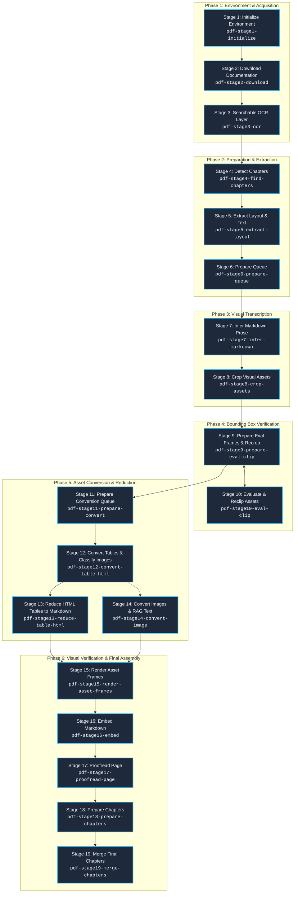

# Master Pipeline Orchestrator (Stages 1 through 19)

`pdf-pipeline` is the master entry point and orchestrator for the modular, end-to-end PDF conversion system. It provides high-level commands to inspect status across all four technical manuals, run automated stage sequences, manage stage resets, and coordinate in-session multimodal inference with CLI processing scripts.

## Input & Output
- **Input (Read-Only):**
  - Source technical PDF manuals in target document directories (or remote archival URLs via Stage 2).
  - CLI execution parameters (`manual_dir`, `--from-stage`, `--to-stage`, `--pages`, `--chunk-size`, `--prep`, `--status`).
- **Output:**
  - Publication-ready, seamlessly merged continuous chapter Markdown documents in `build/02_final_chapters/`.
  - Comprehensive intermediate pipeline artifacts across stages: searchable OCR PDFs, layout JSON/PNG files, cropped asset images, semantic HTML/Markdown tables, companion RAG plain-text files, visual verification frames, and per-page embedded Markdown files.
  - Synchronized pipeline queue states in `build/<stem>_queue.json` and `build/<stem>_assets_queue.json`.

---

## Architectural Workflow



---

## Stage & Skill Reference

All individual stages are completely decoupled and can be run independently or orchestrated together:

| Stage | Sub-Skill | Script / Action | Output Artifacts |
| :--- | :--- | :--- | :--- |
| **1. Init** | [`pdf-stage1-initialize`](../pdf-stage1-initialize/SKILL.md) | `check_env.py`, `pip install` | Verified Python, PyMuPDF, Pillow, Tesseract |
| **2. Download** | [`pdf-stage2-download`](../pdf-stage2-download/SKILL.md) | `download_documentation.ps1` | `build/<stem>.pdf` |
| **3. OCR** | [`pdf-stage3-ocr`](../pdf-stage3-ocr/SKILL.md) | `add_ocr_layer.py` | `build/<stem>_ocr.pdf` |
| **4. Chapters** | [`pdf-stage4-find-chapters`](../pdf-stage4-find-chapters/SKILL.md) | `find_chapters.py` | `build/<stem>_chapters.json` |
| **5. Layout** | [`pdf-stage5-extract-layout`](../pdf-stage5-extract-layout/SKILL.md) | `stage5_extract_layout.py` | `build/01_page_layout/page_XXXX.json`, `.png` |
| **6. Queue** | [`pdf-stage6-prepare-queue`](../pdf-stage6-prepare-queue/SKILL.md) | `stage6_prepare_queue.py` | `build/<stem>_queue.json` (tracks `pending` / `completed`) |
| **7. Inference** | [`pdf-stage7-infer-markdown`](../pdf-stage7-infer-markdown/SKILL.md) | Tier 2 Lead (`stage7-transcription-lead`) via `invoke_subagent` | `build/01_page_layout/page_XXXX.md` with `<crop>` tags |
| **8. Crops** | [`pdf-stage8-crop-assets`](../pdf-stage8-crop-assets/SKILL.md) | `stage8_crop_assets.py` | `assets/*.png`, `page_XXXX-images.md`, `build/<stem>_assets_queue.json` |
| **9. Prepare Eval & Recrop** | [`pdf-stage9-prepare-eval-clip`](../pdf-stage9-prepare-eval-clip/SKILL.md) | `stage9_prepare_eval_clip.py` | Full-page Red/Blue frames (`eval_frames/`), unified multi-asset frames (`eval_final/`), recropped `_vN.png`, finalized `_clip_final.png` |
| **10. Eval & Reclip** | [`pdf-stage10-eval-clip`](../pdf-stage10-eval-clip/SKILL.md) | Tier 2 Lead (`stage10-eval-lead`) via `invoke_subagent` | Visual verdicts (`ok`, `reclip_needed`), corrected coordinates |
| **11. Prep Conversion Queue** | [`pdf-stage11-prepare-convert`](../pdf-stage11-prepare-convert/SKILL.md) | `stage11_prepare_convert.py` | Upgraded `build/<stem>_assets_queue.json` schema, target fragment paths, conversion counters |
| **12. Convert Tables & Classify** | [`pdf-stage12-convert-table-html`](../pdf-stage12-convert-table-html/SKILL.md) | Tier 2 Lead (`stage12-table-html-lead`) via `invoke_subagent` | `assets/<asset_id>_html.md` (HTML tables + collapsed RAG text), classifies `image` directly for Stage 14 |
| **13. Reduce HTML Tables** | [`pdf-stage13-reduce-table-html`](../pdf-stage13-reduce-table-html/SKILL.md) | `stage13_reduce_table_html.py` + Tier 2 Lead (`stage13-reduction-lead`) via `invoke_subagent` | `assets/<asset_id>_reduced.md` (reduced tables), preserved HTML lineage |
| **14. Convert Images & RAG** | [`pdf-stage14-convert-image`](../pdf-stage14-convert-image/SKILL.md) | Tier 2 Lead (`stage14-image-lead`) via `invoke_subagent` | `assets/<asset_id>.md` (image link + collapsed breakdown), `assets/<asset_id>.txt` (RAG plain text) |
| **15. Render Asset Frames** | [`pdf-stage15-render-asset-frames`](../pdf-stage15-render-asset-frames/SKILL.md) | `stage15_render_asset_frames.py` | `build/01_page_layout/asset_frames/page_XXXX_asset_frame.png` (classified review frames) |
| **16. Embed Markdown** | [`pdf-stage16-embed`](../pdf-stage16-embed/SKILL.md) | `stage16_embed.py` | `build/01_page_layout/page_XXXX-embed.md` |
| **17. Proofread Page** | [`pdf-stage17-proofread-page`](../pdf-stage17-proofread-page/SKILL.md) | Tier 2 Lead (`stage17-proofread-lead`) via `invoke_subagent` | `build/01_page_layout/page_XXXX-proofread.md` (sliding window context from page_{XXXX-1}-embed.md) |
| **18. Prepare Chapters** | [`pdf-stage18-prepare-chapters`](../pdf-stage18-prepare-chapters/SKILL.md) | `stage18_prepare_chapters.py` | `build/02_detect_cont_chapters/<slug>.md` drafts with `<continuation-marker>` |
| **19. Merge Final Chapters** | [`pdf-stage19-merge-chapters`](../pdf-stage19-merge-chapters/SKILL.md) | Tier 2 Lead (`stage19-chapter-merge-lead`) via `invoke_subagent` | `build/02_final_chapters/<slug>.md` publication-ready continuous documents |
| **Reset Utility** | [`pdf-reset-stages`](../pdf-reset-stages/SKILL.md) | `stage_reset.py` | Granular stage rollback & cleanup (Stages 7–19) to prepare pages for rerun |

---

## How to Steer and Execute the Workflow

### 1. Check Full Pipeline Status Dashboard
Inspect existing files across all stages for any target manual:
```powershell
python .agents/plugins/pdf-pipeline/skills/pdf-pipeline/scripts/run_pipeline.py "68000 Programmer's Reference Manual" --status
```
Or check status across all four manuals simultaneously:
```powershell
python .agents/plugins/pdf-pipeline/skills/pdf-pipeline/scripts/run_pipeline.py --status
```

### 2. Run Preparation Stages (Stages 4–6)
Executes chapter detection, layout extraction, and transcription queue preparation:
```powershell
python .agents/plugins/pdf-pipeline/skills/pdf-pipeline/scripts/run_pipeline.py "68000 Programmer's Reference Manual" --prep
```

### 3. Run Horizontal Stage Slices via Master Pipeline Runner
Execute horizontal stage progression across chunks of 10 to 25 pages:
```powershell
# Plan execution slice for a 20-page chunk:
python .agents/plugins/pdf-pipeline/skills/pdf-pipeline/scripts/run_pipeline.py "Hardware Reference Manual" --from-stage 9 --to-stage 16 --pages 100-120 --plan

# Execute deterministic stages for the chunk:
python .agents/plugins/pdf-pipeline/skills/pdf-pipeline/scripts/run_pipeline.py "Hardware Reference Manual" --from-stage 9 --to-stage 16 --pages 100-120
```

### 4. Reset & Clean Up Stages for Rerun ([`pdf-reset-stages`](../pdf-reset-stages/SKILL.md))
Cleanly unwinds queue statuses to `pending`, purges obsolete markdown, crops, eval frames, classifications, converted tables, comparisons, embedded markdown, and chapter assemblies for Stages 7 to 19:
```powershell
# Reset Stages 11 through 19 for a chunk of pages:
python .agents/plugins/pdf-pipeline/skills/pdf-reset-stages/scripts/stage_reset.py "Hardware Reference Manual" --from-stage 11 --to-stage 19 --pages 100-120

# Reset via master pipeline runner prior to rerun:
python .agents/plugins/pdf-pipeline/skills/pdf-pipeline/scripts/run_pipeline.py "Hardware Reference Manual" --reset-stages --from-stage 7 --to-stage 19 --pages 100-120

# Reset Stages 11 through 13 across all target manuals:
python .agents/plugins/pdf-pipeline/skills/pdf-reset-stages/scripts/stage_reset.py --from-stage 11 --to-stage 13 --all
```

---

## Agent Operational Protocol

When the user asks the agent to run or resume the pipeline (e.g. `/pdf-pipeline`, or "process the 68000 PRM manual"):
1. **Status Inspection & Authoritative Progress Tracking:**
   - Always run `run_pipeline.py "<manual>" --status` as the first action to determine which stages are complete, the exact progress percentage of each stage, and what work remains to be done.
   - For granular execution slice planning (down to individual pages and pending items), use `run_pipeline.py "<manual>" --from-stage X --to-stage Y --pages Z --plan`.
   - **Strict Prohibition on Custom Status Scripts:** Never write ad-hoc inspection or check scripts (e.g. `check_remaining.py`) to parse JSON queues or probe the filesystem for remaining work. The native `--status` and `--plan` commands are the sole authoritative tools for stage progress tracking.
2. **Execute Missing Preparation:** If Stages 4, 5, or 6 are missing or incomplete, execute the preparation phase via `run_pipeline.py "<manual>" --prep`.
3. **Horizontal Stage Progression Invariant:**
   - **Stage-by-Stage Precedence:** Execution MUST progress **horizontally stage-by-stage**. Complete all work items of Stage $N$ across the target scope (or active page chunk) before advancing to Stage $N+1$.
   - **Strict Ban on Vertical Micro-Loops:** Never loop vertically through stages per individual page (e.g. NEVER run Stage 13 -> 14 -> 15 -> 16 -> 17 for page 32, then repeat for page 33). Complete Stage 13 across all pending tables, complete Stage 14 across all pending images, run deterministic Stages 15 and 16 in bulk once, and only then proceed to Stage 17.
4. **Deterministic Stages as Bulk CLI Operations:**
   - Deterministic stages (Stages 1–6, 8, 9, 11, Stage 13 gatekeeper, 15, 16, 18) are fast Python CLI scripts designed to execute once across the entire manual or target slice in a single shot.
   - Never execute deterministic CLI scripts repeatedly inside an iterative loop for individual single pages.
5. **User-Regulated Chunk Size & Intra-Stage Work Scope:**
   - **Authoritative User Override:** The user may specify any chunk size (e.g. `chunk size: 1`, `chunk size: 2`, `chunk size: 5`, `chunk size: 20`, or `--chunk-size N` / `-c N`). The user's parameter STRICTLY OVERRIDES any default recommendation.
   - **Intra-Stage Definition:** Chunk size strictly governs the number of work units processed **within the active inferential stage** (e.g. $N$ visual assets in Stage 14, or $N$ pages in Stage 17). It does NOT mean slicing the entire manual vertically into 1-page chunks across multiple stages.
   - **Default Scope:** When no chunk size is specified, the pipeline defaults to stage-by-stage across all pages (or chunks of 10–25 pages if slicing).
   - **Continuous Autonomous Looping:** Progress consecutively from chunk to chunk within the active stage, and from stage to stage horizontally, without pausing or requesting confirmation until the target scope is 100% complete.
6. **Single-Item Multimodal Context Isolation:**
   - In inferential stages (Stages 7, 10, 12, 13, 14), inspect and generate output for each target item individually (never feed multiple disparate image crops into a single prompt).
   - Emit outputs (`.md`, `.txt`, and queue update) in a single unified turn per item.
   - Complete ALL items of Stage $N$ within the scope before triggering Stage $N+1$.
7. **Strict Visual Quality & Anti-Bypass Rule:**
   - Every visual asset in inferential stages (Stages 10, 12, 13, 14) MUST be visually inspected by the multimodal model via `view_file`.
   - Never use scripts, heuristics, or OCR text layers to bypass visual model evaluation.
8. **Stage 10 Pragmatic Tolerance & Anti-Pixel-Hunting:**
   - Never enter micro-clipping loops adjusting bounding boxes by 1–2 pixels.
   - If an asset contains all text/ink and does not intrude into adjacent figures or running headers/footers, mark it `ok` immediately.
   - If a reclip is necessary, apply a generous 5–10 unit margin in a single shot and run `--apply-recrops` once.
9. **No Redundant Polling:**
   - Do not call status scripts (`page_status.py`, `run_pipeline.py --status`) after every single page. Process the active chunk, then verify at the chunk boundary.
10. **Mandatory Subagent Delegation for Inferential Stages (Anti-Monolith Invariant):**
    - The Root Orchestrator is **STRICTLY FORBIDDEN** from directly performing visual multimodal inference, inspecting page preview images (`.png`), or generating page Markdown/HTML files directly in its own session.
    - For all inferential stages (Stages 7, 10, 12, 13, 14, 17, 19), the Root Orchestrator MUST:
      a. Generate or verify `build/<stem>_execution_plan.json` using `planner.py`.
      b. Invoke the designated Tier 2 Stage Lead via `invoke_subagent`.
      c. Await the compact JSON completion report from the Tier 2 Lead.
    - Each Tier 2 Lead is strictly responsible for slicing and dispatching bounded chunks ($\le 5$ pages for Stage 7, $\le 10$ assets for Stage 12, $\le 10$ tables for Stage 13, etc.) to Tier 3 leaf workers, strictly preserving bounded subagent context.
11. **CLI Execution Requirement (IDE Chat Prohibition):**
    - Batch pipeline progression and multi-stage orchestration MUST be executed exclusively within the Antigravity CLI (`agy -c --dangerously-skip-permissions`).
    - The Antigravity IDE Chat panel does not expose `invoke_subagent` and induces severe context degradation and UI latency.
    - If the user requests pipeline execution from within the IDE Chat panel, instruct the user to run the task via the `agy` CLI terminal instead.
    - `run_pipeline.py` deterministically gates and blocks batch execution commands invoked from the IDE Chat panel. Read-only commands (`--status`, `--plan`) remain accessible in the IDE.
12. **Document Scope Isolation & Two-Directory Boundary Invariant:**
    - Whenever the orchestrator, a Tier 2 lead, or a Tier 3 worker processes a target manual, all file reads, searches, and writes MUST be strictly and exclusively confined to two directories:
      1. The assigned target manual directory (`<manual_dir>/...`).
      2. The pipeline configuration, agent definitions, and skills directory (`.agents/plugins/pdf-pipeline/...`).
    - Agents and workers are strictly forbidden from inspecting, reading, or searching files belonging to other manuals in the workspace (e.g. reading production manuals while processing a test book, or vice versa).
    - All prompt schemas, formatting conventions, and domain rubrics are fully self-contained. Agents must never seek external stylistic examples from sibling books across the workspace.


