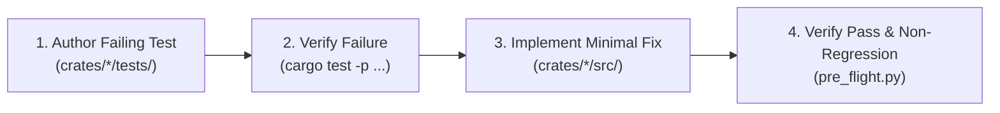

# Repro-First & Regression Guard Rule

This rule governs all defect resolution, bug fixing, hardware divergence corrections, and edge-case handling across the emulator codebase.
To prevent unanchored code modifications, stochastic guessing, and silent adjacent breakages, agents must follow a deterministic **Repro-First** workflow.

---

## 1. The Core Mandate: Test-Driven Defect Resolution

Whenever an agent is tasked with fixing a bug, CPU instruction divergence, bus contention issue, timing flaw, or GUI defect:

1. **Mandatory Failing Test First (The Red Phase):**
   - Before modifying any production code in `crates/*/src/`, the agent **must write an isolated reproduction test** in the appropriate test suite under `crates/<crate>/tests/` (e.g. `crates/m68000/tests/test_regressions.rs` or `crates/<crate>/tests/test_<subsystem>.rs`).
   - The test must precisely isolate and assert the expected hardware behavior vs the defect.
   - Run `cargo test -p <crate> --test <test_name>` and confirm that the test fails on unmodified production code with the exact expected error.

2. **Targeted Implementation (The Green Phase):**
   - Modify the production source files in `crates/*/src/` with the minimal necessary changes to resolve the root cause.
   - Re-run the reproduction test and confirm that it passes cleanly.

3. **Adjacent Non-Regression Verification:**
   - Run the broader domain test suite to ensure adjacent instructions or systems were not broken:
     - For CPU changes: Run SingleStepTests (`cargo test -p test_runner --test test_singlestep`).
     - For Bus/DMA changes: Run Cartesian contention tests (`cargo test -p test_runner --test test_dma_cartesian`).
     - For GUI changes: Run headless integration tests (`cargo test -p gui --test test_interactions`).
     - Always run the Pre-Flight Gate (`python tools/pre_flight.py`).

4. **Permanent Regression Anchor:**
   - The reproduction test must remain in `crates/<crate>/tests/` permanently to prevent future regressions.
   - Never delete or disable a reproduction test once the fix is complete.

---

## 2. Invariants & Prohibited Practices

1. **Zero Inline Tests in Production Code:**
   - Per [`unit-testing-policy.md`](unit-testing-policy.md), reproduction tests must **never** be placed inside `crates/*/src/`. All tests reside exclusively in `crates/*/tests/`.
2. **Zero Blind Golden Hash or Vector Updates:**
   - Per [`spec-compliance.md`](spec-compliance.md), modifying golden master hashes, cycle totals, or reference vectors to silence a failing reproduction test is strictly forbidden.
3. **Root-Cause Resolution Over Heuristics (Zero Local Symptom Patches):**
   - Per [`structural-root-cause.md`](structural-root-cause.md), do not apply surface-level patches that mask symptoms (e.g. nudging beam coordinates/offsets by $\pm 1$ or adding ad-hoc special cases). Identify the specific cycle, register bit, or state machine phase responsible for the divergence upstream.

---

## 3. Checklist for Bug Resolution

- [ ] Has an isolated reproduction test been created in `crates/<crate>/tests/`?
- [ ] Was the test executed and verified to FAIL on current code before making changes?
- [ ] Was the fix implemented in `crates/*/src/` with zero dynamic heap allocations in hot paths?
- [ ] Does the reproduction test now PASS?
- [ ] Have domain regression suites (`SingleStepTests`, `test_dma_cartesian`, `test_architecture_rules`) been run?
- [ ] Has the bug and its architectural resolution been logged in `DIARY.md` (Section 10)?
