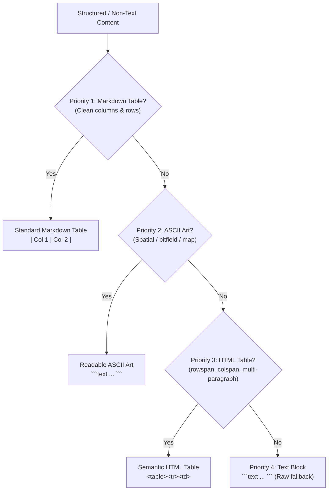

# Recipe: Converting AmigaGuide Documents to Markdown

This skill provides a standardized, battle-tested procedure for converting AmigaGuide (`.guide`) documents into modern, publication-quality Markdown documents optimized for Obsidian vaults and GitHub documentation.

---

## 1. General Principles: Content Integrity & High Fidelity

During the entire transformation process, adhere strictly to these cardinal rules:

1. **Reformat & Adjust Freely**:
   - You may reformat text, adjust layout, unwrap hard-wrapped paragraphs, organize tables, beautify diagrams, and adjust heading levels for optimal readability on modern screens.
2. **Preserve All Content & Meaning**:
   - Every paragraph of explanation, parameter definition, error code, footnote, warning, note, author quote, caveat, or technical detail from the original document must be retained.
   - Technical terms, register names, memory offsets, hexadecimal addresses (e.g. `$00000004`), flag names (e.g. `AFB_68040`), and formula logic must never be altered or misconstrued.
3. **Do NOT Add New Content**:
   - Do not invent explanations, do not add filler commentary, do not synthesize external tutorial material, and do not fabricate missing sections or examples that were not present in the original source.
   - Zero hallucinations. Zero information loss.

---

## 2. Content Removal & Cleanup Rules

AmigaGuide files and printed books converted to digital guides frequently contain repetitive navigation chrome, page headers, footers, and redundant structural indexes that degrade the reading experience in a modern hypertext system like Obsidian. These elements must be systematically removed.

### 1. Remove Headers, Footers, and Page-Repeated Artifacts
- **Running Page Headers**:
  - Strip repeating document titles or chapter names repeated at the top of each page or screen.
  - Strip page numbers (e.g. `Page 12`, `- 12 -`, `[Page 45]`).
  - Strip date stamps or build headers repeated per node.
- **Running Page Footers**:
  - Strip repeating copyright notices at the bottom of each page (preserve copyright once in the top-level Table of Contents metadata callout).
  - Strip horizontal separator bars (`====================`, `--------------------`) used solely to frame top/bottom page borders.
- **Repeated Navigation Chrome**:
  - Strip repeated AmigaGuide UI navigation bars embedded in the text (e.g. `[Contents] [Index] [Help] [Prev] [Next]` or `@{b}Return to MAIN | INDEX@{ub}`).

### 2. Remove Index, List of Tables, and List of Images
- **Remove Alphabetical Index**:
  - Delete any dedicated Index node or alphabetical section (`@NODE Index`, `Alphabetical Index`, `Index of Functions`).
  - *Rationale*: Obsidian and markdown editors provide instant, full-text, fuzzy search across the entire vault. A static index with hundreds of manual links is noisy, redundant, and error-prone.
- **Remove List of Tables / Figures / Images**:
  - Delete any "List of Tables", "List of Figures", "List of Images", or "List of Illustrations" frontmatter/backmatter nodes or sections.
  - Exclude them from generated files and from the master Table of Contents.

### 3. Remove Partial TOCs (Keep Only Main TOC)
- In AmigaGuide files and multi-chapter manuals, chapter nodes often start with a mini-TOC or sub-TOC listing the sections inside that chapter.
- **Remove these partial / chapter-level TOCs**:
  - Strip the block of links and indented section lists at the beginning of chapters.
  - Keep **ONLY the main master Table of Contents** (`00 - Table of Contents.md` or top-level TOC in single-document mode).
- **Preserve Chapter Front Matter**:
  - If a chapter node contains author quotes, epigraphs, introductory prose, or forewords before the chapter sections, **preserve all prose and quotes**. Only strip the redundant link list of sub-sections.

---

## 3. Non-Text Content Conversion Hierarchy

When converting non-text, structured, or visual content (data structures, memory maps, pinouts, register layouts, bitfields, comparison charts, diagrams, tables), evaluate formats according to this strict **priority pipeline**:



### Priority 1: Markdown Table (`| ... |`)
- **Default choice** for tabular and columnar data.
- **When to use**: Data has consistent columns and rows without complex row/column spanning or embedded multiple paragraphs.
- **Rules**:
  - Use clean GFM syntax: `| Col 1 | Col 2 |`.
  - Strip font styling tags like `<u>`, `@{b}` from table header cells.
  - **Preserve empty cells**: If a row has a blank entry under a column, retain the empty cell (`| |`) rather than shifting following columns to the left.
  - Use proper column alignment indicators (`:---`, `:---:`, `---:`).

### Priority 2: ASCII Art (Must be Readable)
- **When to use**: When visual spatial arrangement is essential and cannot be expressed in a flat Markdown table (e.g. register bit layout diagrams showing bits 31 down to 0, memory map partitions, bus timing relationships, ASCII box flowcharts, hardware block diagrams).
- **Rules**:
  - **Must be clean and easily readable** on modern high-resolution displays.
  - Enclose in fixed-width fenced code blocks: ```` ```text ````.
  - Maintain strict character column alignment.
  - Use clean ASCII box characters (`+---+`, `|`, `-`) or clean Unicode box-drawing characters if already present.

### Priority 3: HTML Table (`<table>`, `<tr>`, `<td>`, `<th>`)
- **When to use**: When tabular data is too complex for standard GFM Markdown:
  - Cells spanning multiple rows (`rowspan="2"`).
  - Cells spanning multiple columns (`colspan="3"`).
  - Cells containing multiple paragraphs, bullet lists, or multiple text spans (`<div>`, `<p>`, `<br>`).
  - Grouped / hierarchical header rows.
- **Rules**:
  - Write clean, indented semantic HTML.
  - Ensure all tags are properly closed.
  - Retain Markdown readability within cells where supported or use clean HTML tags (`<code>`, `<strong>`, `<em>`).

### Priority 4: Text Block (Fenced Preformatted Block)
- **Fallback choice** when the content cannot be converted to a table, readable ASCII art, or HTML table without degradation or loss of fidelity.
- **When to use**: Unstructured hex/data dumps, raw terminal captures, disassemblies, or irregular ASCII notes.
- **Rules**:
  - Enclose in ```` ```text ... ``` ````.
  - Preserve all spaces, indentation, and special characters exactly.

---

## 4. Callout Blocks: Notes, Warnings, Cautions, and Errors

AmigaGuide files and technical reference guides frequently feature advisory blocks, developer tips, hardware cautions, or critical error notices marked by bold labels, indented paragraphs, or ASCII delimiter lines (e.g. `Note:`, `Notice:`, `WARNING:`, `CAUTION:`, `IMPORTANT:`).

Always convert these advisory blocks into **native Obsidian callouts** rather than leaving them as plain text or standard blockquotes (`> text`).

### Mapping Source Markers to Obsidian Callouts

| Source Document Marker / Style | Obsidian Callout Type | When to Use |
| :--- | :--- | :--- |
| `Note:`, `Notice:`, `Info:`, `Information:`, bordered box | `> [!NOTE]` or `> [!INFO]` | Supplementary explanations, background hardware details, peripheral clarifications. |
| `Tip:`, `Hint:`, `Recommended:`, `Programming Tip:` | `> [!TIP]` | Performance suggestions, coding tricks, register programming best practices. |
| `Important:`, `Attention:`, `Critical:` | `> [!IMPORTANT]` | Essential prerequisites, non-negotiable register constraints, memory alignment requirements. |
| `Warning:`, `Caution:`, `Alert:`, `Beware:` | `> [!WARNING]` or `> [!CAUTION]` | Hardware risks, bus contention hazards, undefined register bit behaviors, data corruption risks. |
| `Error:`, `Danger:`, `Fatal:`, `Bug:`, `Silicon Errata:` | `> [!DANGER]` or `> [!ERROR]` / `> [!BUG]` | Destructive operations, silicon bugs, fatal CPU exceptions, illegal bus operations. |

### Formatting Syntax & Best Practices

1. **Retain Meaning & Specific Titles**:
   If the source provides a specific heading or title for the note/warning, include it on the callout declaration line:
   ```markdown
   > [!WARNING] Bus Contention Hazard
   > Never write to BLTCON0 while the Blitter busy flag (DMACONR bit 6) is set. Doing so causes bus contention with the 68000 CPU and corrupts subsequent DMA transfers.
   ```
2. **Preserve Complete Content (Zero Omissions)**:
   Retain every sentence, list item, footnote, and technical parameter in the callout. Never summarize or omit details.
3. **Multi-Paragraph and Nested Elements**:
   Prefix every line of the callout with `>`, including empty lines between paragraphs:
   ```markdown
   > [!NOTE] Copper Instruction Fetch Timing
   > Copper instructions are two words (4 bytes) long. A MOVE or WAIT requires two bus cycles (4 clock ticks).
   >
   > - First cycle: Fetch IR1 (register address or vertical beam position).
   > - Second cycle: Fetch IR2 (data word or horizontal beam position).
   ```
4. **Code Blocks Inside Callouts**:
   Prefix code block fences and indented lines with `>`:
   ```markdown
   > [!IMPORTANT]
   > Always set the Blitter logic function minterm before initiating the blit:
   > ```m68k
   > move.w  #$09F0,$DFF040   ; BLTCON0: Minterm D = A & B
   > ```
   ```

---

## 5. Chapter & Section Navigation Standards

To enable effortless browsing across chapters and sections in Obsidian vaults and GitHub markdown viewers, navigation links must be placed at **BOTH the BEGIN and the END** of every chapter and section file.

### Split-Mode Chapter Navigation Bar Format:
```markdown
[⬅ Previous](01%20-%20Previous%20Chapter.md) | [📋 Table of Contents](00%20-%20Table%20of%20Contents.md) | [Next ➡](03%20-%20Next%20Chapter.md)
```

### Placement Rules:
1. **At the BEGIN**:
   - Place immediately below the main `# Title` (or below any introductory metadata callout / chapter epigraph).
   - Follow with a horizontal divider `---`.
2. **At the END**:
   - Precede with a horizontal divider `---`.
   - Place as the very last element of the document.

### Edge Case Handling:
- **First Content Chapter (Chapter 1)**:
  - `Prev` links to the Table of Contents: `[⬅ Previous](00%20-%20Table%20of%20Contents.md)`
  - Format: `[⬅ Previous](00%20-%20Table%20of%20Contents.md) | [📋 Table of Contents](00%20-%20Table%20of%20Contents.md) | [Next ➡](02%20-%20Chapter%202.md)`
- **Last Content Chapter**:
  - `Next` links back to the Table of Contents: `[Next ➡](00%20-%20Table%20of%20Contents.md)`
  - Format: `[⬅ Previous](21%20-%20Chapter%2021.md) | [📋 Table of Contents](00%20-%20Table%20of%20Contents.md) | [Next ➡](00%20-%20Table%20of%20Contents.md)`
- **Table of Contents (`00 - Table of Contents.md`)**:
  - Includes `[Next ➡](01%20-%20Chapter%201.md)` at both top (before Navigation) and bottom.
- **Single-Document Mode**:
  - When all nodes are consolidated into a single `.md` file, each `## Section` receives top and bottom anchor navigation:
    `[⬅ Previous](#previous-section) | [📋 Table of Contents](#table-of-contents) | [Next ➡](#next-section)`

---

## 6. Toolchain & Directory Structure

All conversion scripts and references reside inside this skill directory:

```text
.agents/skills/amigaguide-to-markdown/
├── SKILL.md                               # This workflow recipe
├── scripts/
│   ├── convert_guide.py                   # Automated AmigaGuide parser and Markdown generator
│   ├── validate_links.py                  # Obsidian-exact TD() link & anchor validator
│   └── iff_to_png.py                      # Amiga IFF ILBM graphic to PNG converter
└── references/
    ├── amigaguide-spec.md                 # Complete AmigaGuide command and syntax reference
    └── obsidian-linking-quirks.md         # Obsidian heading anchor normalization and decodeURI rules
```

---

## 7. Step-by-Step Conversion Workflow

Follow these phases sequentially when processing an AmigaGuide file.

### Phase 1: Inspection & Structure Analysis

1. **Inspect Encoding**: Read input files using Latin-1 encoding:
   ```python
   raw_text = Path("input.guide").read_text(encoding="latin-1")
   ```
2. **Determine Document Architecture**:
   - **Single Manual / Utility Guide** (e.g. `Kickstart.guide`, `installer.guide`): Typically 5-15 short nodes. Convert as a single consolidated document using `--mode single`.
   - **Comprehensive Reference Manual / Book** (e.g. *Amiga Guru Book*, *680x0 Reference*): Many nodes, organized hierarchically by chapters and numbered sections. Convert as a multi-chapter folder with a top-level `00 - Table of Contents.md` using `--mode split`.
3. **Identify Assets & Exclusions**:
   - Identify any `.iff` or `.ilbm` graphics to convert.
   - Identify index or list nodes to exclude.

---

### Phase 2: Automated Parsing & Markdown Generation

Run the bundled converter script:

#### Multi-Chapter Split Mode (Default for Books & Reference Manuals):
```bash
python .agents/skills/amigaguide-to-markdown/scripts/convert_guide.py \
  "path/to/document.guide" \
  --output-dir "Obsidian/Amiga/Reference/DocumentName" \
  --mode split
```
- Creates `00 - Table of Contents.md` with document metadata and an Obsidian-compatible navigation list.
- Excludes index nodes, lists of tables, and lists of figures.
- Strips repetitive page headers, footers, and partial chapter-start TOCs.
- Injects bidirectional navigation links (`Prev | TOC | Next`) at the top and bottom of each chapter file.

#### Single-Document Consolidation Mode (For Short Guides):
```bash
python .agents/skills/amigaguide-to-markdown/scripts/convert_guide.py \
  "path/to/document.guide" \
  --output-dir "Obsidian/Amiga/Reference" \
  --mode single
```
- Creates a single self-contained `<DocumentName>.md` file with a top-level Table of Contents and internal section navigation.

---

### Phase 3: Layout Modernization & Content Polishing

When reviewing or enhancing the generated Markdown:

1. **Apply Non-Text Hierarchy**:
   - Prioritize: **Markdown Table $\rightarrow$ Readable ASCII Art $\rightarrow$ HTML Table $\rightarrow$ Text Block**.
2. **Convert Advisory Blocks to Obsidian Callouts**:
   - Convert paragraphs or sections marked with `Note:`, `Warning:`, `Caution:`, `Important:`, or `Error:` into native Obsidian callouts (`> [!NOTE]`, `> [!WARNING]`, `> [!CAUTION]`, `> [!IMPORTANT]`, `> [!DANGER]`).
3. **Code Blocks & Assembly Listings**:
   - Enclose code in fenced blocks with explicit language identifiers: ```` ```c ````, ```` ```m68k ````, or ```` ```text ````.
4. **Mathematical Expressions**:
   - Use standard LaTeX/KaTeX math (`$2^{10}$`, `$2^{31}-1$`).
   - **CRITICAL**: Do **NOT** treat Motorola hexadecimal values (`$00000004`, `$FF`, `$C00000`) as LaTeX math! Enclose hexadecimal addresses in inline code backticks: `` `$00000004` ``.
5. **List Formatting**:
   - Convert AmigaGuide list bullets (`*` or `**` at start of line) to standard Markdown `-`.
   - Keep footnotes and literal asterisks properly escaped (`\*`).
6. **Heading Punctuation**:
   - Convert trailing colons in numbered headings to periods (e.g. `## 2.1.1: System Addresses` $\rightarrow$ `## 2.1.1. System Addresses`).

---

### Phase 4: Obsidian Link & Heading Anchor Rules

Obsidian does **not** use GitHub kebab-case slugification. Its internal engine normalizes headings using:
`SD = /[!"#$%&()*+,.:;<=>?@^\`{|}~/\\[\\]\\\r\n]/g`
`TD(e) = e.replace(SD, " ").replace(/\s+/g, " ").trim().toLowerCase()`

And crucially, Obsidian resolves links using JavaScript's `decodeURI()`, which **does NOT decode `%2C` (commas) or `%3A` (colons)**.

Always follow these rules when creating or rewriting links:
1. **Literal Punctuation**: Never percent-encode commas, colons, dots, or question marks in anchors.
   - ✅ `...#2.1.3.%20System%20addresses,%20jumps%20into%20ROM,%20and%20private%20data%20structures`
   - ❌ `...#2.1.3.%20System%20addresses%2C%20jumps%20into%20ROM%2C%20and%20private%20data%20structures` *(Breaks in Obsidian!)*
2. **Encoded Spaces**: Encode spaces as `%20`.
3. **Same-Document Links**: Omit the file name completely when linking within the same document:
   - ✅ `[Overview](#1.1.%20Data%20types)`
   - ❌ `[Overview](01%20-%20Data%20Types.md#1.1.%20Data%20types)` *(Causes Obsidian to reload or ignore the anchor)*
4. **Cross-Document Links**: Encode spaces in the target filename and append the anchor:
   - `[Section 17.1.71](17%20-%20Dos%20Functions.md#17.1.71.%20InternalLoadSeg%28%29%20%282.0%29)`

---

### Phase 5: Converting Amiga IFF Graphics to PNG

If the guide references Amiga IFF ILBM graphic files:
1. Run `iff_to_png.py`:
   ```bash
   python .agents/skills/amigaguide-to-markdown/scripts/iff_to_png.py \
     "path/to/image.iff" \
     "Obsidian/Amiga/Reference/DocumentName/assets/image.png"
   ```
2. Reference the converted image in Markdown using standard syntax:
   ```markdown
   
   ```

---

### Phase 6: Automated Verification & Validation

Always run `validate_links.py` as the final quality gate:

```bash
python .agents/skills/amigaguide-to-markdown/scripts/validate_links.py \
  "Obsidian/Amiga/Reference/DocumentName"
```

The validator:
- Verifies that all target files exist.
- Simulates Obsidian's exact JavaScript `decodeURI()` and `TD()` heading lookup algorithm on all `#anchors`.
- Verifies all bidirectional navigation links (`Prev | TOC | Next`).
- Flags broken links, mismatched anchors, and improper same-document file references.
- Target: **100% PASS (0 failures, 0 broken anchors)**.
