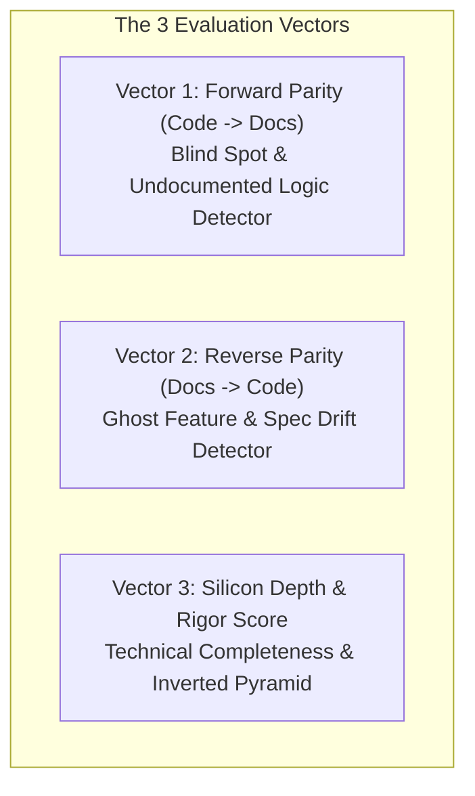

# Recipe: Inference-Driven Bidirectional Semantic Parity Auditor

This skill provides an inference-driven, qualitative architectural audit that evaluates whether living design specifications in `Obsidian/Amiga/Design/` genuinely, bidirectionally correspond to active Rust implementation in `crates/`.

---

## 1. The Core Mandate: Beyond Static Heuristics

Deterministic static analysis (regexes, Git commit hashes, register matrix tables) can verify that a register offset matches or that a commit checkpoint is current. However, **static scripts cannot judge semantic comprehension**:
- A script cannot determine whether a design specification is an exhaustive, cycle-exact hardware document or merely a 10-line high-level stub.
- A script cannot detect **Blind Spots**: subtle silicon behaviors, edge cases, wait-state logic, or register bitfields implemented in Rust that the documentation never mentions.
- A script cannot detect **Ghost Features & Hallucinations**: timing models, register modes, or hardware features asserted in Markdown that the Rust code never actually simulates.

This skill leverages deep LLM reasoning and inference to evaluate true bidirectional parity.

---

## 2. The 3-Vector Bidirectional Evaluation Model

Every audit assesses a paired target `(crates/<crate>/src/, Obsidian/Amiga/Design/<Spec>.md)` across three distinct vectors:



### Vector 1: Forward Parity (Code $\to$ Docs — The "Blind Spot" Detector)
- **Question:** *What is implemented in the Rust codebase that is missing, under-specified, or only trivially mentioned in the specification?*
- **Audit Targets:**
  - Public functions, trait implementations, and companion helpers.
  - State struct fields, internal counters, phase latches, and buffers.
  - Hardware edge cases (e.g. unaligned accesses, contention wait states, reset states).
  - Register bitmasks, write strobe side effects, and pipeline propagation delays.

### Vector 2: Reverse Parity (Docs $\to$ Code — The "Ghost Feature" Detector)
- **Question:** *What is asserted, specified, or described in the design document that does not actually exist or is bypassed in the Rust codebase?*
- **Audit Targets:**
  - Speculative draft snippets or obsolete pseudo-code lingering from earlier development.
  - Features claimed in prose (e.g. 9-bit serial parity checking, custom bus arbitration) that are simplified or omitted in code.
  - Register ownership or access rights claimed in text that contradict memory bus router routing.

### Vector 3: Silicon Depth & Architectural Rigor
- **Question:** *Does this document read like a professional Commodore/Motorola hardware manual with mechanical sympathy, or is it a generic, shallow summary?*
- **Scoring (0–100%):**
  - **90–100% (Gold Standard):** Exact bitfield layouts, hexadecimal masks, CCK1/CCK2 phase timing, autovector numbers, physical memory maps, and clean Inverted Pyramid structure.
  - **70–89% (Acceptable):** Core state machine and registers covered; minor pipeline delays or edge cases omitted.
  - **< 70% (Shallow Stub):** High-level narrative only; lacks bit-level register definitions or circuit mechanics.

---

## 3. Subsystem Mapping Matrix

When auditing a subsystem, inspect its corresponding Rust crate and Obsidian design specification:

| Subsystem Domain | Primary Rust Crates | Authoritative Design Spec |
| :--- | :--- | :--- |
| **Interrupts** | `crates/interrupts` | `Obsidian/Amiga/Design/Interrupts.md` |
| **Paula Coordinator** | `crates/paula` | `Obsidian/Amiga/Design/Paula.md` |
| **Audio Engine** | `crates/audio` | `Obsidian/Amiga/Design/Audio.md` |
| **Floppy Controller** | `crates/floppy` | `Obsidian/Amiga/Design/Floppy.md` |
| **Serial Port** | `crates/paula` (`src/serial.rs`) | `Obsidian/Amiga/Design/Paula.md` |
| **Agnus Coordinator** | `crates/agnus` | `Obsidian/Amiga/Design/Agnus.md` |
| **Copper Coprocessor**| `crates/copper` | `Obsidian/Amiga/Design/Copper.md` |
| **Blitter Engine** | `crates/blitter` | `Obsidian/Amiga/Design/Blitter.md` |
| **DMA Controller** | `crates/dma` | `Obsidian/Amiga/Design/DMA.md` |
| **Denise Display** | `crates/denise` | `Obsidian/Amiga/Design/Denise.md` |
| **Hardware Sprites** | `crates/sprites` | `Obsidian/Amiga/Design/Sprites.md` |
| **Frame Buffer** | `crates/frame_builder` | `Obsidian/Amiga/Design/Frame Buffer.md` |
| **Memory Bus & Gary** | `crates/memory_bus` | `Obsidian/Amiga/Design/MemoryBus.md` |
| **CIA Timers & Ports**| `crates/cia` | `Obsidian/Amiga/Design/CIA.md` |
| **M68000 CPU Core** | `crates/cpu` | `Obsidian/Amiga/Design/CPU Motorola M68000.md` |
| **Motherboard Loop** | `crates/machine_loop` | `Obsidian/Amiga/Design/Main loop A500.md` |

---

## 4. Step-by-Step Execution Protocol

When executing an audit:

1. **Step 1: Extract Code Signatures:**
   - Read `crates/<crate>/src/<crate>.rs` and key submodules.
   - Note all public structs, fields, constants, bitmasks, and hardware action methods (`step_cck`, `write_*`, `read_*`, `poll_*`).
2. **Step 2: Extract Specification Claims:**
   - Read `Obsidian/Amiga/Design/<Spec>.md`.
   - Map all section headings, register tables, timing assertions, and architectural claims.
3. **Step 3: Execute Bidirectional Comparison:**
   - Cross-examine each code entity against document sections.
   - Cross-examine each document assertion against live Rust code.
4. **Step 4: Emit Standardized Parity Report:**
   - Render the report using the standard template in Section 5.
5. **Step 5: Propose Actionable Remediation:**
   - Provide concrete Markdown additions or code adjustments to achieve 100% parity.

---

## 5. Standardized Semantic Parity Report Template

```markdown
# Semantic Parity Audit: [Subsystem Name]

**Evaluated Scope:**
- **Code:** `crates/<crate>/src/`
- **Specification:** `Obsidian/Amiga/Design/<Spec>.md`
- **Overall Parity Score:** [XX]% / 100%
- **Verdict:** [PASS | NEEDS_DOCS_ENRICHMENT | NEEDS_CODE_ALIGNMENT | SPEC_DIVERGENCE]

---

### 1. Forward Parity: Blind Spots (In Code, Missing in Docs)
- 🔴 **[Symbol / Feature / Quirk]:** [Description of what the code implements and why its absence from docs harms fidelity].

### 2. Reverse Parity: Ghost Features (In Docs, Missing in Code)
- 🟡 **[Claim / Assertion / Mode]:** [Description of what the spec claims that is unsimulated or contradicted in code].

### 3. Engineering Depth & Rigor Assessment
- **Register & Bitfield Completeness:** [Exhaustive | Partial | Shallow]
- **Clock Phase & Timing Fidelity:** [Cycle-Exact | Qualitative | Missing]
- **Inverted Pyramid Structure:** [Compliant | Non-Compliant]

### 4. Actionable Remediation Plan
- [Concrete step 1: exact section to add or refine in markdown]
- [Concrete step 2: draft code to prune or align]
```
