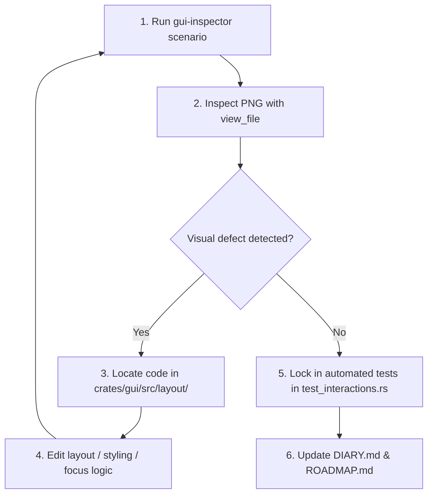

# egui Vision Debugger Skill

This skill enables the AI agent to test, visually inspect, and iteratively debug the immediate-mode `egui` frontend of the Amiga 500 emulator (`crates/gui`).

---

## 1. When to Use This Skill

Activate this skill whenever:
- Fixing or improving GUI layout, docking, panels, splitters, or scrollbars.
- Debugging interactive state transitions: widget focus, inline editing (registers, disassembly, memory hex), Escape cancellation, or click-outside commit/cancel lifecycles.
- Testing responsive window resizing, content clipping, or small display adaptations (e.g. 1024x600, 800x600).
- Polishing typography, color palettes, visual contrast, or aligning tabular items in Dark, Light, or Classic Workbench themes.
- Verifying that layout changes did not introduce graphical regressions.

---

## 2. Core Tool: `gui-inspector`

The headless capture harness is compiled directly from `crates/gui`:

```powershell
cargo run -p gui --bin gui-inspector -- [OPTIONS]
```

### CLI Options:
| Flag | Description | Default |
| :--- | :--- | :--- |
| `--scenario <NAME>` | Predefined interaction scenario (`baseline`, `hover_splitter`, `hover_scrollbar`, `hover_register`, `hover_ccr`, `hover_memory`, `game_mode`, `workbench_theme`, `edit_register`, `edit_disasm`, `small_window`) | `baseline` |
| `--width <PIXELS>` | Viewport width in points/pixels | `1280` |
| `--height <PIXELS>` | Viewport height in points/pixels | `720` |
| `--output <PATH>` | Destination PNG screenshot path | `target/gui_captures/baseline.png` |
| `--json-metadata <PATH>` | Optional file to dump AccessKit widget bounding boxes & labels | *(None)* |

### Example Invocations:
```powershell
# 1. Baseline standard desktop view (1280x720)
cargo run -p gui --bin gui-inspector -- --scenario baseline --output target/gui_captures/baseline.png

# 2. Small window / laptop display test (1024x600)
cargo run -p gui --bin gui-inspector -- --scenario small_window --width 1024 --height 600 --output target/gui_captures/small_1024.png

# 3. Hovering mouse over column splitters
cargo run -p gui --bin gui-inspector -- --scenario hover_splitter --output target/gui_captures/hover_splitter.png

# 4. In-App documentation hover audits (educational cards)
cargo run -p gui --bin gui-inspector -- --scenario hover_register --output target/gui_captures/hover_reg.png
cargo run -p gui --bin gui-inspector -- --scenario hover_ccr --output target/gui_captures/hover_ccr.png
cargo run -p gui --bin gui-inspector -- --scenario hover_memory --output target/gui_captures/hover_mem.png

# 5. Inline register editing state
cargo run -p gui --bin gui-inspector -- --scenario edit_register --output target/gui_captures/edit_register.png

# 6. Alternative themes & modes
cargo run -p gui --bin gui-inspector -- --scenario workbench_theme --output target/gui_captures/workbench.png
cargo run -p gui --bin gui-inspector -- --scenario game_mode --output target/gui_captures/game_mode.png
```

---

## 3. Visual Inspection Workflow (Agent Eyes)

After capturing an image, the agent **MUST** inspect it using `view_file`:

```rust
view_file(AbsolutePath: "D:/Programowanie/Amiga/target/gui_captures/<capture_name>.png")
```

The agent uses its native multimodal vision to inspect:
1. **Layout & Proportions:**
   - Are all 3 columns visible and balanced?
   - Is the central Amiga CRT screen clearly visible at a 4:3 aspect ratio without being squashed or collapsed?
   - Is the temporal timeline bar positioned neatly beneath the screen?
2. **Splitters & Scrollbars:**
   - Are panel resize handles cleanly separated from scrollbars?
   - Are scrollbars visible where content overflows without overlapping adjacent text?
3. **In-App Documentation & Contextual Tooltips:**
   - When hovering over registers, flags, or memory, does a legible, high-contrast card appear?
   - Is the documentation comprehensive (providing bit breakdowns, signed interpretations, and physical hardware behavior without requiring external manuals)?
   - Does the tooltip stay within screen bounds without obscuring the active interaction or clipping against viewport edges?
4. **Focus & Inline Editing:**
   - When editing a register or disassembly row, is there a distinct active focus indicator / border?
   - Does text stay inside its cell without overlapping neighboring columns?
5. **Typography & Contrast:**
   - Are monospace addresses and hex values aligned?
   - Is the contrast ratio high enough for comfortable reading across Dark, Light, and Workbench themes?

---

## 4. The Autonomous Self-Healing Loop

Follow this strict cycle to resolve any UI issue:



1. **Repro:** Run `gui-inspector` with the scenario reproducing the defect.
2. **Inspect:** View the screenshot with `view_file`.
3. **Diagnose:** Analyze the visual defect and identify the root cause in `crates/gui/src/layout/` or `app.rs`.
4. **Fix:** Edit the relevant Rust file cleanly.
5. **Verify:** Re-run `gui-inspector` and re-inspect with `view_file` to visually verify the fix.
6. **Test Gate:** Add a headless integration test in `crates/gui/tests/test_interactions.rs` to prevent future regressions.

---

## 5. Completion Report Format

```markdown
### 🎨 egui Vision Debugger Completion Report
- **Status:** [RESOLVED | FAILED]
- **Target Scenario:** `<scenario_name>`
- **Final Verified Image Path:** `target/gui_captures/<scenario>_fixed.png`
- **Layout Deltas Applied:**
  | File | Component / Widget | Delta Applied (px / style) |
  | :--- | :--- | :--- |
  | `crates/gui/src/layout/...` | Middle Column | Adjusted min_width to 400.0 |
- **Automated Regression Test:** `crates/gui/tests/test_interactions.rs::<test_fn>` (PASS)
- **Visual Artifact:** Embed image in conversation artifact for visual verification.
```
