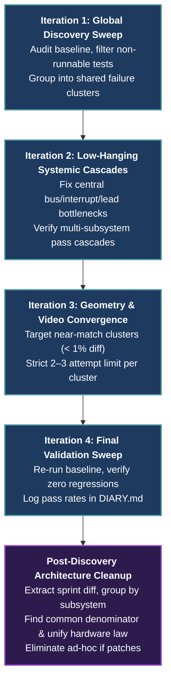

# Recipe: Integration Test Sprint & Anti-Patchwork Protocol

This skill guides the systematic execution, triage, and convergence of multi-chip integration test suites (Tier 2 `machine_loop` tests and Tier 4 `vAmigaTS` system captures) following the **4-Iteration Cascading Verification Protocol** and the **Post-Discovery Architecture Cleanup ("Anti-Patchwork" Protocol)** defined in [`Testing Strategy and Quality Assurance.md`](../../../Obsidian/Amiga/Design/Testing%20Strategy%20and%20Quality%20Assurance.md).

---

## 1. Core Principles

1. **Cascading Over Individual Tweaks:**
   - An Amiga is a tightly synchronized multi-chip system. A 1-cycle offset in a central register can manifest as thousands of pixel mismatches across unrelated coprocessors.
   - Never attempt to fix individual failing test cases in isolation. Address central bus/clock/interrupt signals upstream to unlock cascading passes across multiple chips.
2. **The 2–3 Attempt Rule (Cluster Time-Boxing):**
   - Never spend more than 2–3 calibration attempts on a single failing test cluster during Iteration 3.
   - If an issue requires deep analog modeling, unmapped hardware features, or extensive rewrites, document it and move on to preserve momentum.
3. **The Anti-Patchwork Protocol (Finding the Common Denominator):**
   - Exploratory debugging often accumulates temporary local `if`-statements, coordinate nudges ($\pm 1$), and special-case flags.
   - Every sprint must conclude by extracting the sprint `git diff`, grouping changes by subsystem, identifying the single first-principles hardware law (the common denominator) explaining all discrepancies, and eliminating all temporary ad-hoc patches.

---

## 2. Invocation & Zero-Parameter Execution

When invoked without parameters (e.g. via `/integration-test-sprint` or a general request to run an integration sprint):
1. **Detect Current Sprint Phase:**
   - Inspect `git status` and `git log -n 5 --oneline`.
   - If the working tree is clean: begin **Iteration 1 (Discovery Sweep)** or ask which category/subsystem to target.
   - If changes have accumulated from exploratory fixes: begin the **Anti-Patchwork Synthesis (Section 4)**.
2. **Autonomous Execution Sequence:**
   - Execute the current iteration, present structured metrics, and propose the next concrete step.

---

## 3. The 4-Iteration Cascading Verification Protocol



### Iteration 1: Global Discovery Sweep & Test Selection
1. **Build the Runner:**
   ```powershell
   cargo build --release -p test_runner
   ```
2. **Run Baseline Sweep:**
   - For vAmigaTS: `target/release/test_runner.exe vamiga --category all`
   - For Machine Loop: `cargo test -p machine_loop`
3. **Filter Out Non-Runnable Tests:**
   Do not waste cycles debugging tests that expect hardware outside the current phase:
   - **AGA / 2 MB Chip RAM:** Tests exercising AGA-only registers (`BPLCON3`, 32-bit burst).
   - **High CPU / FPU (68020+, 68881/2):** 32-bit instructions or coprocessor calls.
   - **Photo-only CIA captures:** Tests lacking 24-bit `.raw` reference frame buffers.
   - **Analog Audio Waveforms:** Pure audio capture without frame comparisons.
   - **Interactive Scripts (`.retrosh`):** Real-time user input scripts.
4. **Cluster Failures:**
   Group failing tests by symptom:
   - Frozen loops waiting on unasserted interrupts (e.g. Level 3 Copper/Blitter or Level 4 Audio).
   - Uniform pixel coordinate shifts across multiple tests (e.g. beam lead offset `hpos + 4`).
   - Constant color register mismatches.

### Iteration 2: Low-Hanging Systemic Cascades
1. Identify root bottlenecks in central infrastructure:
   - CPU Status Register interrupt mask (`sr = 0x2000`).
   - Agnus beam counter lead (`VHPOSR` pipeline latency).
   - Interrupt escalation routing (`machine_loop` to CPU IPL).
2. Apply the systemic correction in the core substrate (`crates/machine_loop/`, `crates/agnus/`, `crates/memory_bus/`).
3. Re-run tests and observe cascading multi-subsystem passes.

### Iteration 3: Subsystem Geometry & Video Convergence
1. Target near-match test clusters ($< 1\%$ diff or high pass percentage, e.g. 99.5%+ matching pixels).
2. Investigate display window registers:
   - `DIWSTRT` / `DIWSTOP` boundary clamping.
   - `DDFSTRT` / `DDFSTOP` data fetch sequencer.
   - Bitplane DAC quantization and palette reload latency.
3. **Enforce the 2–3 Attempt Limit:**
   - Track attempts per cluster: Attempt 1 $\to$ Attempt 2 $\to$ Attempt 3.
   - If not resolved after 3 attempts: document the failing condition in [DIARY.md](../../../DIARY.md) and move to the next cluster.

### Iteration 4: Validation Sweep & Regression Lock
1. Re-run the full baseline suite to verify that earlier passing tests have not regressed.
2. Record quantitative results (pass counts, percentages) in [DIARY.md](../../../DIARY.md) (Section 10).

---

## 4. Post-Discovery Architecture Cleanup ("Anti-Patchwork" Protocol)

Before committing sprint results, execute the anti-patchwork cleanup to ensure code quality and branch predictability:

### Step 1: Extract Sprint Diff
```powershell
git diff <baseline_commit>..HEAD > sprint_diff.patch
# Or for unstaged work:
git diff > sprint_diff.patch
```

### Step 2: Subsystem Decomposition
Partition the diff into independent architectural concerns:
- `crates/copper/`: WAIT/SKIP comparators, DMA slot allocation, IR1/IR2 timing.
- `crates/agnus/`: Raster beam counters, LOF/LOL interlacing, mutation pipeline delays.
- `crates/denise/`: Palette latency, DIW/DDF window logic, bitplane serialization.
- `crates/memory_bus/`: Chip RAM contention, wait-states, open bus floating behavior.

### Step 3: First-Principles Hardware Law Identification (Common Denominator)
Review all modifications across the diff and ask:
- *Why were these separate adjustments needed across different chips?*
- *Is there a single physical hardware reality that explains all observed discrepancies?*
  - Example: bus sampling on the falling edge of CCK2 vs CCK1.
  - Example: 1-CCK delay in register strobe propagation across the custom chip bus.
  - Example: DMA slot allocation parity (even vs odd cycles).

### Step 4: Patchwork Elimination & Model Unification
1. Delete all ad-hoc `if` conditions, hardcoded test name checks, and coordinate nudges ($\pm 1$).
2. Implement the identified hardware law cleanly in the core substrate crate.
3. Re-verify the test suite to confirm 100% of the fixes hold under the unified model.

---

## 5. Definition of Done Checklist for Integration Sprints

- [ ] Non-runnable tests (AGA, 68020+, analog audio) properly filtered from baseline.
- [ ] No test cluster received more than 2–3 ad-hoc calibration attempts.
- [ ] Sprint diff extracted and reviewed across subsystems.
- [ ] All exploratory ad-hoc `if` branches and $\pm 1$ coordinate nudges eliminated.
- [ ] Unified physical hardware law implemented in the appropriate substrate crate.
- [ ] Full regression check passed cleanly with zero regressions.
- [ ] Changes committed atomically per [`.agents/rules/git-commits.md`](../../rules/git-commits.md).
- [ ] Quantitative results recorded in [`DIARY.md`](../../../DIARY.md).
