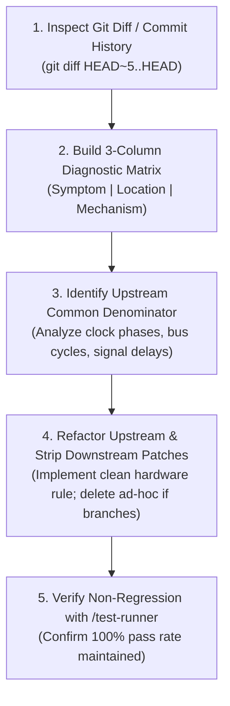

# Recipe: Synthesize Test Fixes (Root-Cause Consolidation)

This skill guides post-facto root-cause consolidation across recent test fixes. When multiple bugs or test failures are resolved one by one, local patches often accumulate across separate files. This workflow audits those changes, maps them into a **3-Column Diagnostic Matrix**, identifies the shared physical hardware law (common denominator), and replaces the scattered patchwork with a single upstream solution.

---

## 1. Core Principles

1. **The Local Patching Trap:**
   - When tackling failures sequentially, each fix feels logical in isolation (e.g. adding a 1-cycle delay in Copper, a latch in Denise, and an interrupt offset in Paula).
   - In a tightly coupled machine, disparate downstream symptoms almost always stem from a single upstream clock phase, bus contention rule, or signal latching invariant.
2. **The 3-Column Diagnostic Matrix:**
   - Every consolidation begins by tabulating recent changes across three distinct axes:
     - **Column 1 (Symptom):** What specific test or behavior was failing?
     - **Column 2 (Location):** Where in the codebase was the patch applied?
     - **Column 3 (Mechanism):** What concrete mechanism (e.g. coordinate nudge $\pm 1$, holding latch, ad-hoc `if`) was introduced?
3. **Upstream Unification ("Common Denominator"):**
   - Step back from individual chip logic and trace backwards along the data lifecycle and clock edges.
   - Formulate a single physical hardware rule in the central substrate (`memory_bus`, `machine_loop`, `agnus`) that satisfies all cases naturally.
4. **Eradication of Ad-Hoc Protections:**
   - The consolidation is only complete when all temporary downstream patches and special-case branches are deleted, leaving clean code that passes `/test-runner`.

---

## 2. Invocation & Zero-Parameter Execution

When invoked without parameters (e.g. via `/synthesize-test-fixes`):
1. **Automatic Scope Detection:**
   - If the working tree is dirty: inspect `git diff`.
   - If the working tree is clean: inspect recent commits (default: `git log -n 5 --oneline` and `git diff HEAD~5..HEAD`).
2. **Autonomous Analysis:**
   - Extracts modified files, parses the changes, and constructs the 3-Column Diagnostic Matrix.
   - Generates the synthesis hypothesis and presents the consolidation plan before touching code.

---

## 3. Step-by-Step Synthesis Workflow



### Step 1: Extract Git History / Diff
```powershell
# If analyzing unstaged or active sprint changes:
git diff > active_fixes.patch

# If analyzing the last N commits:
git log -n 5 --oneline
git diff HEAD~5..HEAD > recent_fixes.patch
```

### Step 2: Build the 3-Column Diagnostic Matrix
Populate the diagnostic table for all modified areas:

| 1. Test / Symptom Verified | 2. Location (File & Subsystem) | 3. Mechanism Applied (Patch Type) |
| :--- | :--- | :--- |
| *e.g. Copper WAIT triggered 1 cycle early* | `crates/copper/src/copper.rs` | *Added artificial offset +1 CCK to comparator* |
| *e.g. Background color changed 1 pixel early* | `crates/denise/src/denise.rs` | *Added 1-cycle holding latch on COLOR00 write* |
| *e.g. Audio DMA interrupt fired before fetch ended* | `crates/paula/src/audio.rs` | *Added delay cycle to AUDxDSR assertion* |

### Step 3: Formulate the Common Denominator Hypothesis
Evaluate the matrix against the physical hardware architecture:
1. **Trace Upstream:** Where do all three affected subsystems intersect? (e.g. CPU bus cycle completion in `crates/memory_bus`, or raster beam counter advance in `crates/agnus`).
2. **Clock Phase Alignment:** Did all symptoms involve a 1-clock or 1-CCK discrepancy? Is an event latching on the rising edge of CCK1 instead of the falling edge of CCK2?
3. **Formulate the Unified Rule:** Define the physical circuit behavior that explains why all three symptoms manifested simultaneously.

### Step 4: Refactor Upstream & Eliminate Downstream Patches
1. Implement the unified physical hardware rule in the central upstream crate (`memory_bus`, `machine_loop`, `agnus`).
2. Delete the downstream workarounds:
   - Remove coordinate and cycle nudges ($\pm 1$).
   - Remove holding latches that were compensating for late bus signals.
   - Remove ad-hoc `if` conditions and test-specific branches.

### Step 5: Verify Non-Regression
Execute the test runner workflow:
```powershell
cargo run -p test_runner -- --diff
python tools/harness/run_tests.py --unit
cargo test -p machine_loop
```
Confirm:
- All previously fixed tests continue to pass.
- No existing tests suffered regressions (0 red diffs).
- Codebase is clean, cohesive, and adheres to [`.agents/rules/structural-root-cause.md`](../../rules/structural-root-cause.md).

---

## 4. Output Contract

Conclude the synthesis execution with a structured report:
- **Commits / Diff Analyzed:** `<range_or_active_diff>`
- **Diagnostic Matrix:** Formatted 3-column table.
- **Identified Common Denominator:** Concise physical hardware law.
- **Upstream Implementation:** File and method where the root cause was solved.
- **Eliminated Downstream Patches:** List of deleted local workarounds.
- **Verification Results:** Regression diff output from `/test-runner`.
