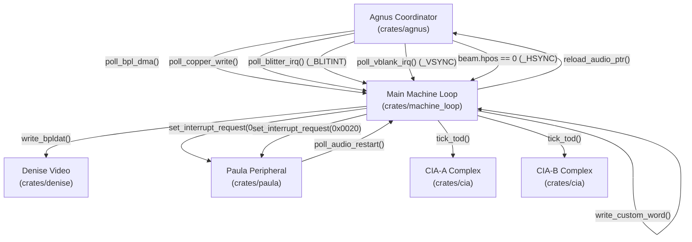

# Agnus (MOS 8370 / 8371 / 8372A) Architecture & Hardware Specification

> [!NOTE]
> System execution constraints, memory bus arbitration, and Color Clock timing are defined in [AGENTS.md](../../../AGENTS.md), [MemoryBus.md](MemoryBus.md), and [Main loop A500.md](Main%20loop%20A500.md).
> Detailed inter-chip signal rules are codified in [`hardware-bus-topology.md`](../../../.agents/rules/hardware-bus-topology.md).
> Save state structures for Agnus are specified in [SaveState.md](SaveState.md). Machine stepping and interrupt delivery are governed by [Main loop A500.md](Main%20loop%20A500.md). Video synchronization is coordinated with [Denise.md](Denise.md) and DMA audio/disk cycles with [Paula.md](Paula.md).
> Subordinate coprocessors and scheduling are specified in dedicated companion documents: [Copper.md](Copper.md), [Blitter.md](Blitter.md), and [DMA.md](DMA.md).

---

## 1. Core Architectural Takeaways & Silicon Invariants

1. **Agnus DMA Address Mastership**:
   - Agnus is the exclusive DMA address master of the Amiga system. It drives all Chip RAM addresses and Custom Register Address (RGA) bus lines during custom chip DMA cycles.
   - [Denise.md](Denise.md) and [Paula.md](Paula.md) are strictly passive data latchers—they contain zero DMA address generators and never execute direct memory reads.
2. **Master Raster Beam Timebase**:
   - Agnus drives the master horizontal (`hpos: 0..227/228`) and vertical (`vpos: 0..311/261`) raster beam counters synchronized to the Color Clock (**CCK**, ~3.54 MHz PAL / ~3.58 MHz NTSC).
   - CPU reads of beam position registers (`VPOSR` at `$DFF004`, `VHPOSR` at `$DFF006`) reflect internal Agnus silicon pipeline behavior: internal scheduling leads the display beam by **5 CCKs**, with a **1 CCK** vertical ripple settling window across line wrap.
3. **Hardware Chip Revisions**:

| Chip Model | Target Standard | Chip RAM Limit | Key Features |
| :--- | :---: | :---: | :--- |
| **MOS 8370** | NTSC OCS | **512 KB** (`$000000-$07FFFF`) | 262-line NTSC display timing, alternating 227/228 CCK long line (`LOL`), standard Blitter/Copper |
| **MOS 8371** | PAL OCS | **512 KB** (`$000000-$07FFFF`) | 312-line PAL display timing, fixed 227 CCK scanlines, standard Blitter/Copper |
| **MOS 8372A** | PAL / NTSC ECS | **1 MB** (`$000000-$0FFFFF`) | "Fat Agnus", pin-selectable PAL/NTSC, 1 MB Chip RAM addressing |

---

## 2. Module Decomposition & Workspace Architecture

To prevent monolithic structures while maintaining strict flat Cargo workspace conventions, Agnus is partitioned into focused, single-responsibility crates under `crates/`:

```
crates/
├── copper/            // Agnus Copper coprocessor state machine (MOVE, WAIT, SKIP, CDANG)
├── blitter/           // 4-channel DMA Blitter, 256 minterms ALU, Bresenham line drawer
├── dma/               // Agnus scanline DMA slot scheduler (227.5 CCK horizontal schedule)
└── agnus/             // Agnus coordinator, beam counters (VHPOSR, VPOSR), register dispatch
```

### 2.1 Subsystem Containment & Re-Exports
Although each subsystem lives in its own crate under `crates/` for fast, decoupled builds, `Agnus` encapsulates and re-exports them via the 3-tier re-export hierarchy:
```rust
pub use blitter;
pub use copper;
pub use dma;

pub struct Agnus {
    pub model: AgnusModel,
    pub copper: copper::Copper,
    pub blitter: blitter::Blitter,
    pub dma: dma::DmaScheduler,
    pub hpos: u16,
    pub vpos: u16,
    pub lof: bool,
    pub lol: bool,
    pub chip_ram_blocked: bool,
    pub pending_bpl_dma: Option<(u8, u16)>,
    // ... registers, pointers, and in-flight mutation pipeline
}
```

---

## 3. Register Memory Map & Bitfield Definitions

All Agnus registers are mapped within the Custom Chip register space (`$DFF000`–`$DFF1FE`):

| Address | R/W | Symbol | Description | Latency Mode |
| :--- | :---: | :--- | :--- | :--- |
| **`$DFF002`** | R | **`DMACONR`** | DMA Control register read (active channels, Blitter busy/zero) | Immediate |
| **`$DFF004`** | R | **`VPOSR`** | Vertical beam position high bits (`V10..V8`), chip ID, `LOF` | Immediate |
| **`$DFF006`** | R | **`VHPOSR`** | Vertical position low 8 bits (`V7..V0`) & Horizontal position (`H8..H1`) | Immediate |
| **`$DFF020`** | W | **`DSKPTH`** | Floppy Disk DMA pointer (High 5 bits) | 2 CCK Overwrite |
| **`$DFF022`** | W | **`DSKPTL`** | Floppy Disk DMA pointer (Low 16 bits, word-aligned) | 2 CCK Overwrite |
| **`$DFF02E`** | W | **`COPCON`** | Copper Control register (bit 1: `CDANG` Copper Danger mode) | 2 CCK Overwrite |
| **`$DFF040`** | W | **`BLTCON0`** | Blitter Control 0 (channel enables A–D, minterms LF0–LF7, shift A) | 2 CCK Overwrite |
| **`$DFF042`** | W | **`BLTCON1`** | Blitter Control 1 (shift B, descending flag, line mode, fill mode) | 2 CCK Overwrite |
| **`$DFF044`** | W | **`BLTAFWM`** | Blitter First Word Mask for Channel A | 2 CCK Overwrite |
| **`$DFF046`** | W | **`BLTALWM`** | Blitter Last Word Mask for Channel A | 2 CCK Overwrite |
| **`$DFF048`** | W | **`BLTCPTH`** | Blitter Channel C Pointer (High 5 bits) | 2 CCK Overwrite |
| **`$DFF04A`** | W | **`BLTCPTL`** | Blitter Channel C Pointer (Low 16 bits, word-aligned) | 2 CCK Overwrite |
| **`$DFF04C`** | W | **`BLTBPTH`** | Blitter Channel B Pointer (High 5 bits) | 2 CCK Overwrite |
| **`$DFF04E`** | W | **`BLTBPTL`** | Blitter Channel B Pointer (Low 16 bits, word-aligned) | 2 CCK Overwrite |
| **`$DFF050`** | W | **`BLTAPTH`** | Blitter Channel A Pointer (High 5 bits) | 2 CCK Overwrite |
| **`$DFF052`** | W | **`BLTAPTL`** | Blitter Channel A Pointer (Low 16 bits, word-aligned) | 2 CCK Overwrite |
| **`$DFF054`** | W | **`BLTDPTH`** | Blitter Channel D Pointer (High 5 bits) | 2 CCK Overwrite |
| **`$DFF056`** | W | **`BLTDPTL`** | Blitter Channel D Pointer (Low 16 bits, word-aligned) | 2 CCK Overwrite |
| **`$DFF058`** | W | **`BLTSIZE`** | Blitter start trigger: Height (rows, bits 6–15) and Width (words, bits 0–5) | 1 CCK Overwrite |
| **`$DFF060`** | W | **`BLTCMOD`** | Blitter Channel C Modulo (signed 16-bit) | 2 CCK Overwrite |
| **`$DFF062`** | W | **`BLTBMOD`** | Blitter Channel B Modulo (signed 16-bit) | 2 CCK Overwrite |
| **`$DFF064`** | W | **`BLTAMOD`** | Blitter Channel A Modulo (signed 16-bit) | 2 CCK Overwrite |
| **`$DFF066`** | W | **`BLTDMOD`** | Blitter Channel D Modulo (signed 16-bit) | 2 CCK Overwrite |
| **`$DFF070`** | W | **`BLTCDAT`** | Blitter Channel C Data latch | 1 CCK Pipeline |
| **`$DFF072`** | W | **`BLTBDAT`** | Blitter Channel B Data latch | 1 CCK Pipeline |
| **`$DFF074`** | W | **`BLTADAT`** | Blitter Channel A Data latch | 1 CCK Pipeline |
| **`$DFF080`** | W | **`COP1LCH`** | Copper First Location Pointer (High 5 bits) | 2 CCK Overwrite |
| **`$DFF082`** | W | **`COP1LCL`** | Copper First Location Pointer (Low 16 bits, word-aligned) | 2 CCK Overwrite |
| **`$DFF084`** | W | **`COP2LCH`** | Copper Second Location Pointer (High 5 bits) | 2 CCK Overwrite |
| **`$DFF086`** | W | **`COP2LCL`** | Copper Second Location Pointer (Low 16 bits, word-aligned) | 2 CCK Overwrite |
| **`$DFF088`** | W/R | **`COPJMP1`** | Copper Restart at `COP1LC` (strobe on write or read; read returns open-bus `$FFFF`) | 1 CCK Overwrite |
| **`$DFF08A`** | W/R | **`COPJMP2`** | Copper Restart at `COP2LC` (strobe on write or read; read returns open-bus `$FFFF`) | 1 CCK Overwrite |
| **`$DFF08C`** | W | **`COPINS`**  | Copper Instruction register latch | 2 CCK Overwrite |
| **`$DFF092`** | W | **`DDFSTRT`** | Display Data Fetch Start (bits 7–2; CCK horizontal slot) | 4 CCK Overwrite |
| **`$DFF094`** | W | **`DDFSTOP`** | Display Data Fetch Stop (bits 7–2; CCK horizontal slot) | 4 CCK Overwrite |
| **`$DFF096`** | W | **`DMACON`**  | DMA Control write (bit 15: SET/CLR, bits 0–14: channel enables) | 2 CCK Overwrite |
| **`$DFF0A0`–`$0D2`** | W | **`AUDxLCH/L`** | Audio Channels 0–3 Location high/low pointers (sets `audlc` & `audpt`) | 2 CCK Overwrite |
| **`$DFF0E0`–`$0F6`** | W | **`BPLxPTH/L`** | Bitplane Channels 1–6 DMA pointers (High 5 bits / Low 16 bits) | 2 CCK Overwrite |
| **`$DFF100`** | W | **`BPLCON0`** | Bitplane Control 0 (mirrored from Denise for DMA plane allocation) | 4 CCK Overwrite |
| **`$DFF108`** | W | **`BPL1MOD`** | Bitplane Modulo 1 (odd bitplanes modulo, signed 16-bit) | 2 CCK Overwrite |
| **`$DFF10A`** | W | **`BPL2MOD`** | Bitplane Modulo 2 (even bitplanes modulo, signed 16-bit) | 2 CCK Overwrite |
| **`$DFF120`–`$13E`** | W | **`SPRxPTH/L`** | Hardware Sprites 0–7 DMA pointers (High 5 bits / Low 16 bits) | 2 CCK Overwrite |

---

### 3.1 DMA Control Registers (`DMACON` & `DMACONR`)

Agnus is the hardware master of DMA channel arbitration. `DMACON` (`$DFF096`) controls channel activation, while `DMACONR` (`$DFF002`) provides status readout:

```
DMACON ($DFF096 - Write):
Bit 15:    SET/CLR   0 = Clear specified bits, 1 = Set specified bits
Bits 14-11: Unused
Bit 10:    BLTPRI    Blitter Nasty (Blitter has 100% bus priority over CPU)
Bit  9:    DMAEN     Master DMA Enable (gates all channels)
Bit  8:    BPLEN     Bitplane DMA Enable
Bit  7:    COPEN     Copper DMA Enable
Bit  6:    BLTEN     Blitter DMA Enable
Bit  5:    SPREN     Sprite DMA Enable
Bit  4:    DSKEN     Floppy Disk DMA Enable
Bit  3:    AUD3EN    Audio Channel 3 DMA Enable
Bit  2:    AUD2EN    Audio Channel 2 DMA Enable
Bit  1:    AUD1EN    Audio Channel 1 DMA Enable
Bit  0:    AUD0EN    Audio Channel 0 DMA Enable

DMACONR ($DFF002 - Read):
Bit 15:    0         Always 0
Bit 14:    BBUSY     Blitter Busy (1 = Blitter active, 0 = Blitter idle)
Bit 13:    BZERO     Blitter Zero (1 = all bits zero during blit, line mode)
Bits 12-11: 0        Unused
Bits 10-0: Same active channel enable bits as DMACON (BLTPRI, DMAEN, BPLEN, COPEN, BLTEN, SPREN, DSKEN, AUDxEN)
```

- **Master Gate Rule:** A channel's DMA is active only when both `DMAEN` (bit 9) and its specific enable bit are asserted:
  ```rust
  #[inline]
  pub fn is_dma_enabled(&self, mask: u16) -> bool {
      (self.dmacon & dmacon::DMAEN) != 0 && (self.dmacon & mask) != 0
  }
  ```
- **Bus Synchronization:** Writes to `DMACON` simultaneously synchronize Paula's DMA state (`AUD0..3`, `DSK`) via the machine loop memory bus.

---

### 3.2 Register Access Semantics & Propagation Pipeline

Agnus embeds a fixed-capacity in-flight mutation array `[Option<DelayedMutation>; 64]` ensuring zero runtime heap allocations:

- **Immediate Readout:** `DMACONR` (`$DFF002`), `VPOSR` (`$DFF004`), and `VHPOSR` (`$DFF006`) read active silicon state immediately on the bus read phase with zero delay.
- **Staging Latencies:**
  - `DMACON` (`$DFF096`): 2 CCK delay (`MutationMode::OverwritePending`).
  - `BPLCON0` (`$DFF100`), `DDFSTRT` (`$DFF092`), `DDFSTOP` (`$DFF094`): 4 CCK delay (`MutationMode::OverwritePending`) to synchronize Agnus bitplane DMA slot schedule.
  - Strobes (`COPJMP1`, `COPJMP2`, `BLTSIZE`): 1 CCK delay (`MutationMode::OverwritePending`).
  - Blitter Data Latches (`BLTCDAT`..`BLTADAT`): 1 CCK delay (`MutationMode::Pipeline`).
  - Address Pointers (`COPxLC`, `BPLxPT`, `SPRxPT`, `AUDxLC`, `DSKPT`): 2 CCK delay (`MutationMode::OverwritePending`).
- **Defensive Overflow Fallback:** If debugger injections saturate the 64-slot buffer, writes commit immediately with a defensive log, preserving zero-host-panic invariants.

---

## 4. Master Beam Counters (`VPOSR` & `VHPOSR`)

Agnus generates display timing and raster position counters synchronized to the Color Clock:

```
VPOSR ($DFF004 - Read):
Bit    15: LOF       Long Frame toggle (toggles every field in interlace mode)
Bits 14-13: 0        Unused
Bit    12: NTSC      1 = NTSC (OCS 8370), 0 = PAL (OCS 8371)
Bits 11-3: Chip ID   0 = OCS, 1 = ECS Fat Agnus (8372A)
Bits  2-0: V10-V8    Vertical scanline high 3 bits (V8 for line >= 256)

VHPOSR ($DFF006 - Read):
Bits 15-8: V7-V0     Vertical scanline low 8 bits
Bits  7-0: H8-H1     Horizontal Color Clock position (0..227 CCK; H0 is sub-CCK pixel clock)
```

### 4.1 PAL vs NTSC Scanning Timings

- **PAL Scanning (MOS 8371):**
  - **Vertical Lines:** 312 lines ($0$ to $311$). Scanlines $\ge 256$ assert $V_8$ in `VPOSR`.
  - **Horizontal CCKs:** Fixed **227 CCKs** per scanline (`PAL_LINE_CCKS = 227`).
  - **Frame Total:** $312 \times 227 = 70,824\ \text{CCKs}$ ($\approx 50.00\ \text{Hz}$).
- **NTSC Scanning (MOS 8370):**
  - **Vertical Lines:** 262 lines ($0$ to $261$).
  - **Horizontal CCKs:** Alternates between **227 CCKs** (short line) and **228 CCKs** (long line) on every scanline via the `LOL` toggle bit (`NTSC_SHORT_LINE_CCKS = 227`, `NTSC_LONG_LINE_CCKS = 228`).
  - **Frame Total:** $262 \times 227.5 = 59,605\ \text{CCKs}$ ($\approx 60.05\ \text{Hz}$).
- **Interlace Long Frame (`LOF`):** Toggles bit 15 on every vertical wrap ($vpos = 0$), shifting odd and even fields by half a scanline.

---

### 4.2 Silicon Pipeline Lead & Ripple Counter Settling

When software reads `VHPOSR` and `VPOSR` via the CPU bus, the readout reflects Agnus internal pipeline and counter ripple latency:

```rust
pub const VHPOSR_PIPELINE_LEAD_CCKS: u16 = 5;
pub const VHPOSR_VERTICAL_SETTLE_CCKS: u16 = 1;

#[inline]
fn pipelined_beam_readout(&self) -> (u16, u16) {
    let line_ccks = match self.model {
        AgnusModel::OcsNtsc8370 => if self.lol { 228 } else { 227 },
        _ => PAL_LINE_CCKS,
    };

    let mut h = self.hpos + VHPOSR_PIPELINE_LEAD_CCKS;
    let mut v = self.vpos;
    if h >= line_ccks {
        h -= line_ccks;
        v = v.wrapping_add(1);
        if v >= self.max_lines() {
            v = 0;
        }
    }

    // Vertical ripple counter settles during the first CCK of horizontal line wrap
    let effective_v = if h <= VHPOSR_VERTICAL_SETTLE_CCKS {
        self.vpos
    } else {
        v
    };
    (h, effective_v)
}
```

1. **5 CCK Pipeline Lead:** Agnus internal beam scheduling logic runs 5 CCKs ahead of the visible display beam to pre-fetch DMA slots and synchronize output latches.
2. **1 CCK Vertical Settle:** When the horizontal counter wraps, the vertical ripple counter requires 1 CCK to settle; during this window, CPU reads return the pre-wrap vertical position.

---

## 5. Autonomous DMA Address Mastership & Pointer Progression

During active DMA scanlines, Agnus evaluates the 8-tier priority arbiter ([DMA.md](DMA.md)) and drives Chip RAM addressing:

1. **Bitplane DMA (`pending_bpl_dma`)**:
   - Fetches 16-bit word from `chip_ram[bplpt[p]]`.
   - Stages word in `pending_bpl_dma: Option<(u8, u16)>`, polled by [Main loop A500.md](Main%20loop%20A500.md) and transferred to Denise `BPLxDAT`.
   - Advances pointer by 2 bytes: `bplpt[p] = (bplpt[p] + 2) & 0x0007_FFFE`.
   - On the last bitplane block of the line (`is_last_bpl_block`), adds signed modulo (`bpl1mod` for odd planes, `bpl2mod` for even planes).
2. **Hardware Sprites (`sprpt`)**:
   - When Sprite DMA slot triggers, fetches sprite control or image word and advances pointer: `sprpt[s] = (sprpt[s] + 2) & 0x0007_FFFE`.
3. **Audio DMA (`audpt` & `audlc`)**:
   - Advances pointer by 2 bytes during audio DMA slots: `audpt[c] = (audpt[c] + 2) & 0x0007_FFFE`.
   - **Pointer Reload:** When Paula's audio buffer empties and triggers a loop restart (`AUDxDSR`), Paula signals the machine loop, which invokes `agnus.reload_audio_ptr(ch)` to reset `audpt[ch] = audlc[ch]`.
4. **Floppy Disk DMA (`dskpt`)**:
   - Master track buffer address driven by Agnus (`dskpt: u32`). Latched via `DSKPTH`/`DSKPTL`.

---

## 6. Physical Cross-Chip Signals & Machine Loop Interconnect

Per [Hardware Bus Topology](../../../.agents/rules/hardware-bus-topology.md), Agnus holds zero direct references to peer chips. All inter-chip coordination occurs through explicit polling interfaces evaluated by [Main loop A500.md](Main%20loop%20A500.md):



| Physical Trace / Signal | Source API | Machine Loop Action | Target Subsystem | Target Effect |
| :--- | :--- | :--- | :--- | :--- |
| **Bitplane Data Word** | `agnus.poll_bpl_dma()` | `denise.write_bpldat(plane, word)` | [Denise.md](Denise.md) | Video serializer bitplane latching |
| **Copper Register Write** | `agnus.poll_copper_write()`| `self.write_custom_word(reg, val)` | Custom Bus | Dispatched to target register pipeline |
| **`_BLITINT` Pin** | `agnus.poll_blitter_irq()` | `paula.set_interrupt_request(0x0040)` | [Paula.md](Paula.md) | INTREQ Level 3 Blitter interrupt (bit 6) |
| **`_VSYNC` Pin** | `agnus.poll_vblank_irq()` | `paula.set_interrupt_request(0x0020)` | [Paula.md](Paula.md) & [CIA.md](CIA.md) | INTREQ Level 3 VBlank interrupt (bit 5) & CIA-A 50/60 Hz TOD tick |
| **`_HSYNC` Pin** | `beam.hpos == 0` | `cia_b.tick_tod()` | [CIA.md](CIA.md) | CIA-B horizontal scanline TOD counter tick |
| **Audio Loop Restart** | `paula.poll_audio_restart(ch)`| `agnus.reload_audio_ptr(ch)` | Agnus | Reloads `audpt[ch]` from `audlc[ch]` |

---

## 7. Subordinate Coprocessors & Subsystems

Agnus encapsulates three specialized companion engines, fully specified in their respective architecture documents:

### 7.1 DMA Arbitration & Slot Scheduling
- **Master DMA Address Generator:** Agnus drives Chip RAM memory addresses and RGA bus register strobes across all channels.
- **Scanline Partitioning:** 227.5 CCK horizontal schedule allocating fixed slots for Refresh, Floppy, Audio, and Sprites, dynamic slots for Bitplanes, and residual cycles for Copper, Blitter, and CPU.
- **Contention Management:** Monitors Chip RAM blocking and arbitrates Blitter Nasty vs Normal mode with 3-cycle CPU starvation yield.
- *Authoritative Specification:* See [DMA.md](DMA.md).

### 7.2 Copper Display Coprocessor
- **Synchronized Coprocessor:** Executes 32-bit instructions (`MOVE`, `WAIT`, `SKIP`) in lockstep with the raster beam.
- **Danger Mode Protection:** Manages `CDANG` register write permissions below `$DFF080` via `COPCON`.
- **List Pointers & Strobes:** Manages `COP1LC`, `COP2LC`, `COPJMP1`, `COPJMP2`, and VBlank reset.
- *Authoritative Specification:* See [Copper.md](Copper.md).

### 7.3 4-Channel Blitter
- **Bit-Block Transferrer:** 4 DMA channels (A, B, C, D) supporting arbitrary rectangle copies, 256 boolean minterms, and sub-word barrel shifting.
- **Vector Line Drawing:** Hardware Bresenham line drawer with slope accumulators and octant direction control.
- **Area Fill & Zero Detect:** Inclusive/exclusive area filling and Zero flag evaluation (`BZERO` in `DMACONR`).
- *Authoritative Specification:* See [Blitter.md](Blitter.md).

---

## 8. Reset Defaults & Coordination

- **`DMACON` (`$DFF096`):** Reset to **`$0000`** (all DMA channels disabled). Agnus immediately releases the Chip RAM bus, ensuring the CPU has unblocked access.
- **`COPCON` (`$DFF02E`):** Reset to **`$0000`** (`CDANG = 0`, Copper danger registers protected).
- **`DDFSTRT` (`$DFF092`):** Reset to **`$0038`** (standard OCS wide display fetch start).
- **`DDFSTOP` (`$DFF094`):** Reset to **`$00D0`** (standard OCS wide display fetch stop).
- **`BPLCON0` (`$DFF100`):** Reset to **`$0000`** (0 bitplanes active, display DMA disabled).
- **Copper State:** Halted until re-enabled by CPU via `DMACON` and triggered via `COPJMP1`.
- **Blitter State:** Idle (`BLTDONE` asserted, busy flag cleared).

---

## 9. Reference Documentation & Upstream Ground Truth

- [Copper Architecture Specification](Copper.md): Comprehensive 3-instruction coprocessor state machine and timing.
- [Blitter Architecture Specification](Blitter.md): 4-channel DMA block transferrer, minterms, and Bresenham line mode.
- [DMA Architecture & Scheduling](DMA.md): 227.5 CCK horizontal slot scheduling and 8-tier priority hierarchy.
- [Cross-Chip Signals and Action Dispatch Catalog](Cross-Chip%20Signals%20and%20Action%20Dispatch%20Catalog.md): Centralized register dispatch and physical signal pin mappings.
- [Amiga Hardware Reference Manual: Chapter 2 (Coprocessor Hardware)](../Reference/Hardware%20Reference%20Manual/02%20-%20Chapter%202%20-%20Coprocessor%20Hardware.md): Authoritative specification for Copper instruction formats (`MOVE`, `WAIT`, `SKIP`).
- [Amiga Hardware Reference Manual: Chapter 6 (Blitter Hardware)](../Reference/Hardware%20Reference%20Manual/06%20-%20Chapter%206%20-%20Blitter%20Hardware.md): Circuit principles for 4-channel DMA Blitter, minterm generator (`BLTCON0`), shifters, and line drawing.
- [Amiga Hardware Reference Manual: Appendix A (Register Summary Alphabetical)](../Reference/Hardware%20Reference%20Manual/09%20-%20Appendix%20A%20-%20Register%20Summary%20%28Alphabetical%29.md): Authoritative register addresses and R/W properties (`VHPOSR` at `$006`, `VPOSR` at `$004`).
- [Amiga Hardware Reference Manual: Appendix B (Register Summary Address Order)](../Reference/Hardware%20Reference%20Manual/10%20-%20Appendix%20B%20-%20Register%20Summary%20%28Address%20Order%29.md): Complete memory-mapped address order table and bitfield masks for all Agnus registers (`$DFF000`–`$DFF1FE`).
- [vAmiga Agnus Component Implementation](../../../ref_src/vAmiga-4.5/Core/Components/Agnus/Agnus.cpp): Reference coordinator implementation for beam counters and custom register access.
