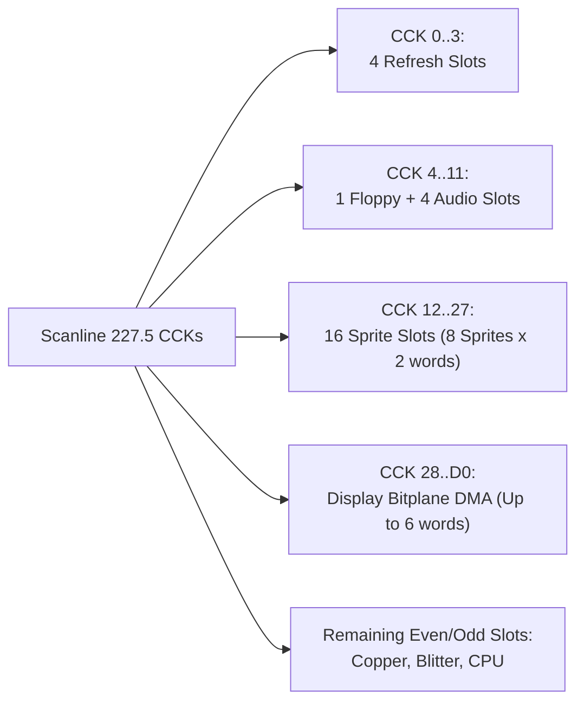
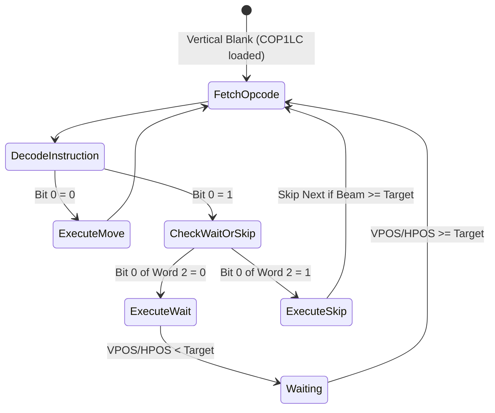
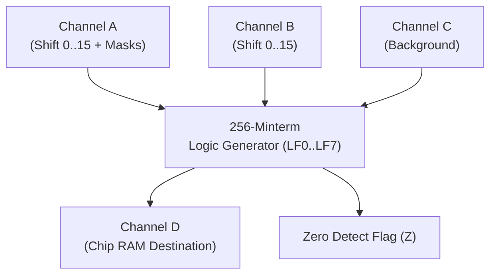

# Agnus (MOS 8370 / 8371 / 8372A) Architecture & Hardware Specification

> [!NOTE]
> System execution constraints, memory bus arbitration, and Color Clock timing are defined in [AGENTS.md](../../../AGENTS.md), [MemoryBus.md](MemoryBus.md), and [CycleCounter.md](CycleCounter.md).
> Save state structures for Agnus are specified in [SaveState.md](SaveState.md). Machine stepping and interrupt delivery are governed by [Main loop A500.md](Main%20loop%20A500.md). Video synchronization is coordinated with [Denise.md](Denise.md) and DMA audio/disk cycles with [Paula.md](Paula.md).

---

## 1. Scope & Chip Revisions

Agnus is the master bus controller, DMA arbiter, and primary coprocessor engine of the Amiga 500:

| Chip Model | Target Standard | Chip RAM Limit | Key Features |
| :--- | :---: | :---: | :--- |
| **MOS 8370** | NTSC OCS | **512 KB** (`$000000-$07FFFF`) | 262/263-line NTSC display timing, standard Blitter/Copper |
| **MOS 8371** | PAL OCS | **512 KB** (`$000000-$07FFFF`) | 312/313-line PAL display timing, standard Blitter/Copper |
| **MOS 8372A** | PAL / NTSC ECS | **1 MB** (`$000000-$0FFFFF`) | "Fat Agnus", pin-selectable PAL/NTSC, 1MB Chip RAM addressing |

---

## 2. Module Decomposition

To prevent monolithic structures, Agnus is organized into focused submodules:

```
chips/agnus/
├── mod.rs             // Agnus coordinator, register dispatch & tick routing
├── beam.rs            // Master raster beam counters (VHPOSR, VPOSR, LOF toggle)
├── dma.rs             // DMA channel arbiter & DMACON scheduling
├── copper.rs          // Copper coprocessor state machine (MOVE, WAIT, SKIP)
└── blitter.rs         // 4-channel DMA Blitter, minterm ALU, Bresenham line drawer
```

---

## 3. Register Memory Map

All Agnus registers are mapped within the Custom Chip register space (`$DFF000`–`$DFF07E`, `$DFF080`–`$DFF096`):

| Address | R/W | Symbol | Description |
| :--- | :---: | :--- | :--- |
| **`$DFF002`** | R | **`DMACONR`** | DMA Control register read (channel active flags & Blitter Nasty status) |
| **`$DFF004`** | R | **`VHPOSR`** | Vertical & Horizontal beam position read |
| **`$DFF006`** | R | **`VPOSR`** | Vertical beam position high bit, chip ID (PAL/NTSC), and `LOF` flag |
| **`$DFF02E`** | W | **`COPCON`** | Copper Control register (bit 1: `CDANG` Copper Danger mode) |
| **`$DFF040`** | W | **`BLTCON0`** | Blitter Control 0 (channel enables A–D, minterms LF0–LF7, shift A) |
| **`$DFF042`** | W | **`BLTCON1`** | Blitter Control 1 (shift B, descending flag, line mode, fill mode) |
| **`$DFF044`** | W | **`BLTAFWM`** | Blitter First Word Mask for Channel A |
| **`$DFF046`** | W | **`BLTALWM`** | Blitter Last Word Mask for Channel A |
| **`$DFF048`** | W | **`BLTCPTH`** | Blitter Channel C Pointer (High 5 bits) |
| **`$DFF04A`** | W | **`BLTCPTL`** | Blitter Channel C Pointer (Low 16 bits) |
| **`$DFF04C`** | W | **`BLTBPTH`** | Blitter Channel B Pointer (High 5 bits) |
| **`$DFF04E`** | W | **`BLTBPTL`** | Blitter Channel B Pointer (Low 16 bits) |
| **`$DFF050`** | W | **`BLTAPTH`** | Blitter Channel A Pointer (High 5 bits) |
| **`$DFF052`** | W | **`BLTAPTL`** | Blitter Channel A Pointer (Low 16 bits) |
| **`$DFF054`** | W | **`BLTDPTH`** | Blitter Channel D Pointer (High 5 bits) |
| **`$DFF056`** | W | **`BLTDPTL`** | Blitter Channel D Pointer (Low 16 bits) |
| **`$DFF058`** | W | **`BLTSIZE`** | Blitter start trigger: Height (rows, bits 6–15) and Width (words, bits 0–5) |
| **`$DFF060`** | W | **`BLTCMOD`** | Blitter Channel C Modulo (signed 16-bit) |
| **`$DFF062`** | W | **`BLTBMOD`** | Blitter Channel B Modulo (signed 16-bit) |
| **`$DFF064`** | W | **`BLTAMOD`** | Blitter Channel A Modulo (signed 16-bit) |
| **`$DFF066`** | W | **`BLTDMOD`** | Blitter Channel D Modulo (signed 16-bit) |
| **`$DFF070`** | W | **`BLTCDAT`** | Blitter Channel C Data latch |
| **`$DFF072`** | W | **`BLTBDAT`** | Blitter Channel B Data latch |
| **`$DFF074`** | W | **`BLTADAT`** | Blitter Channel A Data latch |
| **`$DFF080`** | W | **`COP1LCH`** | Copper First Location Pointer (High 5 bits) |
| **`$DFF082`** | W | **`COP1LCL`** | Copper First Location Pointer (Low 16 bits) |
| **`$DFF084`** | W | **`COP2LCH`** | Copper Second Location Pointer (High 5 bits) |
| **`$DFF086`** | W | **`COP2LCL`** | Copper Second Location Pointer (Low 16 bits) |
| **`$DFF088`** | W | **`COPJMP1`** | Copper Restart at `COP1LC` (strobe) |
| **`$DFF08A`** | W | **`COPJMP2`** | Copper Restart at `COP2LC` (strobe) |
| **`$DFF08C`** | W | **`COPINS`**  | Copper Instruction register latch |
| **`$DFF096`** | W | **`DMACON`**  | DMA Control write (bit 15: SET/CLR, bits 0–14: channel enables) |

### 3.1 Register Access Semantics & Propagation Latency Pipeline
- **Immediate Latch Reads:** `DMACONR` (`$DFF002`), `VHPOSR` (`$DFF004`), and `VPOSR` (`$DFF006`) return the active hardware register state immediately on the bus read phase with zero delay.
- **Write Staging Buffer:** Agnus embeds an inline fixed-capacity mutation array `[Option<DelayedMutation>; 64]` sizing to its addressable write register set.
- **Propagation Timing:**
  - `DMACON` (`$DFF096`): Propagates with 2 CCK delay (`MutationMode::OverwritePending`). Bit 15 determines SET/CLR behavior. Propagates simultaneously across the bus to synchronize Paula DMA channel enables (`AUD0..3`, `DSK`).
  - `BPLCON0` (`$DFF100` mirror): Propagates with 4 CCK delay (`MutationMode::OverwritePending`) to synchronize Agnus bitplane DMA slot schedule.
  - Strobes (`COPJMP1`, `COPJMP2`, `BLTSIZE`): Propagate with 2 CCK delay (`MutationMode::OverwritePending`).
- **Defensive Overflow Protection:** If debugger injections saturate the 64-slot buffer, writes commit immediately with a defensive error log, preserving zero-panic invariants.

---

## 4. Master Beam Counters (`VHPOSR` & `VPOSR`)

Agnus generates display timing and raster position counters synchronized to the Color Clock:

```
VHPOSR ($DFF004):
Bits 15-8: V7-V0  (Vertical scanline low 8 bits)
Bits  7-0: H8-H1  (Horizontal Color Clock position bits 8 to 1; H0 is internal sub-CCK)

VPOSR ($DFF006):
Bit    15: LOF    (Long Frame bit: toggles every frame in interlace mode)
Bits 14-8: Chip ID (0 = OCS PAL 8371 / NTSC 8370; 1 = ECS Fat Agnus 8372A)
Bit     0: V8     (Vertical scanline bit 8)
```

- **PAL Scanning:** $312$ lines ($0$ to $311$). $V_8$ is set for scanlines $\ge 256$. Total CCKs per frame: $70,937$ ($\approx 50.00\ \text{Hz}$).
- **NTSC Scanning:** $262$ lines ($0$ to $261$). Total CCKs per frame: $59,605$ ($\approx 60.05\ \text{Hz}$).
- **Horizontal Range:** Counts $0$ to $227$ CCKs per line (alternating 227/228 on PAL).

### 4.1 Beam Counter Implementation (`chips/agnus/beam.rs`)

```rust
use serde::{Deserialize, Serialize};

#[derive(Debug, Clone, Copy, PartialEq, Eq, Serialize, Deserialize)]
pub enum VideoStandard {
    Pal,
    Ntsc,
}

#[derive(Debug, Clone, Copy, PartialEq, Eq, Serialize, Deserialize)]
pub struct BeamCounter {
    standard: VideoStandard,
    hpos: u16,
    vpos: u16,
    lof: bool,
}

impl BeamCounter {
    pub fn new(standard: VideoStandard) -> Self {
        Self {
            standard,
            hpos: 0,
            vpos: 0,
            lof: false,
        }
    }

    /// Advance raster beam by 1 CCK tick
    #[inline(always)]
    pub fn step_cck(&mut self) {
        let max_hpos = self.line_cck_count(self.vpos);
        self.hpos += 1;
        if self.hpos >= max_hpos {
            self.hpos = 0;
            self.vpos += 1;
            let max_vpos = match self.standard {
                VideoStandard::Pal => 312,
                VideoStandard::Ntsc => 262,
            };
            if self.vpos >= max_vpos {
                self.vpos = 0;
                self.lof = !self.lof; // Toggle interlace field
            }
        }
    }

    /// Returns the number of CCKs for the current scanline (alternating 227 and 228 on PAL)
    #[inline(always)]
    pub fn line_cck_count(&self, line: u16) -> u16 {
        match self.standard {
            VideoStandard::Pal => if (line & 1) == 0 { 228 } else { 227 },
            VideoStandard::Ntsc => 227,
        }
    }

    #[inline(always)]
    pub fn hpos(&self) -> u16 { self.hpos }

    #[inline(always)]
    pub fn vpos(&self) -> u16 { self.vpos }

    #[inline(always)]
    pub fn lof(&self) -> bool { self.lof }

    /// Format value for VHPOSR register ($DFF004)
    #[inline(always)]
    pub fn read_vhposr(&self) -> u16 {
        ((self.vpos & 0xFF) << 8) | ((self.hpos >> 1) & 0xFF)
    }

    /// Format value for VPOSR register ($DFF006)
    #[inline(always)]
    pub fn read_vposr(&self, is_ecs: bool) -> u16 {
        let lof_bit = if self.lof { 0x8000 } else { 0x0000 };
        let chip_id = if is_ecs { 0x2000 } else { 0x0000 };
        let v8_bit = if self.vpos >= 256 { 0x0001 } else { 0x0000 };
        lof_bit | chip_id | v8_bit
    }
}
```

---

## 5. DMA Channel Arbitration & Slot Schedule

Agnus acts as the hardware arbiter for Chip RAM. Each horizontal scanline ($227.5$ CCKs) is partitioned into dedicated DMA time slots:



### 5.1 Fixed Time Slot Allocations
1. **DRAM Refresh:** 4 dedicated memory cycles during horizontal blanking (`CCK 0`–`3`).
2. **Floppy Disk DMA:** 1 dedicated memory cycle per scanline (`CCK 4`).
3. **Audio DMA:** 4 memory cycles (1 for each audio channel `AUD0`–`AUD3`) per scanline (`CCK 5`–`8`).
4. **Sprite DMA:** 16 memory cycles (2 words per sprite for `SPR0`–`SPR7`) per scanline (`CCK 12`–`27`).
5. **Bitplane DMA:** Dynamically allocated according to display depth (`BPLCON0`):
   - In 4-plane Low-Res: Claims 4 slots out of every 8.
   - In 6-plane Low-Res or 4-plane Hi-Res: Claims 6 slots out of every 8.

### 5.2 CPU Access & Blitter Nasty (`BLTPRI`)
- **Even Cycles:** Dedicated to Agnus DMA (Refresh, Audio, Disk, Sprites, Bitplanes).
- **Odd Cycles:** Available to the Motorola 68000 CPU.
- **Blitter Nasty Mode (`DMACON` bit 10 `BLTPRI`):**
  - When `BLTPRI == 0`, the Blitter only uses idle even slots and odd slots when the CPU does not request them.
  - When `BLTPRI == 1` ("Blitter Nasty"), Agnus awards **all available memory cycles** (both even and odd) to the Blitter. If the Blitter requires bus cycles, the CPU is completely locked out (`MemoryBusResult::Blocked`), maximizing blit transfer speed.

### 5.3 Baseline DMA Bus Contention Exposure
The baseline DMA arbiter implements horizontal scanline slot arbitration before individual custom chip internal logic (e.g. video bitplane serialization, audio BLEP synthesis) is completed:
- On each CCK cycle, Agnus determines if the active slot is allocated to custom chip DMA or claimed by Blitter Nasty.
- Agnus signals `MemoryBus::set_chip_ram_blocked(blocked)`.
- When `blocked == true`, any CPU access to Chip RAM (`$000000-$07FFFF`) stalls via `MemoryBusResult::Blocked`, asserting wait states. Fast RAM (`$200000-$27FFFF`) remains accessible at full speed without contention.

### 5.4 Delayed Mutation Propagation Pipeline
In Agnus, writes to control registers (`DMACON`, `BLTCON0/1`, `COPCON`) or strobes (`COPJMP1/2`, `BLTSIZE`) do not take instantaneous cross-chip effect:
- **Read is NOW**: Reading `DMACONR`, `VHPOSR`, or `VPOSR` returns the currently active, latched state immediately on the current cycle.
- **Write is Staged**: Writes enter an inline, fixed-capacity pipeline (`[Option<DelayedMutation<u16>>; 4]`).
- Each CCK step decrements `remaining_cck`. When it reaches zero, the mutated value commits to the active register (e.g. updating DMA channel enables or triggering the Copper program counter reload).
- **Zero Allocations & Save State Persistence**: The mutation array contains no heap allocations and is serialized into `AgnusState`, preserving determinism across save/restore cycles.

---

## 6. Copper Coprocessor

The Copper is an autonomous programmable display coprocessor synchronized with the raster beam.



### 6.1 Instruction Set (3 Instructions, 32 Bits Each)
1. **`MOVE` (Word 1: `$0000_0000_RRRR_RRR0`, Word 2: `DDDD_DDDD_DDDD_DDDD`):**
   - Writes immediate 16-bit value `D` to custom register offset `R` (`$DFF000 + R`).
   - **Copper Danger Mode (`CDANG` in `COPCON`):**
     - If `CDANG == 0`, writes to registers below `$DFF080` (such as Blitter registers `$DFF040`–`$DFF074`) are locked out and executed as no-ops.
     - If `CDANG == 1`, the Copper can write to any custom register.
2. **`WAIT` (Word 1: `VVVV_VVVV_HHHH_HHH1`, Word 2: `BMVV_VVVV_HHHH_HHH0`):**
   - Halts the Copper until `(VPOS, HPOS)` matches or exceeds the specified target position masked by word 2.
   - `B` bit (bit 15 of word 2): When set, Copper waits for Blitter Done (`BLTDONE`).
3. **`SKIP` (Word 1: `VVVV_VVVV_HHHH_HHH1`, Word 2: `BMVV_VVVV_HHHH_HHH1`):**
   - Compares the beam position to target. If current position is greater than or equal to target, skips the next 32-bit instruction.

### 6.2 Restart & Interrupts
- At the start of vertical blanking (line 0), Agnus automatically resets the Copper program counter to `COP1LC`.
- Writes to `COPJMP1` (`$DFF088`) force an immediate reload from `COP1LC`.
- Writes to `COPJMP2` (`$DFF08A`) force an immediate reload from `COP2LC`.
- Writing to a Copper register can trigger the `COPER` interrupt in Paula (Level 3).

---

## 7. 4-Channel Blitter (Bit-Block Transferrer)

The Blitter is a high-speed hardware block mover with an integrated ALU supporting boolean logic operations, arbitrary bit shifts, and Bresenham vector line drawing:



### 7.1 Architecture & Operations
- **4 DMA Channels:**
  - **Channel A:** Source operand, line drawing pattern, and mask source.
  - **Channel B:** Source operand, texture/pattern, bit shifter.
  - **Channel C:** Background operand for cookie-cut blits.
  - **Channel D:** Destination operand written to Chip RAM.
- **256 Minterm Generator:**
  - Bits 7–0 of `BLTCON0` (`LF0`–`LF7`) select any of the 256 boolean logic equations combining inputs A, B, and C:
    $$D = f(A, B, C)$$
  - Standard copy $D = A$: `$09F0` in `BLTCON0`.
  - Cookie-cut blit $D = (A \land B) \lor (\neg A \land C)$: `$0CA0` in `BLTCON0`.
- **Barrel Shifters:**
  - Channel A shift ($0..15$ bits) set via `BLTCON0` bits 12–15.
  - Channel B shift ($0..15$ bits) set via `BLTCON1` bits 12–15.
- **First & Last Word Masks:**
  - `BLTAFWM`: Bitmask ANDed with the first word of each row on channel A.
  - `BLTALWM`: Bitmask ANDed with the last word of each row on channel A.
- **Addressing & Modulos:**
  - Pointers `BLTAPT`, `BLTBPT`, `BLTCPT`, `BLTDPT` advance by 2 bytes after each word transfer.
  - At the end of each row, signed modulos `BLTAMOD`, `BLTBMOD`, `BLTCMOD`, `BLTDMOD` are added.
  - **Ascending vs Descending Mode:** Controlled by `BLTCON1` bit 1 (`DESC`). When set, pointers decrement, enabling safe overlapping memory copies without corruption.
- **Bresenham Line Drawing Mode:**
  - Enabled via `BLTCON1` bit 0 (`LINE`).
  - Implements hardware single-pixel line drawing between arbitrary $(X_1, Y_1)$ and $(X_2, Y_2)$ coordinates using Bresenham slope error accumulators.
- **Zero Detect (`BLTCON0` bit 13):**
  - Evaluates all words written to destination D. If all bits are zero, the `Z` flag remains set; cleared if any bit is 1.

---

## 8. Reset Defaults & Coordination

- **`DMACON` (`$DFF096`):** Reset to **`$0000`** (all DMA channels disabled). Agnus immediately releases the Chip RAM bus, ensuring the CPU has unblocked access.
- **`COPCON` (`$DFF02E`):** Reset to **`$0000`** (`CDANG = 0`, Copper danger registers protected).
- **Copper State:** Halted until re-enabled by CPU via `DMACON` and triggered via `COPJMP1`.
- **Blitter State:** Idle (`BLTDONE` asserted, busy flag cleared).

---

## 9. Reference Documentation & Upstream Ground Truth

- [Amiga Hardware Reference Manual: Chapter 2 (Coprocessor Hardware)](../Reference/Hardware%20Reference%20Manual/02%20-%20Chapter%202%20-%20Coprocessor%20Hardware.md): Authoritative specification for Copper instruction formats (`MOVE`, `WAIT`, `SKIP`), bus timing, and danger register protection (`COPCON`).
- [Amiga Hardware Reference Manual: Chapter 6 (Blitter Hardware)](../Reference/Hardware%20Reference%20Manual/06%20-%20Chapter%206%20-%20Blitter%20Hardware.md): Circuit principles for 4-channel DMA Blitter, 256 minterm truth table generator (`BLTCON0`), shifters, and Bresenham line drawing.
- [Amiga Hardware Reference Manual: Appendix B (Register Summary)](../Reference/Hardware%20Reference%20Manual/10%20-%20Appendix%20B%20-%20Register%20Summary%20%28Address%20Order%29.md): Complete memory-mapped address order table and bitfield masks for all Agnus registers (`$DFF000`–`$DFF07E`).
- [vAmiga Copper Component Implementation](../../../ref_src/vAmiga-4.5/Core/Components/Agnus/Copper/Copper.cpp): Cycle-exact state machine model for Copper instruction decode, comparator logic, and DMA slot fetches.
- [vAmiga Blitter Component Implementation](../../../ref_src/vAmiga-4.5/Core/Components/Agnus/Blitter/Blitter.cpp): Reference pipeline implementation for multi-channel DMA blits, shift logic, and mask application.
