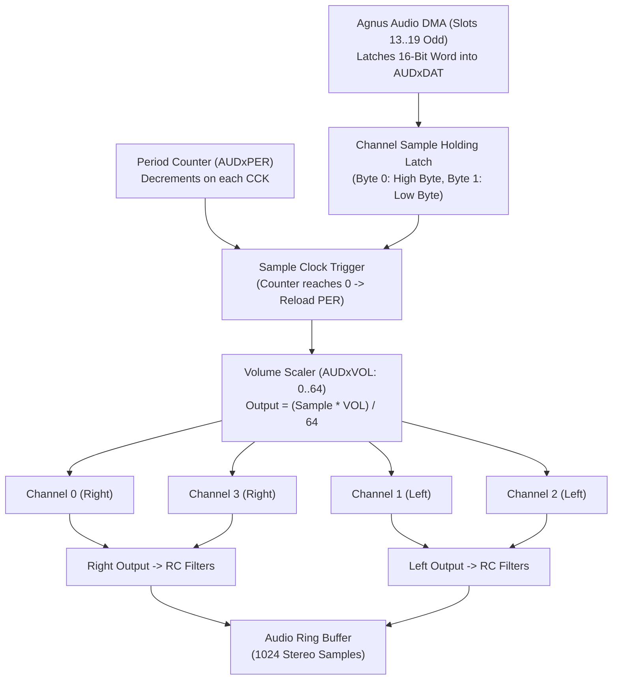

# Paula 4-Channel DMA Audio Architecture & Hardware Specification

> [!NOTE]
> System execution constraints, memory bus arbitration, and Color Clock timing are defined in [AGENTS.md](../../../AGENTS.md), [MemoryBus.md](MemoryBus.md), and [Main loop A500.md](Main%20loop%20A500.md).
> Detailed inter-chip signal rules are codified in [`hardware-bus-topology.md`](../../../.agents/rules/hardware-bus-topology.md).
> Central interrupt multiplexing and UART handling are governed by [Paula.md](Paula.md). Agnus DMA time slot scheduling is detailed in [DMA.md](DMA.md), and LED low-pass filter switching is controlled by [CIA.md](CIA.md).

---

## 1. Core Decisions & Architectural Principles

The audio subsystem of Paula houses 4 independent direct memory access (DMA) sound channels producing 8-bit signed PCM audio output. The channels are routed to fixed stereo channels and feature independent period clocks and volume scaling.



### 1.1 Core Hardware Invariants
1. **Zero Direct Memory Reads:** The audio engine contains **no DMA pointer registers and no address generation circuitry**. Agnus owns all `AUDxPT` pointers and drives Chip RAM addresses in odd memory slots 13, 15, 17, and 19. Paula passively latches the 16-bit word off the data bus into `AUDxDAT` upon matching its `RGA` strobe.
2. **Fixed Stereo Channel Mapping:** Channels 1 and 2 are hardwired to the **Left** stereo output; Channels 0 and 3 are hardwired to the **Right** stereo output.
3. **Period Clock Formula:** The period divider decrements once every Color Clock (~3.55 MHz PAL / ~3.58 MHz NTSC).
4. **Hardware Period Limits:** The minimum period supported by hardware DMA is **124 CCKs** ($\approx 28.86\ \text{kHz}$ under PAL); maximum is **65,535 CCKs** ($\approx 54.1\ \text{Hz}$).

---

## 2. Module Architecture & Crate Containment (`crates/audio`)

```
crates/audio/
├── Cargo.toml
├── src/
│   └── audio.rs           // 4-channel audio engine, period counters, volume scaling, ring buffer
└── tests/
    └── test_audio.rs      // Sample clocking, stereo routing, volume scaling, modulation tests
```

### 2.1 State Representation (`AudioChannel`)
```rust
#[derive(Debug, Clone, Copy, PartialEq, Eq, Default, Serialize, Deserialize)]
pub struct AudioChannel {
    pub lc: u32,
    pub current_pt: u32,
    pub len: u16,
    pub words_remaining: u16,
    pub per: u16,
    pub vol: u8,
    pub dat: u16,
    pub counter: u16,
    pub sample_byte: u8,
    pub current_sample: i8,
    pub dma_enabled: bool,
    pub active: bool,
    pub dma_request: bool,
    pub irq_pending: bool,
    pub restart_strobe: bool,
}
```

---

## 3. Sample Clocking & Frequency Formulas

On each Color Clock (CCK), every active channel decrements its internal counter (`counter`). When the counter reaches 0:
1. `counter` reloads from `AUDxPER`.
2. The next 8-bit signed PCM sample byte is output:
   - High byte of `AUDxDAT` is played first (`sample_byte = 0`).
   - Low byte of `AUDxDAT` is played second (`sample_byte = 1`).
3. When both bytes are consumed, the channel asserts `dma_request = true` to request the next 16-bit word from Agnus DMA.

### 3.1 Sample Rate Equations
$$f_{\text{sample}} = \frac{3,546,895\ \text{Hz}}{\text{period}} \quad (\text{PAL}) \qquad f_{\text{sample}} = \frac{3,579,545\ \text{Hz}}{\text{period}} \quad (\text{NTSC})$$

---

## 4. Volume Scaling & Channel Modulation

### 4.1 6-Bit Linear Volume Scaler (`AUDxVOL`)
- Bits 5–0 of `AUDxVOL` define the linear output volume:
  - $0$ = Complete mute.
  - $64$ = Full maximum amplitude.
  - Values greater than 64 are clamped to 64.
- Output sample scaling:
  $$\text{output} = \frac{\text{sample} \times \min(\text{vol}, 64)}{64}$$

### 4.2 Cross-Channel Modulation via `ADKCON`
Bits in `ADKCON` (`$DFF09E`) allow one audio channel to modulate its neighbor:
- **Volume Modulation:** Channel 0 can modulate the volume of Channel 1; Channel 2 can modulate Channel 3.
- **Frequency (Period) Modulation:** Channel 0 can modulate the period of Channel 1; Channel 2 can modulate Channel 3.
- When enabled, the output word of the master channel overwrites the period or volume latch of the slave channel instead of driving the DAC.

---

## 5. Hardware Audio Filters

The physical Amiga motherboard implements a two-stage analog low-pass filtering circuit on the combined stereo outputs:

1. **Fixed 2-Pole RC Low-Pass Filter:**
   - Always in the audio signal path.
   - Fixed cutoff frequency of $\approx 7\ \text{kHz}$ (designed to eliminate high-frequency aliasing noise above the Nyquist rate for standard sample rates).
2. **Switchable "LED" Low-Pass Filter:**
   - Active 1-pole filter with a low cutoff frequency of $\approx 4.4\ \text{kHz}$.
   - Controlled by **CIA-A Port A bit 1 (`_LED`)**:
     - `_LED = 0`: Filter is **active** (darkens the sound, dims the front power LED).
     - `_LED = 1`: Filter is **bypassed** (brightens the sound, brightens the front power LED).

---

## 6. DMA Buffer Lifecycle & Interrupt Generation

1. **Buffer Loop (`AUDxLC` & `AUDxLEN`):**
   - When a channel is started, Agnus loads `AUDxLC` into the active pointer register.
   - `words_remaining` decrements on each fetched word.
   - When `words_remaining` reaches 0, the channel asserts `restart_strobe = true` (`AUDxDSR`), prompting Agnus to reload the pointer from `AUDxLC` and reset `words_remaining` from `AUDxLEN`.
2. **Level 4 Interrupts:**
   - When a channel buffer loop reloads, Paula asserts an interrupt request in `INTREQ`:
     - Channel 0: Bit 7 (`AUD0`)
     - Channel 1: Bit 8 (`AUD1`)
     - Channel 2: Bit 9 (`AUD2`)
     - Channel 3: Bit 10 (`AUD3`)
   - Routed to CPU Level 4 interrupt.

---

## 7. Register Memory Map

| Address Range | R/W | Symbol | Description |
| :--- | :---: | :--- | :--- |
| **`$DFF0A0`..`$DFF0D0`** | W | **`AUDxLCH`** | Audio Channel 0–3 Sample Location Pointer High (High 3/5 bits) |
| **`$DFF0A2`..`$DFF0D2`** | W | **`AUDxLCL`** | Audio Channel 0–3 Sample Location Pointer Low (Low 16 bits, word-aligned) |
| **`$DFF0A4`..`$DFF0D4`** | W | **`AUDxLEN`** | Audio Channel 0–3 Sample Length (in 16-bit words) |
| **`$DFF0A6`..`$DFF0D6`** | W | **`AUDxPER`** | Audio Channel 0–3 Period divisor (clock ticks per sample) |
| **`$DFF0A8`..`$DFF0D8`** | W | **`AUDxVOL`** | Audio Channel 0–3 Volume (6-bit linear: 0 to 64) |
| **`$DFF0AA`..`$DFF0DA`** | W | **`AUDxDAT`** | Audio Channel 0–3 Sample Data holding latch |

---

## 8. Reference Documentation & Upstream Ground Truth

- [Amiga Hardware Reference Manual: Chapter 5 (Audio Hardware)](../Reference/Hardware%20Reference%20Manual/05%20-%20Chapter%205%20-%20Audio%20Hardware.md): Authoritative specification for 4-channel DMA audio, period clock dividers, volume control, and modulation.
- [Paula Architecture Specification](Paula.md): Master Paula coordinator, interrupt multiplexer (IPL 1..6), and UART serial controller.
- [DMA Architecture & Scheduling](DMA.md): Odd-cycle audio DMA slot allocation (slots 13, 15, 17, 19).
- [CIA Specification](CIA.md): CIA-A Port A bit 1 (`_LED`) audio low-pass filter control.
