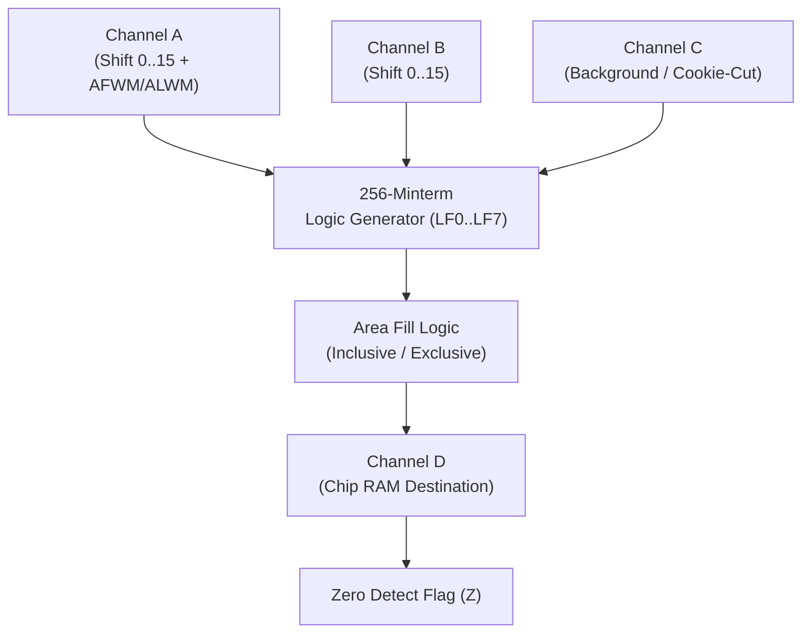

# Blitter (Bit-Block Transferrer) Architecture & Hardware Specification

> [!NOTE]
> System execution constraints, memory bus arbitration, and Color Clock timing are defined in [AGENTS.md](../../../AGENTS.md), [MemoryBus.md](MemoryBus.md), and [Main loop A500.md](Main%20loop%20A500.md).
> Detailed inter-chip signal rules are codified in [`hardware-bus-topology.md`](../../../.agents/rules/hardware-bus-topology.md).
> Master DMA slot scheduling and Blitter Nasty arbitration are documented in [DMA.md](DMA.md). Master Agnus coordination is detailed in [Agnus.md](Agnus.md), and Blitter completion interrupts are routed to [Paula.md](Paula.md).

---

## 1. Core Decisions & Architectural Principles

The Blitter is a dedicated coprocessor inside Agnus designed for high-speed rectangular memory movement, arbitrary boolean operations across three data sources, and hardware-accelerated vector line drawing.



### 1.1 Core Capabilities & Hardware Realities
1. **4 Independent DMA Channels (A, B, C, D):** Channels A, B, and C act as data sources; Channel D acts as the destination written to Chip RAM.
2. **256 Minterm Boolean Logic Generator:** Any boolean combination of inputs A, B, and C can be evaluated in a single clock cycle ($D = f(A, B, C)$), driven by bits 7–0 of `BLTCON0`.
3. **Sub-Word Barrel Shifting:** Channels A and B feature 16-bit barrel shifters ($0..15$ bits), allowing arbitrary bit-level alignment during image blits.
4. **Ascending vs. Descending Copy (`DESC`):** Allows safe in-place memory blits without corrupting overlapping source data.
5. **Hardware Bresenham Line Drawing:** Single-pixel line drawer using Bresenham slope error accumulators, octant flags, and texture masking.

---

## 2. Module Architecture & Crate Containment (`crates/blitter`)

The Blitter is encapsulated within its dedicated workspace crate `crates/blitter`:

```
crates/blitter/
├── Cargo.toml
├── src/
│   ├── blitter.rs         // Blitter engine state machine, register dispatch, row stepping
│   ├── line.rs            // Bresenham line drawing algorithms, octant tables, error stepping
│   ├── minterm.rs         // 256 boolean minterm lookup and evaluation logic
│   └── phase.rs           // Word processing pipeline phases (Fetch A, B, C -> ALU -> Write D)
└── tests/
    ├── test_blitter.rs    // Integration test suites (copies, shifts, masks, fills)
    ├── test_line.rs       // Vector line drawer test vectors across all 8 octants
    ├── test_minterm.rs    // Exhaustive 256-minterm truth table verification
    └── test_phase.rs      // Word-by-word pipeline phase transition verification
```

---

## 3. Register Memory Map

All Blitter registers reside within custom chip address space ($DFF040–$DFF074):

| Address | R/W | Symbol | Description |
| :--- | :---: | :--- | :--- |
| **`$DFF040`** | W | **`BLTCON0`** | Blitter Control 0 (Channel enables A–D, minterms LF0–LF7, shift A) |
| **`$DFF042`** | W | **`BLTCON1`** | Blitter Control 1 (Shift B, descending flag, line mode, fill mode) |
| **`$DFF044`** | W | **`BLTAFWM`** | Blitter First Word Mask for Channel A |
| **`$DFF046`** | W | **`BLTALWM`** | Blitter Last Word Mask for Channel A |
| **`$DFF048`** | W | **`BLTCPTH`** | Channel C Pointer High (High 3/5 bits) |
| **`$DFF04A`** | W | **`BLTCPTL`** | Channel C Pointer Low (Low 16 bits, word-aligned) |
| **`$DFF04C`** | W | **`BLTBPTH`** | Channel B Pointer High (High 3/5 bits) |
| **`$DFF04E`** | W | **`BLTBPTL`** | Channel B Pointer Low (Low 16 bits, word-aligned) |
| **`$DFF050`** | W | **`BLTAPTH`** | Channel A Pointer High (High 3/5 bits) |
| **`$DFF052`** | W | **`BLTAPTL`** | Channel A Pointer Low (Low 16 bits, word-aligned) |
| **`$DFF054`** | W | **`BLTDPTH`** | Channel D Pointer High (High 3/5 bits) |
| **`$DFF056`** | W | **`BLTDPTL`** | Channel D Pointer Low (Low 16 bits, word-aligned) |
| **`$DFF058`** | W | **`BLTSIZE`** | Blitter Start Trigger: Height (rows, bits 6–15) and Width (words, bits 0–5) |
| **`$DFF060`** | W | **`BLTCMOD`** | Channel C Modulo (signed 16-bit) |
| **`$DFF062`** | W | **`BLTBMOD`** | Channel B Modulo (signed 16-bit) |
| **`$DFF064`** | W | **`BLTAMOD`** | Channel A Modulo (signed 16-bit) |
| **`$DFF066`** | W | **`BLTDMOD`** | Channel D Modulo (signed 16-bit) |
| **`$DFF070`** | W | **`BLTCDAT`** | Channel C Data holding latch |
| **`$DFF072`** | W | **`BLTBDAT`** | Channel B Data holding latch |
| **`$DFF074`** | W | **`BLTADAT`** | Channel A Data holding latch |

---

## 4. Operational Mechanics & Pipelines

### 4.1 256 Minterm Boolean Generator (`minterm.rs`)
Bits 7–0 of `BLTCON0` define the 8-bit truth table combining input bits $A$, $B$, and $C$:
$$D = \sum_{k=0}^7 \text{LF}_k \cdot m_k$$

Common minterm equations:
- **Direct Copy ($D = A$):** `LF = $F0` (`BLTCON0 = $09F0` with Channel A and D enabled).
- **Direct Copy ($D = B$):** `LF = $CC` (`BLTCON0 = $05CC` with Channel B and D enabled).
- **Inverted Copy ($D = \neg A$):** `LF = $0F`.
- **Cookie-Cut Masking ($D = (A \land B) \lor (\neg A \land C)$):** `LF = $CA` (`BLTCON0 = $0ECA` with channels A, B, C, D active).

### 4.2 Barrel Shifters & Masks
- **Channel A Shift:** Bits 15–12 of `BLTCON0` shift the source by $0..15$ bits. The shifted word combines data from the previous word (`aold`) and current word (`anew`).
- **Channel B Shift:** Bits 15–12 of `BLTCON1` shift Channel B by $0..15$ bits.
- **First & Last Word Masks:**
  - `BLTAFWM` is ANDed with Channel A on the first word of each row.
  - `BLTALWM` is ANDed with Channel A on the last word of each row.
  - For single-word-wide blits ($W = 1$), both masks are combined: `mask = BLTAFWM & BLTALWM`.

### 4.3 Addressing Modes & Modulos
- After each word transfer, pointers advance by 2 bytes (`pt += 2` in ascending mode, `pt -= 2` in descending mode).
- At the conclusion of each horizontal row, the signed 16-bit modulo (`BLTxMOD`) is added to the pointer.
- **Descending Mode (`BLTCON1` bit 1 `DESC`):** Modulos are subtracted from pointers, ensuring correct pointer traversal when moving data downwards/rightwards to prevent overwriting unread pixels.

### 4.4 Area Fill Mode
Enabled via bits 3–4 of `BLTCON1`:
- **Inclusive Fill (`IFE = 0`):** Retains edge pixels while filling between boundaries.
- **Exclusive Fill (`IFE = 1`):** Clears edge pixels while filling.
- Internal carry bit toggles on each `1` bit in the word, filling spans horizontally.

### 4.5 Bresenham Line Drawing Mode (`line.rs`)
- Activated by setting bit 0 of `BLTCON1` (`LINE = 1`).
- Channel A generates the texture/dash pattern.
- Channel C holds the source background line buffer.
- Channel D writes the updated pixel into Chip RAM.
- Slope registers:
  - `BLTAMOD`: $4 \times (dy - dx)$
  - `BLTBMOD`: $4 \times dy$
  - `BLTAPT`: Initial error accumulator $2 \times dy - dx$
  - Octant selection flags in `BLTCON1` control step direction across all 8 geometrical octants.

---

## 5. Control, Status & Interrupt Routing

1. **Start Trigger (`BLTSIZE`):**
   - Writing to `BLTSIZE` initiates blit execution.
   - Bits 15–6 specify height in scanlines ($1..1024$ rows, where 0 represents 1024).
   - Bits 5–0 specify width in 16-bit words ($1..64$ words, where 0 represents 64).
2. **Zero Flag Detection (`Z` bit):**
   - Bit 13 of `DMACONR` reflects the Zero flag. If all bits written to Channel D across the entire blit are zero, $Z$ remains 1; if any bit is 1, $Z$ is cleared to 0.
3. **Completion Interrupt (`_BLITINT`):**
   - Upon completing the final word transfer, the Blitter clears `is_busy` and asserts `_BLITINT` to Paula, setting bit 6 in `INTREQ` (Level 3 interrupt).

---

## 6. Reference Documentation & Upstream Ground Truth

- [Amiga Hardware Reference Manual: Chapter 6 (Blitter Hardware)](../Reference/Hardware%20Reference%20Manual/06%20-%20Chapter%206%20-%20Blitter%20Hardware.md): Authoritative specification for 4-channel DMA Blitter, 256 minterms, barrel shifting, area fill, and Bresenham line drawing.
- [vAmiga Blitter Component Implementation](../../../ref_src/vAmiga-4.5/Core/Components/Agnus/Blitter/Blitter.cpp): Reference C++ implementation for multi-channel blits and line mode error tracking.
- [Agnus Architecture Specification](Agnus.md): Master Agnus coordinator and custom register dispatch.
- [DMA Architecture & Scheduling](DMA.md): Blitter Nasty vs Normal arbitration and 3-cycle CPU starvation counters.
