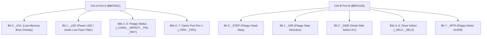

# MOS 8520 Complex Interface Adapters (CIA-A & CIA-B) Specification

> [!NOTE]
> System execution constraints, memory bus arbitration, and Color Clock timing are defined in [AGENTS.md](../../../AGENTS.md), [MemoryBus.md](MemoryBus.md), and [Main loop A500.md](Main%20loop%20A500.md).
> Save state structures for the CIAs are specified in [SaveState.md](SaveState.md). Machine stepping and interrupt delivery are governed by [Main loop A500.md](Main%20loop%20A500.md) and [Paula.md](Paula.md).
> Detailed keyboard serial protocol and handshake timings are documented in [Keyboard.md](Keyboard.md). Floppy drive control lines (step, motor, side) are coordinated with [Floppy.md](Floppy.md).

---

## 1. Scope & System Role

The Amiga 500 incorporates two **MOS 8520 Complex Interface Adapters (CIAs)**:
- **CIA-A:** Serves user I/O, keyboard communication, low-memory overlay, mouse/joystick fire buttons, and parallel printer data.
- **CIA-B:** Serves floppy disk drive control (motor, stepper, head select), serial port RS-232 handshaking, and parallel printer control lines.

Both CIAs are driven by the Motorola **E-Clock** ($709.379\ \text{kHz}$ PAL / $715.909\ \text{kHz}$ NTSC, fixed ratio of $1$ E-Clock tick every $5$ Color Clocks).

---

## 2. Module Decomposition

The CIA emulator is modeled as a reusable component instantiated twice (`cia_a` and `cia_b`) within `chips/cia/`:

```
chips/cia/
├── mod.rs             // MOS 8520 coordinator, register dispatch & E-Clock stepping
├── timers.rs          // 16-bit decrementing Timer A & B, auto-reload, cascading
├── ports.rs           // Bidirectional 8-bit Port A & Port B latches (PRA, PRB, DDRA, DDRB)
├── tod.rs             // 24-bit Time-of-Day counter, alarm comparator, latch-on-read
└── sdr.rs             // 8-bit bidirectional serial shift register (keyboard interface)
```

---

## 3. Physical Address Mapping & Byte Lanes

The 8520 is a native 8-bit peripheral connected across the Amiga 16-bit data bus using dedicated byte lanes:
- **CIA-A (Odd Byte Addresses: `$BFE001`–`$BFEF01`):** Connected to data bits `D7`–`D0`. Even addresses (`A0 = 0`) return open-bus floating lines (`$FF`).
- **CIA-B (Even Byte Addresses: `$BFD000`–`$BFDE00`):** Connected to data bits `D15`–`D8`. Odd addresses (`A0 = 1`) return open-bus floating lines (`$FF`).

### 3.1 CIA Register Map

| CIA-A Address | CIA-B Address | R/W | Symbol | Description |
| :--- | :--- | :---: | :--- | :--- |
| **`$BFE001`** | **`$BFD000`** | R/W | **`PRA`** | Port A Data Register |
| **`$BFE101`** | **`$BFD100`** | R/W | **`PRB`** | Port B Data Register |
| **`$BFE201`** | **`$BFD200`** | R/W | **`DDRA`** | Data Direction Register A (1 = output, 0 = input) |
| **`$BFE301`** | **`$BFD300`** | R/W | **`DDRB`** | Data Direction Register B (1 = output, 0 = input) |
| **`$BFE401`** | **`$BFD400`** | R/W | **`TALO`** | Timer A Low Byte (bits 7–0) |
| **`$BFE501`** | **`$BFD500`** | R/W | **`TAHI`** | Timer A High Byte (bits 15–8) |
| **`$BFE601`** | **`$BFD600`** | R/W | **`TBLO`** | Timer B Low Byte (bits 7–0) |
| **`$BFE701`** | **`$BFD700`** | R/W | **`TBHI`** | Timer B High Byte (bits 15–8) |
| **`$BFE801`** | **`$BFD800`** | R/W | **`TODLO`** | Time-of-Day Clock Low Byte |
| **`$BFE901`** | **`$BFD900`** | R/W | **`TODMID`**| Time-of-Day Clock Mid Byte |
| **`$BFEA01`** | **`$BFDA00`** | R/W | **`TODHI`** | Time-of-Day Clock High Byte |
| **`$BFEC01`** | **`$BFDC00`** | R/W | **`SDR`** | Serial Data Register (Shift Register) |
| **`$BFED01`** | **`$BFDD00`** | R/W | **`ICR`** | Interrupt Control Register (Read: requests, Write: masks) |
| **`$BFEE01`** | **`$BFDE00`** | R/W | **`CRA`** | Control Register A |
| **`$BFEF01`** | **`$BFDF00`** | R/W | **`CRB`** | Control Register B |

### 3.2 Register Access Semantics & Clock Domain Latency Pipeline
- **E-Clock Frequency Domain:** CIAs run synchronously to the Motorola E-Clock ($f_{CCK}/5 \approx 709\ \text{kHz}$). Staged CIA register writes commit after 5 CCK ticks (`MutationMode::Pipeline`).
- **Write Staging Buffer:** Each CIA embeds an inline fixed-capacity mutation array `[Option<DelayedMutation>; 16]` covering all 16 addressable register offsets ($0..15$).
- **TOD Atomic Read-Freeze:** Reading `TODHI` (`$BFEA01`/`$BFDA00`) atomically latches (freezes) the running TOD counter into internal read holding registers. Reading `TODMID` returns the latched mid-byte. Reading `TODLO` returns the latched low-byte and unfreezes the latches, resuming real-time latch tracking.
- **ICR Clear-on-Read:** Reading `ICR` (`$BFED01`/`$BFDD00`) returns pending interrupt flags and immediately clears them (`0x00`). Debugger inspections via `peek_register(0x0D)` read non-destructively without clearing.
- **Pin Transition Cascades:**
  - `CIA-A Port A bit 0 (_OVL)`: Writing to `PRA` bit 0 drives `ovl_transition()`. When configured as an output (`DDRA` bit 0 = 1) and driven HIGH (1), the Gary boot overlay is permanently disengaged in `MemoryBus`, exposing low Chip RAM at `$000000..$07FFFF`.
  - `CIA-A Port A bit 1 (_LED)`: Writing to `PRA` bit 1 drives `led_transition()`, controlling the low-pass audio filter on the Paula audio output stage.
- **Defensive Overflow Protection:** If debugger injections saturate the 16-slot buffer, writes commit immediately with a defensive error log, preserving zero-panic invariants.

---

## 4. 16-Bit Interval Timers (Timer A & Timer B)

Each CIA houses two 16-bit decrementing interval timers:
- **Clock Source:** Decrement on every **E-Clock tick** ($1$ tick every $5$ Color Clocks). The CIA coordinator maintains an internal sub-phase counter (`e_clock_subphase: u8`, $0..4$) stepped on each global CCK; when it wraps from 4 to 0, an E-Clock cycle occurs and active timers decrement.
- **Auto-Reload:** When a counter decrements from `$0001` to `$0000`, an underflow occurs:
  - The counter reloads immediately from its 16-bit latch (`TALO`/`TAHI` or `TBLO`/`TBHI`).
  - An underflow interrupt is latched into `ICR`.
- **Operating Modes (`CRA` / `CRB` bit 3 `RUNMODE`):**
  - **Continuous Mode (`0`):** Automatically reloads and continues counting indefinitely.
  - **One-Shot Mode (`1`):** Stops counting upon underflow until restarted.
- **Force Load (`CRA` / `CRB` bit 4 `LOAD`):** Writing `1` forces an immediate reload of the counter from the latches without waiting for underflow.
- **Cascaded 32-Bit Counting (Timer B):**
  - Timer B can be clocked directly from Timer A underflows (`CRB` bits 6–5 set to `%10`), allowing Timers A and B to combine into a single 32-bit hardware timer.

---

## 5. 24-Bit Time-of-Day (TOD) Clock

The TOD counter tracks elapsed wall-clock time via a 24-bit binary counter:
- **Synchronization Source:**
  - **CIA-A:** Driven by power supply mains ticks ($50\ \text{Hz}$ PAL / $60\ \text{Hz}$ NTSC).
  - **CIA-B:** Driven by horizontal display sync pulses ($15.625\ \text{kHz}$ PAL).
- **Atomic Latch-on-Read:**
  - Reading `TODHI` immediately freezes the current values of `TODMID` and `TODLO` in internal holding latches.
  - Subsequent reads from `TODMID` and `TODLO` read the latched values, preventing race conditions during multi-byte fetches. Reading `TODLO` unlatches the registers.
- **Latch-on-Write:**
  - Writing `TODHI` halts counter incrementing until `TODLO` is written.
- **Alarm Comparator:**
  - Setting bit 7 in `CRB` directs writes to an internal 24-bit alarm register.
  - When the TOD counter matches the alarm register, an interrupt is latched into `ICR`.

---

## 6. Serial Data Register (SDR) & Keyboard Interface

The SDR is an 8-bit bidirectional shift register clocked by the external `CNT` pin:
- **CIA-A Keyboard Protocol:**
  - Keyboard sends scancodes bit-serially into CIA-A SDR.
  - Once 8 bits are received, CIA-A latches the byte and asserts the SDR interrupt in `ICR`.
  - The Amiga OS acknowledges receipt by pulsing the keyboard clock line low via CIA-A Port A.
  - *Detailed Specifications:* See [Keyboard.md](Keyboard.md).

---

## 7. Port I/O Signal Assignments



### 7.1 CIA-A Port A (`$BFE001`) Pinout
- **Bit 0 (`_OVL`):** Low-Memory Boot Overlay control. When `0`, Gary routes `$000000-$07FFFF` accesses to Kickstart ROM. When `1`, access goes to physical Chip RAM.
- **Bit 1 (`_LED`):** Controls the power LED brightness and toggles the audio low-pass filter (0 = Filter ON / dim LED, 1 = Filter OFF / bright LED).
- **Bit 2 (`_CHNG`):** Floppy disk change sensor (input, 0 = disk removed/changed).
- **Bit 3 (`_WPROT`):** Floppy disk write protect sensor (input, 0 = disk is write-protected).
- **Bit 4 (`_TK0`):** Floppy drive head on Track 0 sensor (input, 0 = on track 0).
- **Bit 5 (`_RDY`):** Floppy drive motor ready sensor (input, 0 = motor up to speed).
- **Bit 6 (`_FIR0`):** Game Port 1 Left Mouse Button / Joystick Fire 1 (input, 0 = pressed).
- **Bit 7 (`_FIR1`):** Game Port 2 Joystick Fire 1 (input, 0 = pressed).

### 7.2 CIA-A Port B (`$BFE101`) Pinout
- **Bits 0–7:** Centronics 8-bit parallel printer data lines (`D0`–`D7`).

### 7.3 CIA-B Port A (`$BFD000`) Pinout
- **Bits 0–2:** Parallel printer control handshake (`BUSY`, `POUT`, `SEL`).
- **Bits 3–7:** RS-232 serial port control lines (`DSR`, `CTS`, `CD`, `RTS`, `DTR`).

### 7.4 CIA-B Port B (`$BFD100`) Pinout
- **Bit 0 (`_STEP`):** Floppy step pulse (pulled low to step head).
- **Bit 1 (`_DIR`):** Step direction (0 = inward towards center / track 79, 1 = outward towards track 0).
- **Bit 2 (`_SIDE`):** Disk head side select (0 = upper side 1, 1 = lower side 0).
- **Bit 3 (`_SEL0`):** Drive 0 select (`DF0:`).
- **Bit 4 (`_SEL1`):** Drive 1 select (`DF1:`).
- **Bit 5 (`_SEL2`):** Drive 2 select (`DF2:`).
- **Bit 6 (`_SEL3`):** Drive 3 select (`DF3:`).
- **Bit 7 (`_MTR`):** Floppy motor on/off (latched on drive selection).

> [!NOTE]
> For complete drive mechanics, motor latching on select, head step rates, `_CHNG` flip-flop clearing, and MFM sector formatting, see [Floppy.md](Floppy.md).

---

## 8. Interrupt Control Register (ICR) & Routing

Each CIA contains 5 internal interrupt sources:
- **Bit 0:** Timer A underflow.
- **Bit 1:** Timer B underflow.
- **Bit 2:** Time-of-Day alarm match.
- **Bit 3:** Serial Data Register full/empty (8 bits shifted).
- **Bit 4:** FLAG pin negative edge (Parallel port `ACK` on CIA-A, Serial `CD` on CIA-B).

### 8.1 Read and Write Semantics
- **Read:** Returns pending interrupt flags and **immediately clears all pending requests** to zero.
- **Write:** Bit 7 acts as a Set/Clear control flag:
  - If bit 7 is `1`: Any mask bit set to `1` in bits 0–4 enables that interrupt.
  - If bit 7 is `0`: Any mask bit set to `1` in bits 0–4 disables that interrupt.

### 8.2 Paula Interrupt Priority Lines
- **CIA-A Interrupt Line:** Connects directly to Paula Level 2 (`PORTS`).
- **CIA-B Interrupt Line:** Connects directly to Paula Level 6 (`EXTER`).

---

## 9. Reset Defaults

- **`DDRA`, `DDRB`:** Initialized to **`$00`** (all pins set as high-impedance inputs).
  - Guarantees CIA-A Port A bit 0 (`_OVL`) floats high, asserting `map_kickstart_to_low_memory()`.
- **`PRA`, `PRB`:** Output latches cleared to **`$00`**.
- **`CRA`, `CRB`:** Reset to **`$00`** (timers stopped, continuous mode reset, PBON disabled). Counters reset to `$FFFF`.
- **`ICR`:** Reset to **`$00`** (all CIA interrupt sources masked, requests cleared).
- **`SDR`:** Cleared to **`$00`**.
- **`TOD`:** Halted until initialized.

---

## 10. Reference Documentation & Upstream Ground Truth

- [Amiga Hardware Reference Manual: Appendix F (Complex Interface Adapters)](../Reference/Hardware%20Reference%20Manual/14%20-%20Appendix%20F%20-%20Complex%20Interface%20Adapters.md): Definitive hardware reference for MOS 8520 internal registers, timer modes, TOD counter, and serial data register (SDR).
- [Amiga Hardware Reference Manual: Chapter 8 (Interface Hardware)](../Reference/Hardware%20Reference%20Manual/08%20-%20Chapter%208%20-%20Interface%20Hardware.md): CIA-A and CIA-B port assignments, parallel interface lines, floppy control lines, and RS-232 serial handshaking.
- [vAmiga CIA Component Implementation](../../../ref_src/vAmiga-4.5/Core/Components/CIA/CIA.cpp): Reference C++ state machine for 5-CCK E-Clock timing division, ICR set/clear masks, and TOD 50/60 Hz latching.
