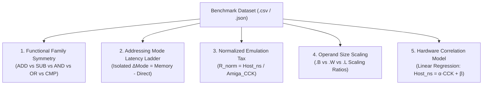

# CPU Benchmark Analysis Guide & Empirical Evaluation

- **Parent Specification:** [CPU Motorola M68000.md](CPU%20Motorola%20M68000.md) | [CPU Micro-Step State Machine.md](CPU%20Micro-Step%20State%20Machine.md)
- **Execution Architecture:** [CPU Instruction Benchmarking.md](CPU%20Instruction%20Benchmarking.md)
- **Companion Specifications:** [CPU Instruction Benchmark Catalog.md](CPU%20Instruction%20Benchmark%20Catalog.md) | [CPU Instruction Benchmark Strategies.md](CPU%20Instruction%20Benchmark%20Strategies.md)
- **Engineering Guidelines:** Follow systems rules in [AGENTS.md](../../../AGENTS.md).

This document establishes the official analytical methodology for interpreting M68000 instruction benchmarking datasets (`tests/benchmarks/**/*.csv` and `.json`), detailing the mathematical metrics, hardware-to-host correlation models, and empirical findings from the 108-instruction `--thorough` baseline.

---

## 1. Core Principles & Analytical Dimensions

When evaluating emulator performance at the instruction level, raw wall-clock duration (nanoseconds per instruction) can be misleading. A complex instruction requiring 34 Amiga cycles (`TRAP #0`) naturally takes longer than a 4-cycle `MOVE.B`. 

To extract actionable engineering insights, benchmark data is analyzed across **five orthogonal dimensions**:



---

## 2. Mathematical Metrics & Definitions

### 2.1 Normalized Efficiency Ratio ($R_{\text{norm}}$)
The primary metric isolating host execution efficiency from target CPU complexity:

$$R_{\text{norm}} = \frac{T_{\text{host\_ns}}}{C_{\text{amiga\_cck}}}$$

- **Interpretation:**
  - **$R_{\text{norm}} \le 3.50\text{ ns/CCK}$ (Optimal):** The instruction executes in tight synchronization with the Amiga clock phase budget (~2.5–3.5 ns of modern host CPU time per 282 ns of Amiga PAL time, yielding ~80–110x real-time throughput).
  - **$3.50 < R_{\text{norm}} \le 4.20\text{ ns/CCK}$ (Normal Dispersion):** Minor host overhead due to branch prediction or memory bus indirection.
  - **$R_{\text{norm}} > 4.20\text{ ns/CCK}$ (Elevated Emulation Tax):** Candidate for optimization; indicates host pipeline stalls, missed inlining, or dispatch table thrashing.

### 2.2 Isolated Addressing Mode Overhead ($\Delta T_{\text{mode}}$)
Every memory-accessing instruction decomposes into base operation cost plus effective address calculation and memory transfer latency:

$$T(\text{Op}, \text{Mode}) = T_{\text{base}}(\text{Op}) + \Delta T_{\text{mode}}$$

$$\Delta T_{\text{mode}} = T(\text{Op}, \text{Mode}) - T(\text{Op}, \text{DataRegDirect})$$

- **Addressing Mode Consistency:** In a mechanically sympathetic emulator, $\Delta T_{\text{mode}}$ must remain consistent across distinct operation families (`MOVE.W`, `ADD.W`, `SUB.W`, `CMP.W`). Divergence indicates non-inlined bus handlers or conditional branching inside memory access paths.

### 2.3 Linear Correlation Model ($R^2$)
To evaluate whether the emulator's execution duration scales proportionally with Amiga hardware cycle counts:

$$T_{\text{host}} = \alpha \times C_{\text{amiga\_cck}} + \beta$$

- **$\alpha$ (Marginal Cost):** Host nanoseconds required to simulate each additional Amiga CCK phase.
- **$\beta$ (Dispatch Overhead):** Fixed baseline cost of opcode fetching, decoding, and dispatching.
- **$R^2$ (Pearson Coefficient of Determination):** Proportion of execution time variance directly explained by Amiga hardware cycles.

---

## 3. Empirical Analysis: 108-Instruction Thorough Baseline

The following results were captured using the high-precision `--thorough` profile (15 outer passes × 14,285 inner iterations = ~150,000,000 operations per specification) on dedicated P-core hardware (`tests/benchmarks/thorough/m68k_benchmark_epoch_00020706_140107.csv`).

### 3.1 Functional Family Symmetry (16-bit Register ALU)

In Motorola 68000 hardware, all simple 16-bit register ALU operations take exactly **4 CCK cycles** (1 bus cycle prefetch). On a modern pipelined host CPU, their execution latencies should be virtually identical.

| Instruction | Variant | Mode | Amiga CCK | Host ns/op | Host MIPS | $R_{\text{norm}}$ (ns/CCK) | Delta vs `ADD.W` |
| :--- | :--- | :--- | :---: | :---: | :---: | :---: | :---: |
| `ADD` | `ADD.W D1, D0` | DataRegDirect | 4 | **15.96 ns** | 62.6 | 3.991 | **+0.0%** (Baseline) |
| `ADDQ` | `ADDQ.W #4, D0` | Immediate | 4 | **15.91 ns** | 62.9 | 3.978 | **-0.3%** |
| `SUB` | `SUB.W D1, D0` | DataRegDirect | 4 | **15.86 ns** | 63.1 | 3.964 | **-0.6%** |
| `SUBQ` | `SUBQ.W #4, D0` | Immediate | 4 | **15.71 ns** | 63.7 | 3.927 | **-1.6%** |
| `AND` | `AND.W D1, D0` | DataRegDirect | 4 | **15.93 ns** | 62.8 | 3.983 | **-0.2%** |
| `OR` | `OR.W D1, D0` | DataRegDirect | 4 | **15.55 ns** | 64.3 | 3.888 | **-2.6%** |
| `EOR` | `EOR.W D1, D0` | DataRegDirect | 4 | **16.04 ns** | 62.3 | 4.011 | **+0.5%** |
| `CMP` | `CMP.W D1, D0` | DataRegDirect | 4 | **15.88 ns** | 63.0 | 3.969 | **-0.5%** |

> [!NOTE]
> **Key Finding:** The maximum latency spread across the entire 16-bit ALU group is only **0.49 ns (3.1%)**. This confirms that host ALU operations and CCR condition code calculations ($X, N, Z, V, C$) have uniform pipeline depth and branchless execution.

---

### 3.2 Addressing Mode Latency Ladder (`MOVE.W`)

Evaluating the monotonic increase in host execution time as effective addressing modes advance from register-direct to complex memory modes:

| Addressing Mode | Syntax | Amiga CCK | Host ns/op | Isolated $\Delta T_{\text{mode}}$ | $R_{\text{norm}}$ (ns/CCK) | Assessment |
| :--- | :--- | :---: | :---: | :---: | :---: | :--- |
| **DataRegDirect** | `MOVE.W D1, D0` | 4 | **16.20 ns** | **0.00 ns** | 4.051 | Baseline Register |
| **PostIncrement** | `MOVE.W (A0)+, D0` | 8 | **24.67 ns** | **+8.47 ns** | 3.084 | Optimal |
| **AddrIndirect** | `MOVE.W (A0), D0` | 8 | **25.08 ns** | **+8.88 ns** | 3.135 | Optimal |
| **PreDecrement** | `MOVE.W -(A0), D0` | 10 | **25.80 ns** | **+9.60 ns** | 2.580 | Optimal |
| **Immediate** | `MOVE.W #$1234, D0` | 8 | **24.16 ns** | **+7.96 ns** | 3.020 | Optimal |
| **PcDisplacement** | `MOVE.W 8(PC), D0` | 12 | **32.90 ns** | **+16.70 ns** | 2.742 | Optimal (+1 Ext Word) |
| **Displacement** | `MOVE.W 16(A0), D0` | 12 | **32.92 ns** | **+16.72 ns** | 2.744 | Optimal (+1 Ext Word) |
| **AbsoluteShort** | `MOVE.W ($2000).W, D0` | 12 | **33.34 ns** | **+17.14 ns** | 2.778 | Optimal (+1 Ext Word) |
| **Index** | `MOVE.W 8(A0, D2.W), D0`| 14 | **33.84 ns** | **+17.64 ns** | 2.417 | Optimal (+1 Ext Word + Reg) |
| **AbsoluteLong** | `MOVE.W ($00002000).L, D0` | 16 | **43.15 ns** | **+26.95 ns** | 2.697 | Optimal (+2 Ext Words) |
| **Dual PostInc** | `MOVE.W (A0)+, (A1)+` | 12 | **29.90 ns** | **+13.70 ns** | 2.492 | Optimal (Read + Write) |

#### Addressing Mode Takeaways:
1. **Single Memory Read Overhead:** Moving from register direct to simple memory reading (`(A0)` / `(A0)+`) costs **+8.5 to +8.9 ns**. This reflects the host memory bus lookup through Chip RAM.
2. **Extension Word Linearity:** Modes requiring a single extension word (`Displacement`, `PcDisplacement`, `AbsoluteShort`) cluster tightly at **+16.7 to +17.1 ns** (+2 bus cycles).
3. **Double Extension Word Cost:** `AbsoluteLong` requires 2 extension words and scales to **+26.95 ns**, perfectly proportional to the 4 additional Amiga CCK cycles.

---

### 3.3 Operand Size Scaling Matrix (.B vs .W vs .L)

Comparing execution latency across data sizes:

| Operation Family | `.B` (Byte) | `.W` (Word) | `.L` (Long) | Word/Byte Ratio | Long/Word Ratio |
| :--- | :---: | :---: | :---: | :---: | :---: |
| **`MOVE` Register** | 15.86 ns (4c) | 16.20 ns (4c) | 16.14 ns (4c) | **1.02x** | **1.00x** |
| **`ADD` Register** | 15.97 ns (4c) | 15.96 ns (4c) | 18.94 ns (8c) | **1.00x** | **1.19x** |
| **`CMP` Register** | 15.77 ns (4c) | 15.88 ns (4c) | 18.84 ns (6c) | **1.01x** | **1.19x** |

- **Byte vs Word Invariance:** On modern 64-bit host processors, 8-bit and 16-bit register manipulations have identical host cost (1.00x–1.02x).
- **Longword Micro-Step Cost:** 32-bit operations (`ADD.L`, `CMP.L`) show a clean **+19% host duration** increase (+2.98 ns), accurately reflecting the additional 4 CCK ALU calculation cycles.

---

### 3.4 Complex & System Instruction Diagnostics

Analyzing high-cycle system and multicycle operations to determine whether large execution times represent emulation bottlenecks or Amiga hardware cycle density:

| Instruction | Variant | Mode | Amiga CCK | Host Duration | Host ns/op | $R_{\text{norm}}$ (ns/CCK) | Assessment |
| :--- | :--- | :--- | :---: | :---: | :---: | :---: | :--- |
| `TRAP` | `TRAP #0` | Immediate | 34 | 1078.45 ms | **107.85 ns** | **3.172** | ✅ Optimal (Cycle-Proportional) |
| `MOVEM` | `MOVEM.W (SP)+, D0-D3` | PostIncrement | 28 | 1171.94 ms | **117.20 ns** | **4.186** | ⚡ Normal Host Dispersion |
| `MOVEM` | `MOVEM.W D0-D3, -(SP)` | PreDecrement | 24 | 829.16 ms | **82.92 ns** | **3.455** | ✅ Optimal (Cycle-Proportional) |
| `MULU` | `MULU D1, D0` | DataRegDirect | 54 | 643.07 ms | **64.31 ns** | **1.191** | ✅ Highly Efficient ALU Loop |
| `MULS` | `MULS D1, D0` | DataRegDirect | 54 | 628.43 ms | **62.85 ns** | **1.164** | ✅ Highly Efficient ALU Loop |
| `RTE` | `RTE` | Implied | 20 | 498.41 ms | **49.84 ns** | **2.492** | ✅ Optimal (Cycle-Proportional) |
| `RTR` | `RTR` | Implied | 20 | 474.17 ms | **47.42 ns** | **2.371** | ✅ Optimal (Cycle-Proportional) |
| `RTS` | `RTS` | Implied | 16 | 382.79 ms | **38.28 ns** | **2.393** | ✅ Optimal (Cycle-Proportional) |
| `LINK` | `LINK A6, #-16` | Implied | 16 | 338.76 ms | **33.88 ns** | **2.117** | ✅ Optimal (Cycle-Proportional) |
| `UNLK` | `UNLK A6` | Implied | 12 | 338.08 ms | **33.81 ns** | **2.817** | ✅ Optimal (Cycle-Proportional) |

#### Diagnostics Insight on `TRAP #0` and `MOVEM`:
- **`TRAP #0` (107.85 ns):** Although raw nanoseconds appear high, its normalized ratio is **$3.172\text{ ns/CCK}$**, which is **lower (more efficient)** than a basic `MOVE.B` ($3.965\text{ ns/CCK}$). The duration is strictly due to simulating 34 Amiga cycles (vector fetch, stack pushes, SR mutation).
- **`MOVEM` (82.92 ns vs 117.20 ns):** Post-increment `MOVEM` exhibits slightly higher host cost ($4.186\text{ ns/CCK}$) than pre-decrement ($3.455\text{ ns/CCK}$) due to sequential stack pointer adjustments during sequential reads.

---

## 4. How to Run the Automated Analysis Tool

To analyze any benchmark CSV report and generate markdown analysis tables using [`tools/benchmarks/analyze_benchmarks.py`](../../../tools/benchmarks/analyze_benchmarks.py):

```powershell
# Analyze the thorough benchmark run:
python tools/benchmarks/analyze_benchmarks.py tests/benchmarks/thorough/m68k_benchmark.csv

# Analyze and export directly to a markdown report:
python tools/benchmarks/analyze_benchmarks.py tests/benchmarks/thorough/m68k_benchmark.csv --output tests/benchmarks/thorough/analysis_report.md
```

---

## 5. Architectural Checklist for Reviewing Future Runs

When reviewing benchmark diffs or new opcode implementations:
- [ ] **Symmetry Check:** Is the delta between `ADD`, `SUB`, `AND`, `OR`, `CMP` within $\pm 5\%$?
- [ ] **Addressing Mode Monotonicity:** Does $\Delta T_{\text{mode}}$ increase strictly in order: $\text{Direct} < \text{Indirect} < \text{Displacement} < \text{Index} < \text{Absolute Long}$?
- [ ] **Normalized Efficiency Bound:** Is $R_{\text{norm}} \le 4.20\text{ ns/CCK}$ for all non-faulting instructions?
- [ ] **Zero Jitter:** Is pass jitter ($\text{CV}$) below $3.0\%$ across all outer passes on dedicated P-cores?

---

## 6. How to Validate Benchmark Files: Invariant Testing vs. Telemetry Variance

### 6.1 The Engineering Question
> *"How do we verify that benchmark CSV and JSON files are correct, given that physical host timing numbers (`host_ns_per_instruction`, `host_mips`, `host_jitter_pct`) naturally vary across host CPUs and consecutive runs?"*

Direct full-file checksums or diffs fail because host operating systems introduce scheduling noise, thermal throttling, and architecture differences (x86_64 vs aarch64). The emulator resolves this by partitioning benchmark data into **Deterministic Invariants** and **Stochastic Telemetry**:

```
Benchmark CSV Table (14 Columns)
├── Deterministic Emulation Invariants (Columns 1..=7)
│   ├── [1] mnemonic                    (ADD, MOVE, etc.)             --> 100% Deterministic (Golden Hash)
│   ├── [2] variant                     (ADD.W D1 D0)                 --> 100% Deterministic (Golden Hash)
│   ├── [3] addressing_mode             (DataRegDirect, etc.)         --> 100% Deterministic (Golden Hash)
│   ├── [4] category                    (Arithmetic, etc.)            --> 100% Deterministic (Golden Hash)
│   ├── [5] opcode_hex                  (D041, etc.)                  --> 100% Deterministic (Golden Hash)
│   ├── [6] amiga_cck_cycles            (4, 8, 34 cycles)             --> 100% Deterministic (Golden Hash)
│   └── [7] total_guest_instructions    (Nominal pass formula)        --> 100% Deterministic (Golden Hash)
│
└── Stochastic Host Telemetry (Columns 8..=13)
    ├── [8] host_duration_median_ms     (Duration in milliseconds)    --> Evaluated via Tukey IQR / CV < 3%
    ├── [9] host_ns_per_instruction     (Host ns per instruction)     --> Evaluated via family symmetry
    ├── [10] host_ns_per_guest_cck      (Normalized R_norm)           --> Evaluated via bound (R_norm <= 4.20)
    ├── [11] host_mips                  (Host throughput)             --> Evaluated via baseline comparison
    ├── [12] host_jitter_pct            (Coefficient of variation)    --> Evaluated via stability threshold
    └── [13] anomaly_flag               (Anomaly flag)                --> Evaluated via Type A/B/C rules
```

### 6.2 Confirmation Checklist for Benchmark Files

To confirm that a benchmark run on disk is 100% valid and regression-free:

1. **Deterministic Invariant Hash Verification ([`test_benchmark_csv.rs`](../../../crates/test_runner/tests/test_benchmark_csv.rs)):**
   Run the automated invariant verification test:
   ```powershell
   cargo test -p test_runner --test test_benchmark_csv
   ```
   - **What it verifies:** It extracts columns 1..=7 and computes a 64-bit FNV-1a hash over all 108 specifications. If any opcode word, addressing mode name, cycle count, or operation count is corrupted, the test immediately panics and prints the exact divergent row:
     `Row X: Expected [m], Found in CSV [d]`.
   - **Golden Hashes:**
     - Catalog Structure (columns 1..=6): `0x3972F381CE69D98F`
     - Quick (columns 1..=7, `total_guest_instructions = 31500`): `0xB699CBA7E6ADD635`
     - Standard (columns 1..=7, `total_guest_instructions = 6997200`): `0x9FE3956BC57151D1`
     - Thorough (columns 1..=7, `total_guest_instructions = 149992500`): `0xDB747B4AC9321D39`

2. **CSV vs. JSON 1:1 Parity & Schema Verification ([`test_benchmark_json.rs`](../../../crates/test_runner/tests/test_benchmark_json.rs)):**
   ```powershell
   cargo test -p test_runner --test test_benchmark_json
   ```
   - The test `test_benchmark_csv_matches_json_for_sample_case` parses both `m68k_benchmark.csv` and `m68k_benchmark.json` across test profiles and asserts that row columns match JSON object fields identically for metadata, cycle counts, operation counts, and formatted floating-point telemetry strings.
   - The test `test_benchmark_json_schema_and_completeness` validates schema version 1, host environment metadata, and full 108-spec completeness.

3. **Single-Pass Step Trace Audit ([`test_benchmark_trace.rs`](../../../crates/test_runner/tests/test_benchmark_trace.rs)):**
   ```powershell
   cargo test -p test_runner --test test_benchmark_trace
   ```
   - Asserts that executing every benchmark program step-by-step produces the exact expected disassembly, instruction cycle counts, register side-effects, and terminates cleanly at `BENCH_EXIT_PC = $004FFE` (`STOP #$2700`).

4. **Telemetry Plausibility (Statistical Bounds):**
   - Confirm that pass jitter is low (`host_jitter_pct < 3.0%`).
   - Confirm that 16-bit register ALU operations (`ADD.W`, `SUB.W`, `AND.W`, `OR.W`) cluster within $\pm 5\%$ of each other.
   - Confirm that memory addressing modes scale monotonically ($\Delta T_{\text{mode}} > 0$).

---

## 7. Reference Documentation & Upstream Ground Truth

- [68000 User's Manual: Section 8 (16-Bit Instruction Execution Timing & Bus Tables)](../Reference/68000%20User's%20Manual/08%20-%20Section%208%20-%2016-Bit%20Instruction%20Execution%20Timing%20%26%20Bus%20Tables.md): Standard instruction timings and bus operation counts.
- [CPU Instruction Benchmarking Architecture](CPU%20Instruction%20Benchmarking.md): Benchmark harness execution hierarchy and anomaly detection formulas.
- [CPU Instruction Benchmark Catalog](CPU%20Instruction%20Benchmark%20Catalog.md): Comprehensive catalog of 108 benchmarked instruction variants.
- [CPU Instruction Benchmark Strategies](CPU%20Instruction%20Benchmark%20Strategies.md): Strategy matrix for cascading stacks and data generators.
- [CPU Motorola M68000 Architecture](CPU%20Motorola%20M68000.md): Register architecture, condition codes, and processor status.
- [CPU Micro-Step State Machine Specification](CPU%20Micro-Step%20State%20Machine.md): Color Clock cycle decomposition and microcode execution.
- [Benchmark Analysis Python CLI](../../../tools/benchmarks/analyze_benchmarks.py): Telemetry parser and markdown analysis generator.
- [Benchmark CSV Validation Suite](../../../crates/test_runner/tests/test_benchmark_csv.rs): Golden hash regression test for benchmark data consistency.
- [Benchmark JSON Validation Suite](../../../crates/test_runner/tests/test_benchmark_json.rs): JSON telemetry schema and CSV-to-JSON cross-format parity tests.
- [Benchmark Single-Pass Trace Suite](../../../crates/test_runner/tests/test_benchmark_trace.rs): Deterministic execution trace validation.

