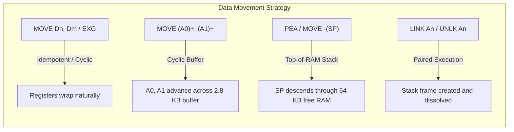
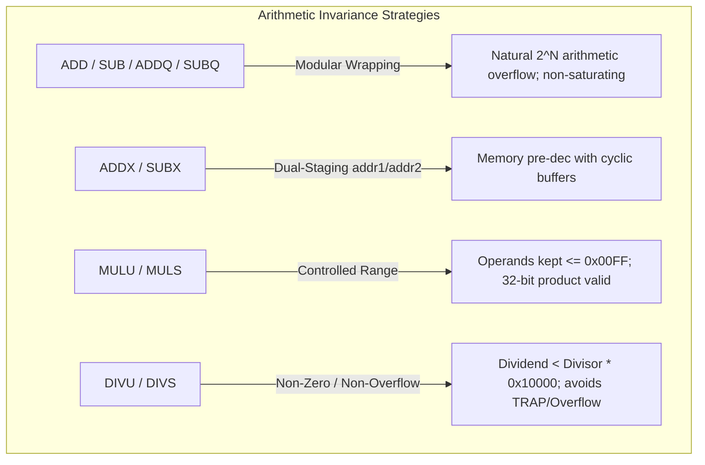
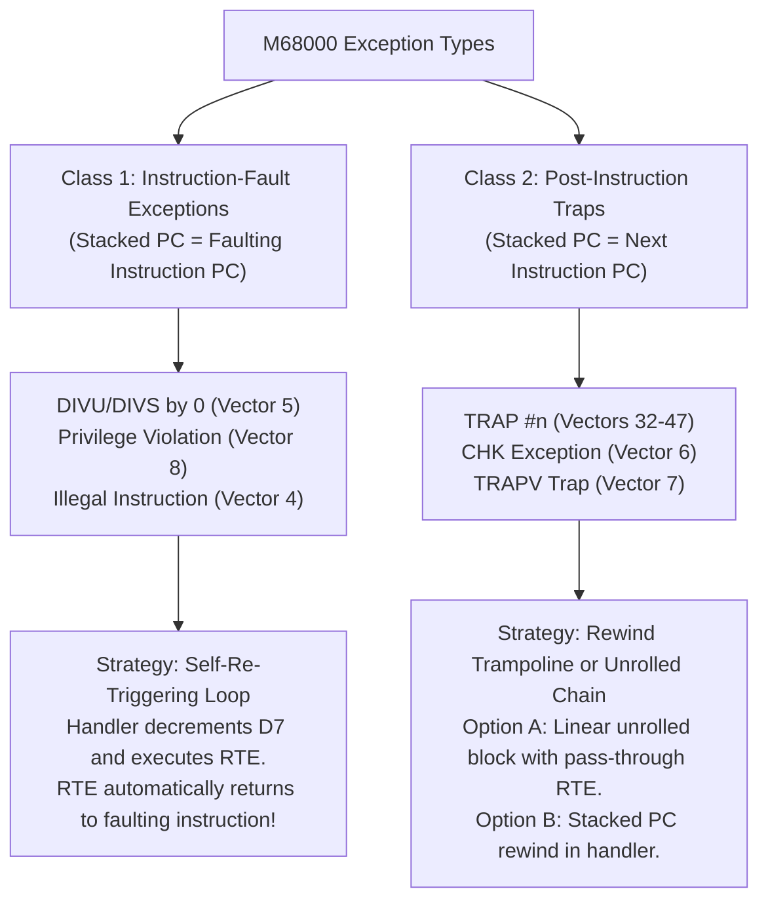

# M68000 Instruction Benchmark Strategies

- **Parent Specification:** [CPU Motorola M68000.md](CPU%20Motorola%20M68000.md) | [CPU Micro-Step State Machine.md](CPU%20Micro-Step%20State%20Machine.md)
- **Execution Architecture:** [CPU Instruction Benchmarking.md](CPU%20Instruction%20Benchmarking.md)
- **Companion Specifications:** [CPU Instruction Benchmark Catalog.md](CPU%20Instruction%20Benchmark%20Catalog.md) | [CPU Benchmark Analysis Guide.md](CPU%20Benchmark%20Analysis%20Guide.md)
- **Engineering Guidelines:** Follow systems rules in [AGENTS.md](../../../AGENTS.md).

> [!NOTE]
> This document details the test harness setup, state invariance strategies, cascading stacks, and memory models for each of the 8 M68000 instruction families.
> For the overall execution architecture and anomaly detection formulas, see [CPU Instruction Benchmarking](CPU%20Instruction%20Benchmarking.md).
> For the complete matrix of testable opcodes, see [CPU Instruction Benchmark Catalog](CPU%20Instruction%20Benchmark%20Catalog.md).

---

## 1. The Challenge of Unrolled Instruction Benchmarking

Executing an unrolled block of $K = 700$ identical or near-identical instructions poses unique state-preservation challenges:
1. **Zero Setup Pollution:** No intermediate register setups, pointer resets, or boundary checks may occur inside the unrolled 700-instruction block. Any setup instructions inside the block would corrupt the purity of the timing measurement.
2. **State Invariance & Non-Saturation:** Many instructions are destructive to their operands (e.g. `AND.W #0, D0` destroys $D_0$ on step 1, leaving 699 subsequent executions operating on zero; `ADD` can overflow; repeated shifts empty registers into zero; pre-decrement memory operations exhaust memory buffers).
3. **Control Flow & Return Paths:** Instructions like `RTS`, `RTE`, and `JSR` alter the Program Counter ($PC$) and Stack Pointer ($SP$).

This document provides formal architectural solutions for every instruction family.

### 1.1 Pseudo-Random Number Generator (PRNG) for Operands
To prevent host processors from detecting trivial patterns or executing shortcut optimizations, operand values throughout all benchmark programs are generated using a **deterministic pseudo-random number generator (PRNG)**:
- **Zero Host Cryptographic Requirement:** The PRNG does not need to be cryptographically secure; a fast, lightweight 64-bit generator ([`XorShift64`](../../../crates/test_runner/src/benchmark/prng.rs) with deterministic seed [`BENCH_PRNG_SEED`](../../../crates/test_runner/src/benchmark/prng.rs)) is used.
- **Memory Buffers:** Memory arrays in Chip RAM (`$000400-$000FFF` and buffers `$006000-$007FFF`) are filled with pseudo-random bytes, ensuring varied bit distributions across all memory read/write instructions.
- **Register Preambles:** Initial values loaded into Data and Address registers ($D_0 \dots D_7, A_0 \dots A_6$) during the preamble are seeded from the PRNG.
- **Immediate Operand Stream:** When generating unrolled immediate instructions (e.g. `ADDI.W #xxx, D0`, `MOVE.L #xxx, D0`, `CMPI.B #xxx, D0`), the immediate values `#xxx` are emitted directly from the PRNG stream rather than repeating a static constant.
- **Domain Clamping:** Where hardware requires valid constraints (e.g. non-zero divisors for `DIVU`, valid decimal digits for `ABCD` via `next_bcd_byte()`, aligned address values), the PRNG output is clamped or masked to remain strictly valid while preserving maximum pseudo-random entropy. See [`crates/test_runner/src/benchmark/prng.rs`](../../../crates/test_runner/src/benchmark/prng.rs).


---

## 2. Strategy 1: Data Movement Family

**Instructions:** `MOVE`, `MOVEA`, `MOVEM`, `MOVEP`, `EXG`, `LEA`, `PEA`, `LINK`, `UNLK`



### 2.1 Register-to-Register & Immediate Moves
- **Strategy:** Alternating or rotating registers (e.g. `MOVE.W D1, D0`, `MOVE.W D2, D1`, `MOVE.W D3, D2`, `MOVE.W D0, D3`).
- **Characteristics:** Completely non-saturating; preserves register diversity and prevents host CPU register renaming shortcuts.

### 2.2 Memory Indirect & Post-Increment / Pre-Decrement
- **Strategy:** Dedicated Chip RAM buffers allocated at [`BENCH_RAM_BUFFER_A0 = $006000`](../../../crates/test_runner/src/benchmark/builder.rs) (source buffer) and [`BENCH_RAM_BUFFER_A1 = $007000`](../../../crates/test_runner/src/benchmark/builder.rs) (destination buffer), each 4 KB.
- **Post-Increment (`(A0)+`):** Initialize $A_0 = \$006000$. After 700 word reads ($1{,}400\text{ bytes}$), $A_0 = \$006578$. The program preambles and execution harness re-arm pointers cleanly before subsequent iterations.
- **Pre-Decrement (`-(A0)`):** Initialize $A_0 = \$006578$. After 700 word writes, $A_0$ decrements back to $\$006000$.

### 2.3 Stack Pushes (`PEA`, `MOVE.L Dn, -(SP)`)
- **Strategy:** Initialize $SP$ near the top of Chip RAM ([`BENCH_STACK_TOP = $07F000`](../../../crates/test_runner/src/benchmark/builder.rs)).
- **Capacity:** Pushing 700 longwords ($2{,}800\text{ bytes}$) moves $SP$ downward to $\$07E510$, remaining completely safe within free memory.
- **Footer Reset:** The execution loop re-arms stack and register state cleanly from [`BenchmarkProgram::inject_into`](../../../crates/test_runner/src/benchmark/builder.rs#L38).

### 2.4 Stack Frames (`LINK` and `UNLK`)
- **Strategy:** Paired interleaved execution:
  ```assembly
  LINK A6, #-16
  UNLK A6
  LINK A6, #-16
  UNLK A6
  ... (repeated 350 pairs = 700 instructions)
  ```
- **State Invariance:** Stack pointer and frame pointer $A_6$ are perfectly balanced after every pair.

---

## 3. Strategy 2: Integer Arithmetic Family

**Instructions:** `ADD`, `ADDA`, `ADDX`, `ADDQ`, `SUB`, `SUBA`, `SUBX`, `SUBQ`, `MULS`, `MULU`, `DIVS`, `DIVU`, `NEG`, `NEGX`, `CLR`, `EXT`



### 3.1 Addition and Subtraction (`ADD`, `SUB`, `ADDQ`, `SUBQ`)
- **Strategy:** Standard modular arithmetic naturally wraps modulo $2^8$, $2^{16}$, or $2^{32}$.
- **Register Rotation:** By rotating through $D_0 \dots D_3$, intermediate sums avoid trivial zero-cycles:
  ```assembly
  ADD.W D1, D0
  ADD.W D2, D1
  ADD.W D3, D2
  ADD.W D0, D3
  ```

### 3.2 Dual-Memory Extended Arithmetic (`ADDX`, `SUBX`)
- **Strategy:** Operates via pre-decrement `-(A0), -(A1)`.
- **Harness Setup:** $A_0$ and $A_1$ start at the high watermark of their respective 4 KB buffers. Memory contents are seeded with deterministic PRNG bytes.

### 3.3 Multiplication (`MULU`, `MULS`)
- **Challenge:** Repeated multiplication by values $>1$ causes exponential overflow; multiplying by $0$ annihilates data.
- **Strategy:** Rotate between small prime multipliers and operands ($3, 5, 7, 11, 13$) or use alternating immediate operands:
  ```assembly
  MULU #13, D0
  SWAP D0
  MULU #7, D0
  SWAP D0
  ```
  This keeps all 32 bits of $D_0$ dynamically active without collapsing to 0 or saturating.

### 3.4 Division (`DIVU`, `DIVS`)
Division features three fundamentally distinct execution paths on the M68000, each measured as an independent benchmark variant:

#### A. Valid Division (Full Quotient & Remainder Calculation)
- **Circuit Behavior:** Executes the full 16-step non-restoring division microcode loop (~140 CCK for `DIVU`, ~158 CCK for `DIVS`).
- **Strategy:** Ensure Dividend $< \text{Divisor} \times \$10000$:
  - Divisor $D_1$ is initialized to a stable non-zero constant (e.g. $\$00A5$).
  - Dividend $D_0$ is pre-seeded or clamped so the quotient fits strictly in 16 bits without triggering overflow.
  - Alternating registers ($D_0 \dots D_3$) ensures each division executes the full 140–158 guest clocks.

#### B. Quotient Overflow Path (Early Exit)
- **Circuit Behavior:** If $(\text{Dividend} \gg 16) \ge \text{Divisor}$, the CPU detects overflow immediately in the first micro-step, sets the Overflow flag ($V = 1$), leaves destination unchanged, and completes in just **~10 CCK**.
- **Strategy:** Pre-set Dividend high word $\ge$ Divisor (e.g. $D_0 = \$FFFF0000, D_1 = \$0002$). Measures the early-abort branch prediction and flag-setting latency.

#### C. Divide-by-Zero Exception Path (Vector 5 Trap, ~38–42 CCK)
- **Circuit Behavior:** When Divisor is $0$, the CPU aborts division immediately and invokes the **Vector 5 Divide-by-Zero Exception** sequence:
  1. Saves internal registers, updates status register ($S = 1$, $T = 0$).
  2. Pushes 4-word exception frame onto the Supervisor Stack: $[SR]$, $[PC\text{ of DIVU}]$.
  3. Fetches Vector 5 from address $\$000014$.
  4. Prefetches first instruction of the Vector 5 handler.
- **700-Iteration Exception Loop Trampoline:**
  To benchmark 700 divide-by-zero traps consecutively without manual re-initialization between iterations, we point Vector 5 to a dedicated trampoline:

  ```mermaid
  sequenceDiagram
      autonumber
      participant CPU as M68000 Core
      participant Handler as Vector 5 Trampoline
      participant SP as Supervisor Stack (SSP)

      Note over CPU: D7 = 700, D1 = 0 (Divisor)
      CPU->>SP: DIVU D1, D0 -> Push SR, PC(DIVU) -> Vector 5
      SP->>Handler: Jump to Handler ($000500)
      Handler->>Handler: SUBQ.W #1, D7 (Decrement loop counter)
      alt D7 > 0
          Handler->>CPU: RTE (Pops SR + PC -> Returns directly to DIVU!)
          Note over CPU: Re-executes DIVU D1, D0 immediately
      else D7 == 0
          Handler->>CPU: ADDQ.L #6, SP; JMP exit_bench
      end
  ```

  **Assembly Implementation:**
  ```assembly
  ; Setup in preamble:
  ; D7 = 700 (loop counter)
  ; D1 = 0   (zero divisor)
  ; Vector 5 ($000014) = handler_addr

  div_zero_entry:
      DIVU.W D1, D0              ; Initial trigger -> traps to Vector 5

  div_zero_handler:
      SUBQ.W #1, D7              ; Decrement loop counter
      BEQ.S  div_zero_done       ; Exit when 700 iterations complete
      RTE                        ; Pops SR and PC, returning directly to DIVU!

  div_zero_done:
      ADDQ.L #6, SP              ; Discard final exception frame
      JMP    benchmark_exit      ; Conclude benchmark pass
  ```
- **Why this works:** On M68000, Vector 5 pushes the Program Counter pointing to the *faulting instruction itself* (unlike TRAPs which push the next PC). Therefore, an `RTE` in the handler returns directly to the `DIVU`, triggering the next exception immediately!
- **Measurement Integrity:** The entire sequence executes 700 full Vector 5 exception dispatch cycles back-to-back with minimal, constant handler overhead (`SUBQ` + `BEQ` + `RTE`).


---

## 4. Strategy 3: Logic & Bit Manipulation Family

**Instructions:** `AND`, `ANDI`, `OR`, `ORI`, `EOR`, `EORI`, `NOT`, `BTST`, `BSET`, `BCLR`, `BCHG`, `TAS`

### 4.1 Avoiding Data Annihilation
- **`AND` / `ANDI`:** Repeatedly ANDing with a static mask will rapidly drive all non-mask bits to 0.
  - *Solution:* Use alternating inverted masks:
    ```assembly
    ANDI.W #$AAAA, D0
    ORI.W  #$5555, D0
    ANDI.W #$5555, D0
    ORI.W  #$AAAA, D0
    ```
    Or benchmark register-to-register `AND.W D1, D0` where $D_1$ is rotated.
- **`EOR` / `NOT`:** Naturally idempotent! Executing `EOR.W D1, D0` twice returns to the original value, making 700 unrolled instructions cycle continuously between two distinct bit patterns.

### 4.2 Bit Testing and Modification (`BTST`, `BSET`, `BCLR`, `BCHG`)
- **Strategy:** Cycle through bit numbers $0 \dots 15$:
  ```assembly
  BCHG #0, D0
  BCHG #1, D0
  ...
  BCHG #15, D0
  ```
- **Result:** Fully exercises bit-indexing microcode paths while keeping register data dynamic.

### 4.3 Test and Set (`TAS`)
- **Strategy:** Run on memory operand `(A0)+` across a PRNG buffer.
- **Circuit Behavior:** Exercises the indivisible 5-cycle Read-Modify-Write bus sequence without contention.

---

## 5. Strategy 4: Shift & Rotate Family

**Instructions:** `ASL`, `ASR`, `LSL`, `LSR`, `ROL`, `ROR`, `ROXL`, `ROXR`, `SWAP`

### 5.1 Bit Retention in Shifts
- Linear shifts (`LSL`, `LSR`, `ASL`, `ASR`) shift bits out of the register and shift in zeros (or sign bits). Executing 700 consecutive shifts would leave the register containing purely $0$ or $-1$.
- **Strategy: Balanced Pair Shifting:**
  ```assembly
  LSL.W #3, D0
  LSR.W #3, D0
  LSL.W #5, D0
  LSR.W #5, D0
  ```
- **Result:** Bits shift dynamically into and out of the Carry ($C$) and Extend ($X$) flags, but the core register bits never get zeroed out.

### 5.2 Rotates (`ROL`, `ROR`, `ROXL`, `ROXR`, `SWAP`)
- Rotates are inherently non-destructive: bits shifted out one end re-enter the other.
- Unrolling 700 rotates with varied rotation counts ($1 \dots 8$) continuously churns register bit patterns without losing data density.

---

## 6. Strategy 5: Comparison & Test Family

**Instructions:** `CMP`, `CMPA`, `CMPM`, `CMPI`, `TST`, `CHK`

### 6.1 Pure Idempotence
- Comparisons and tests are **strictly non-destructive**: they evaluate operands and update the Condition Code Register (CCR) without altering the source or destination data registers.
- **Strategy:** Unrolling 700 `CMP.W D1, D0` or `CMPI.L #$12345678, D0` requires zero state-preservation overhead. Registers remain constant throughout the entire block.

### 6.2 Post-Increment Comparison (`CMPM`)
- `CMPM (A0)+, (A1)+` increments both pointers.
- $A_0$ and $A_1$ traverse parallel 4 KB PRNG buffers, reset in the loop footer.

### 6.3 Bounds Checking (`CHK`)
- Pre-set $D_0$ to a valid in-bounds value: $0 \le D_0 \le \text{bound}$.
- Benchmarks the successful bounds-check path (10 Amiga clocks) without triggering the Vector 6 exception trap.

---

## 7. Strategy 6: Binary Coded Decimal (BCD) Family

**Instructions:** `ABCD`, `SBCD`, `NBCD`

### 7.1 Decimal Digit Validity
- BCD instructions expect each byte to contain two valid BCD digits ($0 \dots 9$, high and low nibble).
- **Strategy:**
  - Initialize data registers with strictly valid packed BCD numbers (e.g. $D_0 = \$12345678$, $D_1 = \$09080706$).
  - Because adding valid BCD numbers produces valid BCD sums with decimal carry, consecutive `ABCD D1, D0` instructions cycle through valid decimal values ($00 \dots 99$) without producing illegal hex nibbles ($A \dots F$).

---

## 8. Strategy 7: Control Flow & Cascading Stack Architecture

**Instructions:** `Bcc`, `BRA`, `BSR`, `JMP`, `JSR`, `RTS`, `RTR`, `DBcc`

### 8.1 The "Cascading Stack" Pattern for Subroutine Returns (`RTS`, `RTR`)

Subroutine returns are among the most challenging instructions to micro-benchmark because each execution pops a return address and branches to it.

```mermaid
sequenceDiagram
    autonumber
    participant SP as Stack Pointer (A7)
    participant RAM as Chip RAM ($008000..$008578)
    participant CPU as M68000 Core

    Note over SP,RAM: Pre-population: SP holds P1, P2, P3... PK, followed by Exit Sentinel ($004FFE)
    CPU->>RAM: Execute JMP $008000 at Entry ($001000)
    CPU->>RAM: Execute RTS at P0 ($008000)
    RAM-->>CPU: Pop P1 from stack ($008002)
    CPU->>RAM: Jump to P1; Execute RTS at P1
    RAM-->>CPU: Pop P2 from stack ($008004)
    CPU->>RAM: Jump to P2; Execute RTS at P2
    RAM-->>CPU: Pop P3 from stack ($008006)
    Note over CPU,RAM: Continuous chain of K unrolled RTS ending with exit sentinel ($004FFE)!
```

#### Execution Steps:
1. **Layout in Memory:** Emit $K$ consecutive `RTS` opcode words (`$4E75`) at base address [`rts_base = $008000`](../../../crates/test_runner/src/benchmark/builder.rs) in Chip RAM:
   - $P_0 = \$008000$: `RTS`
   - $P_1 = \$008002$: `RTS`
   - $P_2 = \$008004$: `RTS`
   - $\dots$
   - $P_{K-1} = \$008000 + 2 \times (K-1)$: `RTS`
2. **Stack Pre-Population:** Before starting execution, push return addresses $P_1 \dots P_{K-1}$, followed by [`BENCH_EXIT_PC = $004FFE`](../../../crates/test_runner/src/benchmark/builder.rs) onto the stack in reverse order.
3. **Execution:** Entry point executes `JMP $008000`.
   - Instruction 0 at $P_0$ pops $P_1$ and branches to $P_1$.
   - Instruction 1 at $P_1$ pops $P_2$ and branches to $P_2$.
   - $\dots$
   - Final instruction at $P_{K-1}$ pops [`BENCH_EXIT_PC = $004FFE`](../../../crates/test_runner/src/benchmark/builder.rs) and stops cleanly at `STOP #$2700`.
4. **Purity:** $K$ consecutive `RTS` instructions execute back-to-back with zero intermediate setup instructions, providing a 100% pure measurement of return microcode latency. Implementation: [`build_cascading_rts`](../../../crates/test_runner/src/benchmark/builder.rs#L262).

### 8.2 Subroutine Return with CCR (`RTR`)
- Uses identical cascading layout as `RTS`, but each stack entry is a 6-byte frame: 2-byte CCR followed by 4-byte return address ($PC$).

### 8.3 Conditional Branches (`Bcc`)
- **Taken Branches:** Sequence of forward skip branches (`BEQ.S +2`) jumping over 2 bytes directly to the next `BEQ.S`:
  ```assembly
  BEQ.S next_1   ; 2 bytes
  next_1:
  BEQ.S next_2   ; 2 bytes
  next_2:
  ...
  ```
- **Untaken Branches:** Condition configured false (e.g. $Z = 0$ for `BEQ`), falling through 700 times consecutively.
- Both paths are benchmarked separately to profile host branch prediction penalties on taken vs untaken branches.

---

## 9. Strategy 8: System & Privileged Instructions

**Instructions:** `MOVE to/from SR/CCR`, `ANDI/EORI/ORI to SR/CCR`, `MOVE USP`, `RTE`, `STOP`, `RESET`, `TRAP`, `TRAPV`, `ILLEGAL`

### 9.1 Exception Frame Cascading (`RTE`)
- Similar to the `RTS` cascading stack:
  - Pre-populate the stack with 700 3-word exception frames:
    - Word 0: Format/SR (Supervisor bit $= 1$, Interrupt mask $= 0$).
    - Word 1–2: Return PC pointing to the next consecutive `RTE` instruction ($\$4E73$).
  - Executes 700 consecutive `RTE` cycles back-to-back, fully exercising the 20-cycle exception return sequence.

### 9.2 Software Traps (`TRAP #n`, `TRAPV`, `CHK`)
- Vector $n$ in the low-memory exception table is pointed to a specialized trampoline handler:
  ```assembly
  trap_handler:
      ADDQ.L #6, SP      ; Discard the 6-byte exception stack frame (SR + PC)
      RTE                ; Return to target
  ```
- To benchmark 700 traps consecutively, each trap invokes the trampoline which immediately restores SP and jumps to the next trap instruction in the unrolled block.

---

## 10. General Strategy Pattern: Exception Vector Loop-Back

A significant challenge in benchmarking hardware and software exceptions is that exceptions divert execution flow to the vector table ($0x000000-0x0003FF$) and push exception frames onto the Supervisor Stack. Without a strategic loop architecture, benchmarking 700 consecutive exceptions would require manual re-initialization between each step.

We classify all M68000 exception-generating instructions into two distinct structural models:



### 10.1 Class 1: Instruction-Fault Exceptions (Self-Re-Triggering Loop)

**Applicable to:** `DIVU #0` / `DIVS #0` (Vector 5), User-mode `MOVE to SR` / `STOP` / `RTE` (Privilege Violation, Vector 8), `ILLEGAL` (Vector 4).

#### Architectural Mechanism:
On Motorola 68000, instruction-fault exceptions push the Program Counter pointing to the **faulting instruction itself**. By executing `RTE` in the exception handler, the CPU restores the original Status Register and jumps directly back to the faulting instruction, causing it to fault again immediately.

#### The 700-Iteration Self-Looping Recipe:
```assembly
; Preamble:
; D7 = 700               ; Iteration counter
; Vector N = handler_addr ; Point vector table to handler

entry_point:
    FAULT_INSTRUCTION    ; e.g. DIVU.W D1, D0 (where D1 = 0)

handler_addr:
    SUBQ.W #1, D7        ; Decrement iteration count (1 CCK bus cycle)
    BEQ.S  loop_complete ; Exit when D7 reaches 0
    RTE                  ; Pops SR and stacked PC -> JUMPS BACK TO FAULT_INSTRUCTION!

loop_complete:
    ADDQ.L #6, SP        ; Clean up final 6-byte exception frame
    JMP    benchmark_exit
```

**Purity & Safety:**
- **Zero Stack Growth:** The Supervisor Stack depth remains exactly 6 bytes throughout all 700 iterations because every `RTE` balances the exception push.
- **Pure Exception Path:** 700 full exception cycles execute consecutively, exercising:
  1. Internal exception trigger & pipeline flush.
  2. Supervisor mode transition ($S = 1$, $T = 0$).
  3. 6-byte frame push onto Supervisor Stack ($SSP$).
  4. Vector table fetch ($4 \times N$).
  5. Handler entry & prefetch.

---

### 10.2 Class 2: Post-Instruction Traps (Rewind Trampoline & Linear Chains)

**Applicable to:** `TRAP #n` (Vectors 32–47), `CHK` (Vector 6, when out-of-bounds), `TRAPV` (Vector 7, when $V = 1$).

#### Architectural Mechanism:
Software traps and conditional trap instructions push the Program Counter pointing to the **next instruction** following the trap.

#### Strategy A: Linear Unrolled Chain (Direct Pass-Through)
- Layout 700 unrolled `TRAP #0` words in memory ($P_0 \dots P_{699}$).
- The exception handler simply executes:
  ```assembly
  trap_handler:
      RTE                ; Stacked PC already points to next unrolled TRAP instruction!
  ```
- Each `TRAP` pushes the address of the next `TRAP`, and the handler's `RTE` jumps directly to it, completing all 700 traps in a seamless linear cascade.

#### Strategy B: Single-Instruction PC Rewind Trampoline
- If testing a single trap instruction without 700 linear copies:
  ```assembly
  trap_rewind_handler:
      SUBQ.W #1, D7              ; Decrement loop counter
      BEQ.S  trap_done
      SUBQ.L #2, 2(SP)          ; Rewind stacked PC back by 2 bytes (to the trap op)
      RTE                       ; Returns to the trap instruction!

  trap_done:
      ADDQ.L #6, SP
      JMP    benchmark_exit
  ```

---

## 11. Reference Documentation & Upstream Ground Truth

- [68000 User's Manual: Section 8 (16-Bit Instruction Execution Timing & Bus Tables)](../Reference/68000%20User's%20Manual/08%20-%20Section%208%20-%2016-Bit%20Instruction%20Execution%20Timing%20%26%20Bus%20Tables.md): Standard instruction timings and bus operation counts.
- [68000 User's Manual: Section 6 (Exception Processing, Stack Frames & Reset)](../Reference/68000%20User's%20Manual/06%20-%20Section%206%20-%20Exception%20Processing,%20Stack%20Frames%20%26%20Reset.md): Exception vector assignments and stack frame mechanics.
- [CPU Instruction Benchmarking Architecture](CPU%20Instruction%20Benchmarking.md): Benchmark harness execution hierarchy and anomaly detection formulas.
- [CPU Instruction Benchmark Catalog](CPU%20Instruction%20Benchmark%20Catalog.md): Comprehensive catalog of 108 benchmarked instruction variants.
- [CPU Benchmark Analysis Guide](CPU%20Benchmark%20Analysis%20Guide.md): Operational guide for interpreting host performance metrics and anomalies.
- [CPU Motorola M68000 Architecture](CPU%20Motorola%20M68000.md): Register architecture, condition codes, and processor status.
- [CPU Micro-Step State Machine Specification](CPU%20Micro-Step%20State%20Machine.md): Color Clock cycle decomposition and microcode execution.
- [PRNG Stream Generator](../../../crates/test_runner/src/benchmark/prng.rs): Deterministic pseudo-random number generator for benchmark operands.
- [Benchmark Program Builder](../../../crates/test_runner/src/benchmark/builder.rs): Programmatic unrolled loop generation and stack management.
- [Benchmark Harness Implementation](../../../crates/test_runner/src/benchmark/): Living Rust benchmark harness, runners, and profiler models.
