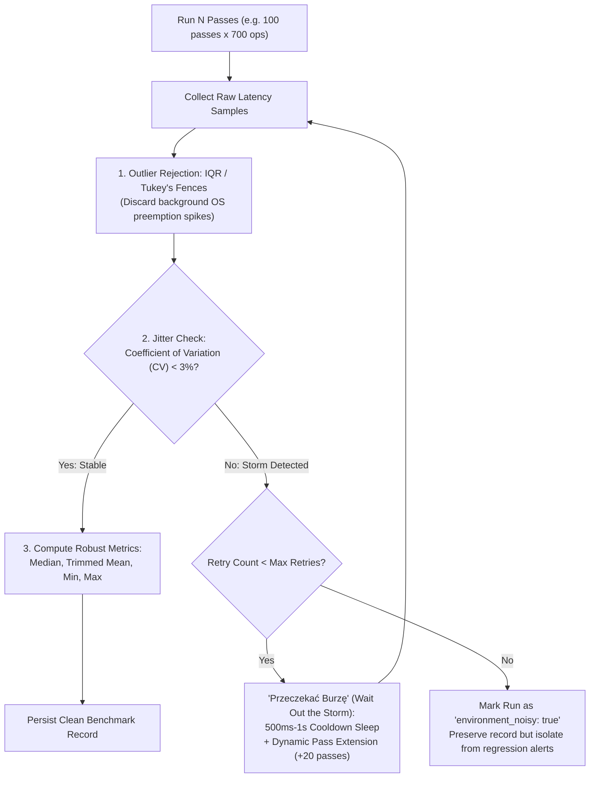
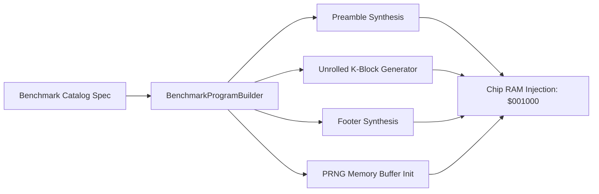
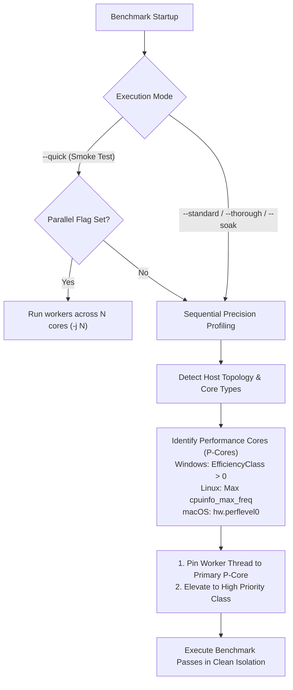
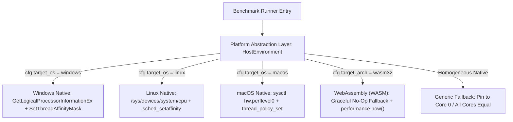
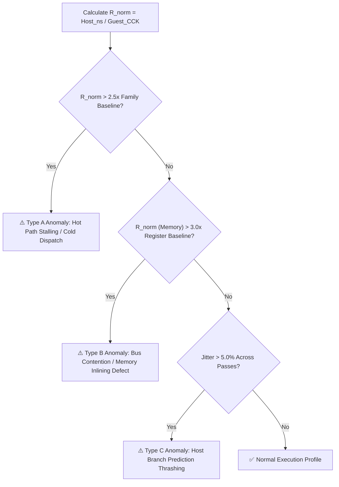

# M68000 Instruction Benchmarking Architecture & Anomaly Detection

> [!NOTE]
> This document defines the architectural specification and execution model for the programmatic M68000 instruction benchmarking subsystem.
> For per-instruction testing strategies (cascading stacks, PRNG data, exception loops), see [CPU Instruction Benchmark Strategies](CPU%20Instruction%20Benchmark%20Strategies.md).
> For the exhaustive list of testable opcodes and addressing modes, see [CPU Instruction Benchmark Catalog](CPU%20Instruction%20Benchmark%20Catalog.md).

---

## 1. Executive Summary & Goals

The Amiga 500 emulator is a cycle-exact, micro-stepped simulation. While functional correctness is validated against over 1 million test vectors via [SingleStepTests](CPU%20SingleStepTests.md) and [Cartesian DMA Contention](CPU%20Motorola%20M68000.md#6-dma-contention--wait-states), raw correctness does not guarantee optimal host CPU performance or absence of micro-architectural stalls.

The **M68000 Instruction Benchmarking Subsystem** exists to:
1. **Detect Host Execution Anomalies:** Uncover unexpected execution latency spikes where instructions with identical or lower Amiga cycle counts consume disproportionately more host CPU time due to branch mispredictions, poor code alignment, cold path cache pollution, or missed inlining.
2. **Profile Mechanical Sympathy:** Measure how efficiently modern pipelined host processors (x86_64 Zen/Core, aarch64 Apple Silicon/Neoverse) execute the 65,536-entry static dispatch table and micro-step state machine.
3. **Differential Baseline Calibration:** Isolate pure instruction execution cost by subtracting a standardized 700-op `NOP` baseline ($T_{\text{baseline}}$), neutralizing loop control and instruction fetch overhead.
4. **Prevent Performance Regressions:** Maintain persistent, version-controlled benchmark records over time (JSON/CSV) to track emulator throughput across commits and refactorings with automated diff alerting.
5. **Flexible Soak Testing:** Support both lightning-fast sanity checks (seconds) and exhaustive multi-day stress runs without modifying source code.

---

## 2. Execution Hierarchy: Dual-Loop Architecture

Accurately micro-benchmarking individual instructions on modern out-of-order, superscalar host CPUs requires isolating the target instruction from loop control branch overhead, host micro-architectural prediction biases, and compiler dead-code elimination.


```mermaid
flowchart TD
    subgraph Host Runner ["Host Test Runner (Outer Loop)"]
        A[Load Benchmark Spec] --> B[Initialize Machine & Memory]
        B --> C[Warm-up Pass]
        C --> D[Sample Run 1..N]
        D --> E[Statistical Aggregation: Min, Median, Max, StdDev]
        E --> F[Persist to JSON & CSV]
    end

    subgraph Guest Emulation ["Guest Amiga MemoryBus (Inner Loop)"]
        G[Preamble: Init Registers & Reset Pointers] --> H[Unrolled Instruction Block: K = 700 ops]
        H --> I["Loop Footer: DBF D7, Target / Reset"]
        I -->|D7 != 0| H
        I -->|D7 == 0| J[Benchmark Complete / Exit]
    end

    D <-->|Executes Guest Machine| Guest Emulation
```

### 2.1 The Inner Loop: Unrolled Block ($K = 700$ Instructions)

If an inner loop executed only 1 or 2 instructions before branching back (e.g. `ADD.W D1, D0` followed by `DBF D7, loop`), the loop control mechanics (`DBF` micro-steps, PC recalculation, host branch prediction evaluation) would consume up to 60% of the total measured time.

To achieve pure instruction measurement:
1. **Configurable Unroll Factor ($K$):** By default, the benchmark generator emits a contiguous block of **$K = 700$ unrolled instances** of the instruction under test.
2. **Amortized Branch Overhead:** With 700 instructions per block, the single terminating `DBF` or jump represents less than **0.15%** of the executed cycles, negligible enough to provide near-perfect measurement isolation.
3. **Defeating Host Loop Stream Detectors (LSD):**
   - Modern x86 processors (Intel Skylake through Raptor Lake, AMD Zen 3/4) contain dedicated Loop Stream Detectors / $\mu\text{op}$ caches that identify tight loops under 64 instructions and stream decoded micro-ops directly to execution ports, completely bypassing instruction fetch and decode.
   - An unrolled block of 700 instructions produces 1,400 to 4,200 bytes of guest machine code. This comfortably exceeds the host CPU's LSD threshold (preventing synthetic micro-op loop bypass) while remaining well within standard L1 instruction caches (32 KB–64 KB), ensuring realistic host instruction dispatch.
4. **Host Branch Predictor Decorrelation:**
   - Where applicable, unrolled sequences alternate registers (e.g. $D_0 \dots D_3$) or stride memory addresses so that the host CPU does not over-optimize repeated register rename aliases.

### 2.2 The Outer Loop: Multi-Pass Statistical Sampling & Noise Compensation

Modern host operating systems introduce non-deterministic timing noise via background thread preemption, memory paging, antivirus scans, DPC/ISR spikes, and dynamic CPU frequency scaling (turbo boost / thermal throttling).

To guarantee that measurements reflect true emulator performance rather than transient host OS interference, the outer loop employs a multi-tiered noise compensation and filtering pipeline:



#### 1. Warm-up Phase
- One or two unmeasured passes execute first to prime host L1i/L1d caches, populate the translation lookaside buffer (TLB), and bring CPU frequency governors up to maximum stable clock speed.

#### 2. Outlier Rejection (Tukey's Fences & Trimmed Statistics)
- Raw timing samples collected across passes undergo automatic outlier rejection:
  - Calculate Interquartile Range ($\text{IQR} = Q_3 - Q_1$).
  - Filter out extreme latency spikes where $T > Q_3 + 1.5 \times \text{IQR}$ (typical of host OS context switches and background service interference).
  - Compute a **trimmed mean** (discarding top and bottom 10% of samples) alongside the **median**.

#### 3. Adaptive Environmental Noise Compensation ("Przeczekać Burzę")
If the filtered samples exhibit high jitter ($\text{CV} = \sigma / \mu > 3.0\%$), it indicates the host CPU is experiencing external load or thermal throttling:
1. **Cooldown Pause ("Przeczekać Burzę"):** Sleep for 500 ms to 1 second to allow transient host spikes (disk I/O bursts, background threads) to settle.
2. **Dynamic Pass Extension:** Automatically collect additional passes (e.g. extending from 100 to 120+ passes) until a statistically stable cluster of runs is achieved.
3. **Graceful Noise Flagging:** If the host remains unstable after 3 retry cooldown attempts, the benchmark does not fail; instead, it flags the record with `"environment_noisy": true` and `"confidence": "low"`, preventing external host interference from being falsely reported as an emulator code regression.

### 2.3 Compiler Optimization Defense (`black_box` & State Checksumming)

Modern optimizing compilers (LLVM / `rustc -O`) are extraordinarily capable of detecting dead loops, constant results, or redundant state transitions:
- If a benchmark loop modifies `CpuState` but never reads the result outside the loop, LLVM may optimize away parts of the dispatch loop or state updates.
- **Defense Mechanism:**
  1. At the conclusion of each outer pass, the test harness passes the mutable reference `&mut cpu` through `std::hint::black_box()` to prevent LLVM from eliminating intermediate memory or register writes.
  2. The harness computes a rolling 64-bit CRC / XOR checksum of all registers ($D_0 \dots D_7, A_0 \dots A_7, SR, PC$) and asserts it via `black_box`, forcing complete hardware simulation fidelity on every pass.

### 2.4 Differential Baseline Subtraction (`NOP` Reference Calibration)

Even with 700 unrolled instructions, a baseline fraction of runtime is consumed by:
- Instruction fetch and prefetch queue advance (`IR`/`IRC`).
- Cycle counter incrementing and bus clock tick bookkeeping.
- The single terminating `DBF` branch and loop control logic.

To isolate the **pure execution latency ($\Delta T$)** of complex ALU or memory operations, the subsystem defines two baseline calibration models:

#### 1. The Standard `NOP-700` Homogeneous Baseline
- For the ~95% of instructions that are **100% homogeneous** (e.g. 700 pure `ADD.W`, 700 pure `MOVE.W`, 700 pure cascading `RTS`), the reference baseline is **`BASE-00`**: an identical block of 700 unrolled `NOP` instructions ($4\text{ CCK}$ each, the lowest-latency valid guest opcode).
- The unit dispatch overhead of one guest instruction is:
  $$T_{\text{unit\_nop}} = \frac{T_{\text{NOP-700}}}{700}$$
- **Differential Delta:**
  $$\Delta T_{\text{net}} = T_{\text{instruction}} - T_{\text{NOP-700}}$$
  This cancels out the `DBF` loop control, prefetch priming, and general micro-step loop bookkeeping, leaving strictly the net host time spent on operand effective address calculations, bus transfers, and ALU computation.

#### 2. Composite & Paired Blocks (Template-Matched Baselines)
For instructions that require auxiliary or state-balancing companions inside the 700-instruction block:
- **Paired Instructions (e.g. `LINK` + `UNLK`, `LSL` + `LSR`):**
  - The block maintains the exact same total length ($K_{\text{total}} = 700$), consisting of 350 pairs:
    $$350 \times \text{LINK} + 350 \times \text{UNLK} = 700\text{ instructions}$$
  - The runner reports metrics normalized **per individual target instruction**:
    $$\text{Host ns/op} = \frac{T_{\text{block}}}{350} - T_{\text{unit\_aux}}$$
  - If `UNLK` has already been calibrated independently, its measured cost is subtracted to isolate `LINK`.
- **Exception Trampoline Loops (e.g. `DIVU #0` with handler):**
  - The baseline can run a **structural template replacement**, replacing the faulting `DIVU` with an un-trapped instruction in the same loop harness to isolate the trampoline overhead (`SUBQ` + `BEQ` + `RTE`) from the core Vector 5 exception dispatch.


---

## 3. Programmatic Code Generation (`BenchmarkProgramBuilder`)

Rather than maintaining hundreds of static `.bin` files and requiring an external M68000 assembler toolchain, the benchmarking subsystem synthesizes test programs **100% programmatically in Rust memory**.



### 3.1 Architecture Advantages
- **Zero External Toolchain Dependencies:** Compiles and runs out-of-the-box on native Linux, macOS, Windows, and WebAssembly without requiring `vasm`, `gas`, or pre-assembled binaries.
- **Dynamic Parameterization:** Unroll factor $K$, register sets, memory addresses, and data patterns can be altered at runtime via test configuration flags.
- **Microsecond Synthesis:** Constructing a 700-instruction test program directly in a `Vec<u16>` and writing it into Chip RAM takes under 15 microseconds.

### 3.2 Program Structure
Every generated benchmark program conforms to a 4-stage memory layout:

```
+-------------------------------------------------------------+
| Vector Table & Exception Handlers ($000000 - $0003FF)       |
+-------------------------------------------------------------+
| PRNG Memory Operand Buffer ($000400 - $000FFF)              |
+-------------------------------------------------------------+
| Benchmark Program Entry ($001000):                          |
|   1. Preamble: Set registers, SP, flags, loop counter D7    |
|   2. Inner Loop Body: K unrolled target instructions        |
|   3. Footer: Pointer reset / DBF D7 loop-back               |
|   4. Exit: ILLEGAL or STOP #$2700 sentinel                  |
+-------------------------------------------------------------+
| Cascading Stack / Push Buffer ($070000 - $07FFFF)           |
+-------------------------------------------------------------+
```

---

## 4. Execution Scaling & Runtime Configuration

The benchmark runner supports scalable execution modes controlled via CLI parameters or environment variables, allowing the same test suite to serve as a fast developer sanity check or an exhaustive multi-day soak test.

### 4.1 Execution Profiles

| Profile | CLI Flag / Env Variable | Total Instructions per Opcode | Approximate Runtime (Whole Suite) | Primary Use Case |
| :--- | :--- | :--- | :--- | :--- |
| **Sanity / Quick** | `--quick` / `BENCH_MODE=quick` | $10{,}000$ | ~5 seconds | Pre-commit check, CI pipeline validation. |
| **Standard** | `--standard` / `BENCH_MODE=standard` | $1{,}000{,}000$ | ~2 minutes | PR review, instruction optimization validation. |
| **Thorough** | `--thorough` / `BENCH_MODE=thorough` | $10{,}000{,}000$ | ~20 minutes | Nightly performance regression check. |
| **Soak / Multi-Day** | `--soak` / `BENCH_MODE=soak` | $10^8 - 10^9$ | Several hours to multiple days | Deep thermal profiling, long-term stability soak. |

### 4.2 Configuration Parameters

The runner exposes fine-grained overrides:
- `BENCH_UNROLL`: Overrides the unroll block factor $K$ (e.g. `BENCH_UNROLL=500` or `BENCH_UNROLL=1000`). Default: `700`.
- `BENCH_PASSES`: Number of outer loop statistical passes. Default: `7`.
- `BENCH_FILTER`: Regex or substring filter to benchmark specific instruction families (e.g. `BENCH_FILTER="ADD|SUB"` or `BENCH_FILTER="RTS"`).
- `BENCH_OUT_DIR`: Target directory for JSON and CSV output files (defaults to `target/benchmarks/`).
- `BENCH_PIN_CORE`: Pin benchmark thread to a specific host logical core index (e.g. `BENCH_PIN_CORE=2`). Defaults to auto-detected P-core.
- `BENCH_PARALLEL`: Number of parallel test workers (`-j <N>`). Default: `1` (sequential).

### 4.3 Multi-Core Policy & Performance Core (P-Core) Auto-Detection



#### 1. Why Sequential Profiling on P-Cores is Mandatory
Running multiple benchmark threads concurrently across all CPU cores causes **severe measurement degradation**:
- **Shared Cache Contention:** Concurrent threads evict each other's lines in the shared L3 cache.
- **DRAM Bus Saturation:** Memory-referencing instructions compete for shared memory bus bandwidth.
- **Thermal Downclocking:** Modern multi-core processors reduce clock speeds under all-core load (e.g. all-core boost clock is often 500–1000 MHz lower than peak single-core boost clock).
- **The Golden Rule:** High-precision instruction profiling (`--standard`, `--thorough`, `--soak`) must execute **sequentially on a single dedicated Performance Core (P-core)** to maintain peak single-core turbo frequencies, clean L1i/L2 caches, and minimal jitter. Multi-threaded execution (`-j <N>`) is strictly reserved for developer smoke tests (`--quick`).

#### 2. Automatic Detection of Performance Cores (P-Cores vs E-Cores)
On modern hybrid architectures (Intel 12th–14th Gen, AMD Zen 4/5c, Apple Silicon M-series), host processors mix high-performance P-cores with lower-clocked Efficiency (E-cores). To guarantee benchmarks always execute on maximum-performance hardware:

- **Windows (`GetLogicalProcessorInformationEx`):**
  - Queries `RelationProcessorCore` topology.
  - Inspects the `EfficiencyClass` byte in each `PROCESSOR_CORE_INFO`:
    - `EfficiencyClass == 0`: Efficiency Core (E-core).
    - `EfficiencyClass > 0`: Performance Core (P-core) with highest computational throughput.
  - The runner selects a core with the highest `EfficiencyClass`.
- **Linux (`/sys/devices/system/cpu/`):**
  - Scans `/sys/devices/system/cpu/cpu*/cpufreq/cpuinfo_max_freq`.
  - Cores reporting the highest frequency ceiling (e.g. 5.8 GHz vs 4.0 GHz) are classified as P-cores.
- **macOS (`sysctl`):**
  - Queries `hw.perflevel0.logicalcpu` (P-cores) and `hw.perflevel1.logicalcpu` (E-cores).

#### 3. Affinity Pinning & Thread Priority Elevation
Once the optimal P-core is resolved:
1. **Thread Affinity:** The runner binds the benchmark thread to the selected core mask (`SetThreadAffinityMask` on Windows, `pthread_setaffinity_np` on Linux/macOS), preventing the OS scheduler from migrating the thread across cores mid-pass.
2. **Process Priority:** The runner temporarily raises its priority to `HIGH_PRIORITY_CLASS` (Windows) or `nice -20` (Unix) to minimize preemption from background host tasks.

### 4.4 Portability & WebAssembly (WASM) Decoupling Architecture

A fundamental architectural mandate of this emulator is:
> *"Compiles seamlessly for native desktop (x86_64, aarch64) and WebAssembly (`wasm32-unknown-unknown`). System-agnostic core: zero direct OS or platform dependencies."*

To satisfy this requirement without compromising native P-core pinning or portability across different machines:



#### 1. Decoupled Platform Abstraction (`HostEnvironment`)
The benchmark harness defines a lightweight platform abstraction with zero runtime overhead:
```rust
pub struct HostEnvironment {
    pub platform_name: &'static str,
    pub p_core_detected: bool,
    pub p_core_id: Option<usize>,
    pub affinity_supported: bool,
}

impl HostEnvironment {
    /// Discovers host topology dynamically on startup without hardcoding
    pub fn detect() -> Self;

    /// Pins worker thread to P-core if supported; compiles to no-op on WASM
    pub fn pin_to_p_core(&self) -> Result<(), BenchmarkError>;
}
```

#### 2. Dynamic Hardware Discovery (Zero Hardcoded Paths or IDs)
- If the user moves the project from an Intel hybrid laptop (P+E cores) to an AMD desktop (16 identical Zen cores) or an Apple Silicon Mac (M-series):
  - **No hardcoded core numbers exist in the codebase.**
  - At startup, the OS query resolves the current machine's physical layout in microseconds.
  - On homogeneous processors (where all cores have identical performance), the detector recognizes that all cores are equal and pins to core 0 (or core 2 to stay clear of OS timer IRQs).

#### 3. WebAssembly (`wasm32-unknown-unknown`) Compatibility
In a WebAssembly environment (browsers, Node.js, Web Workers):
- **Browser Sandboxing:** Web browsers intentionally restrict access to physical CPU core topology and thread affinity to prevent side-channel timing attacks (Spectre) and device fingerprinting.
- **Graceful Compilation Fallback:** Under `#[cfg(target_arch = "wasm32")]`:
  - `pin_to_p_core()` compiles into a **zero-overhead, successful no-op** (`Ok(())`).
  - Core detection returns `affinity_supported: false`.
  - Timers automatically bind to high-resolution web standards (`performance.now()`) instead of host-native APIs.
- **Result:** The exact same benchmark code compiles cleanly for `wasm32-unknown-unknown`, allowing instruction benchmarking directly inside web browser test suites without compile errors, platform panics, or conditional code branching in the hot loop.


---

## 5. Memory Environment & PRNG Seeding

Memory-referencing instructions (`(An)`, `(An)+`, `-(An)`, `d(An)`, `d(An,Xi)`, `$xxxx.W`, `$xxxxxxxx.L`) must not operate on uninitialized, zeroed, or static memory:
- Operating entirely on zeros risks unrealistic branch and arithmetic shortcuts in the host ALU (e.g. zero division, no-op carries).
- Inverting bits or repeating single values creates synthetic CPU cache behaviors.

### 5.1 Deterministic Pseudo-Random Generator (PRNG)
To eliminate repetitive data patterns and prevent host processor branch/ALU shortcut optimizations, a deterministic PRNG is used for:
1. **Memory Operand Buffers:** Pre-filling Chip RAM operand buffers with varied, non-zero bit patterns.
2. **Initial Register Preamble:** Initializing Data and Address registers ($D_0 \dots D_7, A_0 \dots A_6$) with pseudo-random values.
3. **Immediate Operand Stream:** Emitting varying pseudo-random constants for immediate instruction streams (e.g. 700 unrolled `MOVE.L #<random>, D0` or `ADDI.W #<random>, D0`) rather than repeating a single static constant.

The generator does not require cryptographic security; a fast, lightweight 64-bit algorithm (such as `XorShift64`) is used:
```rust
// Deterministic seed ensures identical data across runs and host architectures
const BENCH_PRNG_SEED: u64 = 0x8547_5938_4721_9381;
```
- **Determinism:** Data is 100% bit-for-bit identical across runs, native architectures (x86_64 vs aarch64), and releases.
- **Valid Data Range Clamping:** For sensitive instructions (e.g. non-zero `DIVU`/`DIVS` divisors, valid decimal digits for `ABCD`/`SBCD`, word-aligned addresses for address registers), the PRNG output is clamped or masked to ensure architectural validity without triggering accidental hardware traps.


### 5.2 Cyclic Memory Buffers
For post-increment `(An)+` and pre-decrement `-(An)` modes:
- The buffer size is sized to match the unroll block (e.g. $700 \times 4\text{ bytes} = 2{,}800\text{ bytes}$ for `.L` operations).
- In the loop footer, $An$ is reset back to the buffer head, allowing endless cyclic traversals without memory overflow or fault generation.

---

## 6. Results Persistence & Output Schema

Because long-duration benchmarks may run for hours or days, results are persisted continuously to disk upon completion of each instruction family.

Output files are stored in `target/benchmarks/`:
1. `target/benchmarks/m68k_benchmark_<timestamp>.json` (Full structured dataset with environment metadata).
2. `target/benchmarks/m68k_benchmark_<timestamp>.csv` (Flat tabular format for spreadsheet analysis and Python pandas/matplotlib plotting).
3. `target/benchmarks/m68k_benchmark_latest.json` (Symlink / copy of latest run for automated regression diffing).

### 6.1 JSON Data Schema
```json
{
  "version": 1,
  "timestamp": "2026-09-10T12:00:00Z",
  "environment": {
    "host_os": "windows",
    "host_arch": "x86_64",
    "rustc_version": "rustc 1.82.0",
    "profile": "release",
    "unroll_factor": 700,
    "outer_passes": 7
  },
  "results": [
    {
      "mnemonic": "ADD.W",
      "variant": "ADD.W D1, D0",
      "addressing_mode": "DataRegDirect",
      "category": "Arithmetic",
      "opcode_hex": "D041",
      "amiga_cck_cycles": 4,
      "total_guest_instructions": 7000000,
      "total_guest_cck": 28000000,
      "host_duration_median_ms": 19.82,
      "host_duration_min_ms": 19.45,
      "host_duration_max_ms": 20.31,
      "host_jitter_pct": 1.25,
      "host_ns_per_instruction": 2.83,
      "host_ns_per_guest_cck": 0.708,
      "host_mips": 353.18,
      "anomaly_flag": false
    }
  ]
}
```

### 6.2 CSV Data Columns
The `.csv` file provides identical metrics in columnar form:
```csv
timestamp,mnemonic,variant,mode,category,opcode,amiga_cck,total_ops,host_ms_median,host_ns_op,host_ns_cck,host_mips,jitter_pct,anomaly
2026-09-10T12:00:00Z,ADD.W,ADD.W D1, D0,DataRegDirect,Arithmetic,D041,4,7000000,19.82,2.83,0.708,353.18,1.25,false
```

---

## 7. Anomaly Detection: The Normalized Cycle Metric

The primary objective of the benchmarking suite is not merely measuring raw speed, but **identifying implementation anomalies**.

### 7.1 The Metric: Host Nanoseconds per Amiga Color Clock ($R_{\text{norm}}$)
$$R_{\text{norm}} = \frac{T_{\text{host}}\ (\text{ns})}{C_{\text{guest}}\ (\text{Amiga CCK})}$$

In a micro-stepped, cycle-exact emulator, each Amiga Color Clock represents a single step of the bus or internal state machine. Consequently, **the host time required per guest clock cycle should remain relatively uniform across all instructions of the same execution tier**.

### 7.2 Anomaly Classification Rules



1. **Type A: Intra-Family Execution Spike ($R_{\text{norm}} > 2.5\times$ baseline)**
   - *Symptom:* `SUB.W D1, D0` takes $0.71\text{ ns/CCK}$, but `AND.W D1, D0` (both 4-cycle register operations) takes $2.45\text{ ns/CCK}$.
   - *Root Cause:* Dynamic match expressions evaluated at runtime instead of direct table dispatch, or missing compiler optimizations.
2. **Type B: Addressing Mode Inefficiency ($R_{\text{norm}} > 3.0\times$ register baseline)**
   - *Symptom:* Memory read `MOVE.W (A0), D0` exhibits an exorbitant cost per cycle compared to register `MOVE.W D1, D0`.
   - *Root Cause:* Memory access helpers (`read_word`, `bank_handler`) failing cross-crate inlining (`#[inline]`), creating indirect function call overhead on every bus cycle.
3. **Type C: Excessive Jitter ($\sigma / \text{median} > 5\%$)**
   - *Symptom:* Significant variance between consecutive outer loop passes on an idle system.
   - *Root Cause:* Host CPU Branch Target Buffer (BTB) capacity exceeded, or instruction stream crossing cache line boundaries unevenly.

### 7.3 Automated Historical Regression Diffing (`bench_diff`)

To make benchmark data immediately actionable across development cycles:
- **Baseline Comparison:** The test runner automatically looks for `target/benchmarks/m68k_benchmark_baseline.json`. If present, it computes the delta percentage for each instruction variant:
  $$\Delta \% = \frac{T_{\text{new}} - T_{\text{baseline}}}{T_{\text{baseline}}} \times 100\%$$
- **Regression Alert Thresholds:**
  - **$\Delta \le +3.0\%$:** Normal variance / noise tolerance.
  - **$+3.0\% < \Delta \le +7.0\%$:** Warning flag (`⚠️ Minor Regression: Investigate inlining`).
  - **$\Delta > +7.0\%$:** Failure alert (`🚨 Severe Regression: Blocking merge`).
- **Environment Metadata Verification:** The diff engine verifies that `host_arch`, `host_cpu`, and `profile` match before issuing regression alerts, ensuring measurements taken on different hardware are never compared directly.

