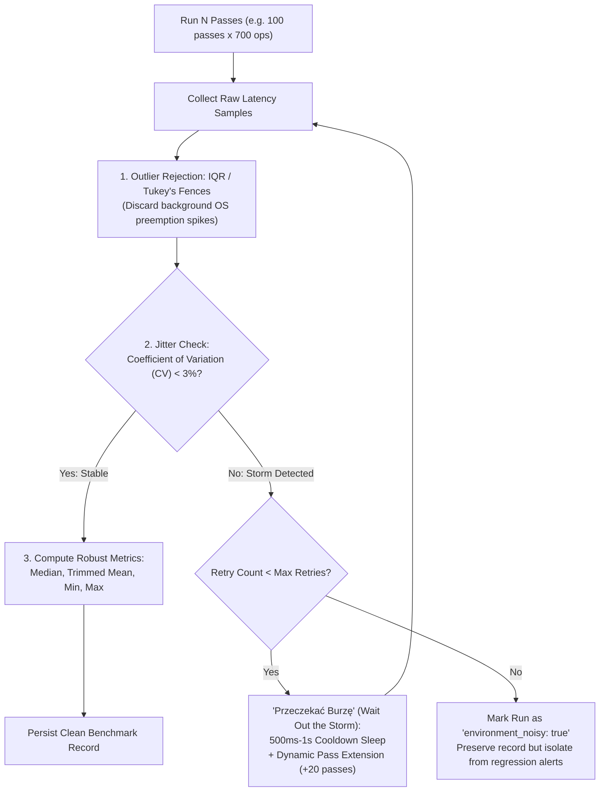
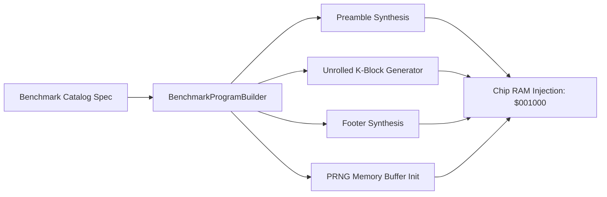
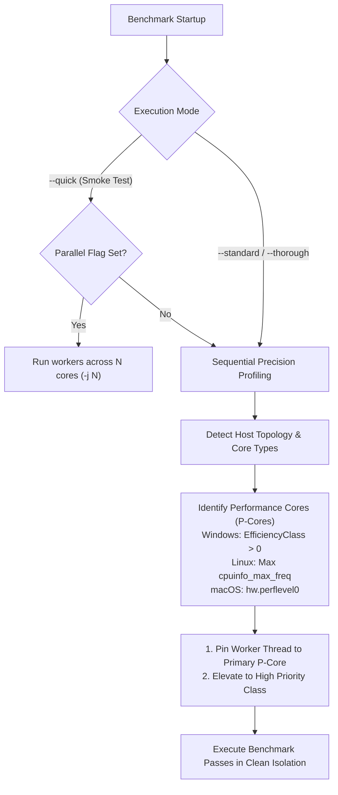
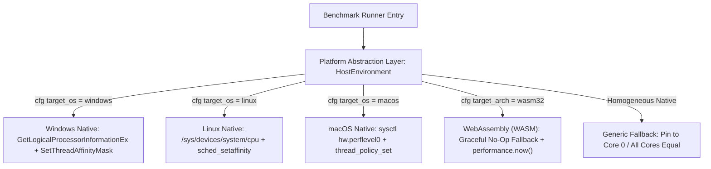
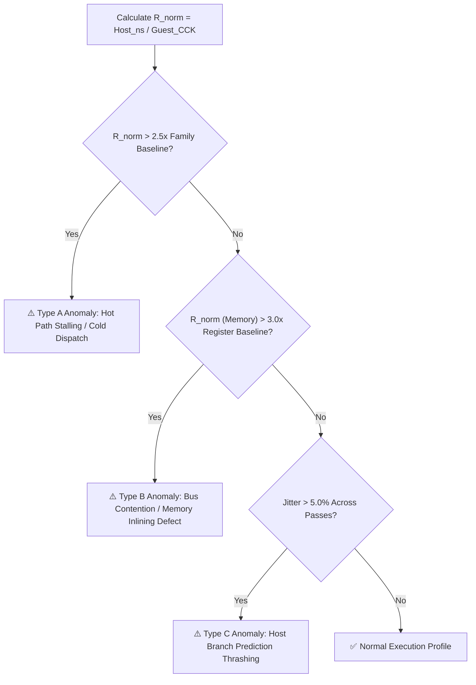
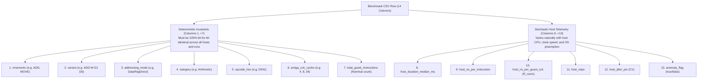

# M68000 Instruction Benchmarking Architecture & Anomaly Detection

- **Parent Specification:** [CPU Motorola M68000.md](CPU%20Motorola%20M68000.md) | [CPU Micro-Step State Machine.md](CPU%20Micro-Step%20State%20Machine.md)
- **Module Location:** `crates/test_runner/src/benchmark/`
- **Companion Specifications:** [CPU Instruction Benchmark Catalog](CPU%20Instruction%20Benchmark%20Catalog.md) | [CPU Instruction Benchmark Strategies](CPU%20Instruction%20Benchmark%20Strategies.md) | [CPU Benchmark Analysis Guide](CPU%20Benchmark%20Analysis%20Guide.md)
- **Engineering Guidelines:** Follow systems rules in [AGENTS.md](../../../AGENTS.md).

> [!NOTE]
> This document defines the architectural specification and execution model for the programmatic M68000 instruction benchmarking subsystem.
> For per-instruction testing strategies (cascading stacks, PRNG data, exception loops), see [CPU Instruction Benchmark Strategies](CPU%20Instruction%20Benchmark%20Strategies.md).
> For the exhaustive list of testable opcodes and addressing modes, see [CPU Instruction Benchmark Catalog](CPU%20Instruction%20Benchmark%20Catalog.md).

---

## 1. Executive Summary & Goals

The Amiga 500 emulator is a cycle-exact, micro-stepped simulation. While functional correctness is validated against over 1 million test vectors via [SingleStepTests](CPU%20SingleStepTests.md) and [Cartesian DMA Contention](CPU%20Motorola%20M68000.md#6-dma-contention--wait-states), raw correctness does not guarantee optimal host CPU performance or absence of micro-architectural stalls.

The **M68000 Instruction Benchmarking Subsystem** exists to:
1. **Detect Host Execution Anomalies:** Uncover unexpected execution latency spikes where instructions with identical or lower Amiga cycle counts consume disproportionately more host CPU time due to branch mispredictions, poor code alignment, cold path cache pollution, or missed inlining.
2. **Profile Host Execution Efficiency:** Measure how efficiently modern pipelined host processors (x86_64 Zen/Core, aarch64 Apple Silicon/Neoverse) execute the 65,536-entry static dispatch table and micro-step state machine.
3. **Differential Baseline Calibration:** Isolate pure instruction execution cost by subtracting a standardized 700-op `NOP` baseline ($T_{\text{baseline}}$), neutralizing loop control and instruction fetch overhead.
4. **Prevent Performance Regressions:** Maintain persistent, version-controlled benchmark records over time (JSON/CSV) to track emulator throughput across commits and refactorings with automated diff alerting.
5. **Flexible Execution Scaling:** Support both lightning-fast sanity checks (seconds) and thorough statistical baseline generation without modifying source code.

---

## 2. Execution Hierarchy: Dual-Loop Architecture

Accurately micro-benchmarking individual instructions on modern out-of-order, superscalar host CPUs requires isolating the target instruction from loop control branch overhead, host micro-architectural prediction biases, and compiler dead-code elimination.


```mermaid
flowchart TD
    subgraph Host Runner ["Host Test Runner (Outer Loop)"]
        A[Load Benchmark Spec] --> B[Initialize Machine & Memory]
        B --> C[Warm-up Pass]
        C --> D[Sample Run 1..N]
        D --> E[Statistical Aggregation: Min, Median, Max, StdDev]
        E --> F[Persist to JSON & CSV]
    end

    subgraph Guest Emulation ["Guest Amiga MemoryBus (Inner Loop)"]
        G[Preamble: Init Registers & Reset Pointers] --> H[Unrolled Instruction Block: K = 700 ops]
        H --> I["Loop Footer: DBF D7, Target / Reset"]
        I -->|D7 != 0| H
        I -->|D7 == 0| J[Benchmark Complete / Exit]
    end

    D <-->|Executes Guest Machine| Guest Emulation
```

### 2.1 The Inner Loop: Unrolled Block ($K = 700$ Instructions)

If an inner loop executed only 1 or 2 instructions before branching back (e.g. `ADD.W D1, D0` followed by `DBF D7, loop`), the loop control mechanics (`DBF` micro-steps, PC recalculation, host branch prediction evaluation) would consume up to 60% of the total measured time.

To achieve pure instruction measurement:
1. **Configurable Unroll Factor ($K$):** By default, the benchmark generator emits a contiguous block of **$K = 700$ unrolled instances** of the instruction under test.
2. **Amortized Branch Overhead:** With 700 instructions per block, the single terminating `DBF` or jump represents less than **0.15%** of the executed cycles, negligible enough to provide near-perfect measurement isolation.
3. **Defeating Host Loop Stream Detectors (LSD):**
   - Modern x86 processors (Intel Skylake through Raptor Lake, AMD Zen 3/4) contain dedicated Loop Stream Detectors / $\mu\text{op}$ caches that identify tight loops under 64 instructions and stream decoded micro-ops directly to execution ports, completely bypassing instruction fetch and decode.
   - An unrolled block of 700 instructions produces 1,400 to 4,200 bytes of guest machine code. This comfortably exceeds the host CPU's LSD threshold (preventing synthetic micro-op loop bypass) while remaining well within standard L1 instruction caches (32 KB–64 KB), ensuring realistic host instruction dispatch.
4. **Host Branch Predictor Decorrelation:**
   - Where applicable, unrolled sequences alternate registers (e.g. $D_0 \dots D_3$) or stride memory addresses so that the host CPU does not over-optimize repeated register rename aliases.

### 2.2 The Outer Loop: Multi-Pass Statistical Sampling & Noise Compensation

Modern host operating systems introduce non-deterministic timing noise via background thread preemption, memory paging, antivirus scans, DPC/ISR spikes, and dynamic CPU frequency scaling (turbo boost / thermal throttling).

To guarantee that measurements reflect true emulator performance rather than transient host OS interference, the outer loop employs a multi-tiered noise compensation and filtering pipeline:



#### 1. Warm-up Phase
- One or two unmeasured passes execute first to prime host L1i/L1d caches, populate the translation lookaside buffer (TLB), and bring CPU frequency governors up to maximum stable clock speed.

#### 2. Outlier Rejection (Tukey's Fences & Trimmed Statistics)
- Raw timing samples collected across passes undergo automatic outlier rejection:
  - Calculate Interquartile Range ($\text{IQR} = Q_3 - Q_1$).
  - Filter out extreme latency spikes where $T > Q_3 + 1.5 \times \text{IQR}$ (typical of host OS context switches and background service interference).
  - Compute a **trimmed mean** (discarding top and bottom 10% of samples) alongside the **median**.

#### 3. Adaptive Environmental Noise Compensation ("Przeczekać Burzę")
If the filtered samples exhibit high jitter ($\text{CV} = \sigma / \mu > 3.0\%$), it indicates the host CPU is experiencing external load or thermal throttling:
1. **Cooldown Pause ("Przeczekać Burzę"):** Sleep for 500 ms to 1 second to allow transient host spikes (disk I/O bursts, background threads) to settle.
2. **Dynamic Pass Extension:** Automatically collect additional passes (e.g. extending from 100 to 120+ passes) until a statistically stable cluster of runs is achieved.
3. **Graceful Noise Flagging:** If the host remains unstable after 3 retry cooldown attempts, the benchmark does not fail; instead, it flags the record with `"environment_noisy": true` and `"confidence": "low"`, preventing external host interference from being falsely reported as an emulator code regression.

### 2.3 Compiler Optimization Defense (`black_box` & State Checksumming)

Modern optimizing compilers (LLVM / `rustc -O`) are extraordinarily capable of detecting dead loops, constant results, or redundant state transitions:
- If a benchmark loop modifies `CpuState` but never reads the result outside the loop, LLVM may optimize away parts of the dispatch loop or state updates.
- **Defense Mechanism:**
  1. At the conclusion of each outer pass, the test harness passes the mutable reference `&mut cpu` through `std::hint::black_box()` to prevent LLVM from eliminating intermediate memory or register writes.
  2. The harness computes a rolling 64-bit CRC / XOR checksum of all registers ($D_0 \dots D_7, A_0 \dots A_7, SR, PC$) and asserts it via `black_box`, forcing complete hardware simulation fidelity on every pass.

### 2.4 Differential Baseline Subtraction (`NOP` Reference Calibration)

Even with 700 unrolled instructions, a baseline fraction of runtime is consumed by:
- Instruction fetch and prefetch queue advance (`IR`/`IRC`).
- Cycle counter incrementing and bus clock tick bookkeeping.
- The single terminating `DBF` branch and loop control logic.

To isolate the **pure execution latency ($\Delta T$)** of complex ALU or memory operations, the subsystem defines two baseline calibration models:

#### 1. The Standard `NOP-700` Homogeneous Baseline
- For the ~95% of instructions that are **100% homogeneous** (e.g. 700 pure `ADD.W`, 700 pure `MOVE.W`, 700 pure cascading `RTS`), the reference baseline is **`BASE-00`**: an identical block of 700 unrolled `NOP` instructions ($4\text{ CCK}$ each, the lowest-latency valid guest opcode).
- The unit dispatch overhead of one guest instruction is:
  $$T_{\text{unit\_nop}} = \frac{T_{\text{NOP-700}}}{700}$$
- **Differential Delta:**
  $$\Delta T_{\text{net}} = T_{\text{instruction}} - T_{\text{NOP-700}}$$
  This cancels out the `DBF` loop control, prefetch priming, and general micro-step loop bookkeeping, leaving strictly the net host time spent on operand effective address calculations, bus transfers, and ALU computation.

#### 2. Composite & Paired Blocks (Template-Matched Baselines)
For instructions that require auxiliary or state-balancing companions inside the 700-instruction block:
- **Paired Instructions (e.g. `LINK` + `UNLK`, `LSL` + `LSR`):**
  - The block maintains the exact same total length ($K_{\text{total}} = 700$), consisting of 350 pairs:
    $$350 \times \text{LINK} + 350 \times \text{UNLK} = 700\text{ instructions}$$
  - The runner reports metrics normalized **per individual target instruction**:
    $$\text{Host ns/op} = \frac{T_{\text{block}}}{350} - T_{\text{unit\_aux}}$$
  - If `UNLK` has already been calibrated independently, its measured cost is subtracted to isolate `LINK`.
- **Exception Trampoline Loops (e.g. `DIVU #0` with handler):**
  - The baseline can run a **structural template replacement**, replacing the faulting `DIVU` with an un-trapped instruction in the same loop harness to isolate the trampoline overhead (`SUBQ` + `BEQ` + `RTE`) from the core Vector 5 exception dispatch.

### 2.5 Sentinel Termination & Infinite Loop Protection

To ensure synthesized machine code terminates cleanly and deterministically without unbounded execution or host process hangs:
1. **The Sentinel Exit Address (`BENCH_EXIT_PC = $004FFE`):**
   - Every synthesized linear block terminates with a jump footer (`JMP $004FFE`, opcode `4EF9 0000 4FFE`), or in cascading stack workflows (`RTS`, `RTR`, `RTE`), pops the final return address pointing to `$004FFE`.
   - At address `$004FFE`, the injection builder places a supervisor stop instruction: `STOP #$2700` (opcode `4E 72 27 00`).
2. **Termination Loop Invariant:**
   - The inner stepping loop evaluates termination after each instruction:
     ```rust
     while !cpu.state.halted && !cpu.state.stopped && cpu.state.instruction_pc != program.exit_pc {
         cpu.step_instruction(&mut bus);
     }
     ```
   - Reaching `$004FFE` immediately breaks the loop, transitioning the CPU into the clean stopped state.
3. **Hard Cycle Timeout Threshold ($10\times$ Expected CCK):**
   - If an unexpected hardware defect, unaligned vector jump, or instruction corruption causes an infinite loop, execution is guaranteed to abort:
     $$\text{max\_cycles} = \max(C_{\text{expected\_per\_pass}}, 1000) \times 10$$
   - When `elapsed_cycles >= max_cycles`, the runner halts execution, marks `timed_out = true`, and flags the result with `AnomalyType::ExecutionTimeoutOrInfiniteLoop`.

### 2.6 Golden Master Trace Hash Verification (`test_benchmark_trace.rs`)

Prior to high-iteration performance profiling, synthesized benchmark programs undergo automated regression verification against deterministic **Golden Master Hashes**:
1. **Zero Fragile String Assertions:**
   - Rather than fragile string scraping on disassembler lines, the test suite verifies all 108 benchmark specifications by calculating a normalized 64-bit FNV-1a hash over each program's single-pass execution log and comparing it against [`GOLDEN_TRACE_HASHES`](../../../crates/test_runner/tests/test_benchmark_trace.rs).
2. **Instant Cross-Platform Regression Detection:**
   - Evaluates in-memory execution traces in **< 0.08 seconds** across all 108 specifications.
   - Any modification to CPU microcode, ALU flag calculations, instruction cycle duration, addressing mode pointer arithmetic, or disassembly output immediately alters the computed hash.
3. **Actionable Failure Diagnostics:**
   - On hash mismatch, the test runner outputs explicit diagnostic guidance instructing the developer or review agent to inspect the generated trace file (`tests/benchmarks/traces/<SPEC_ID>.trace`) manually or with an LLM, verify whether the behavior change is intentional, and update the golden hash.

### 2.7 Persistent Execution Audit Traces (`--dump-traces` for LLM & Human Double-Check)

To enable comprehensive semantic verification by AI agents (LLMs) or human auditors, the benchmark runner includes the `--dump-traces` option:
```powershell
cargo run -p test_runner --release -- bench --dump-traces --filter "ARITH|MOV|FLOW"
```

1. **Dedicated Trace Directory (`tests/benchmarks/traces/<SPEC_ID>.trace`):**
   - For every benchmark program matching the filter, the engine executes a single pass and writes a standalone, human- and LLM-readable audit trace file.
2. **Standard Audit File Structure:**
   - **Specification Metadata:** Opcode ID, instruction syntax, category, addressing mode, expected Amiga CCK cycles.
   - **Initial State Snapshot:** Full register dump ($D_0..D_7$, $A_0..A_7$, $SR$, $SSP$) and memory buffer base addresses ($A_0 = \$006000$, $A_1 = \$007000$).
   - **Step-by-Step Log:** 1 line per instruction showing step index, Program Counter, opcode hex, disassembler text, CCK duration, register deltas, and memory write destinations:
     ```text
     [001] 00001000: 32D8  MOVE.W (A0)+, (A1)+ | 12 CCK | ΔRegs: A0: 0x006000 -> 0x006002, A1: 0x007000 -> 0x007002 | Mem: Mem[0x007000] <= 0x4837
     ```
   - **Summary & Verification Footer:** Total instructions executed, total guest cycles, clean sentinel termination confirmation, and final register dump.
3. **LLM Verification Workflow:**
   - Reviewing agents can read `<SPEC_ID>.trace` files directly via `view_file` to perform a non-strict, semantic "double-check", ensuring that the synthesized machine code actually targets the intended hardware circuitry and behaves as expected before running millions of benchmark iterations.

---

## 3. Programmatic Code Generation (`BenchmarkProgramBuilder`)

Rather than maintaining hundreds of static `.bin` files and requiring an external M68000 assembler toolchain, the benchmarking subsystem synthesizes test programs **100% programmatically in Rust memory**.



### 3.1 Architecture Advantages
- **Zero External Toolchain Dependencies:** Compiles and runs out-of-the-box on native Linux, macOS, Windows, and WebAssembly without requiring `vasm`, `gas`, or pre-assembled binaries.
- **Dynamic Parameterization:** Unroll factor $K$, register sets, memory addresses, and data patterns can be altered at runtime via test configuration flags.
- **Microsecond Synthesis:** Constructing a 700-instruction test program directly in a `Vec<u16>` and writing it into Chip RAM takes under 15 microseconds.

### 3.2 Program Structure
Every generated benchmark program conforms to a 4-stage memory layout:

```
+-------------------------------------------------------------+
| Vector Table & Exception Handlers ($000000 - $0003FF)       |
+-------------------------------------------------------------+
| PRNG Memory Operand Buffer ($000400 - $000FFF)              |
+-------------------------------------------------------------+
| Benchmark Program Entry ($001000):                          |
|   1. Preamble: Set registers, SP, flags                     |
|   2. Inner Loop Body: K unrolled target instructions        |
|   3. Footer: JMP $004FFE / Cascading Stack Return           |
|   4. Exit Sentinel: STOP #$2700 at $004FFE                  |
+-------------------------------------------------------------+
| Memory Buffers ($006000 A0 source, $007000 A1 destination)  |
| Subroutine Return Base ($008000 rts_base)                   |
| Cascading Stack / Push Buffer ($070000 - $07FFFF)           |
+-------------------------------------------------------------+
```

---

## 4. Execution Scaling & Runtime Configuration

The benchmark runner supports scalable execution modes controlled via CLI parameters or environment variables, allowing the same test suite to serve as a fast developer sanity check or an exhaustive baseline generation profile.

### 4.1 Execution Profiles

| Profile | CLI Flag / Env Variable | Total Instructions per Opcode | Approximate Runtime (Whole Suite) | Primary Use Case |
| :--- | :--- | :--- | :--- | :--- |
| **Sanity / Quick** | `--quick` / `BENCH_MODE=quick` | $10{,}000$ | ~5 seconds | Pre-commit check, CI pipeline validation. |
| **Standard** | `--standard` / `BENCH_MODE=standard` | $1{,}000{,}000$ | ~2 minutes | PR review, instruction optimization validation. |
| **Thorough** | `--thorough` / `BENCH_MODE=thorough` | $10{,}000{,}000$ | ~20 minutes | Nightly performance regression check. |

### 4.2 Configuration Parameters

The runner exposes fine-grained overrides:
- `BENCH_UNROLL`: Overrides the unroll block factor $K$ (e.g. `BENCH_UNROLL=500` or `BENCH_UNROLL=1000`). Default: `700`.
- `BENCH_PASSES`: Number of outer loop statistical passes. Default: `7`.
- `BENCH_FILTER`: Regex or substring filter to benchmark specific instruction families (e.g. `BENCH_FILTER="ADD|SUB"` or `BENCH_FILTER="RTS"`).
- `BENCH_OUT_DIR`: Target directory for JSON and CSV output files (defaults to `tests/benchmarks/`).
- `BENCH_PIN_CORE`: Pin benchmark thread to a specific host logical core index (e.g. `BENCH_PIN_CORE=2`). Defaults to auto-detected P-core.
- `BENCH_PARALLEL`: Number of parallel test workers (`-j <N>`). Default: `1` (sequential).

### 4.3 Multi-Core Policy & Performance Core (P-Core) Auto-Detection



#### 1. Why Sequential Profiling on P-Cores is Mandatory
Running multiple benchmark threads concurrently across all CPU cores causes **severe measurement degradation**:
- **Shared Cache Contention:** Concurrent threads evict each other's lines in the shared L3 cache.
- **DRAM Bus Saturation:** Memory-referencing instructions compete for shared memory bus bandwidth.
- **Thermal Downclocking:** Modern multi-core processors reduce clock speeds under all-core load (e.g. all-core boost clock is often 500–1000 MHz lower than peak single-core boost clock).
- **The Golden Rule:** High-precision instruction profiling (`--standard`, `--thorough`) must execute **sequentially on a single dedicated Performance Core (P-core)** to maintain peak single-core turbo frequencies, clean L1i/L2 caches, and minimal jitter. Multi-threaded execution (`-j <N>`) is strictly reserved for developer smoke tests (`--quick`).

#### 2. Automatic Detection of Performance Cores (P-Cores vs E-Cores)
On modern hybrid architectures (Intel 12th–14th Gen, AMD Zen 4/5c, Apple Silicon M-series), host processors mix high-performance P-cores with lower-clocked Efficiency (E-cores). To guarantee benchmarks always execute on maximum-performance hardware:

- **Windows (`GetLogicalProcessorInformationEx`):**
  - Queries `RelationProcessorCore` topology.
  - Inspects the `EfficiencyClass` byte in each `PROCESSOR_CORE_INFO`:
    - `EfficiencyClass == 0`: Efficiency Core (E-core).
    - `EfficiencyClass > 0`: Performance Core (P-core) with highest computational throughput.
  - The runner selects a core with the highest `EfficiencyClass`.
- **Linux (`/sys/devices/system/cpu/`):**
  - Scans `/sys/devices/system/cpu/cpu*/cpufreq/cpuinfo_max_freq`.
  - Cores reporting the highest frequency ceiling (e.g. 5.8 GHz vs 4.0 GHz) are classified as P-cores.
- **macOS (`sysctl`):**
  - Queries `hw.perflevel0.logicalcpu` (P-cores) and `hw.perflevel1.logicalcpu` (E-cores).

#### 3. Affinity Pinning & Thread Priority Elevation
Once the optimal P-core is resolved:
1. **Thread Affinity:** The runner binds the benchmark thread to the selected core mask (`SetThreadAffinityMask` on Windows, `pthread_setaffinity_np` on Linux/macOS), preventing the OS scheduler from migrating the thread across cores mid-pass.
2. **Process Priority:** The runner temporarily raises its priority to `HIGH_PRIORITY_CLASS` (Windows) or `nice -20` (Unix) to minimize preemption from background host tasks.

### 4.4 Portability & WebAssembly (WASM) Decoupling Architecture

A fundamental architectural mandate of this emulator is:
> *"Compiles seamlessly for native desktop (x86_64, aarch64) and WebAssembly (`wasm32-unknown-unknown`). System-agnostic core: zero direct OS or platform dependencies."*

To satisfy this requirement without compromising native P-core pinning or portability across different machines:



#### 1. Decoupled Platform Abstraction (`HostEnvironment`)
The benchmark harness defines a lightweight platform abstraction with zero runtime overhead in [`crates/test_runner/src/benchmark/platform.rs`](../../../crates/test_runner/src/benchmark/platform.rs):
- **Struct [`HostEnvironment`](../../../crates/test_runner/src/benchmark/platform.rs):** Encapsulates `platform_name`, `p_core_detected`, `p_core_id`, and `affinity_supported`.
- **`HostEnvironment::detect()`:** Discovers host topology dynamically on startup without hardcoding.
- **`HostEnvironment::pin_to_p_core()`:** Pins the worker thread to the resolved P-core with high priority class; compiles to a clean no-op on WebAssembly.

#### 2. Dynamic Hardware Discovery (Zero Hardcoded Paths or IDs)
- If the user moves the project from an Intel hybrid laptop (P+E cores) to an AMD desktop (16 identical Zen cores) or an Apple Silicon Mac (M-series):
  - **No hardcoded core numbers exist in the codebase.**
  - At startup, the OS query resolves the current machine's physical layout in microseconds.
  - On homogeneous processors (where all cores have identical performance), the detector recognizes that all cores are equal and pins to core 0 (or core 2 to stay clear of OS timer IRQs).

#### 3. WebAssembly (`wasm32-unknown-unknown`) Compatibility
In a WebAssembly environment (browsers, Node.js, Web Workers):
- **Browser Sandboxing:** Web browsers intentionally restrict access to physical CPU core topology and thread affinity to prevent side-channel timing attacks (Spectre) and device fingerprinting.
- **Graceful Compilation Fallback:** Under `#[cfg(target_arch = "wasm32")]`:
  - `pin_to_p_core()` compiles into a **zero-overhead, successful no-op** (`Ok(())`).
  - Core detection returns `affinity_supported: false`.
  - Timers automatically bind to high-resolution web standards (`performance.now()`) instead of host-native APIs.
- **Result:** The exact same benchmark code compiles cleanly for `wasm32-unknown-unknown`, allowing instruction benchmarking directly inside web browser test suites without compile errors, platform panics, or conditional code branching in the hot loop.


---

## 5. Memory Environment & PRNG Seeding

Memory-referencing instructions (`(An)`, `(An)+`, `-(An)`, `d(An)`, `d(An,Xi)`, `$xxxx.W`, `$xxxxxxxx.L`) must not operate on uninitialized, zeroed, or static memory:
- Operating entirely on zeros risks unrealistic branch and arithmetic shortcuts in the host ALU (e.g. zero division, no-op carries).
- Inverting bits or repeating single values creates synthetic CPU cache behaviors.

### 5.1 Deterministic Pseudo-Random Generator (PRNG)
To eliminate repetitive data patterns and prevent host processor branch/ALU shortcut optimizations, a deterministic PRNG is used for:
1. **Memory Operand Buffers:** Pre-filling Chip RAM operand buffers with varied, non-zero bit patterns.
2. **Initial Register Preamble:** Initializing Data and Address registers ($D_0 \dots D_7, A_0 \dots A_6$) with pseudo-random values.
3. **Immediate Operand Stream:** Emitting varying pseudo-random constants for immediate instruction streams (e.g. 700 unrolled `MOVE.L #<random>, D0` or `ADDI.W #<random>, D0`) rather than repeating a single static constant.

The generator does not require cryptographic security; a fast, lightweight 64-bit algorithm (such as `XorShift64`) is used:
```rust
// Deterministic seed ensures identical data across runs and host architectures
const BENCH_PRNG_SEED: u64 = 0x8547_5938_4721_9381;
```
- **Determinism:** Data is 100% bit-for-bit identical across runs, native architectures (x86_64 vs aarch64), and releases.
- **Valid Data Range Clamping:** For sensitive instructions (e.g. non-zero `DIVU`/`DIVS` divisors, valid decimal digits for `ABCD`/`SBCD`, word-aligned addresses for address registers), the PRNG output is clamped or masked to ensure architectural validity without triggering accidental hardware traps.


### 5.2 Cyclic Memory Buffers
For post-increment `(An)+` and pre-decrement `-(An)` modes:
- The buffer size is sized to match the unroll block (e.g. $700 \times 4\text{ bytes} = 2{,}800\text{ bytes}$ for `.L` operations).
- In the loop footer, $An$ is reset back to the buffer head, allowing endless cyclic traversals without memory overflow or fault generation.

---

## 6. Results Persistence & Output Schema

Upon completion of a benchmark run, results are serialized to disk into profile-isolated directories under `tests/benchmarks/<profile>/`. To maintain a clean, deterministic repository without accumulating unbounded timestamped files, the harness implements **two-tier rotation**: before writing the new benchmark results, existing reports are automatically rotated to `_previous`:

1. `tests/benchmarks/<profile>/m68k_benchmark.json` (Active structured dataset with environment metadata).
2. `tests/benchmarks/<profile>/m68k_benchmark.csv` (Active flat tabular format for spreadsheet analysis and automated regression testing).
3. `tests/benchmarks/<profile>/m68k_benchmark_latest.json` / `.csv` (Active run copy for automated regression diffing).
4. `tests/benchmarks/<profile>/m68k_benchmark_previous.json` / `.csv` (Immediately preceding run preserved before rotation, accessible via `load_previous_report()`).

### 6.1 JSON Data Schema
```json
{
  "version": 1,
  "timestamp": "2026-09-10T12:00:00Z",
  "environment": {
    "host_os": "windows",
    "host_arch": "x86_64",
    "rustc_version": "rustc 1.82.0",
    "profile": "release",
    "unroll_factor": 700,
    "outer_passes": 7
  },
  "results": [
    {
      "mnemonic": "ADD.W",
      "variant": "ADD.W D1, D0",
      "addressing_mode": "DataRegDirect",
      "category": "Arithmetic",
      "opcode_hex": "D041",
      "amiga_cck_cycles": 4,
      "total_guest_instructions": 7000000,
      "total_guest_cck": 28000000,
      "host_duration_median_ms": 19.82,
      "host_duration_min_ms": 19.45,
      "host_duration_max_ms": 20.31,
      "host_jitter_pct": 1.25,
      "host_ns_per_instruction": 2.83,
      "host_ns_per_guest_cck": 0.708,
      "host_mips": 353.18,
      "anomaly_flag": false
    }
  ]
}
```

### 6.2 CSV Data Columns & Schema Reference

The `.csv` table provides identical telemetry and metadata to the JSON report in flat tabular form (`m68k_benchmark.csv`, `latest.csv`). All column headers are **100% unified with JSON property names**:

```csv
timestamp,mnemonic,variant,addressing_mode,category,opcode_hex,amiga_cck_cycles,total_guest_instructions,host_duration_median_ms,host_ns_per_instruction,host_ns_per_guest_cck,host_mips,host_jitter_pct,anomaly_flag
epoch_00020706_140107,ADD,ADD.W D1 D0,DataRegDirect,Arithmetic,D041,4,6997200,19.82,2.83,0.708,353.18,1.25,false
```

#### Complete 14-Column Specification Table

| Col # | Header Name (Unified with JSON) | Type | Example | Classification | Architectural Definition & Mathematical Formula |
| :---: | :--- | :---: | :--- | :---: | :--- |
| **0** | **`timestamp`** | `String` | `epoch_00020706_140107` | Run Metadata | Monotonically formatted execution timestamp or ISO-8601 string identifying the specific benchmark run. |
| **1** | **`mnemonic`** | `String` | `ADD` | **Deterministic Invariant** | Motorola M68000 base assembly mnemonic (e.g. `ADD`, `MOVE`, `SUB`, `JSR`). |
| **2** | **`variant`** | `String` | `ADD.W D1 D0` | **Deterministic Invariant** | Representative instruction syntax including operand size (`.B`, `.W`, `.L`) and operand types. Commas are replaced with spaces to avoid CSV quoting. |
| **3** | **`addressing_mode`** | `String` | `DataRegDirect` | **Deterministic Invariant** | Effective Addressing Mode name (e.g. `DataRegDirect`, `AddrIndirect`, `PreDecrement`, `Displacement`, `Immediate`, `PcDisplacement`). |
| **4** | **`category`** | `String` | `Arithmetic` | **Deterministic Invariant** | Functional instruction category (`Baseline`, `DataMovement`, `Arithmetic`, `Comparison`, `Logic`, `Shift`, `ControlFlow`, `Bcd`, `System`). |
| **5** | **`opcode_hex`** | `String` | `D041` | **Deterministic Invariant** | Hexadecimal machine code representation of the instruction (16-bit, 32-bit, or 48-bit words separated by space). |
| **6** | **`amiga_cck_cycles`** | `u64` | `4` | **Deterministic Invariant** | Cycle-exact Amiga Color Clock (**CCK**) cost on an Amiga 500 (~282 ns per CCK; $1\ \text{CCK} = 2\ \text{CPU clocks}$). |
| **7** | **`total_guest_instructions`** | `u64` | `6997200` | **Deterministic Invariant** | Strictly nominal total operations executed across all passes ($K \times \text{iterations} \times \text{passes}$). Exactly invariant across all 108 specs for a profile (`Quick`: 31,500; `Standard`: 6,997,200; `Thorough`: 149,992,500). |
| **8** | **`host_duration_median_ms`** | `f64` | `19.82` | **Stochastic Telemetry** | Median wall-clock duration per pass in milliseconds across all surviving passes after Tukey's fences outlier rejection. |
| **9** | **`host_ns_per_instruction`** | `f64` | `2.83` | **Stochastic Telemetry** | Host execution latency per instruction in nanoseconds: $$T_{\text{host\_ns}} = \frac{T_{\text{median\_ms}} \times 10^6}{K \times \text{iterations}}$$ |
| **10** | **`host_ns_per_guest_cck`** | `f64` | `0.708` | **Stochastic Telemetry** | **Normalized Emulation Tax ($R_{\text{norm}}$):** Host nanoseconds required to simulate one Amiga CCK phase. $$R_{\text{norm}} = \frac{\text{host\_ns\_per\_instruction}}{\text{amiga\_cck\_cycles}}$$ Target bound is $\le 3.50\text{ ns/CCK}$ (~80–110× real-time). |
| **11** | **`host_mips`** | `f64` | `353.18` | **Stochastic Telemetry** | Host execution throughput in Millions of Instructions Per Second: $$\text{MIPS} = \frac{1000}{\text{host\_ns\_per\_instruction}}$$ |
| **12** | **`host_jitter_pct`** | `f64` | `1.25` | **Stochastic Telemetry** | Coefficient of Variation ($\text{CV} = \sigma / \mu \times 100\%$) across passes. Values $< 3\%$ indicate high stability; $> 5\%$ flags excessive host jitter. |
| **13** | **`anomaly_flag`** | `bool` | `false` | **Stochastic Telemetry** | Boolean anomaly verdict (`true` / `false`). Triggered if Type A (intra-family spike $> 2.5\times$), Type B (memory overhead $> 3.0\times$), or Type C (jitter $> 5\%$) rules fail. |

---

## 7. Anomaly Detection: The Normalized Cycle Metric

The primary objective of the benchmarking suite is not merely measuring raw speed, but **identifying implementation anomalies**.

### 7.1 The Metric: Host Nanoseconds per Amiga Color Clock ($R_{\text{norm}}$)
$$R_{\text{norm}} = \frac{T_{\text{host}}\ (\text{ns})}{C_{\text{guest}}\ (\text{Amiga CCK})}$$

In a micro-stepped, cycle-exact emulator, each Amiga Color Clock represents a single step of the bus or internal state machine. Consequently, **the host time required per guest clock cycle should remain relatively uniform across all instructions of the same execution tier**.

### 7.2 Anomaly Classification Rules



1. **Type A: Intra-Family Execution Spike ($R_{\text{norm}} > 2.5\times$ baseline)**
   - *Symptom:* `SUB.W D1, D0` takes $0.71\text{ ns/CCK}$, but `AND.W D1, D0` (both 4-cycle register operations) takes $2.45\text{ ns/CCK}$.
   - *Root Cause:* Dynamic match expressions evaluated at runtime instead of direct table dispatch, or missing compiler optimizations.
2. **Type B: Addressing Mode Inefficiency ($R_{\text{norm}} > 3.0\times$ register baseline)**
   - *Symptom:* Memory read `MOVE.W (A0), D0` exhibits an exorbitant cost per cycle compared to register `MOVE.W D1, D0`.
   - *Root Cause:* Memory access helpers (`read_word`, `bank_handler`) failing cross-crate inlining (`#[inline]`), creating indirect function call overhead on every bus cycle.
3. **Type C: Excessive Jitter ($\sigma / \text{median} > 5\%$)**
   - *Symptom:* Significant variance between consecutive outer loop passes on an idle system.
   - *Root Cause:* Host CPU Branch Target Buffer (BTB) capacity exceeded, or instruction stream crossing cache line boundaries unevenly.

### 7.3 Automated Historical Regression Diffing (`bench_diff`)

To make benchmark data immediately actionable across development cycles:
- **Baseline Comparison:** The test runner automatically looks for `tests/benchmarks/m68k_benchmark_baseline.json`. If present, it computes the delta percentage for each instruction variant:
  $$\Delta \% = \frac{T_{\text{new}} - T_{\text{baseline}}}{T_{\text{baseline}}} \times 100\%$$
- **Regression Alert Thresholds:**
  - **$\Delta \le +3.0\%$:** Normal variance / noise tolerance.
  - **$+3.0\% < \Delta \le +7.0\%$:** Warning flag (`⚠️ Minor Regression: Investigate inlining`).
  - **$\Delta > +7.0\%$:** Failure alert (`🚨 Severe Regression: Blocking merge`).
- **Environment Metadata Verification:** The diff engine verifies that `host_arch`, `host_cpu`, and `profile` match before issuing regression alerts, ensuring measurements taken on different hardware are never compared directly.

For the comprehensive mathematical and architectural methodology for evaluating benchmark results (Functional Symmetry, Addressing Mode Latency Ladders, Size Scaling, and Normalized Emulation Tax), consult the dedicated [CPU Benchmark Analysis Guide](CPU%20Benchmark%20Analysis%20Guide.md).

---

## 8. CLI Execution Guide: Quick, Standard, and Thorough Runs, Tracing & Automated Baseline Diffing

The benchmarking harness supports multiple operational profiles, targeted category filtering, trace dumping, and automatic differential regression comparison against a locked golden baseline.

### 8.1 Execution Profiles: Quick, Standard, and Thorough

Select an execution profile via `--quick`, `--standard`, or `--thorough`:

| Profile Flag | Outer Passes | Iterations / Pass | Total Ops / Spec | Typical Full Suite Duration | Recommended Usage |
| :--- | :---: | :---: | :---: | :---: | :--- |
| **`--quick`** | 3 | 15 | ~10,500 | **~2–5 seconds** | Rapid developer sanity checks, pre-commit validation, CI pipelines. |
| **`--standard`** *(default)* | 7 | 1,428 | ~1,000,000 | **~1–2 minutes** | Standard performance profiling, PR validation, Tukey outlier rejection. |
| **`--thorough`** | 15 | 14,285 | ~10,000,000 | **~10–15 minutes** | High-precision baseline generation, jitter elimination ($\text{CV} < 1\%$). |

### 8.2 Results Output Files & Directory Structure

All benchmark outputs, reports, and execution traces are persisted into `tests/benchmarks/` with automatic profile subfolder isolation:

```
tests/benchmarks/
├── m68k_benchmark_baseline.json    <-- Master Golden Baseline [Git-Tracked]
├── m68k_benchmark_baseline.csv     <-- Master Tabular Baseline [Git-Tracked]
├── quick/                          <-- Isolated runs for --quick (sanity checks) [Gitignored]
│   ├── m68k_benchmark.json         <-- Active run
│   ├── m68k_benchmark.csv
│   ├── m68k_benchmark_latest.json
│   ├── m68k_benchmark_latest.csv
│   ├── m68k_benchmark_previous.json <-- Rotated preceding run
│   └── m68k_benchmark_previous.csv
├── standard/                       <-- Isolated runs for --standard (PR / feature branches) [Gitignored]
│   ├── m68k_benchmark.json
│   ├── m68k_benchmark.csv
│   ├── m68k_benchmark_latest.json
│   ├── m68k_benchmark_latest.csv
│   ├── m68k_benchmark_previous.json
│   └── m68k_benchmark_previous.csv
├── thorough/                       <-- Protected high-precision runs for --thorough [Gitignored]
│   ├── m68k_benchmark.json
│   ├── m68k_benchmark.csv
│   ├── m68k_benchmark_latest.json
│   ├── m68k_benchmark_latest.csv
│   ├── m68k_benchmark_previous.json
│   └── m68k_benchmark_previous.csv
└── traces/                         <-- Deterministic Execution Traces [Git-Tracked]
    ├── ARITH-01.trace              <-- Disassembly, CCK cycles, and register deltas (108 specs)
    ├── MOVE-05.trace
    └── FLOW-01.trace
```

> [!NOTE]
> **Git Hygiene Policy:** The `quick/`, `standard/`, and `thorough/` directories are strictly excluded in `.gitignore`. Running benchmarks or test suites generates local files for developer inspection without polluting `git status`. The committed baseline (`m68k_benchmark_baseline.*`) and golden execution traces (`traces/*.trace`) remain the project's permanent sources of truth.

### 8.3 Automated Baseline Diffing & Cross-Hardware Normalization

The test runner features **built-in zero-configuration differential regression detection**:
1. **Automatic Detection:** On every benchmark run, the harness automatically checks whether `tests/benchmarks/m68k_benchmark_baseline.json` exists.
2. **Cross-Hardware Normalization:** When running on a different CPU architecture (e.g. AMD Ryzen, Apple Silicon, CI) or when baseline NOP duration diverges by $> 15\%$ from the host's measured NOP latency, the runner automatically normalizes execution durations relative to `BASE-00` (`NOP`):
   $$R_{\text{nop}} = \frac{T_{\text{host}}(\text{Op})}{T_{\text{host}}(\text{NOP})}$$
   $$\Delta\% = \frac{R_{\text{nop, current}} - R_{\text{nop, baseline}}}{R_{\text{nop, baseline}}} \times 100\%$$
   Because host CPU clock speed variations scale both the target instruction and NOP equally, this ratio is hardware-invariant and eliminates false regression alarms across different developer machines.
3. **Immediate Diff Output:** The runner matches each opcode specification, calculates $\Delta\%$ change, and displays live terminal alerts:
   - **$\Delta \le +3.0\%$:** `OK (baseline)` — within normal noise and thermal jitter tolerance.
   - **$+3.0\% < \Delta \le +7.0\%$:** `⚠️ [WARN: Minor Regression]` — potential cache line misalignment or missed cross-crate inlining.
   - **$\Delta > +7.0\%$:** `🚨 [FAIL: Severe Regression]` — unacceptable performance drop; review git diff immediately.
4. **Promoting / Updating the Baseline:**
   To establish or update the golden baseline after intentional, verified optimizations:
   ```powershell
   Copy-Item tests/benchmarks/thorough/m68k_benchmark_latest.json tests/benchmarks/m68k_benchmark_baseline.json
   Copy-Item tests/benchmarks/thorough/m68k_benchmark_latest.csv tests/benchmarks/m68k_benchmark_baseline.csv
   ```

### 8.4 Command Cheat-Sheet & Comprehensive CLI Reference

The test runner binary (`crates/test_runner/src/main.rs`) serves as the unified diagnostic and benchmarking CLI for the emulator.

#### 8.4.1 Global Command-Line Syntax
```powershell
cargo run -p test_runner [FLAGS] -- [COMMAND] [OPTIONS]
```
*(Use `--release` when benchmarking to ensure compiler optimizations are active and measurements reflect maximum throughput).*

#### 8.4.2 Benchmark Command Options (`bench [OPTIONS]`)

| Option | Argument | Default | Description |
| :--- | :---: | :---: | :--- |
| **`--quick`** | None | — | **Quick Sanity Profile:** 3 passes × 15 iterations (~31,500 operations per specification, ~2–5s total). Validates instruction synthesis, CPU execution, and state mutations without waiting. |
| **`--standard`** | None | Active | **Standard Profile (Default):** 7 passes × 1,428 iterations (~7,000,000 operations per specification, ~1–2 min total). Robust statistical sampling with Tukey's fences outlier rejection. Used for pull requests and CI. |
| **`--thorough`** | None | — | **Thorough High-Precision Profile:** 15 passes × 14,285 iterations (~150,000,000 operations per specification, ~10–15 min total). Minimizes jitter ($\text{CV} < 1\%$). Recommended for baseline commits (`m68k_benchmark_baseline.json`). |
| **`--filter`** | `<TAG>` | All specs | Case-insensitive regex/substring filter matching instruction mnemonics or category tags (e.g. `--filter "arith_mul\|arith_div"`, `--filter "move_"`). |
| **`--unroll`** | `<K>` | `700` | Overrides the inner loop unroll block factor $K$. Compiles $K$ contiguous repetitions of the instruction between loop branches to amortize jump overhead to $< 0.1\%$. |
| **`--passes`** | `<N>` | Profile default | Overrides the number of outer measurement passes (e.g. `--passes 10`). Each pass measures $K \times \text{iterations}$ operations. |
| **`--out-dir`** | `<PATH>` | `tests/benchmarks/<profile>/` | Overrides the output directory where JSON and CSV reports are written. |
| **`--dump-traces`** | None | Disabled | Executes a single step-by-step verification pass per specification, generating detailed disassembly, CCK cycle counts, register deltas, and bus transaction logs in `tests/benchmarks/traces/<ID>.trace`. |
| **`--no-pin`** | None | P-core pinned | Disables Windows thread affinity pinning (`SetThreadAffinityMask`) and process priority elevation. Useful when benchmarking inside virtual machines, WSL, or non-hybrid CPU environments. |

#### 8.4.3 SingleStepTest Diagnostic Commands

| Command | Argument | Description |
| :--- | :---: | :--- |
| **`--summary`** | None | Reads `target/debug/results/summary.json` and prints the global pass/fail coverage matrix across all tested M68000 opcodes. |
| **`--diff`** | None | Compares current test execution results against previous runs to detect regressions (tests that previously passed but now fail) and fixes. |
| **`--suite`** | `<OP>` | Directly runs Tom Harte physical silicon test vectors for a single opcode (e.g. `--suite ADD.b`, `--suite MOVE.w`), outputting full cycle-by-cycle diagnostics on failure. |
| **`--help`** | None | Prints command-line usage instructions. |

#### 8.4.4 Practical CLI Execution Examples
```powershell
# 1. Quick sanity check across all 108 benchmark specifications (~2–5 seconds):
cargo run -p test_runner --release -- bench --quick

# 2. Standard benchmark run (default profile, ~1–2 minutes, full suite):
cargo run -p test_runner --release -- bench
# Or explicitly:
cargo run -p test_runner --release -- bench --standard

# 3. Standard run with single-pass step-by-step execution trace dumping enabled:
cargo run -p test_runner --release -- bench --standard --dump-traces

# 4. Targeted profiling of arithmetic operations (multiplications and divisions):
cargo run -p test_runner --release -- bench --quick --filter "arith_mul|arith_div"

# 5. High-precision thorough profiling targeting memory data movement (MOVE instructions):
cargo run -p test_runner --release -- bench --thorough --filter "move_"

# 6. Custom tuning: 10 passes with unroll block factor K = 500 into custom directory:
cargo run -p test_runner --release -- bench --passes 10 --unroll 500 --out-dir tests/benchmarks/custom

# 7. Unpinned profiling (for virtual machines or heterogeneous host schedulers):
cargo run -p test_runner --release -- bench --quick --no-pin

# 8. SingleStepTest coverage matrix summary:
cargo run -p test_runner -- --summary

# 9. SingleStepTest regression diff against previous test pass:
cargo run -p test_runner -- --diff

# 10. SingleStepTest live diagnostics for specific opcode:
cargo run -p test_runner -- --suite ADD.b

# 11. Full markdown comparative analysis report generation from latest thorough run:
python tools/benchmarks/analyze_benchmarks.py tests/benchmarks/thorough/m68k_benchmark_latest.json --output tests/benchmarks/thorough/analysis_report.md
```

---

## 9. Living Rust Source Code & Module Map

All components specified in this document are implemented without macros or const-generic dispatch, strictly conforming to the 800-line modularity threshold:

| Subsystem Component | Living Rust Source File | Responsibilities |
| :--- | :--- | :--- |
| **Benchmark Runner** | [`crates/test_runner/src/benchmark/runner.rs`](../../../crates/test_runner/src/benchmark/runner.rs) | Dual-loop runner, baseline calibration, black_box compiler defense, and hard cycle cap timeout. |
| **Catalog Specifications** | [`crates/test_runner/src/benchmark/catalog.rs`](../../../crates/test_runner/src/benchmark/catalog.rs)<br/>[`catalog_data_a.rs`](../../../crates/test_runner/src/benchmark/catalog_data_a.rs)<br/>[`catalog_data_b.rs`](../../../crates/test_runner/src/benchmark/catalog_data_b.rs) | Exhaustive static catalog of ~80 benchmark specifications covering Categories 0–8. |
| **Programmatic Builder** | [`crates/test_runner/src/benchmark/builder.rs`](../../../crates/test_runner/src/benchmark/builder.rs) | Synthesizes unrolled instruction blocks ($K = 700$), cascading return stacks, and Chip RAM buffers. |
| **Platform Abstraction** | [`crates/test_runner/src/benchmark/platform.rs`](../../../crates/test_runner/src/benchmark/platform.rs) | Windows P-core topology discovery, affinity pinning (`SetThreadAffinityMask`), priority elevation, WASM fallback. |
| **Deterministic PRNG** | [`crates/test_runner/src/benchmark/prng.rs`](../../../crates/test_runner/src/benchmark/prng.rs) | `XorShift64` PRNG seeded with `BENCH_PRNG_SEED`, valid BCD generator, aligned address helpers. |
| **Statistical Analysis** | [`crates/test_runner/src/benchmark/stats.rs`](../../../crates/test_runner/src/benchmark/stats.rs) | Multi-pass statistical sampling, Tukey's fences outlier rejection, jitter analysis ($\text{CV} < 3\%$), MIPS calculation. |
| **Anomaly Classifier** | [`crates/test_runner/src/benchmark/anomaly.rs`](../../../crates/test_runner/src/benchmark/anomaly.rs) | Evaluates Type A, Type B, Type C, and `ExecutionTimeoutOrInfiniteLoop` anomalies; diffs against baseline. |
| **Persistence Engine** | [`crates/test_runner/src/benchmark/persistence.rs`](../../../crates/test_runner/src/benchmark/persistence.rs) | Formats and saves version-controlled JSON (`m68k_benchmark.json`, `latest.json`) and tabular CSV (`m68k_benchmark.csv`). |
| **Single-Pass Tracer** | [`crates/test_runner/src/benchmark/tracer.rs`](../../../crates/test_runner/src/benchmark/tracer.rs) | Generates step-by-step disassembly, cycle counts, register deltas, and memory write audit traces. |
| **Anomaly Engine Tests** | [`crates/test_runner/tests/test_anomaly.rs`](../../../crates/test_runner/tests/test_anomaly.rs) | Unit tests for Type A/B/C anomalies, timeout verdicts, baseline delta percentages, and regression statuses. |
| **Statistical Analysis Tests** | [`crates/test_runner/tests/test_stats.rs`](../../../crates/test_runner/tests/test_stats.rs) | Unit tests for Tukey's outlier fences, percentiles, trimmed means, jitter CV, and nominal total_ops invariance. |
| **Platform Abstraction Tests** | [`crates/test_runner/tests/test_platform.rs`](../../../crates/test_runner/tests/test_platform.rs) | Unit tests for host CPU topology detection, platform naming, and P-core affinity pinning without panics. |
| **Results Persistence Tests** | [`crates/test_runner/tests/test_persistence.rs`](../../../crates/test_runner/tests/test_persistence.rs) | Unit tests for timestamp formatting, JSON/CSV roundtrips, baseline loading, and canonical file overwriting. |
| **Program Builder Tests** | [`crates/test_runner/tests/test_builder.rs`](../../../crates/test_runner/tests/test_builder.rs) | Unit tests for unroll factors, PRNG seeding, cyclic memory buffers, and CPU/bus injection across all 108 specs. |
| **Deterministic PRNG Tests** | [`crates/test_runner/tests/test_prng.rs`](../../../crates/test_runner/tests/test_prng.rs) | Validates PRNG seed determinism, BCD domain clamping, non-zero divisors, and buffer alignment. |
| **Smoke & Catalog Tests** | [`crates/test_runner/tests/test_benchmark_smoke.rs`](../../../crates/test_runner/tests/test_benchmark_smoke.rs) | Rapid catalog integrity, cascading stack execution, profiles, and quick runner smoke tests. |
| **Step Trace Verification** | [`crates/test_runner/tests/test_benchmark_trace.rs`](../../../crates/test_runner/tests/test_benchmark_trace.rs) | Exhaustive single-pass execution trace assertions across all 108 benchmark specifications. |
| **Golden Master CSV Tests** | [`crates/test_runner/tests/test_benchmark_csv.rs`](../../../crates/test_runner/tests/test_benchmark_csv.rs) | Invariant column hashing, profile-specific verification, and row diff diagnostics. |
| **JSON Schema & Parity Tests** | [`crates/test_runner/tests/test_benchmark_json.rs`](../../../crates/test_runner/tests/test_benchmark_json.rs) | Hierarchical JSON schema verification, completeness (108 specs), and CSV-vs-JSON 1:1 parity. |
| **Benchmark Entry** | [`crates/test_runner/benches/bench_instructions.rs`](../../../crates/test_runner/benches/bench_instructions.rs) | Standard `cargo bench` entry point invoking the benchmark suite. |
| **Analysis & Reporting Tool** | [`tools/benchmarks/analyze_benchmarks.py`](../../../tools/benchmarks/analyze_benchmarks.py) | Comparative analysis tool evaluating functional symmetry, addressing mode scaling, and emulation tax. |

---

## 10. Validating Benchmark Results & Deterministic File Invariants (`test_benchmark_csv`)

A fundamental engineering challenge in micro-benchmarking is verifying that generated output files (`tests/benchmarks/**/*.csv` and `.json`) are **structurally and functionally correct**, even though physical timing metrics (`host_ns_op`, `host_mips`, `jitter_pct`) naturally vary across host CPUs, operating systems, and ambient workloads.

### 10.1 Separating Stochastic Telemetry from Emulation Invariants

Every benchmark row in the CSV table contains 14 columns. The verification architecture strictly bifurcates these into two categories:



- **Stochastic Telemetry (Columns 8–13):** Host nanoseconds, MIPS, and variance cannot be verified with static checksums. They are evaluated via statistical confidence bounds ($\text{CV} < 3\%$) and anomaly rules ($R_{\text{norm}}$ ratios) as detailed in [CPU Benchmark Analysis Guide](CPU%20Benchmark%20Analysis%20Guide.md).
- **Deterministic Invariants (Columns 1–7):** The opcode encodings, addressing mode names, cycle-exact Amiga timings, and total nominal operation counts are **strictly deterministic**. If an agent refactoring code accidentally changes an opcode encoding, modifies an addressing mode, alters an Amiga CCK cycle count, or skews test iteration counts, the invariant columns will diverge.

### 10.2 Strictly Nominal `total_ops` Invariance

In earlier iterations, `total_ops` was calculated from the number of passes surviving Tukey's fences outlier rejection (`instructions_per_pass * filtered_count`). Consequently, on noisy host runs where 1–2 outlier passes were dropped, `total_ops` fluctuated (e.g. 119M vs 149M), breaking deterministic file hashing.

To ensure absolute repeatability, `total_ops` is computed using **nominal pass counts** (`raw_count` in `stats.rs`):

$$\text{total\_ops} = K \times \text{iterations} \times \text{passes}$$

| Profile | Unroll Factor ($K$) | Inner Iterations | Outer Passes | Nominal `total_ops` (Invariant) |
| :--- | :---: | :---: | :---: | :---: |
| **`--quick`** | 700 | 3 | 15 | **31,500** |
| **`--standard`** | 700 | 1,428 | 7 | **6,997,200** |
| **`--thorough`** | 700 | 14,285 | 15 | **149,992,500** |

All 108 benchmark specifications within a given profile have identical nominal `total_ops`.

### 10.3 Golden Master 64-bit FNV-1a Hashing

To validate files without checking in gigabytes of test vectors, the test suite [`crates/test_runner/tests/test_benchmark_csv.rs`](../../../crates/test_runner/tests/test_benchmark_csv.rs) maintains verified **Golden Master 64-bit FNV-1a hashes** computed over normalized LF lines:

| Scope | Invariant Columns Evaluated | Expected Golden Hash | Invariance Guarantee |
| :--- | :---: | :---: | :--- |
| **Catalog Structure** | Columns 1..=6 (`mnemonic..amiga_cck_cycles`) | `0x3972F381CE69D98F` | Universal across all profiles (Quick, Standard, Thorough). |
| **Quick Profile CSV** | Columns 1..=7 (includes `total_guest_instructions = 31500`) | `0xB699CBA7E6ADD635` | Invariant for all `--quick` runs on disk. |
| **Standard Profile CSV** | Columns 1..=7 (includes `total_guest_instructions = 6997200`) | `0x9FE3956BC57151D1` | Invariant for all `--standard` runs on disk. |
| **Thorough Profile CSV** | Columns 1..=7 (includes `total_guest_instructions = 149992500`) | `0xDB747B4AC9321D39` | Invariant for all `--thorough` runs on disk. |

### 10.4 Row-by-Row Diagnostic Failure Diffing

If any instruction mnemonic, addressing mode, opcode hex word, Amiga cycle count, or pass count is altered, the test does not merely fail with an opaque checksum error. It generates an immediate, actionable **row-by-row diff**:

```
🔴 DISK BENCHMARK CSV HASH MISMATCH for profile [Thorough]: tests/benchmarks/thorough/m68k_benchmark.csv
Expected Golden Hash: 0xDB747B4AC9321D39
Disk File Hash:      0x3D772B37E9EBFE2B
Divergent rows (up to 5):
  Row 1: Expected [NOP,NOP,Implied,Baseline,4E71,4,149992500], Found in CSV [NOP,NOP,Implied,Baseline,4E71,4,119994000]
  Row 4: Expected [MOVE,MOVE.L D1  D0,DataRegDirect,DataMovement,2001,4,149992500], Found in CSV [MOVE,MOVE.L D1  D0,DataRegDirect,DataMovement,2001,4,139993000]
ACTION: Regenerate benchmark CSV files via 'cargo run -p test_runner --release -- bench'.
```

This immediately pinpoints the exact row and divergent field, enabling rapid diagnosis of unintentional changes.

### 10.5 Cross-Format Parity: CSV vs. JSON 1:1 Verification (`test_benchmark_json`)

To verify that the flat tabular CSV and the rich hierarchical JSON report describe the exact same benchmark run, the test suite [`crates/test_runner/tests/test_benchmark_json.rs`](../../../crates/test_runner/tests/test_benchmark_json.rs) performs schema validation and 1:1 field parity checks for sample instructions (e.g. `ADD.W D1, D0`):
- **Metadata Parity:** Asserts `mnemonic`, `variant`, `addressing_mode`, `category`, and `opcode_hex` match.
- **Timing & Cycle Parity:** Asserts `amiga_cck_cycles` and `total_guest_instructions` match.
- **Formatted Telemetry Parity:** Asserts formatted decimal strings for `host_duration_median_ms`, `host_ns_per_instruction`, `host_ns_per_guest_cck`, `host_mips`, `host_jitter_pct`, and `anomaly_flag` match 1:1 between CSV columns and JSON object fields.
- **Schema & Completeness:** Asserts `version == 1`, non-empty environment telemetry (`host_os`, `host_arch`), and presence of all 108 specification entries.

### 10.6 Automated Test Execution Commands

```powershell
# 1. Run the Golden Master CSV invariant regression test:
cargo test -p test_runner --test test_benchmark_csv

# 2. Run the JSON schema and CSV-to-JSON cross-format parity test:
cargo test -p test_runner --test test_benchmark_json

# 3. Run the complete benchmark verification test suite:
cargo test -p test_runner --test prng --test test_benchmark_smoke --test test_benchmark_trace --test test_benchmark_csv --test test_benchmark_json --test test_architecture_rules
```

---

## 11. Reference Documentation & Upstream Ground Truth

- [68000 User's Manual: Section 8 (16-Bit Instruction Execution Timing & Bus Tables)](../Reference/68000%20User's%20Manual/08%20-%20Section%208%20-%2016-Bit%20Instruction%20Execution%20Timing%20%26%20Bus%20Tables.md): Baseline instruction execution times and memory bus cycle references.
- [CPU Instruction Benchmark Catalog](CPU%20Instruction%20Benchmark%20Catalog.md): Comprehensive catalog of 108 benchmarked instruction variants.
- [CPU Instruction Benchmark Strategies](CPU%20Instruction%20Benchmark%20Strategies.md): Strategy matrix for PRNG, cascading stacks, and pointer management.
- [CPU Benchmark Analysis Guide](CPU%20Benchmark%20Analysis%20Guide.md): Operational guide for interpreting host performance metrics and anomalies.
- [CPU Motorola M68000 Architecture](CPU%20Motorola%20M68000.md): Register architecture, condition codes, and processor status.
- [CPU Micro-Step State Machine Specification](CPU%20Micro-Step%20State%20Machine.md): Color Clock cycle decomposition and microcode execution.
- [Benchmark Harness Implementation](../../../crates/test_runner/src/benchmark/): Living Rust benchmark harness, runners, and profiler models.
- [Benchmark CSV Validation Suite](../../../crates/test_runner/tests/test_benchmark_csv.rs): Golden hash regression test for benchmark data consistency.
- [Benchmark JSON Validation Suite](../../../crates/test_runner/tests/test_benchmark_json.rs): JSON telemetry schema and CSV-to-JSON cross-format parity tests.


