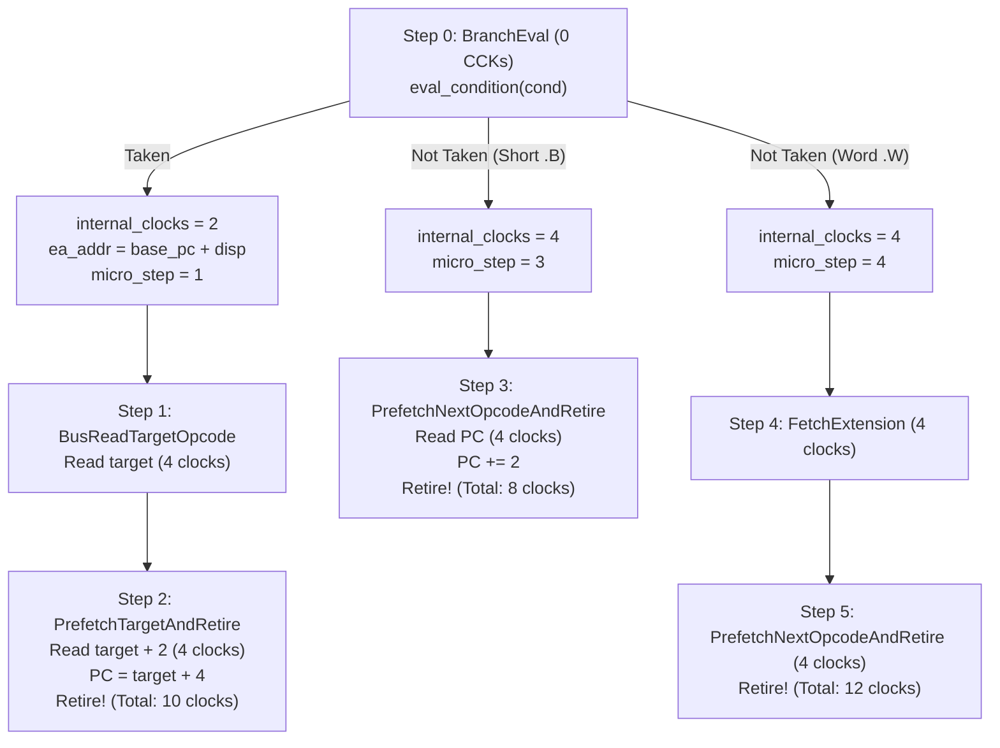
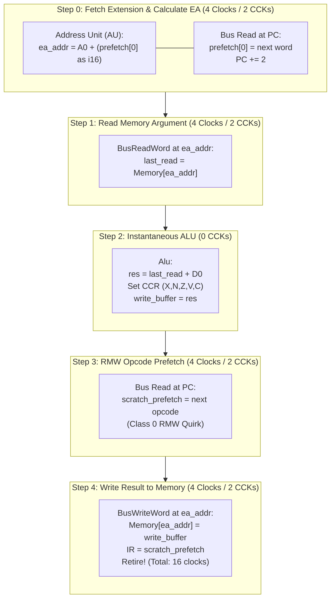
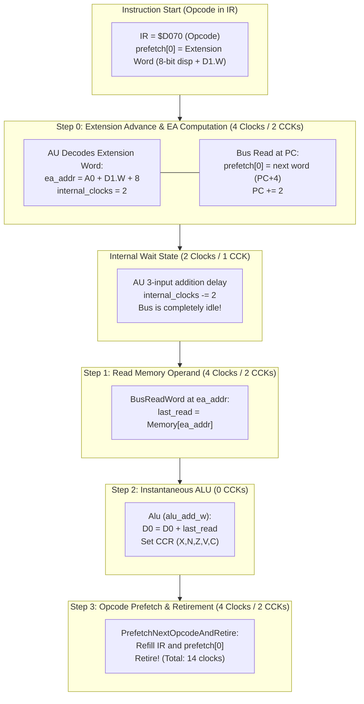
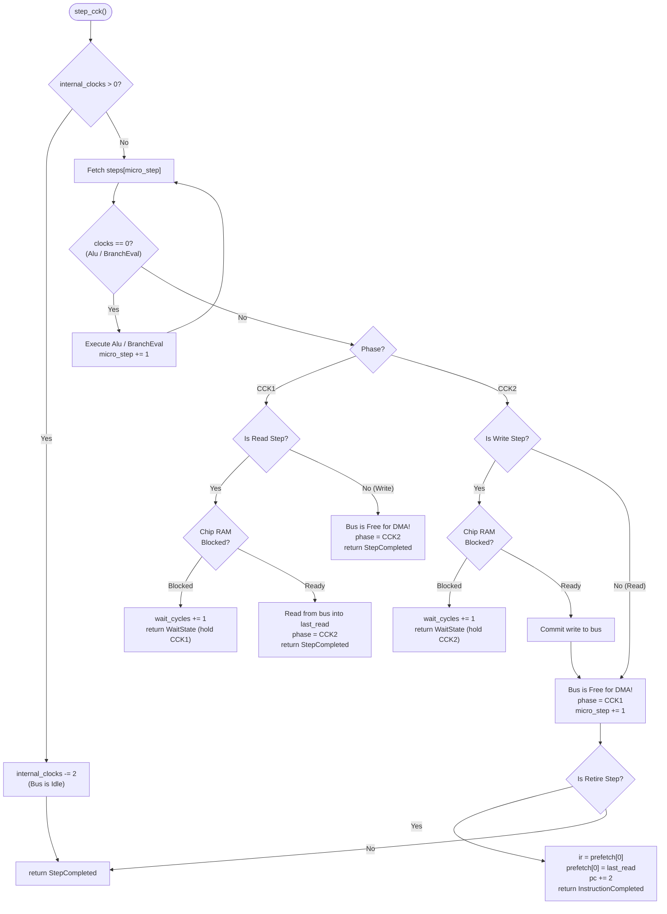

# Architecture Specification: M68000 Cycle-Exact Micro-Step State Machine

- **Parent Specification:** [[CPU Motorola M68000.md]]
- **Module Location:** `crates/m68000/`
- **Execution Model:** Cycle-exact micro-operations mapped to Color Clock phases (**CCK1** and **CCK2**).
- **Bus Interface:** Interacts with memory strictly via [[MemoryBus.md]], handling `BusResult::WaitState` and executing direct 2-phase CCK read/write transactions (`step_read_word_at`, `step_write_word_at`).
- **Engineering Guidelines:** Follow systems rules in [AGENTS.md](../../../AGENTS.md) (zero custom macros, zero const-generic handlers, wrapping arithmetic, Big-Endian decoding, zero panics).
- **Test Validation:** Verified via [[CPU SingleStepTests.md]] and skill `m68k-singlestep-test`.

---

## 1. Executive Summary & Design Philosophy

This document defines the architectural blueprint for the cycle-exact Motorola 68000 CPU emulator core based on the **Micro-Step State Machine Engine**.

The architecture mirrors the physical two-level microcode design of the Motorola 68000 silicon (the Stritter & Tredennick microcode patent):
1. **Instruction Sequencer (Macro-Level / Microrom)**: The 16-bit opcode word (`IR`) selects a static, compile-time blueprint of atomic micro-steps.
2. **Execution Unit & Bus Controller (Micro-Level / Nanorom)**: Drives the physical bus lines (`_AS`, `_UDS`, `_LDS`), Color Clock phases (**CCK1** and **CCK2**), dynamic ALU calculation delays, memory write decomposition, two-word pipeline refills, and Agnus DMA wait-state contention.

### Core Architectural Axioms
1. **The 65,536 Static Universe**:
   Because immediate values, displacements, and 32-bit addresses are fetched dynamically from memory during execution, **the micro-step sequence is a pure, immutable function of the 16-bit opcode word (`IR`)**. Exactly 65,536 static entries cover 100% of the instruction set.
2. **Zero Runtime Heap Allocation**:
   The entire micro-step table is static `const` data embedded in the host binary (`.rodata`). It requires **0 bytes of dynamic heap allocation** (`Vec`, `Box`, `malloc`) during runtime.
3. **Specialized Atomic Micro-Step Handlers (Zero-Branch Direct Dispatch)**:
   Transfer size (Byte vs. Word vs. 32-bit Long decomposition) is **specialized directly into atomic `StepFn` function pointers** (`Cpu::step_bus_read_byte`, `Cpu::step_bus_read_word`, `Cpu::step_bus_write_byte`, `Cpu::step_bus_write_word`, `Cpu::step_bus_write_long_high`, `Cpu::step_bus_write_long_low`). This eliminates nested `match size` branches and dynamic `match step.action` switches in the hot CCK execution loop, honoring host CPU mechanical sympathy.
4. **Pre-Allocated CPU-Level Prefetch Array**:
   `prefetch: [u16; 2]` and `ir: u16` are fixed fields inside `CpuState` (modeling hardware registers `IRC`, `IR`, and `IRD`). Zero dynamic queues.
5. **Parametric, Bus-Free ALU Function Pointers (`AluFn`)**:
   ALU steps do **not** take `MemoryBus`. By the time the ALU executes, all operands have already arrived in `CpuState` (`prefetch[0]`, `last_read`, or `d[]/a[]`). ALU functions take `(&mut CpuState, reg_src: u8, reg_dst: u8)`. This parameterization collapses 8–64 repetitive opcode functions into **one shared, elegant function per operation**.
6. **Zero-Cycle ALU Micro-Ops (Instantaneous Internal Ops)**:
   ALU calculations, flag updates, and Effective Address arithmetic consume **0 CCK cycles**. They execute instantly and immediately fall through to the subsequent bus step within the same host tick. If the subsequent bus step stalls due to Agnus DMA, **the ALU step is never repeated**, eliminating re-entrancy bugs and branch checks.
7. **Data Output Buffer (`write_buffer: u32`) & Exact Write Strobe Preservation**:
   Results destined for memory are held in `state.micro.write_buffer: u32` (hardware `DOB`). Memory writes strictly respect 68000 bus widths:
   - **`BusWriteByte`**: Drives $\overline{\text{UDS}}$ (even address, high byte) or $\overline{\text{LDS}}$ (odd address, low byte). The unaddressed byte in the 16-bit memory cell is **strictly preserved**.
   - **`BusWriteWord`**: Drives both $\overline{\text{UDS}}$ and $\overline{\text{LDS}}$ simultaneously on even address boundaries.
   - **`BusWriteLongHigh` & `BusWriteLongLow`**: Decomposed into two sequential 16-bit Word bus write cycles (High Word followed by Low Word).
8. **Two-Word Pipeline Refill for Control Flow (`JMP`, `JSR`, `RTS`, `Bcc`)**:
   When program execution flow changes, the prefetch stream is flushed and refilled from the target address via two sequential program-space read bus cycles (`Cpu::step_bus_read_target_opcode` and `Cpu::step_prefetch_target_and_retire`).
9. **Decoupled Internal Delay Countdown**:
   Variable-cycle operations (`DIVU`, `DIVS`, `MULU`, `MULS`, multi-bit shifts, 3-input indexed EA calculation, taken branch penalties) calculate their math instantly, compute the hardware cycle penalty, and set `cpu.state.micro.internal_clocks`. The host ticks down this counter with 3 assembly instructions, leaving the external bus completely idle for Amiga custom chips (Copper, Blitter, Denise).
10. **Automatic Self-Modifying Code (SMC) Immunity**:
    Because opcodes directly index the static 65,536 table upon prefetch, and operands are read live from memory, **the engine requires zero bus snooping, zero page dirty tracking, and zero cache invalidation**.
11. **Cached Slice Pointer Dispatch (`current_steps: &'static [MicroStep]`)**:
    Upon opcode prefetch and retirement, `state.micro.current_steps` caches the slice pointer directly from `OPCODE_DESCRIPTOR_TABLE[ir]`. All subsequent CCK ticks during the instruction index `current_steps[micro_step]` directly, completely eliminating 65,536-entry table lookups in the hot execution loop.
12. **Dynamic Transfer Loop for Block Operations (`MOVEM`)**:
    `MOVEM` register count (0 to 16) is dynamically driven by the 16-bit extension mask in `scratch[0]` via `crate::instructions::movem::execute_movem_transfer`. Each set bit performs an atomic bus cycle and advances the mask, looping with 0 heap allocation and exact cycle timing.
13. **Cycle-Exact Hardware Exception Stacking**:
    Group 0 (Address/Bus Error) and Group 1/2 (Interrupts/Traps) exception stacking are modeled as dedicated micro-sequences (`EXCEPTION_GROUP0_STEPS`, `EXCEPTION_GROUP1_STEPS`). Stack writes and vector reads interact with `MemoryBus` and experience Chip RAM DMA wait states identical to real hardware.

---
## 2. Data Structures & Type Definitions

The microcode data structures and static lookup tables are implemented in [`crates/m68000/src/micro/`](file:///d:/Programowanie/Amiga/crates/m68000/src/micro/).

### 2.1 The `AluFn` Function Pointer (Pure Internal CPU Operation)

Because all memory operands are already latched into `CpuState` (`prefetch[0]`, `last_read`, or `d[]/a[]`) before the ALU step runs, `AluFn` does **not** take `MemoryBus`. ALU handlers execute purely internally, operating directly on `CpuState` with pre-decoded register indices:
- Signature: `fn(state: &mut CpuState, reg_src: u8, reg_dst: u8)`
- Implementation: [`crates/m68000/src/micro/engine.rs`](file:///d:/Programowanie/Amiga/crates/m68000/src/micro/engine.rs) and [`crates/m68000/src/micro/alu.rs`](file:///d:/Programowanie/Amiga/crates/m68000/src/micro/alu.rs).

### 2.2 The `MicroStep` Descriptor (Stateless & Cache-Dense)

Each micro-step is an immutable, cache-dense `Copy` struct in `.rodata`:
- `step_fn`: Direct atomic execution function pointer (`StepFn = fn(&mut Cpu, &mut MemoryBus) -> Option<StepResult>`).
- `alu_fn`: Optional function pointer to pure internal ALU logic (`Option<AluFn>`).
- `base_clocks`: Base CPU clocks consumed (4 for bus cycles, 0 for instantaneous ALU / branch evaluation).

Pre-decoded register indices (`reg_src`, `reg_dst`) are held once per opcode in `OpcodeDescriptor` and cached into `state.micro.reg_src` / `reg_dst`.

### 2.3 Specialized Atomic Micro-Step Handlers (`StepFn`)

By baking operand width directly into specialized handler functions, the execution loop completely eliminates runtime size checks (`match size`) and dynamic action matching (`match step.action`):

| Category | Primitives | Hardware Operation & Bus Semantics |
| :--- | :--- | :--- |
| **Operand Reads (Data Space)** | `step_bus_read_byte`, `step_bus_read_word`, `step_bus_read_long_high`, `step_bus_read_long_low` | Reads from `ea_addr` (or `ea_addr + 2`). Stalls on CCK1 if Chip RAM blocked. Latches into `last_read` / `scratch[0]`. |
| **Operand Writes (Data Space)** | `step_bus_write_byte`, `step_bus_write_word`, `step_bus_write_long_high`, `step_bus_write_long_low` | Drives data from `write_buffer` to `ea_addr`. Stalls on CCK2 if Chip RAM blocked. Even byte writes preserve low byte; odd byte writes preserve high byte. |
| **Stack Operations (Data Space)** | `step_bus_pop_stack`, `step_bus_pop_stack_high`, `step_bus_pop_stack_low`, `step_bus_push_stack_high`, `step_bus_push_stack_low`, `step_bus_push_stack_low_and_retire` | Stack reads and pushes over `SP` ($A_7$). Postincrements / predecrements stack pointer on even word boundaries. |
| **Prefetch & Refill (Program Space)** | `step_fetch_extension`, `step_bus_prefetch_to_scratch`, `step_bus_read_target_opcode`, `step_prefetch_target_and_retire`, `step_prefetch_next_opcode_and_retire` | Reads from `pc` or branch target in Program Space ($FC_2$ / $FC_6$). Refills pipeline and manages instruction retirement. |
| **RMW & Block Transfers** | `BusWriteWordAndRetire`, `BusWriteByteAndRetire`, `BusWriteLongLowAndRetire`, `BusWriteLongHighAndRetire`, `MovemTransfer` | Read-Modify-Write retirement sequences and iterative `MOVEM` multi-register bus cycles driven by mask in `scratch[0]`. |
| **Internal & Exceptions** | `Alu`, `BranchEval`, `OriToCcr`, `OriToSr`, `AndiToCcr`, `AndiToSr`, `EoriToCcr`, `EoriToSr`, `Trap` | Instantaneous (0 CCK) internal operations, CCR/SR updates, condition evaluation, and exception vector initiation. |

Full enum definition: [`crates/m68000/src/micro/actions.rs`](file:///d:/Programowanie/Amiga/crates/m68000/src/micro/actions.rs).

### 2.4 CPU Micro-State Storage (`CpuMicroState`)

Embedded in `CpuState` to track sub-cycle progress across Color Clock phases:
- `phase`: Current Color Clock sub-phase (`CckPhase::Cck1` or `CckPhase::Cck2`).
- `last_read`: Last 16-bit word received from completed bus read cycle.
- `scratch_prefetch`: Latched prefetch word for pipeline refills and RMW sequences.
- `internal_clocks`: Non-bus execution clocks countdown (DIVU/MULU/shifts/indexed EA).
- `current_steps`: Cached slice pointer to active opcode's `&'static [MicroStep]`.
- `micro_step`: Step index within the current instruction's micro-operation sequence.
- `reg_src`, `reg_dst`: Pre-decoded register indices ($0..7$ for $D_n / A_n$).
- `write_buffer`: Hardware Data Output Buffer (DOB) holding ALU result for memory writes.
- `ea_addr`: Resolved effective memory address for operands or branch/jump targets.
- `scratch`: Intermediate scratch registers (`scratch[0]` holds `MOVEM` register transfer mask).
- `current_cycle_wait_cycles`: Wait cycles accumulated during bus stalls in the current cycle.

### 2.5 The 65,536 Static Dispatch Universe (`OPCODE_DESCRIPTOR_TABLE`)

- Embedded in host `.rodata` via [`crates/m68000/src/micro/table.rs`](file:///d:/Programowanie/Amiga/crates/m68000/src/micro/table.rs).
- Exactly 65,536 `OpcodeDescriptor` entries mapping every 16-bit opcode word directly to its pre-compiled `&'static [MicroStep]` sequence and pre-decoded register indices (`reg_src`, `reg_dst`).
- Requires **zero dynamic heap allocations** (`0` bytes allocated at runtime).

---

## 3. Parametric ALU Handlers: 8x Code Reduction

Passing `reg_src` and `reg_dst` into `AluFn` collapses code duplication across all register combinations without using forbidden macros or const-generics:
1. **Register Destinations:** The ALU reads `state.d_byte(reg_dst)` or `state.d_word(reg_dst)`, evaluates condition codes via branchless CCR setters, and writes directly back to the register.
2. **Memory Destinations:** When targeting memory (e.g. `ORI.B #$42, (A0)`), the ALU reads `state.micro.last_read`, evaluates condition codes, and latches the result into `state.micro.write_buffer` (DOB) for the subsequent write bus cycle.
3. **Effective Address Arithmetic:** Because `Alu` micro-steps consume 0 CCKs, effective address calculations (such as `(d16, An)` or `(d8, An, Xn)`) use the identical `AluFn` mechanism to compute and store addresses in `state.micro.ea_addr`.

All specialized ALU handlers reside in [`crates/m68000/src/micro/alu.rs`](file:///d:/Programowanie/Amiga/crates/m68000/src/micro/alu.rs).

---

## 4. Memory Bus Operations & Strobe Semantics

### 4.1 Direct 2-Phase Bus Architecture (Zero Dynamic Strobe Boilerplate)

On the Amiga 500, the 4-clock M68000 bus cycle maps to **two Color Clock phases (CCK1 and CCK2)**. Amiga Chip DRAM accesses complete in 1 CCK (280 ns), interleaving bus access 50/50 between the CPU and Agnus DMA:

```
            ┌──────────────────────┬──────────────────────┐
            │     CCK1 (S0–S3)     │     CCK2 (S4–S7)     │
────────────┼──────────────────────┼──────────────────────┤
 READ Cycle │ Read to latch buffer │ CPU idle / DMA slot  │
────────────┼──────────────────────┼──────────────────────┤
 WRITE Cycle│ CPU setup (idle bus) │ Write to DRAM / Wait │
────────────┴──────────────────────┴──────────────────────┘
```

- **READ Cycles (`BusReadByte`, `BusReadWord`, `BusReadLongHigh`, `BusReadLongLow`, `FetchExtension`, `PrefetchNextOpcodeAndRetire`):**
  - **CCK1 (S0–S3):** Bus read attempt via `bus.read_word(addr)` or `bus.read_byte(addr)`. If `BusResult::WaitState` $\to$ insert wait state (CPU stalls in CCK1). If `BusResult::Ready(data)` $\to$ latches data into `state.micro.last_read`, advancing `phase = CCK2`.
  - **CCK2 (S4–S7):** **Do nothing on the bus!** Physical Chip RAM is already released for custom chip DMA (Blitter, Copper). The CPU records the transaction, finishes the 4-clock cycle (or prefetch retirement), and advances to the next micro-step (`phase = CCK1`).
- **WRITE Cycles (`BusWriteByte`, `BusWriteWord`, `BusWriteLongHigh`, `BusWriteLongLow`, `BusPushStackHigh`, `BusPushStackLow`):**
  - **CCK1 (S0–S3):** **CPU does not touch the bus!** Internal address propagation only. Chip RAM remains completely free for Agnus DMA. Advances `phase = CCK2`.
  - **CCK2 (S4–S7):** Bus write attempt via `bus.write_word(addr, val)` or `bus.write_byte(addr, val)`. If `BusResult::WaitState` (Gary withholds $\overline{\text{DTACK}}$) $\to$ insert wait state (CPU stalls in CCK2). Once `BusResult::Ready(())` $\to$ write is committed to `bus`, recording the transaction and advancing to the next micro-step (`phase = CCK1`).

Byte strobes ($\overline{\text{UDS}}$ / $\overline{\text{LDS}}$) are derived natively by `bus.read_byte(addr)` / `bus.write_byte(addr, val)` from `addr & 1`. **The CPU core eliminates all manual strobe calculations, `BusCycle` allocations, and intermediate latch buffering.**

#### Execution Dispatch Implementation
The 2-phase Color Clock stepping logic is implemented via dedicated, single-purpose helper functions (`step_bus_read_byte`, `step_bus_read_word`, `step_bus_write_byte`, `step_bus_write_word`, etc.) in [`crates/m68000/src/micro/engine.rs`](file:///d:/Programowanie/Amiga/crates/m68000/src/micro/engine.rs). Each helper executes the exact CCK1/CCK2 protocol with zero branch cascading and zero heap allocation.

### 4.2 Byte Strobe Activation & Byte Preservation

During an 8-bit Byte write operation (`BusWriteByte`):
1. **Even Byte Address (`ea_addr & 1 == 0`)**:
   - $\overline{\text{UDS}}$ asserts low ($0$); $\overline{\text{LDS}}$ remains negated ($1$).
   - The data byte is driven on $D_8 \dots D_{15}$.
   - The memory array writes **only into the high byte** of the addressed 16-bit word cell.
   - **The low byte in the 16-bit word cell is strictly PRESERVED and unaltered.**
2. **Odd Byte Address (`ea_addr & 1 == 1`)**:
   - $\overline{\text{LDS}}$ asserts low ($0$); $\overline{\text{UDS}}$ remains negated ($1$).
   - The data byte is driven on $D_0 \dots D_7$.
   - The memory array writes **only into the low byte** of the addressed 16-bit word cell.
   - **The high byte in the 16-bit word cell is strictly PRESERVED and unaltered.**
3. **Hardware Pin Duplication**:
   - In physical 68000 silicon, the CPU duplicates the byte on both bus halves ($D_{15..8} = \text{byte}$ and $D_{7..0} = \text{byte}$). The RAM chips use $\overline{\text{UDS}}/\overline{\text{LDS}}$ as write-enable qualifiers.
4. **Zero Address Errors on Byte Accesses**:
   - Unlike Word or Long accesses, Byte accesses **never generate an Address Error** on odd addresses. Odd byte reads and writes are 100% legal.

### 4.3 32-Bit Long Decomposition: Why `BusWriteLongHigh` Writes a 16-Bit Word

On the Motorola 68000, **a 32-bit transfer physically does not exist on the external bus**. The data bus has only 16 pins ($D_0 \dots D_{15}$).
Therefore, a 32-bit (Long) read or write is **strictly composed of two 16-bit Word bus cycles**:
- **`BusWriteLongHigh`**: Writes a **16-bit Word** containing the upper 16 bits of `write_buffer` to `ea_addr`.
- **`BusWriteLongLow`**: Writes a **16-bit Word** containing the lower 16 bits of `write_buffer` to `ea_addr + 2`.

Each cycle is an independent 4-clock / 2-CCK bus transaction that can stall on Agnus DMA contention in Chip RAM.

### 4.4 Operation Comparison Matrix

| Action | Physical Bus Size | Target Address | Data Source / Destination | $\overline{\text{UDS}}$ / $\overline{\text{LDS}}$ | Preservation Behavior |
| :--- | :---: | :--- | :--- | :---: | :--- |
| **`BusReadByte`** | 8-bit Byte | `ea_addr` | `last_read = byte` | Parity | Read-only |
| **`BusReadWord`** | 16-bit Word | `ea_addr` | `last_read = word` | Both active | Read-only (Address error if odd) |
| **`BusReadLongHigh`** | 16-bit Word | `ea_addr` | `scratch[0] = word << 16` | Both active | Read-only (Address error if odd) |
| **`BusReadLongLow`** | 16-bit Word | `ea_addr + 2` | `last_read = scratch[0] \| word` | Both active | Read-only (Address error if odd) |
| **`BusWriteByte`** | 8-bit Byte | `ea_addr` | `(write_buffer & 0xFF) as u8` | Parity | **Unaddressed byte preserved!** |
| **`BusWriteWord`** | 16-bit Word | `ea_addr` | `(write_buffer & 0xFFFF) as u16` | Both active | Entire 16-bit cell overwritten |
| **`BusWriteLongHigh`** | 16-bit Word | `ea_addr` | `(write_buffer >> 16) as u16` | Both active | Upper 16-bit cell overwritten |
| **`BusWriteLongLow`** | 16-bit Word | `ea_addr + 2` | `(write_buffer & 0xFFFF) as u16` | Both active | Lower 16-bit cell overwritten |

### 4.5 Function Codes (FC0–FC2) & Special Status Word (SSW) Encoding

On physical M68000 silicon, the CPU outputs 3 Function Code lines to qualify address space on every bus cycle:

| FC2 | FC1 | FC0 | Address Space Type | Usage in Emulator |
| :---: | :---: | :---: | :--- | :--- |
| 0 | 0 | 1 | **User Data** (`FC_UD`) | Data space read/write when `SR.S == 0` |
| 0 | 1 | 0 | **User Program** (`FC_UP`) | Opcode/extension fetch when `SR.S == 0` |
| 1 | 0 | 1 | **Supervisor Data** (`FC_SD`) | Data space read/write and stack pushes when `SR.S == 1` |
| 1 | 1 | 0 | **Supervisor Program** (`FC_SP`) | Opcode/extension fetch when `SR.S == 1` |
| 1 | 1 | 1 | **CPU Space / IACK** | Interrupt Acknowledge cycle |

#### Special Status Word (SSW) Format during Group 0 Exceptions:
When an Address Error or Bus Error occurs, word 0 of the 7-word stack frame (`SP - 2`) stores the diagnostic Special Status Word:
```
Bit:   15..5     4      3      2     1     0
Field: Unused   R/W    I/N    FC2   FC1   FC0
```
- **Bits 0–2 (FC0–FC2)**: The Function Code of the bus cycle that faulted.
- **Bit 3 (I/N)**: `0` if fault occurred during instruction processing; `1` if during instruction prefetch.
- **Bit 4 (R/W)**: `1` if read cycle; `0` if write cycle.
- **Bits 5–15**: Reserved / floating bus lines.

---

## 5. Control Flow, Pipeline Refill & Complex Addressing

### 5.1 The Two-Word Pipeline Refill

In normal sequential execution, instructions end with `PrefetchNextOpcodeAndRetire`, shifting `ir = prefetch[0]`, `prefetch[0] = last_read`, and `pc += 2`.

When control flow changes (`JMP`, `JSR`, `RTS`, `BRA`, taken `Bcc`):
- The existing prefetch pipeline contents are **flushed**.
- The CPU must perform a **two-word pipeline refill** directly from the new target address in Program Space (`FC2` User / `FC6` Supervisor):
  1. **Refill Bus Cycle 1 (`BusReadTargetOpcode`)**:
     - Bus read from `ea_addr` (4 CPU clocks / 2 CCKs).
     - Data is latched into `state.micro.scratch_prefetch` (the new opcode).
  2. **Refill Bus Cycle 2 (`PrefetchTargetAndRetire`)**:
     - Bus read from `ea_addr + 2` (4 CPU clocks / 2 CCKs).
     - Data is latched into `state.prefetch[0]`.
     - `state.ir` is loaded with `scratch_prefetch`.
     - `state.pc` is initialized to `ea_addr + 4`.
     - Instruction retires with `StepResult::InstructionCompleted`.

### 5.2 `JMP <ea>` (Jump to Effective Address)

- **Target Address Calculation**:
  - `(An)`: 0 internal clocks.
  - `(d16, An)`, `(xxx).w`, `(d16, PC)`: 2 internal clocks.
  - `(d8, An, Xn)`, `(d8, PC, Xn)`: 6 internal clocks.
  - `(xxx).l`: 1 extension read bus cycle (`FetchExtension`, 4 clocks).
- **Execution Flow**:
  1. Calculate target into `ea_addr`.
  2. Verify `(ea_addr & 1) == 0`. If odd, trigger **Address Error (Vector 3)** immediately!
  3. Execute `BusReadTargetOpcode` at `ea_addr`.
  4. Execute `PrefetchTargetAndRetire` at `ea_addr + 2`.
- **Total Time**:
  - `JMP (An)`: Exactly 8 CPU clocks (4 CCKs).
  - `JMP (xxx).L`: Exactly 12 CPU clocks (6 CCKs).

### 5.3 `JSR <ea>` (Jump to Subroutine)

- **Execution Flow**:
  1. Calculate target into `ea_addr`. Verify `(ea_addr & 1) == 0`.
  2. Determine return address `return_pc = base_pc + extension_words`.
  3. Decrement stack pointer: `SP = SP - 4`. Verify `(SP & 1) == 0`.
  4. Latch `write_buffer = return_pc`.
  5. Push Return Address:
     - `BusPushStackHigh`: Write `(return_pc >> 16) as u16` to `SP` (4 clocks).
     - `BusPushStackLow`: Write `(return_pc & 0xFFFF) as u16` to `SP + 2` (4 clocks).
  6. Execute Two-Word Refill:
     - `BusReadTargetOpcode` at `ea_addr` (4 clocks).
     - `PrefetchTargetAndRetire` at `ea_addr + 2` (4 clocks).
- **Total Time**:
  - `JSR (An)`: Exactly 16 CPU clocks (8 CCKs: 2 stack writes + 2 prefetch reads).
  - `JSR (xxx).L`: Exactly 20 CPU clocks (10 CCKs: 1 extension read + 2 stack writes + 2 prefetch reads).

### 5.4 `RTS` (Return from Subroutine)

- **Fixed Timing**: Exactly 16 CPU clocks (8 CCKs: 2 stack pop reads + 2 prefetch reads).
- **Execution Flow**:
  1. Pop High Word: `BusPopStack` reads word from `(SP)` into upper 16 bits of `ea_addr` (4 clocks).
  2. Pop Low Word: `BusPopStack` reads word from `(SP + 2)` into lower 16 bits of `ea_addr`, and updates `SP = SP + 4` (4 clocks).
  3. Verify `(ea_addr & 1) == 0`. If odd, trigger **Address Error (Vector 3)**!
  4. Execute Two-Word Refill:
     - `BusReadTargetOpcode` at `ea_addr` (4 clocks).
     - `PrefetchTargetAndRetire` at `ea_addr + 2` (4 clocks).

### 5.5 `Bcc` (Conditional Branch State Machine: Taken vs Not-Taken)

Conditional branches (`BEQ`, `BNE`, `BGT`, `BLT`, etc.) introduce dynamic runtime branching based on the Condition Code Register (CCR):



---

### 5.6 Effective Address Calculation with Extension Word Prefetch (Memory RMW: `ADD.W Dn, (d16, An)`)

A common architectural question is: **How does the CPU handle operations where arguments are read from memory, the address requires displacement/extension words, and the result is written back to memory?**

Consider **`ADD.W D0, (d16, A0)`** (Add data register `D0` to memory operand at `(A0 + d16)`, storing result at `(A0 + d16)`).



#### Detailed Clock-by-Clock Cycle Breakdown:
1. **The Prefetch Reality at Instruction Start**:
   - The opcode `$D168` is in `IR`.
   - Because the *previous* instruction concluded with an opcode prefetch, **the displacement word `d16` is ALREADY resident in `state.prefetch[0]` with 0 latency!**
2. **Step 0: `FetchExtension` with `ea_calc_d16_an` (4 clocks / 2 CCKs)**:
   - The AU calculates: `ea_addr = A0.wrapping_add((prefetch[0] as i16) as u32)`.
   - The bus controller fetches the next word from `PC` into `last_read` (advancing `PC += 2`).
   - At CCK2, `prefetch[0] = last_read`.
3. **Step 1: `BusReadWord` (4 clocks / 2 CCKs)**:
   - Reads the 16-bit word from memory at `ea_addr` into `last_read`.
4. **Step 2: `Alu` (`alu_add_rmw_w`) (0 CCKs Instantaneous)**:
   - Computes `res = last_read.wrapping_add(D0)`.
   - Evaluates and updates CCR condition code flags ($X, N, Z, V, C$).
   - Latches `state.micro.write_buffer = res as u32`.
5. **Step 3: `BusPrefetchToScratch` (4 clocks / 2 CCKs)**:
   - **Hardware Silicon Quirk (Class 0 RMW)**: The MC68000 executes the next instruction opcode prefetch *before* writing the modified operand back to memory!
   - Fetches the next opcode from `PC` into `state.micro.scratch_prefetch`, advancing `PC += 2`.
6. **Step 4: `BusWriteWordAndRetire` (4 clocks / 2 CCKs)**:
   - Drives 16-bit word `(write_buffer & 0xFFFF)` to `ea_addr`.
   - Overwrites the destination cell in memory.
   - At CCK2, shifts `IR = scratch_prefetch`, and completes instruction retirement!

**Total Execution Time**: Exactly **16 CPU clocks (8 CCKs)** (matching Motorola 68000 hardware: 12 clocks base + 4 clocks for `d16` addressing mode).

---

### 5.7 Indexed Addressing with Internal Calculation Clocks (`ADD.W (8, A0, D1.W), D0`)

When an instruction uses **Address Register Indirect with Index and 8-Bit Displacement** (`(d8, An, Xn)`):
1. The extension word specifies the 8-bit signed displacement and index register (`D1.W`).
2. The address calculation requires a 3-input addition: `ea_addr = An + Xn + disp8`.
3. In physical MC68000 silicon, this 3-input addition consumes **2 internal CPU clock cycles** ($N_{internal} = 2$ clocks / 1 CCK) with zero external bus activity.

#### Example Execution Trace: `ADD.W (8, A0, D1.W), D0` (Opcode `$D070`)
- **Total Duration**: Exactly **14 CPU clocks (7 CCKs)** (8 clocks base + 6 clocks for index mode: 4 bus clocks + 2 internal clocks).



| Step | Action | Clocks | Description / Bus Transaction |
| :---: | :--- | :---: | :--- |
| **0** | `FetchExtension`<br/>*(with `ea_calc_d8_an_xn`)* | 4 (2 CCKs) | 1. AU decodes `prefetch[0]`: extracts `disp8 = +8`, `Xn = D1.W`, and sets `ea_addr = A0 + D1.W + 8`.<br/>2. Sets `state.micro.internal_clocks = 2` for hardware 3-input addition delay.<br/>3. Bus reads next word from `PC`, updating `prefetch[0]`, `PC += 2`. |
| **—** | *Internal Delay* | **2 (1 CCK)** | Bus remains completely idle while `internal_clocks` ticks down from 2 to 0. |
| **1** | `BusReadWord` | 4 (2 CCKs) | Initiates 16-bit word read from `ea_addr`. Latching memory operand into `last_read`. |
| **2** | `Alu`<br/>*(`alu_add_w`)* | **0 (Instant)** | Computes `D0 = D0.wrapping_add(last_read)`. Updates CCR flags ($X, N, Z, V, C$). |
| **3** | `PrefetchNextOpcodeAndRetire` | 4 (2 CCKs) | Reads next opcode from `PC`, refills `IR = prefetch[0]`, `prefetch[0] = last_read`, and retires! |

**Total Duration**: $4\ (\text{FetchExtension}) + 2\ (\text{Internal Delay}) + 4\ (\text{BusReadWord}) + 0\ (\text{ALU}) + 4\ (\text{Prefetch}) = \mathbf{14\ \text{CPU clocks}}\ (7\ \text{CCKs})$!

---

### 5.8 `MOVEM` Dynamic Register Transfer Engine

In `MOVEM <ea>, reglist` and `MOVEM reglist, <ea>`, the opcode specifies the transfer direction, size (Word vs. Long), and effective addressing mode. However, the **number of registers transferred (0 to 16)** is dynamic, specified by the 16-bit **extension mask word**:

```
Bit:   15  14  13  12  11  10   9   8   7   6   5   4   3   2   1   0
Reg:   A7  A6  A5  A4  A3  A2  A1  A0  D7  D6  D5  D4  D3  D2  D1  D0   (Standard / Postincrement)
Reg:   D0  D1  D2  D3  D4  D5  D6  D7  A0  A1  A2  A3  A4  A5  A6  A7   (Predecrement -(An) mode)
```

#### The `MovemTransfer` Loop Mechanics:
Because a static array cannot predict the number of registers at compile time, `MOVEM` is modeled via the atomic **`execute_movem_transfer`** sub-loop:
1. **Step 0 (`FetchExtension`)**: Reads the 16-bit register mask from `PC` into `state.micro.scratch[0]`, advancing `PC += 2`.
2. **Step 1 (`Alu`)**: Resolves `ea_addr = An` (or calculates displacement/index).
3. **Step 2 (`MovemTransfer`)**:
   - Inspects `state.micro.scratch[0]`. If `scratch[0] == 0`, immediately falls through and advances `micro_step += 1`.
   - Finds the next active register bit $k$:
     - **For Memory-to-Register / Standard**: Finds lowest set bit ($k = \text{trailing\_zeros}(scratch[0])$).
     - **For Predecrement `-(An)`**: Finds highest set bit ($k = 15 - \text{leading\_zeros}(scratch[0])$).
   - In CCK1/CCK2, performs the atomic bus transfer (Read or Write, Word or 2-cycle Long) between register $R_k$ and memory at `ea_addr`.
   - Adjusts `ea_addr`: increments `ea_addr += size` (or decrements `ea_addr -= size` for `-(An)`).
   - Clears bit $k$ in `state.micro.scratch[0]`.
   - **Loop Condition**: If `state.micro.scratch[0] != 0`, `micro_step` **does NOT advance**, repeating `MovemTransfer` on the subsequent bus cycle!
4. **Step 3 (`PrefetchNextOpcodeAndRetire`)**: Standard sequential opcode prefetch, completing retirement.

#### Exact Hardware Timing:
- **Base Overhead**: 12 CPU clocks (6 CCKs: 1 opcode fetch + 1 mask fetch + 1 opcode prefetch) for `(An)`.
- **Per-Register Transfer**:
  - **Word (`.W`)**: Exactly **4 CPU clocks (2 CCKs)** per transferred register.
  - **Long (`.L`)**: Exactly **8 CPU clocks (4 CCKs: 2 bus cycles)** per transferred register.
- **Example (`MOVEM.W (A0)+, D0-D2/A0-A1` — 5 registers)**:
  $12 + 5 \times 4 = \mathbf{32\ \text{CPU clocks}}\ (16\ \text{CCKs})$, matching Motorola 68000 silicon to the exact clock!

---

### 5.9 Cycle-Exact Hardware Exception Processing & Stacking

When a hardware or software exception occurs (Address Error, Bus Error, Interrupt, Illegal Instruction, `TRAP`, Zero Divide), instruction execution halts, and the CPU enters **Exception Processing**.

On the Amiga 500, exception stack pushes and vector table reads occur over the external bus and **experience Agnus Chip RAM DMA wait states identical to standard instruction cycles**.

#### Group 0 Exceptions: Address Error (Vector 3) & Bus Error (Vector 2)
Group 0 exceptions push a **7-word (14-byte) diagnostic stack frame** to allow the OS (or Guru Meditation handler) to diagnose the bus fault:

```
SP - 2  -->  [ Special Status Word (SSW): R/W bit, I/N bit, Function Code FC0..FC2 ]
SP - 4  -->  [ Access Address High 16-bits ]
SP - 6  -->  [ Access Address Low 16-bits ]
SP - 8  -->  [ Instruction Register (IR) at time of fault ]
SP - 10 -->  [ Status Register (SR) prior to exception ]
SP - 12 -->  [ Program Counter (PC) High 16-bits ]
SP - 14 -->  [ Program Counter (PC) Low 16-bits ]
```

##### Group 0 Execution Flow:
1. Transition CPU to Supervisor Mode: `SR.S = 1`, `SR.T = 0`.
2. Push 7 Words onto Supervisor Stack (`SSP` / `A7'`):
   - 7 sequential word write bus cycles (`BusPushStackHigh` / `BusPushStackLow`).
3. Fetch Exception Vector:
   - 2 sequential word read bus cycles at address `$000000 + VectorNum * 4` (e.g. `$00000C` for Address Error).
4. Pipeline Refill:
   - Two-word pipeline refill (`BusReadTargetOpcode` + `PrefetchTargetAndRetire`) from the handler address loaded from the vector.
5. **Total Execution Duration**: Exactly **50 CPU clocks (25 CCKs)** base time + wait states.

#### Group 1 & Group 2 Exceptions: Interrupts (IPL 1–7), TRAPs, Illegal Instructions
Push a standard **3-word (6-byte) stack frame**:
```
SP - 2  -->  [ Status Register (SR) prior to exception ]
SP - 4  -->  [ Program Counter (PC) High 16-bits ]
SP - 6  -->  [ Program Counter (PC) Low 16-bits ]
```
- **Total Duration**:
  - `TRAP #n`: Exactly **34 CPU clocks (17 CCKs)** (3 stack writes + 2 vector reads + 2 refill reads + 4 internal clocks).
  - Interrupt (Autovector): Exactly **44 CPU clocks (22 CCKs)** (includes 4-clock Interrupt Acknowledge `IACK` bus cycle with `FC = %111`).

---

### 5.10 Stack Pointer Predecrement Alignment Quirk (`-(SP)`)

In Motorola 68000 silicon, the Stack Pointer (`A7`, both `USP` and `SSP`) must **always remain on an even 16-bit word boundary**.
- When addressing mode `-(An)` is evaluated with `An = A7` for an **8-bit Byte** operation (e.g. `MOVE.B D0, -(SP)`):
  - In `ea_calc_predec_an`: the decrement amount is forced to **2 bytes** instead of 1 (advancing $A_7 \leftarrow A_7 - 2$).
  - The byte is written to the high byte (even address) with $\overline{\text{UDS}}$ asserted.
  - This ensures that stack frames and popped values never become misaligned.

---

## 6. The Execution Engine & Stepping Model (`step_cck`)

Execution is driven by the Amiga Color Clock (CCK, ~3.54 MHz). $1\ \text{M68000 bus cycle} = 4\ \text{CPU clocks} = 2\ \text{CCK phases}\ (\text{CCK1} + \text{CCK2})$.



### 6.1 Concrete Implementation: The High-Throughput `step_cck()` Dispatcher

The full CCK stepping engine is implemented in [`crates/m68000/src/micro/engine.rs`](file:///d:/Programowanie/Amiga/crates/m68000/src/micro/engine.rs) and driven via [`crates/m68000/src/core.rs`](file:///d:/Programowanie/Amiga/crates/m68000/src/core.rs):

1. **Internal Execution Delay Countdown:**
   - If `internal_clocks > 0`, decrements by 2 clocks (1 CCK), advances `total_cycles`, and returns `StepResult::StepCompleted` while keeping the external bus completely idle for custom chip DMA (Blitter, Copper, Denise).
2. **Instantaneous Fall-Through Micro-Steps:**
   - A fast internal loop executes zero-cycle micro-operations (`Alu`, `BranchEval`) within the same host tick until encountering a bus cycle (`base_clocks > 0`).
   - If a subsequent bus cycle stalls due to Chip RAM contention, the ALU calculation is **never repeated**.
3. **Two-Phase External Bus Execution (`phase`):**
   - **CCK1 (Phase 1):** Read actions issue `bus.read_word(addr)` / `bus.read_byte(addr)`. If `BusResult::WaitState`, the CPU accumulates a wait cycle and returns `StepResult::WaitState` without advancing phase. If `BusResult::Ready(data)`, samples memory data into `last_read` / `prefetch` and advances `phase = CckPhase::Cck2`. For write actions, the CPU does not touch the bus (bus idle for DMA) and simply advances to CCK2.
   - **CCK2 (Phase 2):** Write actions issue `bus.write_word(addr, val)` / `bus.write_byte(addr, val)`. If `BusResult::WaitState`, stalls on `StepResult::WaitState`. If `BusResult::Ready(())`, commits data, resets `phase = CckPhase::Cck1`, completing the 4-clock bus cycle.
4. **Pipeline Advance & Instruction Retirement:**
   - On retirement actions (`PrefetchNextOpcodeAndRetire`, `PrefetchTargetAndRetire`, etc.), shifts `ir = prefetch[0]`, `prefetch[0] = last_read`, advances `pc += 2`, updates `current_steps`, and returns `StepResult::InstructionCompleted`.

---

## 7. Concrete Micro-Step Traces by Architectural Class

The table below catalogs representative micro-step sequences for each fundamental instruction class, highlighting how **prefetch** and **result writing** are coordinated.

---

### Class 1: Register-to-Register Operations (Pure Internal ALU, Zero Memory Writes)

#### Archetype: `ADD.W D1, D0` (Opcode `$D041`)
- **Total Duration**: 4 CPU clocks (2 CCKs).
- **Result Writing**: Register destination (`D0`). Zero external write cycles.
- **Prefetch**: Single sequential prefetch of the next instruction opcode.

| Step | Action | Clocks | Description / Bus Transaction |
| :---: | :--- | :---: | :--- |
| **0** | `Alu` | **0 (Instant)** | Calls `alu_add_w(&mut state, 1, 0)`. Computes `D0 = D0 + D1`, sets CCR flags ($X, N, Z, V, C$). |
| **1** | `PrefetchNextOpcodeAndRetire` | 4 (2 CCKs) | Schedules bus read at `PC`. Updates `prefetch[0] = last_read`. Latching new `IR`, `PC += 2`, retires! |

---

### Class 2: Immediate to Register Operations (Extension Prefetch + ALU, Zero Memory Writes)

#### Archetype: `ORI.B #$42, D0` (Opcode `$0000`)
- **Total Duration**: 8 CPU clocks (4 CCKs).
- **Result Writing**: Register destination (`D0`). Zero external write cycles.
- **Prefetch**: First bus cycle fetches immediate extension word; second bus cycle prefetches next instruction opcode.

| Step | Action | Clocks | Description / Bus Transaction |
| :---: | :--- | :---: | :--- |
| **0** | `FetchExtension` | 4 (2 CCKs) | Bus read at `PC`, advances `PC += 2`. Latching immediate word `#$0042` into `last_read`. |
| **1** | `Alu` | **0 (Instant)** | Calls `alu_ori_b(&mut state, 0, 0)`. Computes `D0 = D0 \| imm`, updates CCR flags. |
| **2** | `PrefetchNextOpcodeAndRetire` | 4 (2 CCKs) | Bus read at `PC`. Latching next opcode into `IR`, `prefetch[0] = last_read`, `PC += 2`, retires! |

---

### Class 3: Memory Source to Register Load (Memory Read, Zero Memory Writes)

#### Archetype: `ADD.W (A0), D0` (Opcode `$D050`)
- **Total Duration**: 8 CPU clocks (4 CCKs).
- **Result Writing**: Register destination (`D0`). Zero external write cycles.
- **Prefetch**: Read operand from memory, then prefetch next opcode.

| Step | Action | Clocks | Description / Bus Transaction |
| :---: | :--- | :---: | :--- |
| **0** | `BusReadWord` | 4 (2 CCKs) | Bus read from `ea_addr = A0` into `last_read`. Stalls if Chip RAM blocked. |
| **1** | `Alu` | **0 (Instant)** | Calls `alu_add_w_mem(&mut state, 0, 0)`. Computes `D0 = D0 + last_read`, sets CCR flags. |
| **2** | `PrefetchNextOpcodeAndRetire` | 4 (2 CCKs) | Bus read at `PC`. Refills pipeline with next instruction opcode and retires! |

---

### Class 4: Register to Memory Store (Word and 32-Bit Long Write)

#### Archetype 4A: `MOVE.W D0, (A0)` (Opcode `$3080` — 16-Bit Word Store)
- **Total Duration**: 8 CPU clocks (4 CCKs).
- **Result Writing**: Single 16-bit Word write cycle (`BusWriteWord`) at `(A0)`.
- **Prefetch**: Opcode prefetch follows write.

| Step | Action | Clocks | Description / Bus Transaction |
| :---: | :--- | :---: | :--- |
| **0** | `Alu` | **0 (Instant)** | Latches `write_buffer = D0 as u32`, `ea_addr = A0`. Sets CCR flags ($N, Z, V=0, C=0$). |
| **1** | `BusWriteWord` | 4 (2 CCKs) | Drives 16-bit word `(write_buffer & 0xFFFF)` to `ea_addr`. Both $\overline{\text{UDS}}$ and $\overline{\text{LDS}}$ assert. |
| **2** | `PrefetchNextOpcodeAndRetire` | 4 (2 CCKs) | Bus read at `PC`. Prefetches next opcode and retires! |

#### Archetype 4B: `MOVE.L D0, (A0)` (Opcode `$2080` — 32-Bit Long Store Decomposition)
- **Total Duration**: 12 CPU clocks (6 CCKs).
- **Result Writing**: Two sequential 16-bit Word write cycles (`BusWriteLongHigh` followed by `BusWriteLongLow`).
- **Prefetch**: Opcode prefetch follows the second write cycle.

| Step | Action | Clocks | Description / Bus Transaction |
| :---: | :--- | :---: | :--- |
| **0** | `Alu` | **0 (Instant)** | Latches `write_buffer = D0` (32 bits), `ea_addr = A0`. Sets CCR flags. |
| **1** | `BusWriteLongHigh` | 4 (2 CCKs) | Drives High Word `((write_buffer >> 16) & 0xFFFF)` to `ea_addr`. Stalls if Chip RAM blocked. |
| **2** | `BusWriteLongLow` | 4 (2 CCKs) | Drives Low Word `(write_buffer & 0xFFFF)` to `ea_addr + 2`. Stalls if Chip RAM blocked. |
| **3** | `PrefetchNextOpcodeAndRetire` | 4 (2 CCKs) | Bus read at `PC`. Prefetches next opcode and retires! |

---

### Class 5: Memory Read-Modify-Write with Extension Prefetch (`ADD.W Dn, (d16, An)`)

#### Archetype 5A: `ADD.W D0, (d16, A0)` (Opcode `$D168` — Memory RMW with Displacement)
- **Total Duration**: 16 CPU clocks (8 CCKs).
- **Prefetch**: Displacement `d16` in `prefetch[0]`; fetches next extension, then reads memory, then opcode prefetch before write!
- **Result Writing**: Commits modified word to `ea_addr` in the final step.

| Step | Action | Clocks | Description / Bus Transaction |
| :---: | :--- | :---: | :--- |
| **0** | `FetchExtension` | 4 (2 CCKs) | AU computes `ea_addr = A0 + disp16`. Bus reads next word at `PC`, advancing `PC += 2`. |
| **1** | `BusReadWord` | 4 (2 CCKs) | Reads memory operand from `ea_addr` into `last_read`. |
| **2** | `Alu` | **0 (Instant)** | Calls `alu_add_rmw_w`. Computes `res = last_read + D0`, updates CCR, sets `write_buffer = res as u32`. |
| **3** | `BusPrefetchToScratch` | 4 (2 CCKs) | **RMW Quirk:** Prefetches next opcode from `PC` into `scratch_prefetch`. |
| **4** | `BusWriteWordAndRetire` | 4 (2 CCKs) | Writes `write_buffer` to `ea_addr`. Shifts `scratch_prefetch` into `IR` and completes retirement! |

#### Archetype 5B: `ADDI.W #$1234, (d16, A0)` (Opcode `$0668` — Immediate + Displacement Memory RMW)
- **Total Duration**: 20 CPU clocks (10 CCKs).
- **Prefetch**: 2 extension words (immediate `#$1234` + displacement `d16`), then memory read, then opcode prefetch before write.

| Step | Action | Clocks | Description / Bus Transaction |
| :---: | :--- | :---: | :--- |
| **0** | `FetchExtension` | 4 (2 CCKs) | Latches immediate: `scratch[0] = prefetch[0]`. Reads `d16` from `PC` into `prefetch[0]`, `PC += 2`. |
| **1** | `FetchExtension` | 4 (2 CCKs) | AU computes `ea_addr = A0 + d16`. Reads next word from `PC` into `prefetch[0]`, `PC += 2`. |
| **2** | `BusReadWord` | 4 (2 CCKs) | Reads memory operand from `ea_addr` into `last_read`. |
| **3** | `Alu` | **0 (Instant)** | Computes `res = last_read + (scratch[0] as u16)`, updates CCR, sets `write_buffer = res as u32`. |
| **4** | `BusPrefetchToScratch` | 4 (2 CCKs) | **RMW Quirk:** Prefetches next opcode from `PC` into `scratch_prefetch`. |
| **5** | `BusWriteWordAndRetire` | 4 (2 CCKs) | Writes `write_buffer` to `ea_addr`. Shifts `scratch_prefetch` into `IR` and retires! |

---

### Class 6: Subroutine Call / Stack Push (`JSR <ea>`)

#### Archetype: `JSR (A0)` (Opcode `$4E90`)
- **Total Duration**: 16 CPU clocks (8 CCKs).
- **Result Writing**: Pushes 32-bit return address onto stack (two 16-bit word writes to `-(SP)`).
- **Prefetch**: Two-word pipeline refill directly from target address `(A0)`.

| Step | Action | Clocks | Description / Bus Transaction |
| :---: | :--- | :---: | :--- |
| **0** | `Alu` | **0 (Instant)** | Resolves `ea_addr = A0`. Decrements `SP = SP - 4`. Latches `write_buffer = return_pc`. |
| **1** | `BusPushStackHigh` | 4 (2 CCKs) | Writes MSW `(write_buffer >> 16)` to `SP` (Data Space). |
| **2** | `BusPushStackLow` | 4 (2 CCKs) | Writes LSW `(write_buffer & 0xFFFF)` to `SP + 2` (Data Space). |
| **3** | `BusReadTargetOpcode` | 4 (2 CCKs) | **Refill 1:** Reads new opcode from Program Space at `ea_addr` into `scratch_prefetch`. |
| **4** | `PrefetchTargetAndRetire` | 4 (2 CCKs) | **Refill 2:** Reads prefetch word at `ea_addr + 2`. Loads `IR = scratch_prefetch`, sets `PC = ea_addr + 4`, retires! |

---

### Class 7: Subroutine Return / Stack Pop (`RTS`)

#### Archetype: `RTS` (Opcode `$4E75`)
- **Total Duration**: 16 CPU clocks (8 CCKs).
- **Result Writing**: None (Memory reads from stack). Updates `SP = SP + 4`.
- **Prefetch**: Two-word pipeline refill directly from popped return address.

| Step | Action | Clocks | Description / Bus Transaction |
| :---: | :--- | :---: | :--- |
| **0** | `BusPopStack` | 4 (2 CCKs) | Reads MSW from `(SP)` into upper 16 bits of `ea_addr`. |
| **1** | `BusPopStack` | 4 (2 CCKs) | Reads LSW from `(SP + 2)` into lower 16 bits of `ea_addr`, sets `SP = SP + 4`. Checks alignment. |
| **2** | `BusReadTargetOpcode` | 4 (2 CCKs) | **Refill 1:** Reads new opcode from Program Space at `ea_addr` into `scratch_prefetch`. |
| **3** | `PrefetchTargetAndRetire` | 4 (2 CCKs) | **Refill 2:** Reads prefetch word at `ea_addr + 2`. Loads `IR = scratch_prefetch`, sets `PC = ea_addr + 4`, retires! |

---

### Class 8: Unconditional Jump (`JMP <ea>`)

#### Archetype: `JMP (A0)` (Opcode `$4ED0`)
- **Total Duration**: 8 CPU clocks (4 CCKs).
- **Result Writing**: None.
- **Prefetch**: Flushes pipeline and performs two-word pipeline refill from `(A0)`.

| Step | Action | Clocks | Description / Bus Transaction |
| :---: | :--- | :---: | :--- |
| **0** | `Alu` | **0 (Instant)** | Resolves `ea_addr = A0`. Checks `(ea_addr & 1) == 0`. (If odd, triggers Address Error). |
| **1** | `BusReadTargetOpcode` | 4 (2 CCKs) | **Refill 1:** Reads new opcode from Program Space at `ea_addr` into `scratch_prefetch`. |
| **2** | `PrefetchTargetAndRetire` | 4 (2 CCKs) | **Refill 2:** Reads prefetch word at `ea_addr + 2`. Loads `IR = scratch_prefetch`, sets `PC = ea_addr + 4`, retires! |

---

### Class 9: Conditional Branching (`Bcc`) (Dynamic Path Selection)

#### Archetype 9A: `BNE.B <disp8>` (Opcode `$66xx` — Short Branch)
- **Total Duration**: 10 CPU clocks (5 CCKs) if Taken; 8 CPU clocks (4 CCKs) if Not Taken.
- **Result Writing**: None.
- **Prefetch**: Two-word refill if taken; sequential prefetch if not taken.

| Step | Action | Clocks | Description / Bus Transaction |
| :---: | :--- | :---: | :--- |
| **0** | `BranchEval` | **0 (Instant)** | Evaluates `Z == 0`.<br/>- **Taken**: sets `internal_clocks = 2`, `ea_addr = base_pc + disp8`. Advances to **Step 1**.<br/>- **Not Taken**: sets `internal_clocks = 4`. Skips to **Step 3**. |
| **1 (Taken)** | `BusReadTargetOpcode` | 4 (2 CCKs) | **Refill 1:** Reads target opcode from `ea_addr` into `scratch_prefetch`. |
| **2 (Taken)** | `PrefetchTargetAndRetire` | 4 (2 CCKs) | **Refill 2:** Reads `ea_addr + 2`. Sets `IR = scratch_prefetch`, `prefetch[0] = last_read`, `PC = ea_addr + 4`, and retires! *(Total: 10 clocks)* |
| **3 (Not Taken)** | `PrefetchNextOpcodeAndRetire` | 4 (2 CCKs) | Performs standard sequential prefetch from `PC`, advancing to next instruction. Retires! *(Total: 8 clocks)* |

#### Archetype 9B: `BEQ.W <disp16>` (Opcode `$6700` — Word Branch)
- **Total Duration**: 10 CPU clocks (5 CCKs) if Taken; 12 CPU clocks (6 CCKs) if Not Taken.

| Step | Action | Clocks | Description / Bus Transaction |
| :---: | :--- | :---: | :--- |
| **0** | `BranchEval` | **0 (Instant)** | Evaluates `Z == 1`.<br/>- **Taken**: sets `internal_clocks = 2`, `ea_addr = base_pc + disp16`. Advances to **Step 1**.<br/>- **Not Taken**: sets `internal_clocks = 4`. Skips to **Step 4**. |
| **1 (Taken)** | `BusReadTargetOpcode` | 4 (2 CCKs) | **Refill 1:** Reads target opcode from `ea_addr`. |
| **2 (Taken)** | `PrefetchTargetAndRetire` | 4 (2 CCKs) | **Refill 2:** Reads `ea_addr + 2`. Loads new `IR`, sets `PC = ea_addr + 4`, retires! *(Total: 10 clocks)* |
| **4 (Not Taken)** | `FetchExtension` | 4 (2 CCKs) | Bus read to skip over displacement extension word in memory stream. |
| **5 (Not Taken)** | `PrefetchNextOpcodeAndRetire` | 4 (2 CCKs) | Performs standard sequential prefetch from `PC`. Retires! *(Total: 12 clocks)* |

---

### Class 10: Variable-Cycle Arithmetic (`DIVU.W <ea>, Dn`)

#### Archetype: `DIVU.W (A0), D0` (Opcode `$80D0`)
- **Total Duration**: Variable: 108 to 140 CPU clocks.
- **Result Writing**: Register destination (`D0`). Sets quotient and remainder. Zero memory writes.
- **Prefetch**: Reads divisor word, waits internal division delay (`internal_clocks`), then completes sequential opcode prefetch.

| Step | Action | Clocks | Description / Bus Transaction |
| :---: | :--- | :---: | :--- |
| **0** | `BusReadWord` | 4 (2 CCKs) | Reads 16-bit divisor from memory at `(A0)`. Latches into `last_read`. |
| **1** | `Alu` | **0 (Instant)** | Calls `alu_divu_w(&mut state, 0, 0)`. Divides `D0` by `last_read`. Sets CCR flags. Sets quotient & remainder in `D0`. Sets `state.micro.internal_clocks = 76 + quot_ones * 2`. Advances to Step 2. |
| **2** | `PrefetchNextOpcodeAndRetire` | 4 (2 CCKs) | Sits in idle bus countdown for `internal_clocks` (freeing Chip RAM for Blitter/Copper). Once `internal_clocks == 0`, completes opcode prefetch from `PC` and retires! |

---

### Class 11: Multi-Register Block Transfer (`MOVEM <ea>, reglist`)

#### Archetype: `MOVEM.W (A0)+, D0-D2/A0-A1` (Opcode `$4CD8 $0307` — 5 Registers)
- **Total Duration**: Exactly 32 CPU clocks (16 CCKs).
- **Result Writing**: Loads registers $D_0, D_1, D_2, A_0, A_1$ from memory. Postincrements $A_0$ by $5 \times 2 = 10$ bytes. Zero memory writes.
- **Prefetch**: Extension word provides 16-bit register mask `$0307` (`%0000_0011_0000_0111`).

| Step | Action | Clocks | Description / Bus Transaction |
| :---: | :--- | :---: | :--- |
| **0** | `FetchExtension` | 4 (2 CCKs) | Reads 16-bit mask `$0307` from `PC` into `state.micro.scratch[0]`, advancing `PC += 2`. |
| **1** | `Alu` | **0 (Instant)** | Resolves `ea_addr = A0`. Latches starting address. |
| **2** | `MovemTransfer`<br/>*(x5 iterations)* | **20 (10 CCKs)** | Loops across all set mask bits ($D_0, D_1, D_2, A_0, A_1$). Each register read takes 4 clocks (2 CCKs) from `ea_addr`, increments `ea_addr += 2`, and clears the bit. Stalls on Chip RAM DMA. |
| **3** | `PrefetchNextOpcodeAndRetire` | 4 (2 CCKs) | Commits final address write-back $A_0 = ea\_addr$. Reads next opcode from `PC`, refills pipeline, and retires! |

---

### Class 12: Group 0 Diagnostic Hardware Exception (Address Error Vector 3)

#### Archetype: Misaligned Word Read (`MOVE.W ($1001), D0` at `$002000`)
- **Total Duration**: Exactly 50 CPU clocks (25 CCKs).
- **Diagnostic Stacking**: Pushes 7-word diagnostic frame onto Supervisor Stack (`SSP`).
- **Prefetch**: Vector fetch + two-word pipeline refill from exception handler.

| Step | Action | Clocks | Description / Bus Transaction |
| :---: | :--- | :---: | :--- |
| **0** | `Alu` | **0 (Instant)** | Misalignment detected (`addr & 1 != 0`). Switches to Supervisor mode (`SR.S = 1, SR.T = 0`). Latches `write_buffer = SSP - 14`. Diverts `current_steps` to `EXCEPTION_GROUP0_STEPS`. |
| **1** | `BusPushStackHigh` | 4 (2 CCKs) | Pushes SSW (`FC = %001, R/W = 1, I/N = 0`) to `SSP - 2`. |
| **2** | `BusPushStackHigh` | 4 (2 CCKs) | Pushes Access Address High (`$0000`) to `SSP - 4`. |
| **3** | `BusPushStackLow` | 4 (2 CCKs) | Pushes Access Address Low (`$1001`) to `SSP - 6`. |
| **4** | `BusPushStackHigh` | 4 (2 CCKs) | Pushes Instruction Register `IR` (`$3039`) to `SSP - 8`. |
| **5** | `BusPushStackHigh` | 4 (2 CCKs) | Pushes Pre-exception Status Register `SR` to `SSP - 10`. |
| **6** | `BusPushStackHigh` | 4 (2 CCKs) | Pushes Fault `PC` High (`$0000`) to `SSP - 12`. |
| **7** | `BusPushStackLow` | 4 (2 CCKs) | Pushes Fault `PC` Low (`$2002`) to `SSP - 14`, commits `SSP = SSP - 14`. |
| **8** | `BusReadWord` | 4 (2 CCKs) | Reads Vector 3 High Word from address `$00000C` into `ea_addr[31..16]`. |
| **9** | `BusReadWord` | 4 (2 CCKs) | Reads Vector 3 Low Word from address `$00000E` into `ea_addr[15..0]`. |
| **10** | `BusReadTargetOpcode` | 4 (2 CCKs) | **Refill 1:** Reads first opcode of exception handler at `ea_addr` into `scratch_prefetch`. |
| **11** | `PrefetchTargetAndRetire` | 4 (2 CCKs) | **Refill 2:** Reads next word at `ea_addr + 2`. Loads `IR = scratch_prefetch`, `PC = ea_addr + 4`, and retires! |

---

## 8. Architectural Quality Attributes & Systems Compliance

| Requirement | Specification Implementation |
| :--- | :--- |
| **Host Mechanical Sympathy** | Static dispatch array; flat contiguous micro-steps; zero dynamic branching in inner loops; host L1d cache residency. |
| **Cached Slice Pointer Dispatch** | Active step slice pointer `state.micro.current_steps` cached upon opcode prefetch; eliminates 64K table lookups during instruction execution. |
| **Zero Runtime Allocations** | Complete microcode ROM is `const` in `.rodata`; zero heap allocation during emulation loops. |
| **Zero Cascaded Size Branches** | Transfer size specialized directly into `StepFn` handlers (`step_bus_read_byte`, `step_bus_read_word`, `step_bus_write_byte`, `step_bus_write_word`, `step_bus_write_long_high`, `step_bus_write_long_low`). |
| **Dynamic Multi-Register Transfer** | `MOVEM` dynamic register counts (0 to 16) executed cleanly via `execute_movem_transfer` sub-loop with zero heap allocation. |
| **Byte Write Strobe Fidelity** | Strict $\overline{\text{UDS}}$ / $\overline{\text{LDS}}$ parity driving: even writes preserve low byte, odd writes preserve high byte. Zero Address Error on odd byte. |
| **Control Flow & Refill Fidelity** | Exact two-word Program Space pipeline refill (`step_bus_read_target_opcode` + `step_prefetch_target_and_retire`) on JMP, JSR, RTS, and taken Bcc. |
| **Cycle-Exact Exception Stacking** | Group 0 (7-word diagnostic frame) and Group 1/2 (3-word frame) stacking modeled as cycle-exact bus writes stalling on Chip RAM DMA. |
| **Dynamic Branch Sequencing** | `step_branch_eval` handler dynamically selects between 10-clock taken and 8/12-clock not-taken micro-paths with zero heap allocation. |
| **32-Bit Write Decomposition** | Long writes cleanly decomposed into two atomic 16-bit bus write cycles (`BusWriteLongHigh` and `BusWriteLongLow`). |
| **Cycle-Exact Wait States** | Stalling pauses directly on the active bus step; wait states accumulated in increments of 1 CCK (2 clocks). ALU step never re-run. |
| **Fast-Path Non-Contended Access** | Single-comparison bypass (`addr < 0x200000`) for Fast RAM, Kickstart ROM, and Slow RAM, maximizing branch predictor efficiency. |
| **Exact-Moment Data Sampling** | Read data sampled at S6 (CCK2); writes committed at S6 (CCK2), accurately modeling Gary/Agnus bus handshakes. |
| **Self-Modifying Code (SMC)** | Zero invalidation overhead; live fetches from prefetch queue dynamically index the static table. |
| **Code Architecture & Standards** | Zero user-defined macros (`macro_rules!` forbidden); zero const-generic functions; wrapping arithmetic; strictly $\le 800$ lines per Rust file. |
