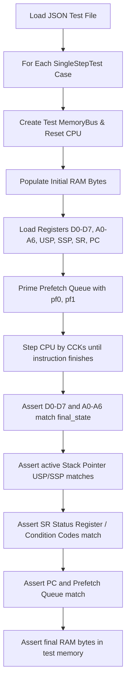

# M68000 SingleStepTests Suite Specification

- **Parent Specification:** [CPU Motorola M68000.md](CPU%20Motorola%20M68000.md) | [CPU Micro-Step State Machine.md](CPU%20Micro-Step%20State%20Machine.md)
- **Module Location:** `crates/test_runner/`
- **Engineering Guidelines:** Follow systems rules in [AGENTS.md](../../../AGENTS.md).

> [!NOTE]
> Operational test running, command shortcuts, and debugging checklists are documented in the [m68k-singlestep-test](../../../.agents/skills/m68k-singlestep-test/SKILL.md) skill.
> Step-by-step instruction implementation is guided by [add-m68k-instruction](../../../.agents/skills/add-m68k-instruction/SKILL.md).

This document defines the complete specification and Rust data structures for running the **SingleStepTests** test suites against the M68000 CPU emulator. It specifies validation against:
- The **Tom Harte SingleStepTests-680x0 suite** in [`ref_src/SingleStepTests-680x0/68000/v1/`](../../../ref_src/SingleStepTests-680x0/68000/v1) (124 `.json` files, ~1,000,000 tests captured directly from physical 68000 silicon pins).

---

## 1. Physical Hardware Silicon Test Suite Overview

To ensure robust, ground-truth verification, the M68000 CPU emulator is validated directly against physical hardware captures:

| Feature | Tom Harte SingleStepTests (Hardware) |
| :--- | :--- |
| **Path** | [`ref_src/SingleStepTests-680x0/68000/v1/`](../../../ref_src/SingleStepTests-680x0/68000/v1) |
| **File Format** | Plain `.json` |
| **Suite Count** | **124 test files** |
| **Test Scale** | ~8,000+ tests per file (~1,000,000 total) |
| **Origin** | Tom Harte's CLK processor test generator captured on physical 68000 silicon pins |
| **Unique Strengths** | Massive randomized test coverage; independently verified against real hardware |
| **`TAS` Indivisible RMW** | ✅ Fully modeled via explicit `"t"` bus transactions |
| **`TRAPV` $S$-bit** | ✅ Standard 68000 behavior |
| **Mode Coverage** | 99% Supervisor mode, 1% User mode |

### 1.1 Opcode Packaging Quirk: CMP and CMPM
In the test suite, there are **no separate `CMPM.b.json`, `CMPM.w.json`, or `CMPM.l.json` files**. Instead, all `CMPM (Ay)+, (Ax)+` test cases are bundled together inside `CMP.b.json`, `CMP.w.json`, and `CMP.l.json` alongside standard `CMP <ea>, Dn`.

- The test runner provides [`is_cmpm_postinc_opcode`](../../../crates/test_runner/src/runner.rs) (`(op & 0xF138) == 0xB108`) to isolate `CMPM` cases when specific post-increment testing is required.
- **Batch 1.3 Complete:** Standard `CMP`, `CMPA`, and `CMPI` are fully implemented and verified. Both isolated `CMPM` tests and exhaustive full-suite `CMP.<size>.json` integration tests run in [`crates/test_runner/tests/test_singlestep.rs`](../../../crates/test_runner/tests/test_singlestep.rs) and [`crates/test_runner/tests/test_dma_cartesian.rs`](../../../crates/test_runner/tests/test_dma_cartesian.rs).

---

## 2. JSON Test Schema

Each `.json` file contains a JSON array of individual test cases: `[ { ... }, { ... } ]`.

### 2.1 Example JSON Test Object
```json
{
  "name": "ADD.B D1, D0 (0000)",
  "initial": {
    "d0": 0,
    "d1": 42,
    "d2": 0,
    "d3": 0,
    "d4": 0,
    "d5": 0,
    "d6": 0,
    "d7": 0,
    "a0": 0,
    "a1": 0,
    "a2": 0,
    "a3": 0,
    "a4": 0,
    "a5": 0,
    "a6": 0,
    "usp": 0,
    "ssp": 1048576,
    "sr": 9984,
    "pc": 1000,
    "prefetch": [ 53264, 0 ],
    "ram": [
      [ 1000, 208 ],
      [ 1001, 8 ],
      [ 1002, 0 ],
      [ 1003, 0 ]
    ]
  },
  "final": {
    "d0": 42,
    "d1": 42,
    "d2": 0,
    "d3": 0,
    "d4": 0,
    "d5": 0,
    "d6": 0,
    "d7": 0,
    "a0": 0,
    "a1": 0,
    "a2": 0,
    "a3": 0,
    "a4": 0,
    "a5": 0,
    "a6": 0,
    "usp": 0,
    "ssp": 1048576,
    "sr": 9984,
    "pc": 1004,
    "prefetch": [ 0, 0 ],
    "ram": [
      [ 1000, 208 ],
      [ 1001, 8 ]
    ]
  },
  "transactions": [
    [ "r", 0, 2, 1000, ".w", 53264, 1, 1 ],
    [ "r", 4, 2, 1002, ".w", 0, 1, 1 ],
    [ "n", 8 ]
  ],
  "length": 8
}
```

### 2.2 Field Descriptions
| Field | Type | Description |
| :--- | :--- | :--- |
| `name` | `String` | Human-readable test description |
| `initial` | `Object` | CPU state and memory before execution |
| `final` | `Object` | Expected CPU state and memory after execution |
| `transactions` | `Array` | Log of cycle bus transactions (see Section 2.3) |
| `length` | `u32` | Total number of clock cycles taken (assuming immediate DTACK) |

#### State Object Fields (`initial` and `final`):
- `d0`–`d7`: Data registers (`u32`)
- `a0`–`a6`: Address registers (`u32`)
- `usp`: User Stack Pointer (`u32`)
- `ssp`: Supervisor Stack Pointer (`u32`)
- `sr`: Status Register (`u16`) containing condition codes and system flags
- `pc`: Program Counter (`u32`, points to next prefetch address)
- `prefetch`: Two 16-bit words (`[u32; 2]`) in the CPU prefetch queue (`pf0`, `pf1`)
- `ram`: Array of `[address, byte_value]` pairs (`Vec<[u32; 2]>`)

### 2.3 Bus Transaction Format (`ref_src/SingleStepTests-680x0/`)

The physical hardware test suite logs bus activity as a structured transaction array:

- **Bus Cycle:** `[type, duration, fc, addr, size, data]`
  - `type`: `"r"` (read), `"w"` (write), or `"t"` (**TAS indivisible read-modify-write cycle**).
  - `duration`: Transaction length in clock cycles (typically 4 cycles).
  - `fc`: Function code bits (`bit 0 = FC0, bit 1 = FC1, bit 2 = FC2`).
  - `addr`: 24-bit physical address.
  - `size`: `".b"` (byte) or `".w"` (word).
  - `data`: Value on the data bus (0–255 for byte, 0–65535 for word). For `"t"`, records final byte written.
- **Internal / Idle Cycle:** `["n", duration]`
  - CPU internal execution phases without external bus activity.

### 2.4 Strict Schema Validation Rules
- **Optional Fields:** **None**. Every single field in the test schema is **mandatory**. If any expected field is missing from a test object or state object, deserialization must immediately fail with a descriptive error.
- **Unknown Fields:** **Forbidden**. Any unrecognized or unexpected keys present in the JSON must cause deserialization to fail.


---

## 3. Rust Deserialization Data Structures

To enforce strict validation, all structs defined in [`crates/test_runner/src/schema.rs`](../../../crates/test_runner/src/schema.rs) use `#[serde(deny_unknown_fields)]`:
- **`SingleStepTest`**: Encapsulates test `name`, `initial: CpuTestState`, `final_state: CpuTestState`, `transactions: Vec<serde_json::Value>`, and expected execution `length: u32`.
- **`CpuTestState`**: Deserializes registers `d0..d7`, `a0..a6`, `usp`, `ssp`, `sr`, `pc`, `prefetch: [u32; 2]`, and initial/final `ram: Vec<[u32; 2]>` (`[address, byte]`).

---

## 4. Test Execution Loop

Each test case is executed independently in an isolated test harness:



### 4.1 Step-by-Step Test Runner Logic

1. **Memory Initialization:**
   - Use a lightweight test memory model (e.g. flat byte array or sparse hash map `HashMap<u32, u8>`).
   - Populate test memory with all `[address, byte]` pairs from `initial.ram`.
2. **CPU State Setup:**
   - Load $D_0-D_7$ and $A_0-A_6$.
   - Load $USP$ and $SSP$. Set active $A_7$ based on the Supervisor bit ($S$) in $SR$.
   - Set $SR$ and $PC$.
   - Prime the internal prefetch buffer with `initial.prefetch[0]` and `initial.prefetch[1]`.
3. **Execute Instruction:**
   - Step the CPU cycle-by-cycle (or CCK-by-CCK) until the current instruction completes.
   - Guard against infinite loops with a timeout threshold (e.g., `length * 2` cycles or max 1,000 cycles).
4. **State Verification:**
   - **Data Registers:** Assert `cpu.d(i) == final_state.d[i]` for $i \in 0..7$.
   - **Address Registers:** Assert `cpu.a(i) == final_state.a[i]` for $i \in 0..6$.
   - **Stack Pointers:** Assert `cpu.usp == final_state.usp` and `cpu.ssp == final_state.ssp`.
   - **Status Register (SR / CCR):** Assert `cpu.sr == final_state.sr`.
   - **Program Counter:** Assert `cpu.pc == final_state.pc`.
   - **Prefetch Queue:** Assert `cpu.prefetch == final_state.prefetch`.
   - **RAM Verification:** Iterate through all `[address, expected_byte]` pairs in `final_state.ram` and assert that the test memory contains the exact byte.
5. **Cycle-by-Cycle Bus Transaction Assertion:**
   - Iterate through `test.transactions` (`[type, duration, size, addr, str_size, data, uds, lds]`):
     - **CCK1 (S0–S3):** Assert the CPU asserts the exact address (`addr`), strobe signals (`uds`, `lds`), and transfer direction (`r` vs `w`).
     - **CCK2 (S4–S7):** Assert that on read, data captured in the latch matches `data`, and on write, data driven on the bus matches `data`.
     - Idle cycles (`n`) assert no active bus strobes for the given clock duration.
6. **Address Error & Exception Handling:**
   - If the test triggers an address error (unaligned word/long access), verify that the CPU:
     1. Pushes the Address Error stack frame (Function Code, Access Address, Instruction Register, Status Register, PC).
     2. Sets the Supervisor bit $S$ in $SR$.
     3. Fetches the exception handler address from Vector 3 (`$00000C`).

---

## 5. Rust Test Harness Implementation (`crates/test_runner`)

The test harness is implemented in the dedicated workspace crate [`crates/test_runner`](../../../crates/test_runner). It executes test vectors directly against `m68000::Cpu` and a dedicated test bus (`TestMemoryBus::new()`):

### 5.1 Module Structure
- **[`schema.rs`](../../../crates/test_runner/src/schema.rs):** Strict deserialization of `SingleStepTest` and `CpuTestState` using `#[serde(deny_unknown_fields)]`.
- **[`runner.rs`](../../../crates/test_runner/src/runner.rs):** Test execution loop, CPU prefetch priming, state comparison, cycle count validation, and RAM byte validation:
  - `run_single_test_detail(test, file_path, index, mode) -> Result<(), TestFailure>`: Executes a single test case with configurable `VerifyMode` (`StateOnly`, `StateAndCycles`, `Full`).
  - `run_test_file(path, limit) -> Result<(usize, usize), Box<dyn Error>>`: Reads plain `.json` test suites, running up to `limit` test cases in `StateOnly` mode.
  - `run_test_file_with_mode(path, limit, mode)`: Configurable execution mode enabling cycle-exact and bus transaction verification.
- **[`transactions.rs`](../../../crates/test_runner/src/transactions.rs):** Deserializes and parses Tom Harte transaction logs, matching recorded bus transactions (read/write/TAS direction, 24-bit address, size, bus value, FC lines) against physical silicon logs.
- **[`dma_harness.rs`](../../../crates/test_runner/src/dma_harness.rs):** Synthetic Agnus DMA bus contention runner sweeping single-cycle (`run_dma_contention_sweep`) and multi-cycle burst (`run_dma_burst_contention`) stalls across instruction execution phases, validating State Invariance and Cycle Invariance ($C = C_0 + 2 \times \text{wait\_cycles}$).
- **[`diagnostic.rs`](../../../crates/test_runner/src/diagnostic.rs):** Human-readable failure reporting, full CCR flag decomposition ($T, S, I, X, N, Z, V, C$), clock/CCK cycle metrics, and transaction diff formatting.
- **[`reporter.rs`](../../../crates/test_runner/src/reporter.rs):** Persistent results recording in `tests/singlestep/`, differential regression detection, and global summary generation.
- **[`benchmark/`](../../../crates/test_runner/src/benchmark/):** Automated per-opcode instruction micro-benchmarking engine, programmatic unrolled block synthesis ($K = 700$), single-pass step tracing (`tracer.rs`), P-core affinity pinning, and anomaly classifier (see [CPU Instruction Benchmarking.md](CPU%20Instruction%20Benchmarking.md)).

### 5.2 CPU State Setup & Execution Flow
Implemented directly in [`crates/test_runner/src/runner.rs`](../../../crates/test_runner/src/runner.rs):
- Instantiates a clean [`TestMemoryBus`](../../../crates/test_runner/src/test_memory_bus.rs) and injects initial RAM vectors via `bus.load_test_ram()`.
- Primes CPU registers $D_0-D_7$, $A_0-A_6$, $USP$, $SSP$, $SR$, and Program Counter (accounting for Tom Harte's $+4$ prefetch offset).
- Primes prefetch queue registers `ir` and `prefetch[0]`.
- Drives instruction stepping via `cpu.step_instruction(&mut bus)` or CCK-by-CCK via `cpu.step_cck(&mut bus)`.

---

## 6. Integration Test Suite Structure (`tests/test_singlestep.rs`)

Integration tests reside in [`crates/test_runner/tests/test_singlestep.rs`](../../../crates/test_runner/tests/test_singlestep.rs). Rather than scattering tests across dozens of individual files, tests use the hardware test helper `run_test("<OPCODE>", limit)`, running and asserting zero failures against:
- **Tom Harte real silicon test suite** (`ref_src/SingleStepTests-680x0/68000/v1/<OPCODE>.json`).

Tests are grouped into cohesive categories within `test_singlestep.rs`:
- **System & Control Flow:** `test_nop`, `test_rts`, `test_trap`, `test_bcc`, `test_jmp`, `test_jsr`
- **Data Movement:** `test_move_b/w/l`, `test_movea_w/l`
- **Integer Arithmetic:** `test_add_b/w/l`, `test_adda_w/l`, `test_sub_b/w/l`, `test_suba_w/l`
- **Logic & Bit Manipulation:** `test_and_b/w/l`, `test_or_b/w/l`, `test_btst`, `test_bset`, `test_bclr`, `test_bchg`
- **Shifts & Rotates:** `test_asl_b/w/l`, `test_asr_b/w/l`, `test_lsl_b/w/l`, `test_lsr_b/w/l`

---

## 7. Running Tests & CLI Commands

Tests are executed via standard Cargo commands or through the dedicated `test_runner` CLI:

```powershell
# Run all single-step integration tests with default fast sample limit (50 vectors per suite)
cargo test -p test_runner --test test_singlestep

# Run exhaustive full validation across all ~300,000 vectors in parallel
$env:SINGLESTEP_FULL = "1"; cargo test -p test_runner --test test_singlestep

# Run tests with a custom vector limit per suite
$env:SINGLESTEP_LIMIT = "500"; cargo test -p test_runner --test test_singlestep

# Run all tests for a specific opcode across both suites
cargo test -p test_runner -- test_add_b
cargo test -p test_runner -- test_move_w
cargo test -p test_runner -- test_nop

# Run Cartesian DMA contention permutation test suite
cargo test -p test_runner --test test_dma_cartesian

# Run automated architectural compliance suite
cargo test -p test_runner --test test_architecture_rules

# Check for regressions or improvements against previous test run
cargo run -p test_runner -- --diff

# Display global pass/fail matrix and coverage summary
cargo run -p test_runner -- --summary

# Run a specific opcode suite directly with live diagnostic failure logs
cargo run -p test_runner -- --suite ADD.b
```

---

## 8. In-Code Test Mutation Strategy (Chip/Fast RAM & DMA Contention)

To verify the CPU's bus arbitration and wait-state handling under real Amiga hardware conditions, we do **not** generate duplicate JSON files on disk. Instead, the test runner applies **programmatic test mutations in memory**:

### 8.1 Memory Classification & Gary Bus Equivalence
The test harness classifies accessed memory addresses using `MemoryType`:
- **`MemoryType::ChipRam`**: Contended by Agnus DMA ($000000-$07FFFF); memory bus accesses stall with `BusResult::WaitState` when `chip_ram_blocked` is asserted.
- **`MemoryType::FastRam`**: Uncontended memory; completely immune to Agnus DMA contention, executing with **zero wait states** even during 100% DMA bus stalls.

### 8.2 Full Cartesian Permutation Engine (`run_dma_full_cartesian_permutation`)
Rather than testing a small subset of arbitrary schedules, the test harness evaluates the full combinatorial Cartesian product across both dimensions:
1. **Address Permutation Space ($2^k$):** Memory cells accessed by the instruction are dynamically discovered during an uncontended pre-flight pass (`run_preflight`) and clustered into up to $k \le 4$ functional roles (`cluster_contacts`). Every combination of `ChipRam` vs `FastRam` is swept.
2. **DMA Schedule Permutation Space ($2^M$):** Each CCK cycle $t \in [0, M)$ of the instruction execution window is evaluated across all $2^M$ bit patterns (every possible combination of stalled vs free CCK slots).
3. **Hardware Invariants Verified per Run:**
   - **State Invariance:** CPU registers ($D_0-D_7$, $A_0-A_6$, $USP$, $SSP$, $SR$, $PC$, prefetch) and RAM contents match the golden uncontended run 100% bit-identically across all permutations.
   - **Cycle Invariance:** Contended execution total CPU clocks satisfy $C = C_0 + 2 \times \text{wait\_cycles}$, where wait cycles only accumulate when contested `ChipRam` cells are accessed during an active DMA stall.
   - **Fast RAM Immunity:** When all accessed contacts are assigned `FastRam`, wait states are strictly 0 ($C = C_0$) regardless of active DMA stalls.

### 8.3 Memory Inversion Guard (`invert_chip_ram`)
During stalled CCK cycles, the test bus temporarily inverts contested Chip RAM cells (`bus.invert_chip_ram()`) before stepping the CPU, and re-inverts them afterwards. Any unauthorized read during a wait state captures inverted/corrupted data, and any unauthorized write modifies inverted storage which becomes permanently corrupted upon un-inversion, immediately failing state assertions.

---

## 9. Physical Hardware Silicon Verification & Discrepancy Diagnosis

Validating against physical 68000 silicon captures guarantees cycle-exact behavior across all edge cases:

### 9.1 Key Hardware Invariants Verified by Tom Harte Vectors
| Subsystem / Operation | Physical Silicon Hardware Behavior |
| :--- | :--- |
| **Standard ALU Operations** | Cycle-exact execution across 124 opcodes (~8,000 cases each). |
| **`TAS` Indivisible RMW** | Verified via explicit `"t"` bus transactions with uninterrupted bus ownership. |
| **`ASR` Shift Count > Width** | Shift register exhaustion forces both $C = 0$ and $X = 0$ when $count \ge width$. |
| **`(An)+` Address Error AGU** | $A_n$ increments in AGU as read begins; unaligned read commits incremented $A_n$ before exception trap. |
| **`-(An)` MOVE.l Write Ordering** | Low word decrements to $A_n - 2$ then high word to $A_n - 4$; unaligned write leaves $A_n - 2$. |
| **`LINK A7` Pushed SP** | $SP$ decrements before write latch, correctly pushing $SP - 4$. |
| **`CHK` Flag Preservation** | Prior $N$ flag is preserved when no exception occurs ($N$ undefined in PRM). |

### 9.2 Failure Diagnosis Protocol
When diagnosing a single-step test failure:
1. **Register State Mismatch:** Inspect the reported diff (e.g. `diff == 1` or sign-extension). Verify whether ALU calculation, prefetch queue, or pre/post-increment commitment order is at fault.
2. **Condition Code Register (CCR):** Use the detailed CCR flags decomposition ($X, N, Z, V, C$) to pinpoint exact flag logic.
3. **Cycle Timing Mismatch:** Cross-reference micro-step durations against [CPU Micro-Step State Machine.md](CPU%20Micro-Step%20State%20Machine.md).

### 9.3 Automated Single-Step Integration Test Matrix
The integration test suite in [`crates/test_runner/tests/test_singlestep.rs`](../../../crates/test_runner/tests/test_singlestep.rs) executes hardware cross-validation on every `cargo test` run. Each opcode test invokes `run_test("<OPCODE>", limit)`, validating vectors against:
- **Tom Harte Real 68k Suite** (`ref_src/SingleStepTests-680x0/68000/v1/<OPCODE>.json`)

Currently active tests cover all implemented instructions:
- **System & Control**: `NOP`, `RTS`, `TRAP`, `Bcc` (`BRA`), `JMP`, `JSR`
- **Data Movement**: `MOVE.b`, `MOVE.w`, `MOVE.l`, `MOVEA.w`, `MOVEA.l`
- **Arithmetic**: `ADD.b`, `ADD.w`, `ADD.l`, `ADDA.w`, `ADDA.l`, `SUB.b`, `SUB.w`, `SUB.l`, `SUBA.w`, `SUBA.l`
- **Logic**: `AND.b`, `AND.w`, `AND.l`, `OR.b`, `OR.w`, `OR.l`
- **Bit Manipulation**: `BTST`, `BSET`, `BCLR`, `BCHG`
- **Shifts & Rotates**: `ASL.b`, `ASL.w`, `ASL.l`, `ASR.b`, `ASR.w`, `ASR.l`, `LSL.b`, `LSL.w`, `LSL.l`, `LSR.b`, `LSR.w`, `LSR.l`

---

## 10. Diagnostic Logging & Regression Tracking Architecture

To support autonomous developer and agent workflows, the test runner implements cycle-level diagnostic failure logging and persistent differential regression tracking.

### 10.1 Diagnostic Failure Reports
Whenever a test case fails, the runner produces a formatted diagnostic report containing:
- **Test Identification:** Opcode name, source JSON/GZ file, test vector index.
- **Cycle & Timing:** Exact test length in CPU clock cycles and Amiga CCK cycles ($1\ \text{CCK} = 2\ \text{CPU clocks}$).
- **Decomposed CCR Analysis:** Status Register decoded into human-readable flags ($T, S, I, X, N, Z, V, C$) indicating specifically which flags are unexpectedly SET or CLEARED.
- **Register & Memory Diffs:** Detailed expected vs actual values with decimal offsets for registers ($D_0-D_7, A_0-A_7, PC$) and RAM byte addresses.

### 10.2 Differential Regression Tracker (`tests/singlestep/`)
Test outcomes are persisted across runs in the `tests/singlestep/` workspace directory:
- `tests/singlestep/latest/<suite>.json`: Full test results and failing test names from the most recent run.
- `tests/singlestep/previous/<suite>.json`: Prior run snapshot rotated upon execution.
- `tests/singlestep/summary.json`: Aggregated repository coverage matrix with pass rates and active failure cases.

#### Regression & Improvement Detection:
- 🔴 **Regressions:** Tests that previously passed in `tests/singlestep/previous/` but failed in the current run are immediately flagged with `⚠️ [REGRESSION DETECTED]` in the terminal.
- 🟢 **Improvements:** Tests that previously failed but now pass are flagged with `🎉 [PROGRESS / FIX]`.

### 10.3 CLI Inspection Tool
Developers and AI agents can query test status and regressions directly:
```powershell
# Show regressions and fixed tests vs previous run
cargo run -p test_runner -- --diff

# Display global pass/fail matrix across all suites
cargo run -p test_runner -- --summary

# Run a specific opcode suite directly
cargo run -p test_runner -- --suite ADD.b
```

---

## 11. Reference Documentation & Upstream Ground Truth

- [68000 User's Manual: Section 8 (16-Bit Instruction Execution Timing & Bus Tables)](../Reference/68000%20User's%20Manual/08%20-%20Section%208%20-%2016-Bit%20Instruction%20Execution%20Timing%20%26%20Bus%20Tables.md): Standard instruction timings and bus operation counts.
- [Tom Harte SingleStepTests-680x0 Suite](../../../ref_src/SingleStepTests-680x0/68000/v1): Comprehensive randomized test vectors for 68000 CPU.
- [CPU Motorola M68000 Design Specification](CPU%20Motorola%20M68000.md): Register architecture, condition codes, and processor status.
- [CPU Micro-Step State Machine Specification](CPU%20Micro-Step%20State%20Machine.md): Color Clock cycle decomposition and microcode execution.
- [SingleStep Test Runner Implementation](../../../crates/test_runner/src/runner.rs): Test loading, memory bus fixture, and assertion logic.
- [SingleStep Integration Test Suite](../../../crates/test_runner/tests/test_singlestep.rs): Automated dual-suite regression tests.
- [DMA Cartesian Contention Test Suite](../../../crates/test_runner/tests/test_dma_cartesian.rs): Cycle invariance verification across DMA wait-state permutations.

