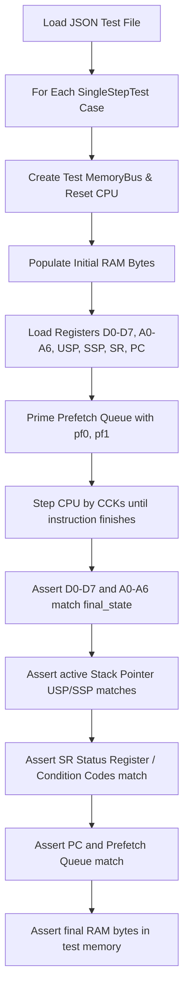

# M68000 SingleStepTests Suite Specification

> [!NOTE]
> Operational test running, command shortcuts, and debugging checklists are documented in the [m68k-singlestep-test](file:///d:/Programowanie/Amiga/.agents/skills/m68k-singlestep-test/SKILL.md) skill.
> Step-by-step instruction implementation is guided by [add-m68k-instruction](file:///d:/Programowanie/Amiga/.agents/skills/add-m68k-instruction/SKILL.md).

This document defines the complete specification and Rust data structures for running the **SingleStepTests** test suites against the M68000 CPU emulator. It specifies validation against both:
1. The **MAME SingleStepTests suite** in [`ref_src/SingleStepTests-m68000/v1/`](file:///d:/Programowanie/Amiga/ref_src/SingleStepTests-m68000/v1) (127 JSON files).
2. The **Tom Harte SingleStepTests-680x0 suite** in [`ref_src/SingleStepTests-680x0/68000/v1/`](file:///d:/Programowanie/Amiga/ref_src/SingleStepTests-680x0/68000/v1) (125 `.json.gz` files, ~1,000,000 tests).

---

## 1. Dual Test Suite Overview

To ensure robust, ground-truth verification and eliminate single-source simulation artifacts, the M68000 CPU emulator is validated against **two independent, complementary single-step test suites**:

| Feature | Suite 1: MAME SingleStepTests | Suite 2: Tom Harte SingleStepTests |
| :--- | :--- | :--- |
| **Path** | [`ref_src/SingleStepTests-m68000/v1/`](file:///d:/Programowanie/Amiga/ref_src/SingleStepTests-m68000/v1) | [`ref_src/SingleStepTests-680x0/68000/v1/`](file:///d:/Programowanie/Amiga/ref_src/SingleStepTests-680x0/68000/v1) |
| **File Format** | Plain `.json` (and `.json.bin`) | Gzip-compressed `.json.gz` |
| **Suite Count** | **127 test files** | **125 test files** |
| **Test Scale** | ~1,000–5,000 tests per file | ~8,000+ tests per file (~1,000,000 total) |
| **Origin** | MAME cycle-exact microcoded core | Tom Harte's CLK processor test generator |
| **Unique Strengths** | Fast uncompressed loading; includes `ILLEGAL_LINEA`, `ILLEGAL_LINEF`, `STOP` | Massive randomized test coverage; independently verified |
| **`TAS` Indivisible RMW** | ⚠️ Caveat: does not model 5-cycle RMW timing | ✅ Fully modeled via explicit `"t"` bus transactions |
| **`TRAPV` $S$-bit** | ⚠️ Caveat: Known quirk with S-bit handling | ✅ Standard behavior |
| **Mode Coverage** | Supervisor & User mode | 99% Supervisor mode, 1% User mode |

### 1.1 Why Dual-Suite Testing?
1. **Triangulation of Simulator Quirks:** When an instruction test fails, comparing against both MAME and Tom Harte tests immediately clarifies whether the issue is a genuine core bug or a quirk of MAME's microcode generator (such as `TAS` and `TRAPV`).
2. **Exhaustive Address & Mode Variation:** Tom Harte's suite generates over 1 million test vectors, checking edge cases in word-aligned vs unaligned memory pointers and register boundary combinations.
3. **Comprehensive Coverage:** MAME provides specialized exception vector suites (`ILLEGAL_LINEA`, `ILLEGAL_LINEF`, `STOP`) that are not present in Tom Harte's 125-opcode collection.


---

## 2. JSON Test Schema

Each `.json` file contains a JSON array of individual test cases: `[ { ... }, { ... } ]`.

### 2.1 Example JSON Test Object
```json
{
  "name": "ADD.B D1, D0 (0000)",
  "initial": {
    "d0": 0,
    "d1": 42,
    "d2": 0,
    "d3": 0,
    "d4": 0,
    "d5": 0,
    "d6": 0,
    "d7": 0,
    "a0": 0,
    "a1": 0,
    "a2": 0,
    "a3": 0,
    "a4": 0,
    "a5": 0,
    "a6": 0,
    "usp": 0,
    "ssp": 1048576,
    "sr": 9984,
    "pc": 1000,
    "prefetch": [ 53264, 0 ],
    "ram": [
      [ 1000, 208 ],
      [ 1001, 8 ],
      [ 1002, 0 ],
      [ 1003, 0 ]
    ]
  },
  "final": {
    "d0": 42,
    "d1": 42,
    "d2": 0,
    "d3": 0,
    "d4": 0,
    "d5": 0,
    "d6": 0,
    "d7": 0,
    "a0": 0,
    "a1": 0,
    "a2": 0,
    "a3": 0,
    "a4": 0,
    "a5": 0,
    "a6": 0,
    "usp": 0,
    "ssp": 1048576,
    "sr": 9984,
    "pc": 1004,
    "prefetch": [ 0, 0 ],
    "ram": [
      [ 1000, 208 ],
      [ 1001, 8 ]
    ]
  },
  "transactions": [
    [ "r", 0, 2, 1000, ".w", 53264, 1, 1 ],
    [ "r", 4, 2, 1002, ".w", 0, 1, 1 ],
    [ "n", 8 ]
  ],
  "length": 8
}
```

### 2.2 Field Descriptions
| Field | Type | Description |
| :--- | :--- | :--- |
| `name` | `String` | Human-readable test description |
| `initial` | `Object` | CPU state and memory before execution |
| `final` | `Object` | Expected CPU state and memory after execution |
| `transactions` | `Array` | Log of cycle bus transactions (see Section 2.3) |
| `length` | `u32` | Total number of clock cycles taken (assuming immediate DTACK) |

#### State Object Fields (`initial` and `final`):
- `d0`–`d7`: Data registers (`u32`)
- `a0`–`a6`: Address registers (`u32`)
- `usp`: User Stack Pointer (`u32`)
- `ssp`: Supervisor Stack Pointer (`u32`)
- `sr`: Status Register (`u16`) containing condition codes and system flags
- `pc`: Program Counter (`u32`, points to next prefetch address)
- `prefetch`: Two 16-bit words (`[u32; 2]`) in the CPU prefetch queue (`pf0`, `pf1`)
- `ram`: Array of `[address, byte_value]` pairs (`Vec<[u32; 2]>`)

### 2.3 Transaction Formats (MAME vs Tom Harte)

While CPU state schemas are identical, the two suites format their bus transactions array slightly differently:

#### Tom Harte Transaction Format (`ref_src/SingleStepTests-680x0/`):
- **Bus Cycle:** `[type, duration, fc, addr, size, data]`
  - `type`: `"r"` (read), `"w"` (write), or `"t"` (**TAS indivisible read-modify-write cycle**).
  - `duration`: Transaction length in clock cycles (typically 4 cycles).
  - `fc`: Function code bits (`bit 0 = FC0, bit 1 = FC1, bit 2 = FC2`).
  - `addr`: 24-bit physical address.
  - `size`: `".b"` (byte) or `".w"` (word).
  - `data`: Value on the data bus (0–255 for byte, 0–65535 for word). For `"t"`, records final byte written.
- **Internal / Idle Cycle:** `["n", duration]`
  - CPU internal operations without external bus activity.

#### MAME Transaction Format (`ref_src/SingleStepTests-m68000/`):
- **Bus Cycle:** `[type, start_cycle, fc, addr, size, data, uds, lds]`
  - `type`: `"r"`, `"w"`, `"re"` (read address error), `"we"` (write address error).
  - `uds`, `lds`: Upper and lower data strobe line states (`1` or `0`).
- **Internal / Idle Cycle:** `["n", duration]`

### 2.4 Strict Schema Validation Rules
- **Optional Fields:** **None**. Every single field in the test schema is **mandatory**. If any expected field is missing from a test object or state object, deserialization must immediately fail with a descriptive error.
- **Unknown Fields:** **Forbidden**. Any unrecognized or unexpected keys present in the JSON must cause deserialization to fail.


---

## 3. Rust Deserialization Data Structures

To enforce strict validation, all structs use `#[serde(deny_unknown_fields)]`:

```rust
use serde::Deserialize;

#[derive(Debug, Deserialize)]
#[serde(deny_unknown_fields)]
pub struct SingleStepTest {
    pub name: String,
    pub initial: CpuTestState,
    #[serde(rename = "final")]
    pub final_state: CpuTestState,
    pub transactions: Vec<serde_json::Value>,
    pub length: u32,
}

#[derive(Debug, Deserialize)]
#[serde(deny_unknown_fields)]
pub struct CpuTestState {
    pub d0: u32,
    pub d1: u32,
    pub d2: u32,
    pub d3: u32,
    pub d4: u32,
    pub d5: u32,
    pub d6: u32,
    pub d7: u32,
    pub a0: u32,
    pub a1: u32,
    pub a2: u32,
    pub a3: u32,
    pub a4: u32,
    pub a5: u32,
    pub a6: u32,
    pub usp: u32,
    pub ssp: u32,
    pub sr: u16,
    pub pc: u32,
    pub prefetch: [u32; 2],
    pub ram: Vec<[u32; 2]>, // [address, byte]
}
```

---

## 4. Test Execution Loop

Each test case is executed independently in an isolated test harness:



### 4.1 Step-by-Step Test Runner Logic

1. **Memory Initialization:**
   - Use a lightweight test memory model (e.g. flat byte array or sparse hash map `HashMap<u32, u8>`).
   - Populate test memory with all `[address, byte]` pairs from `initial.ram`.
2. **CPU State Setup:**
   - Load $D_0-D_7$ and $A_0-A_6$.
   - Load $USP$ and $SSP$. Set active $A_7$ based on the Supervisor bit ($S$) in $SR$.
   - Set $SR$ and $PC$.
   - Prime the internal prefetch buffer with `initial.prefetch[0]` and `initial.prefetch[1]`.
3. **Execute Instruction:**
   - Step the CPU cycle-by-cycle (or CCK-by-CCK) until the current instruction completes.
   - Guard against infinite loops with a timeout threshold (e.g., `length * 2` cycles or max 1,000 cycles).
4. **State Verification:**
   - **Data Registers:** Assert `cpu.d(i) == final_state.d[i]` for $i \in 0..7$.
   - **Address Registers:** Assert `cpu.a(i) == final_state.a[i]` for $i \in 0..6$.
   - **Stack Pointers:** Assert `cpu.usp == final_state.usp` and `cpu.ssp == final_state.ssp`.
   - **Status Register (SR / CCR):** Assert `cpu.sr == final_state.sr`.
   - **Program Counter:** Assert `cpu.pc == final_state.pc`.
   - **Prefetch Queue:** Assert `cpu.prefetch == final_state.prefetch`.
   - **RAM Verification:** Iterate through all `[address, expected_byte]` pairs in `final_state.ram` and assert that the test memory contains the exact byte.
5. **Cycle-by-Cycle Bus Transaction Assertion:**
   - Iterate through `test.transactions` (`[type, duration, size, addr, str_size, data, uds, lds]`):
     - **CCK1 (S0–S3):** Assert the CPU asserts the exact address (`addr`), strobe signals (`uds`, `lds`), and transfer direction (`r` vs `w`).
     - **CCK2 (S4–S7):** Assert that on read, data captured in the latch matches `data`, and on write, data driven on the bus matches `data`.
     - Idle cycles (`n`) assert no active bus strobes for the given clock duration.
6. **Address Error & Exception Handling:**
   - If the test triggers an address error (unaligned word/long access), verify that the CPU:
     1. Pushes the Address Error stack frame (Function Code, Access Address, Instruction Register, Status Register, PC).
     2. Sets the Supervisor bit $S$ in $SR$.
     3. Fetches the exception handler address from Vector 3 (`$00000C`).

---

## 5. Rust Test Harness Implementation (`common.rs`)

```rust
use std::fs::File;
use std::io::BufReader;
use std::path::Path;
use flate2::read::GzDecoder;
use crate::m68000::cpu::Cpu;
use crate::m68000::bus::TestMemoryBus;

/// Loads and executes tests from either a plain `.json` (MAME) or `.json.gz` (Tom Harte) file.
pub fn run_test_file<P: AsRef<Path>>(test_path: P) {
    let tests = load_test_file(test_path);
    for test in tests {
        run_single_test(&test);
    }
}

/// Runs a bounded subset of tests from a file (useful for rapid TDD iterations on large suites).
pub fn run_test_sample<P: AsRef<Path>>(test_path: P, sample_size: usize) {
    let tests = load_test_file(test_path);
    for test in tests.iter().take(sample_size) {
        run_single_test(test);
    }
}

/// Transparently deserializes either plain `.json` or `.json.gz`.
pub fn load_test_file<P: AsRef<Path>>(test_path: P) -> Vec<SingleStepTest> {
    let path = test_path.as_ref();
    let file = File::open(path)
        .unwrap_or_else(|_| panic!("Failed to open test file: {:?}", path));
    let reader = BufReader::new(file);

    if path.extension().and_then(|s| s.to_str()) == Some("gz") {
        let gz = GzDecoder::new(reader);
        serde_json::from_reader(gz)
            .unwrap_or_else(|e| panic!("Failed to parse gzipped JSON {:?}: {}", path, e))
    } else {
        serde_json::from_reader(reader)
            .unwrap_or_else(|e| panic!("Failed to parse JSON {:?}: {}", path, e))
    }
}

pub fn run_single_test(test: &SingleStepTest) {
    let mut bus = TestMemoryBus::new();
    
    // 1. Populate RAM
    for ram_entry in &test.initial.ram {
        let addr = ram_entry[0];
        let val = ram_entry[1] as u8;
        bus.write_byte(addr, val);
    }

    // 2. Instantiate and configure CPU
    let mut cpu = Cpu::new();
    cpu.set_d0(test.initial.d0);
    cpu.set_d1(test.initial.d1);
    cpu.set_d2(test.initial.d2);
    cpu.set_d3(test.initial.d3);
    cpu.set_d4(test.initial.d4);
    cpu.set_d5(test.initial.d5);
    cpu.set_d6(test.initial.d6);
    cpu.set_d7(test.initial.d7);
    
    cpu.set_a0(test.initial.a0);
    cpu.set_a1(test.initial.a1);
    cpu.set_a2(test.initial.a2);
    cpu.set_a3(test.initial.a3);
    cpu.set_a4(test.initial.a4);
    cpu.set_a5(test.initial.a5);
    cpu.set_a6(test.initial.a6);
    
    cpu.set_usp(test.initial.usp);
    cpu.set_ssp(test.initial.ssp);
    cpu.set_sr(test.initial.sr);
    cpu.set_pc(test.initial.pc);
    cpu.set_prefetch(test.initial.prefetch[0] as u16, test.initial.prefetch[1] as u16);

    // 3. Step execution
    let mut cycles = 0;
    while !cpu.is_instruction_finished() && cycles < (test.length * 2 + 10) {
        cpu.step_cck(&mut bus);
        cycles += 1;
    }

    // 4. Assert Final Registers
    assert_eq!(cpu.d0(), test.final_state.d0, "D0 mismatch in test: {}", test.name);
    assert_eq!(cpu.d1(), test.final_state.d1, "D1 mismatch in test: {}", test.name);
    assert_eq!(cpu.d2(), test.final_state.d2, "D2 mismatch in test: {}", test.name);
    assert_eq!(cpu.d3(), test.final_state.d3, "D3 mismatch in test: {}", test.name);
    assert_eq!(cpu.d4(), test.final_state.d4, "D4 mismatch in test: {}", test.name);
    assert_eq!(cpu.d5(), test.final_state.d5, "D5 mismatch in test: {}", test.name);
    assert_eq!(cpu.d6(), test.final_state.d6, "D6 mismatch in test: {}", test.name);
    assert_eq!(cpu.d7(), test.final_state.d7, "D7 mismatch in test: {}", test.name);

    assert_eq!(cpu.a0(), test.final_state.a0, "A0 mismatch in test: {}", test.name);
    assert_eq!(cpu.a1(), test.final_state.a1, "A1 mismatch in test: {}", test.name);
    assert_eq!(cpu.a2(), test.final_state.a2, "A2 mismatch in test: {}", test.name);
    assert_eq!(cpu.a3(), test.final_state.a3, "A3 mismatch in test: {}", test.name);
    assert_eq!(cpu.a4(), test.final_state.a4, "A4 mismatch in test: {}", test.name);
    assert_eq!(cpu.a5(), test.final_state.a5, "A5 mismatch in test: {}", test.name);
    assert_eq!(cpu.a6(), test.final_state.a6, "A6 mismatch in test: {}", test.name);

    assert_eq!(cpu.usp(), test.final_state.usp, "USP mismatch in test: {}", test.name);
    assert_eq!(cpu.ssp(), test.final_state.ssp, "SSP mismatch in test: {}", test.name);
    assert_eq!(cpu.sr(), test.final_state.sr, "SR mismatch in test: {}", test.name);
    assert_eq!(cpu.pc(), test.final_state.pc, "PC mismatch in test: {}", test.name);
    assert_eq!(cpu.prefetch(), [test.final_state.prefetch[0] as u16, test.final_state.prefetch[1] as u16], "Prefetch mismatch in test: {}", test.name);

    // 5. Assert Final RAM
    for ram_entry in &test.final_state.ram {
        let addr = ram_entry[0];
        let expected = ram_entry[1] as u8;
        let actual = bus.read_byte(addr);
        assert_eq!(actual, expected, "RAM mismatch at 0x{:06X} in test: {}", addr, test.name);
    }
}
```

---

## 6. Rust Test Structure & Organization

Each JSON file in `ref_src/SingleStepTests-m68000/v1/` has a corresponding test function or test module.

### 6.1 Directory & Module Layout
```text
tests/
  cpu/
    mod.rs
    common.rs

    // Arithmetic & Logic
    test_add_b.rs          // ADD.b.json
    test_add_w.rs          // ADD.w.json
    test_add_l.rs          // ADD.l.json
    test_adda_w.rs         // ADDA.w.json
    test_adda_l.rs         // ADDA.l.json
    test_addx_b.rs         // ADDX.b.json
    test_addx_w.rs         // ADDX.w.json
    test_addx_l.rs         // ADDX.l.json
    test_sub_b.rs          // SUB.b.json
    test_sub_w.rs          // SUB.w.json
    test_sub_l.rs          // SUB.l.json
    test_mulu.rs           // MULU.json
    test_muls.rs           // MULS.json
    test_divu.rs           // DIVU.json
    test_divs.rs           // DIVS.json
    test_and_b.rs          // AND.b.json
    test_or_b.rs           // OR.b.json
    test_eor_b.rs          // EOR.b.json
    test_neg_b.rs          // NEG.b.json
    test_not_b.rs          // NOT.b.json
    test_clr_b.rs          // CLR.b.json
    test_tst_b.rs          // TST.b.json
    test_cmp_b.rs          // CMP.b.json

    // Shifts & Rotates
    test_asl_b.rs          // ASL.b.json
    test_asr_b.rs          // ASR.b.json
    test_lsl_b.rs          // LSL.b.json
    test_lsr_b.rs          // LSR.b.json
    test_rol_b.rs          // ROL.b.json
    test_ror_b.rs          // ROR.b.json
    test_roxl_b.rs         // ROXL.b.json
    test_roxr_b.rs         // ROXR.b.json

    // Data Movement
    test_move_b.rs         // MOVE.b.json
    test_move_w.rs         // MOVE.w.json
    test_move_l.rs         // MOVE.l.json
    test_moveq.rs          // MOVE.q.json
    test_movea_w.rs        // MOVEA.w.json
    test_movea_l.rs        // MOVEA.l.json
    test_movem_w.rs        // MOVEM.w.json
    test_movem_l.rs        // MOVEM.l.json
    test_movep_w.rs        // MOVEP.w.json
    test_movep_l.rs        // MOVEP.l.json
    test_lea.rs            // LEA.json
    test_pea.rs            // PEA.json
    test_exg.rs            // EXG.json
    test_swap.rs           // SWAP.json
    test_ext_w.rs          // EXT.w.json
    test_ext_l.rs          // EXT.l.json

    // BCD & Bit Operations
    test_abcd.rs           // ABCD.json
    test_sbcd.rs           // SBCD.json
    test_nbcd.rs           // NBCD.json
    test_btst.rs           // BTST.json
    test_bset.rs           // BSET.json
    test_bclr.rs           // BCLR.json
    test_bchg.rs           // BCHG.json

    // Branch & Control Flow
    test_bcc.rs            // Bcc.json
    test_dbcc.rs           // DBcc.json
    test_bsr.rs            // BSR.json
    test_jmp.rs            // JMP.json
    test_jsr.rs            // JSR.json
    test_rts.rs            // RTS.json
    test_rte.rs            // RTE.json
    test_rtr.rs            // RTR.json
    test_link.rs           // LINK.json
    test_unlink.rs         // UNLINK.json
    test_nop.rs            // NOP.json

    // Status Register & System Operations
    test_andi_to_ccr.rs    // ANDItoCCR.json
    test_andi_to_sr.rs     // ANDItoSR.json
    test_eori_to_ccr.rs    // EORItoCCR.json
    test_eori_to_sr.rs     // EORItoSR.json
    test_ori_to_ccr.rs     // ORItoCCR.json
    test_ori_to_sr.rs      // ORItoSR.json
    test_move_to_ccr.rs    // MOVEtoCCR.json
    test_move_to_sr.rs     // MOVEtoSR.json
    test_move_from_sr.rs   // MOVEfromSR.json
    test_move_to_usp.rs    // MOVEtoUSP.json
    test_move_from_usp.rs  // MOVEfromUSP.json

    // Exceptions, Interrupts & Error Cases
    test_illegal_linea.rs  // ILLEGAL_LINEA.json (Line 1010)
    test_illegal_linef.rs  // ILLEGAL_LINEF.json (Line 1111)
    test_chk.rs            // CHK.json
    test_trap.rs           // TRAP.json
    test_trapv.rs          // TRAPV.json
    test_reset.rs          // RESET.json
    test_stop.rs           // STOP.json
```

### 6.2 Example Individual Test File (`test_add_b.rs`)

Tests can target both MAME and Tom Harte suites independently or as a combined verification run:

```rust
use crate::tests::cpu::common::run_test_file;

#[test]
fn test_mame_add_b() {
    run_test_file("ref_src/SingleStepTests-m68000/v1/ADD.b.json");
}

#[test]
fn test_harte_add_b() {
    run_test_file("ref_src/SingleStepTests-680x0/68000/v1/ADD.b.json.gz");
}
```

### 6.3 Example Exception Test File (`test_illegal_linea.rs`)

```rust
use crate::tests::cpu::common::run_test_file;

#[test]
fn test_illegal_linea() {
    // Sourced from MAME suite (provides dedicated Line-A exception vector 10 verification)
    run_test_file("ref_src/SingleStepTests-m68000/v1/ILLEGAL_LINEA.json");
}
```

---

## 7. Running Tests

Individual instruction suites, specific suites, or entire test runs can be executed selectively:
```powershell
# Run only NOP tests (both MAME and Harte)
cargo test tests::cpu::test_nop

# Run specific arithmetic tests (MAME suite)
cargo test tests::cpu::test_mame_add_b

# Run specific arithmetic tests (Tom Harte suite)
cargo test tests::cpu::test_harte_add_b

# Run all tests for ADD.b across both suites
cargo test test_add_b

# Run exception & trap tests
cargo test tests::cpu::test_illegal_linea
cargo test tests::cpu::test_trap

# Run all MAME single-step tests
cargo test tests::cpu::mame

# Run all Tom Harte single-step tests
cargo test tests::cpu::harte

# Run all CPU tests
cargo test tests::cpu
```

---

## 8. In-Code Test Mutation Strategy (Chip/Fast RAM & DMA Contention)

To verify the CPU's bus arbitration and wait-state handling under real Amiga hardware conditions, we do **not** generate duplicate JSON files on disk. Instead, the test runner applies **programmatic test mutations in memory**:

### 8.1 Address Remapping Modes
The test harness provides a parameter to remap the arbitrary test addresses from the JSON into Amiga-specific address spaces:
- **`MemoryMappingMode::Direct`**: Executes tests using raw addresses from the JSON file in sparse test memory.
- **`MemoryMappingMode::ForceChipRam`**: Offsets all code, data, and stack addresses into Chip RAM (`$000000-$07FFFF`). Validates that the CPU handles Chip RAM contention and respects `MemoryBusResult::Blocked`.
- **`MemoryMappingMode::ForceFastRam`**: Offsets addresses into Fast RAM (`$200000-$27FFFF`). Validates that the CPU executes at full speed without bus delays.
- **`MemoryMappingMode::MixedChipFast`**: Maps instruction opcodes in Fast RAM while placing data operands in Chip RAM (or vice versa), testing mixed-bus execution.

### 8.2 Parameterized DMA Contention Scheduling
The test harness can inject a simulated Agnus DMA schedule into the execution loop:
```rust
pub struct DmaSchedule {
    /// Closure or pattern indicating if Agnus occupies the bus at this CCK cycle
    pub is_blocked: Box<dyn Fn(u64) -> bool>,
}

impl DmaSchedule {
    /// Agnus blocks every alternate cycle (simulating bitplane DMA)
    pub fn alternate_cycles() -> Self {
        Self { is_blocked: Box::new(|cck| cck % 2 != 0) }
    }

    /// Blitter nastiness: Agnus blocks the bus for N consecutive CCK cycles
    pub fn burst(duration: u64) -> Self {
        Self { is_blocked: Box::new(move |cck| cck < duration) }
    }
}
```

### 8.3 Invariant Under Bus Mutations
When running a test mutation with simulated DMA blocks:
1. **Registers & Memory:** The final register state ($D_0-D_7$, $A_0-A_6$, $SR$, $PC$, prefetch) and RAM contents **must match the JSON final state exactly**.
2. **Cycle Count:** The total elapsed CCK count naturally increases by the exact number of wait states inserted by the DMA schedule.

---

## 9. Dual-Suite Cross-Validation & Discrepancy Resolution

Having access to both the MAME and Tom Harte test suites provides an invaluable verification tool for cycle-exact M68000 emulation:

### 9.1 Comparative Matrix
| Operation / Quirk | MAME SingleStepTests (`ref_src/SingleStepTests-m68000/v1/`) | Tom Harte SingleStepTests (`ref_src/SingleStepTests-680x0/68000/v1/`) | Recommended Ground Truth |
| :--- | :--- | :--- | :--- |
| **Standard Instructions** (ADD, MOVE, etc.) | Cycle-exact; verified across 125 operations | Cycle-exact; verified across 125 operations (~8,000 cases each) | **Both must pass** |
| **`TAS` Instruction** | ⚠️ Flawed: Does not simulate 5-cycle indivisible read-modify-write timing | ✅ Accurate: Models indivisible RMW via `"t"` transaction | **Tom Harte Suite** |
| **`TRAPV` Exception** | ⚠️ Flawed: S-bit state quirk in MAME test generator | ✅ Standard 68000 behavior | **Tom Harte Suite** |
| **`ILLEGAL_LINEA` / `LINEF`** | ✅ Included (Vector 10 & Vector 11 tests) | Not included in basic opcode list | **MAME Suite** |
| **`STOP` Instruction** | ✅ Included (Supervisor privileged stop) | Not included in basic opcode list | **MAME Suite** |
| **User vs Supervisor Stack** | Both modes tested | 99% Supervisor mode, 1% User mode | **Both** |

### 9.2 Triangulation Protocol
When diagnosing a test mismatch:
1. **Fails in MAME, Passes in Tom Harte:**
   - Check if the instruction is `TAS`, `TRAPV`, or touches a known MAME microcode generator quirk. If Tom Harte passes and verified against [Moira 3.0](file:///d:/Programowanie/Amiga/ref_src/Moira-3.0), the core is behaving accurately.
2. **Fails in Tom Harte, Passes in MAME:**
   - Tom Harte generates vastly more random address combinations (~8,000 per opcode). A failure here typically reveals an unaligned address boundary edge case or unhandled condition code combination that MAME's smaller sample missed.
3. **Fails in Both:**
   - Definite implementation bug in decoding, effective address calculation, CCK phase alignment, or CCR flag updates.