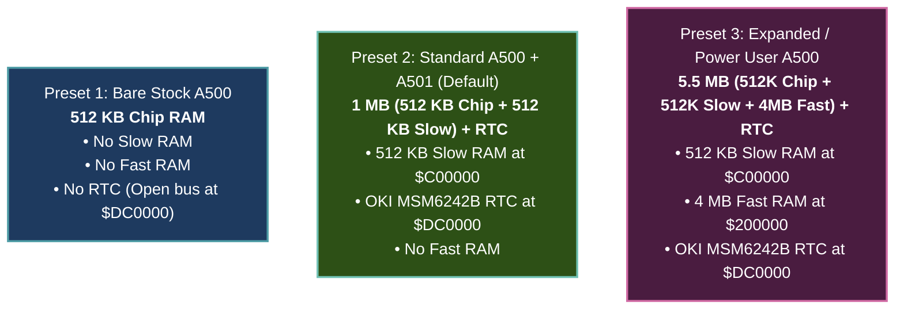

# Amiga 500 Configuration Specification (`A500Config`)

> [!NOTE]
> All ROM binaries, disk images, and memory configurations are injected into the core externally as raw byte slices (`&[u8]`), preserving WASM portability and system independence (see [AGENTS.md](../../../AGENTS.md)).
> Implementation resides in the dedicated foundational crate [`crates/config`](../../../crates/config).
> Physical memory layout is applied in [MemoryBus.md](MemoryBus.md), RTC models in [RTC.md](RTC.md), chipset variants in [Agnus.md](Agnus.md) and [Denise.md](Denise.md), and system coordinator setup in [Main loop A500.md](Main%20loop%20A500.md).

---

## 1. Focused Scope: 3 Canonical Hardware Presets

To achieve cycle-exact emulation and eliminate configuration explosion, the emulator core is configured exclusively through **three canonical hardware presets**:

1. **Preset 1 (`Bare512k`)**: Factory unexpanded 1987 A500. 512 KB Chip RAM only, no expansions, open bus `$FF` at `$DC0000`.
2. **Preset 2 (`Standard1Mb`, Default)**: The golden standard for >90% of Amiga 500 games and demoscene productions. 512 KB Chip + 512 KB Slow RAM (`$C00000`) + OKI MSM6242B RTC at `$DC0000`.
3. **Preset 3 (`ExpandedPowerUser`)**: 512 KB Chip + 512 KB Slow + 4 MB Auto-Config Fast RAM (`$200000`) + OKI MSM6242B RTC. Ideal for Workbench productivity, WHDLoad, and compilers.

---

## 2. Configuration Immutability & Data Structure

`A500Config` enforces strict encapsulation:
* **Read-Only**: Internal fields are private and accessible solely via public getters (`active_preset()`, `chip_ram()`, `slow_ram()`, `fast_ram()`, `rtc()`, `video_standard()`).
* **Single Mutation Vector**: Configuration can only be modified atomically via `apply_preset(preset)`.
* **RTC Model**: Held internally as an explicit `RtcModel` enum.

The master configuration is encapsulated in [`A500Config`](../../../crates/config/src/config.rs), which strictly enforces immutability and single-point mutation:
- **Encapsulated Types (Defined directly in [`crates/config/src/config.rs`](../../../crates/config/src/config.rs)):**
  - **`A500Preset`**: Canonical hardware presets (`Bare512k`, `Standard1Mb`, `ExpandedPowerUser`).
  - **`VideoStandard`**: Display timing standard (`Pal` at ~50 Hz / 3.546895 MHz CCK, `Ntsc` at ~60 Hz / 3.579545 MHz CCK).
  - **`ChipRamSize`**: Chip RAM sizing (`Kb512`).
  - **`SlowRamSize`**: Trapdoor pseudo-fast RAM (`None`, `Kb512` at `$C00000`).
  - **`FastRamSize`**: Auto-config expansion RAM (`None`, `Mb4` at `$200000`).
  - **`RtcModel`**: Real-time clock hardware (`None` [floating open bus `$FF`], `Msm6242b` [OKI MSM6242B at `$DC0000`]).
- **Constructors & Mutation**:
  - Constructors: `A500Config::bare_512k(video)`, `standard_1mb(video)`, `expanded_power_user(video)`, or `from_preset(preset, video)`.
  - Mutation Vector: Atomic preset application via `config.apply_preset(preset)`. All fields are accessed externally via read-only getters (`active_preset()`, `chip_ram()`, `slow_ram()`, `fast_ram()`, `rtc()`, `video_standard()`).

---

## 3. ROM & Image Injection Interfaces

Because the emulator core is system-agnostic and decoupled from the host filesystem (Rule 1.1 and Rule 2.5 in [AGENTS.md](../../../AGENTS.md)), all ROMs and disk images are injected strictly as external byte slices (`&[u8]`):
- **Kickstart ROM Injection**: The top-level machine constructor accepts `kickstart_rom: &[u8]`, validating exact length (256 KB or 512 KB) before loading into `MemoryBus` and executing initial cold reset.
- **Floppy ADF Injection**: Disk drives accept ADF images as raw byte slices `&[u8]`, enabling seamless operation in both desktop environments and WebAssembly canvas contexts.
- **Zero Host I/O in Core**: No `std::fs` operations exist inside the core emulation engine.

---

## 4. Standard Preset Profiles

1. **Stock Amiga 500 (1987 baseline):**
   - PAL 50Hz, 512 KB Chip RAM, No Slow RAM, No Fast RAM.
   - Port 1: Mouse, Port 2: Joystick.
   - Agnus OCS 8371, Denise OCS 8362, Kickstart 1.2 or 1.3 (256 KB).
2. **Classic 1 MB Gaming Setup (Most common A500):**
   - PAL 50Hz, 512 KB Chip RAM + 512 KB Slow RAM (A501 trapdoor).
   - Port 1: Mouse, Port 2: Joystick.
   - Agnus OCS 8371, Denise OCS 8362, Kickstart 1.3.
3. **Productivity / Expanded Setup:**
   - PAL 50Hz, 512 KB Chip RAM + 512 KB Slow RAM + 4 MB Fast RAM.
   - Kickstart 1.3.

---

## 5. Future Roadmap Extensions (Post-A500)

*The following configurations are deferred to subsequent project milestones:*
- **A500 Rev 6A / Late OCS:** 1 MB Chip RAM jumperable option (Fat Agnus 8372A in OCS mode).
- **A500 Plus (ECS):** 1 MB Chip RAM (`ChipRamSize::Mb1`), ECS Agnus 8372A (`AgnusModel::Ecs1Mb`), ECS Denise 8373 (`DeniseModel::Ecs8373`), Kickstart 2.04 (512 KB).
- **Megachip / ECS 2MB:** 2 MB Chip RAM (`ChipRamSize::Mb2`), Agnus 8372B.
- **A1200 (AGA):** 68EC020 CPU (32-bit), 2 MB Chip RAM, Alice (AGA Agnus), Lisa (AGA Denise), 24-bit color palette.
- **Extended Peripherals:** 4-Player Parallel Port Joystick adapter, analog proportional joysticks.

---

## 6. Reference Documentation & Upstream Ground Truth

- [Amiga Hardware Reference Manual: Appendix D (System Memory Map)](../Reference/Hardware%20Reference%20Manual/12%20-%20Appendix%20D%20-%20System%20Memory%20Map.md): Memory map boundaries for 512 KB Chip, 512 KB Slow, and 8 MB Auto-Config address spaces.
- [A500/A2000 Technical Reference Manual: Section 1 (Summary of Differences)](../Reference/A500%20A2000%20Technical%20Reference%20Manual/01%20-%20Section%201%20Summary%20of%20Differences.md): Motherboard revision differences, jumper configurations (JP2 512K/1MB Agnus, JP1 50/60Hz tick), and expansion bus options.
- [Configuration Subsystem Implementation Source](../../../crates/config/src/config.rs): Rust implementation of `A500Config`, hardware presets (`Bare512k`, `Standard1Mb`, `ExpandedPowerUser`), and video standards.
