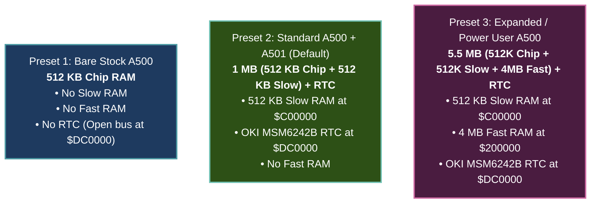

# Amiga 500 Configuration Specification (`A500Config`)

> [!NOTE]
> All ROM binaries, disk images, and memory configurations are injected into the core externally as raw byte slices (`&[u8]`), preserving WASM portability and system independence (see [AGENTS.md](file:///d:/Programowanie/Amiga/AGENTS.md)).
> Implementation resides in the dedicated foundational crate [`crates/config`](file:///d:/Programowanie/Amiga/crates/config).

---

## 1. Focused Scope: 3 Canonical Hardware Presets

To achieve cycle-exact emulation and eliminate configuration explosion, the emulator core is configured exclusively through **three canonical hardware presets**:



1. **Preset 1 (`Bare512k`)**: Factory unexpanded 1987 A500. 512 KB Chip RAM only, no expansions, open bus `$FF` at `$DC0000`.
2. **Preset 2 (`Standard1Mb`, Default)**: The golden standard for >90% of Amiga 500 games and demoscene productions. 512 KB Chip + 512 KB Slow RAM (`$C00000`) + OKI MSM6242B RTC at `$DC0000`.
3. **Preset 3 (`ExpandedPowerUser`)**: 512 KB Chip + 512 KB Slow + 4 MB Auto-Config Fast RAM (`$200000`) + OKI MSM6242B RTC. Ideal for Workbench productivity, WHDLoad, and compilers.

---

## 2. Configuration Immutability & Data Structure

`A500Config` enforces strict encapsulation:
* **Read-Only**: Internal fields are private and accessible solely via public getters (`active_preset()`, `chip_ram()`, `slow_ram()`, `fast_ram()`, `rtc()`, `video_standard()`).
* **Single Mutation Vector**: Configuration can only be modified atomically via `apply_preset(preset)`.
* **RTC Model**: Held internally as an explicit `RtcModel` enum.

```rust
use serde::{Deserialize, Serialize};

/// Canonical hardware configuration presets
#[derive(Debug, Clone, Copy, PartialEq, Eq, Serialize, Deserialize)]
pub enum A500Preset {
    /// Preset 1: Bare Stock A500 (512 KB Chip RAM, no expansions, no RTC)
    Bare512k,
    /// Preset 2: Standard A500 + A501 (512 KB Chip + 512 KB Slow RAM + MSM6242B RTC)
    Standard1Mb,
    /// Preset 3: Power User A500 (512 KB Chip + 512 KB Slow + 4 MB Fast RAM + MSM6242B RTC)
    ExpandedPowerUser,
}

/// Real-Time Clock hardware model
#[derive(Debug, Clone, Copy, PartialEq, Eq, Serialize, Deserialize)]
pub enum RtcModel {
    /// No RTC installed (returns floating bus $FF at $DC0000..$DC003F)
    None,
    /// OKI MSM6242B (standard on A501 expansion, A500+, and A2000)
    Msm6242b,
}

/// Master configuration struct for the Amiga 500 emulator
#[derive(Debug, Clone, PartialEq, Eq, Serialize, Deserialize)]
pub struct A500Config {
    preset: A500Preset,
    video_standard: VideoStandard,
    chip_ram: ChipRamSize,
    slow_ram: SlowRamSize,
    fast_ram: FastRamSize,
    rtc: RtcModel,
}

impl A500Config {
    pub fn from_preset(preset: A500Preset, video: VideoStandard) -> Self;
    pub fn bare_512k(video: VideoStandard) -> Self;
    pub fn standard_1mb(video: VideoStandard) -> Self;
    pub fn expanded_power_user(video: VideoStandard) -> Self;

    /// The only mutation vector: applies a canonical preset atomically
    pub fn apply_preset(&mut self, preset: A500Preset);

    // Read-only getters
    pub fn active_preset(&self) -> A500Preset;
    pub fn video_standard(&self) -> VideoStandard;
    pub fn chip_ram(&self) -> ChipRamSize;
    pub fn slow_ram(&self) -> SlowRamSize;
    pub fn fast_ram(&self) -> FastRamSize;
    pub fn rtc(&self) -> RtcModel;
}

#[derive(Debug, Clone, Copy, PartialEq, Eq, Serialize, Deserialize)]
pub enum VideoStandard {
    /// PAL: 50 Hz vertical refresh, ~3.546895 MHz Color Clock (CCK)
    Pal,
    /// NTSC: 60 Hz vertical refresh, ~3.579545 MHz Color Clock (CCK)
    Ntsc,
}

#[derive(Debug, Clone, Copy, PartialEq, Eq, Serialize, Deserialize)]
pub enum ChipRamSize {
    Kb512,
}

#[derive(Debug, Clone, Copy, PartialEq, Eq, Serialize, Deserialize)]
pub enum SlowRamSize {
    None,
    Kb512,
}

#[derive(Debug, Clone, Copy, PartialEq, Eq, Serialize, Deserialize)]
pub enum FastRamSize {
    None,
    Mb4,
}

#[derive(Debug, Clone, Copy, PartialEq, Eq, Serialize, Deserialize)]
pub enum AgnusModel {
    /// OCS 8370 (NTSC 512 KB) / 8371 (PAL 512 KB)
    Ocs512Kb,
}

#[derive(Debug, Clone, Copy, PartialEq, Eq, Serialize, Deserialize)]
pub enum DeniseModel {
    /// OCS 8362 (Standard OCS Denise)
    Ocs8362,
}

#[derive(Debug, Clone, Copy, PartialEq, Eq, Serialize, Deserialize)]
pub enum GamePortDevice {
    /// Two-button quadrature mouse (default on Port 1)
    Mouse,
    /// Atari-standard digital 2-button joystick (default on Port 2)
    Joystick,
    /// Nothing plugged in
    None,
}

#[derive(Debug, Clone, PartialEq, Eq, Serialize, Deserialize)]
pub struct FloppyConfig {
    pub df0_enabled: bool,
    pub df1_enabled: bool,
    pub df2_enabled: bool,
    pub df3_enabled: bool,
}
```

---

## 3. ROM & Image Injection Interfaces

Because the emulator core is decoupled from the host filesystem, ROMs and disk images are injected as byte slices:

```rust
impl A500 {
    /// Instantiate a new machine with the specified configuration and Kickstart ROM image
    pub fn new(config: A500Config, kickstart_rom: &[u8]) -> Result<Self, ConfigError> {
        // Validate Kickstart ROM length (256 KB or 512 KB)
        // Initialize MemoryBus, CPU, Agnus, Denise, Paula, CIAs
        // Perform initial Cold Reset
        todo!()
    }

    /// Insert or swap an ADF floppy disk image into a specific drive (e.g. DF0)
    pub fn insert_floppy(&mut self, drive: usize, adf_bytes: &[u8]) -> Result<(), FloppyError> {
        todo!()
    }

    /// Eject disk from specified drive
    pub fn eject_floppy(&mut self, drive: usize) {
        todo!()
    }
}
```

---

## 4. Standard Preset Profiles

1. **Stock Amiga 500 (1987 baseline):**
   - PAL 50Hz, 512 KB Chip RAM, No Slow RAM, No Fast RAM.
   - Port 1: Mouse, Port 2: Joystick.
   - Agnus OCS 8371, Denise OCS 8362, Kickstart 1.2 or 1.3 (256 KB).
2. **Classic 1 MB Gaming Setup (Most common A500):**
   - PAL 50Hz, 512 KB Chip RAM + 512 KB Slow RAM (A501 trapdoor).
   - Port 1: Mouse, Port 2: Joystick.
   - Agnus OCS 8371, Denise OCS 8362, Kickstart 1.3.
3. **Productivity / Expanded Setup:**
   - PAL 50Hz, 512 KB Chip RAM + 512 KB Slow RAM + 4 MB Fast RAM.
   - Kickstart 1.3.

---

## 5. Future Roadmap Extensions (Post-A500)

*The following configurations are deferred to subsequent project milestones:*
- **A500 Rev 6A / Late OCS:** 1 MB Chip RAM jumperable option (Fat Agnus 8372A in OCS mode).
- **A500 Plus (ECS):** 1 MB Chip RAM (`ChipRamSize::Mb1`), ECS Agnus 8372A (`AgnusModel::Ecs1Mb`), ECS Denise 8373 (`DeniseModel::Ecs8373`), Kickstart 2.04 (512 KB).
- **Megachip / ECS 2MB:** 2 MB Chip RAM (`ChipRamSize::Mb2`), Agnus 8372B.
- **A1200 (AGA):** 68EC020 CPU (32-bit), 2 MB Chip RAM, Alice (AGA Agnus), Lisa (AGA Denise), 24-bit color palette.
- **Extended Peripherals:** 4-Player Parallel Port Joystick adapter, analog proportional joysticks.
