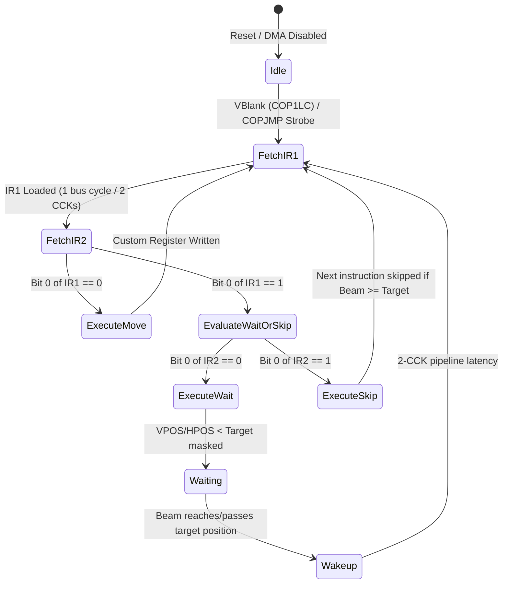

# Copper Coprocessor Architecture & Hardware Specification

> [!NOTE]
> System execution constraints, memory bus arbitration, and Color Clock timing are defined in [AGENTS.md](../../../AGENTS.md), [MemoryBus.md](MemoryBus.md), and [Main loop A500.md](Main%20loop%20A500.md).
> Detailed inter-chip signal rules are codified in [`hardware-bus-topology.md`](../../../.agents/rules/hardware-bus-topology.md).
> Master DMA slot allocation is governed by [DMA.md](DMA.md). Agnus raster beam tracking is detailed in [Agnus.md](Agnus.md), and interrupt routing to the CPU is managed by [Paula.md](Paula.md).

---

## 1. Core Decisions & Architectural Principles

The Copper is an autonomous, programmable display coprocessor integrated into the Agnus custom chip. It executes in lockstep with the electron beam position, enabling synchronized register modifications without Motorola 68000 CPU intervention.



### 1.1 Core Invariants
1. **Bus Synchronized Execution:** Every Copper instruction occupies exactly 32 bits (two 16-bit words: `IR1` and `IR2`). Fetching an instruction requires 2 memory bus cycles (4 Color Clocks / CCKs).
2. **Autonomous Custom Register Driving:** The Copper writes directly into custom chip registers ($DFF000–$DFF1FE), modifying colors, audio periods, sprite positions, and bitplane pointers on exact raster lines and horizontal positions.
3. **Copper Danger Mode (`CDANG`):** Controlled by bit 1 of `COPCON` (`$DFF02E`). When `CDANG == 0`, writes to custom registers below `$DFF080` (such as Blitter and early custom registers) are locked out and executed as no-ops.
4. **Physical Beam Lead Timing:** On physical Agnus silicon, the beam comparator circuitry wakes up 2 Color Clocks ahead of instruction fetch execution (`COPPER_WAKEUP_HPOS_LEAD = 2`), ensuring color palette changes latch cleanly before active display generation.

---

## 2. Module Architecture & Crate Containment (`crates/copper`)

The Copper engine resides in its dedicated workspace crate `crates/copper`, fully decoupled from Agnus and memory storage:

```
crates/copper/
├── Cargo.toml
├── src/
│   └── copper.rs          // Copper state machine, instruction decoding, comparators
└── tests/
    └── test_copper.rs     // Cycle-exact instruction validation & edge case suites
```

### 2.1 State Machine Representation (`CopperState`)
```rust
#[derive(Debug, Clone, Copy, PartialEq, Eq, Default, Serialize, Deserialize)]
pub enum CopperState {
    #[default]
    Idle,
    FetchIR1(u8),
    FetchIR2(u8),
    Waiting,
    Wakeup(u8),
    WaitPipeline(u8),
}
```

- **`Idle`:** The coprocessor is stopped or waiting for DMA enablement (`COPEN` in `DMACON`).
- **`FetchIR1(remaining)`:** Agnus fetches the first 16-bit word (`IR1`) from Chip RAM via the Copper program counter (`cop_pc`).
- **`FetchIR2(remaining)`:** Agnus fetches the second 16-bit word (`IR2`) from Chip RAM.
- **`Waiting`:** Beam comparator actively evaluates vertical and horizontal raster coordinates against target values on each Color Clock.
- **`Wakeup(latency)`:** 2-CCK internal pipeline recovery before resuming the next instruction fetch.
- **`WaitPipeline(latency)`:** 4-CCK (2 bus cycles) latency before the beam comparator becomes active after decoding a `WAIT`.

---

## 3. Instruction Set Architecture (3 Instructions, 32 Bits Each)

The Copper instruction set consists of three 32-bit instructions distinguished by bit 0 of `IR1` and `IR2`:

| Instruction | Word 1 (`IR1`) | Word 2 (`IR2`) | Description |
| :--- | :---: | :---: | :--- |
| **`MOVE`** | `0000 000R RRRR RRR0` | `DDDD DDDD DDDD DDDD` | Write 16-bit immediate value `D` to register offset `R` (`$DFF000 + R`) |
| **`WAIT`** | `VVVV VVVV HHHH HHH1` | `BMVV VVVV HHHH HHH0` | Halt Copper until `(VPOS, HPOS) >= Target` masked by Word 2 |
| **`SKIP`** | `VVVV VVVV HHHH HHH1` | `BMVV VVVV HHHH HHH1` | Skip next instruction if `(VPOS, HPOS) >= Target` masked by Word 2 |

### 3.1 `MOVE` Instruction (Register Write)
- **Decoding:** Bit 0 of `IR1` is `0`. Register offset is extracted via `IR1 & 0x01FE`.
- **Target Offset:** Specifies a custom register in the `$DFF000`–`$DFF1FE` range.
- **Danger Mode Protection:**
  - If `offset < $080` and `cdang == false`, the write is suppressed (no-op).
  - On OCS Agnus, registers below `$040` (`COPPER_OCS_MIN_REGISTER_LIMIT`) cannot be written by the Copper under any circumstances.
- **Strobe Detection:** If the target register is `COPJMP1` (`$088`) or `COPJMP2` (`$08A`), the Copper jumps to `COP1LC` or `COP2LC` immediately.

### 3.2 `WAIT` Instruction (Beam & Blitter Synchronization)
- **Decoding:** Bit 0 of `IR1` is `1`, and bit 0 of `IR2` is `0`.
- **Target Beam Position:**
  - `V = (IR1 >> 8) & 0xFF`
  - `H = IR1 & 0xFE`
- **Masks (Word 2):**
  - Vertical compare mask: `(IR2 >> 8) & 0x7F`. **Silicon Quirk:** Bit 7 of the vertical mask (`0x80`) is permanently wired to `1` on physical Agnus hardware.
  - Horizontal compare mask: `IR2 & 0xFE`.
- **Blitter Finish Disable (`BFD`, Bit 15 of `IR2`):**
  - If bit 15 is `0`: The Copper requires both the beam position condition **AND** the Blitter Done condition (`BLTDONE == true`) to wake up.
  - If bit 15 is `1`: The Copper ignores Blitter status and wakes up solely based on beam coordinates.
- **End-of-Copper-List Sentinel (`$FFFFFFFE`):**
  - A `WAIT` with $V = 255$, $H = 254$, and masks $V_{\text{mask}} = 127$, $H_{\text{mask}} = 254$ halts the Copper until the start of vertical blanking on scanline 0.

### 3.3 `SKIP` Instruction (Conditional Skip)
- **Decoding:** Bit 0 of `IR1` is `1`, and bit 0 of `IR2` is `1`.
- **Evaluation:** Performs the identical beam comparison as `WAIT`.
- **Outcome:** If current `(VPOS, HPOS)` is greater than or equal to the masked target, the Copper increments its program counter by 4 bytes (`cop_pc += 4`), skipping the immediately following 32-bit instruction.

---

## 4. Hardware Registers & Address Pointers

| Address | R/W | Symbol | Description |
| :--- | :---: | :--- | :--- |
| **`$DFF02E`** | W | **`COPCON`** | Copper Control (Bit 1: `CDANG` Copper Danger mode) |
| **`$DFF080`** | W | **`COP1LCH`** | Copper First Location Pointer High (High 3/5 bits) |
| **`$DFF082`** | W | **`COP1LCL`** | Copper First Location Pointer Low (Low 16 bits, word-aligned) |
| **`$DFF084`** | W | **`COP2LCH`** | Copper Second Location Pointer High (High 3/5 bits) |
| **`$DFF086`** | W | **`COP2LCL`** | Copper Second Location Pointer Low (Low 16 bits, word-aligned) |
| **`$DFF088`** | W/R | **`COPJMP1`** | Copper Restart at `COP1LC` (strobe; read returns open bus) |
| **`$DFF08A`** | W/R | **`COPJMP2`** | Copper Restart at `COP2LC` (strobe; read returns open bus) |
| **`$DFF08C`** | W | **`COPINS`** | Copper Instruction Register latch |

### 4.1 Address Pointer Wrapping & Masking
All Copper pointers (`COP1LC`, `COP2LC`, `cop_pc`) operate strictly within Chip RAM:
- **OCS (512 KB):** Masked with `COPPER_ADDRESS_MASK_512K` (`0x0007_FFFE`).
- **ECS (1 MB):** Masked with `0x000F_FFFE`.

---

## 5. Motherboard Coordination & Signal Routing

In accordance with [`hardware-bus-topology.md`](../../../.agents/rules/hardware-bus-topology.md), the Copper has zero direct references to other chips or host memory:
1. **Vertical Blank Reset:** At the start of vertical blanking (scanline 0), Agnus reloads the Copper program counter from `COP1LC` and initiates instruction fetching.
2. **Interrupt Signaling:** If the Copper writes to `INTREQ` (`$09C`) with bit 4 set (`COPER`), Paula asserts the Level 3 interrupt line to the 68000 CPU.
3. **Cycle Lockout on Cycle `$E0`:** On physical Agnus silicon, horizontal cycle `$E0` is reserved for DRAM refresh/overhead, locking Copper DMA fetching for that cycle.

---

## 6. Reference Documentation & Upstream Ground Truth

- [Amiga Hardware Reference Manual: Chapter 2 (Coprocessor Hardware)](../Reference/Hardware%20Reference%20Manual/02%20-%20Chapter%202%20-%20Coprocessor%20Hardware.md): Authoritative specification for Copper instruction formats (`MOVE`, `WAIT`, `SKIP`), danger registers (`COPCON`), and beam synchronization.
- [vAmiga Copper Component Implementation](../../../ref_src/vAmiga-4.5/Core/Components/Agnus/Copper/Copper.cpp): Cycle-exact state machine model for Copper instruction decode, comparators, and DMA slot fetches.
- [Agnus Architecture Specification](Agnus.md): Master Agnus coordinator, beam counters, and register mapping.
- [DMA Architecture & Scheduling](DMA.md): 227.5 CCK horizontal slot scheduling and Copper bus priority.
