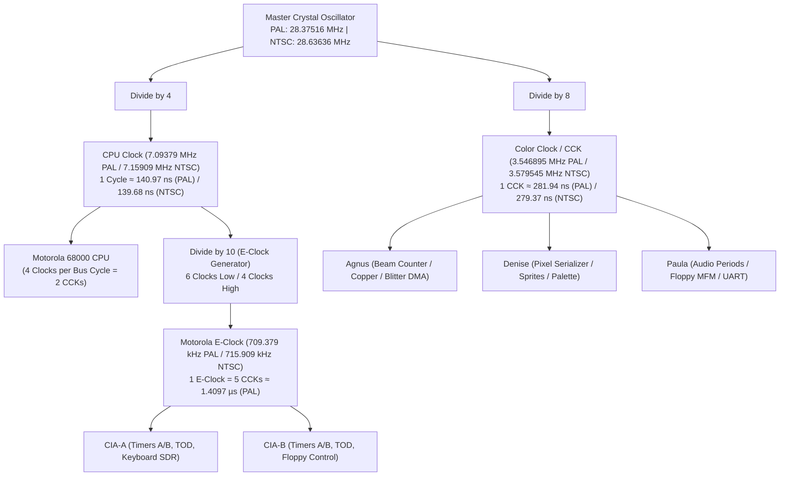

# Amiga 500 Master CycleCounter & Hardware Clock Hierarchy

> [!NOTE]
> System execution constraints, zero-allocation hot path rules, and 2-phase Color Clock guidelines are defined in [AGENTS.md](file:///d:/Programowanie/Amiga/AGENTS.md).
> Bus arbitration using Color Clock phases is specified in [MemoryBus.md](file:///d:/Programowanie/Amiga/Obsidian/Amiga/Design/MemoryBus.md).
> Machine stepping integration is detailed in [Main loop A500.md](file:///d:/Programowanie/Amiga/Obsidian/Amiga/Design/Main%20loop%20A500.md).

---

## 1. System Clock Generation & Master Hierarchy

The Amiga 500 derives all system clock frequencies from a single high-precision master crystal oscillator. All major processing units—Motorola 68000 CPU, custom chips (Agnus, Denise, Paula), and Complex Interface Adapters (MOS 8520 CIAs)—operate in strict synchronous harmonic lock:



### 1.1 Master Frequency Standards

| Standard | Master Oscillator ($f_{\text{master}}$) | CPU Clock ($f_{\text{cpu}} = \frac{f_{\text{master}}}{4}$) | Color Clock ($f_{\text{cck}} = \frac{f_{\text{master}}}{8}$) | E-Clock ($f_{\text{e}} = \frac{f_{\text{cpu}}}{10}$) | CCK Period ($T_{\text{cck}}$) |
| :--- | :---: | :---: | :---: | :---: | :---: |
| **PAL** | **$28.375160\ \text{MHz}$** | **$7.093790\ \text{MHz}$** | **$3.546895\ \text{MHz}$** | **$709.379\ \text{kHz}$** | $\approx 281.9368\ \text{ns}$ |
| **NTSC** | **$28.636360\ \text{MHz}$** | **$7.159090\ \text{MHz}$** | **$3.579545\ \text{MHz}$** | **$715.909\ \text{kHz}$** | $\approx 279.3651\ \text{ns}$ |

---

## 2. The Color Clock (CCK) Fundamental Unit

The primary unit of synchronization in the emulator is the **Color Clock (CCK)**. One Color Clock represents exactly:
- **$2$ Motorola 68000 CPU clock ticks**.
- **$1$ low-resolution pixel clock** ($3.55\ \text{MHz}$ / $140\ \text{ns}$ per low-res pixel in Denise, or $2$ hi-res pixels at $7\ \text{MHz}$, or $4$ super-hires pixels at $14\ \text{MHz}$).
- **$1$ memory bus slot** in Chip RAM.
- **$\frac{1}{5}$ of a Motorola E-Clock tick** ($5\ \text{CCKs} = 1\ \text{E-Clock}$).

### 2.1 Color Clock Phases: CCK1 & CCK2

A standard Motorola 68000 bus cycle requires $4$ CPU clock cycles ($S_0$ through $S_7$), which maps directly onto **two consecutive Color Clocks**:

```
CPU Clock:  | S0 | S1 | S2 | S3 | S4 | S5 | S6 | S7 |
            |-------------------|-------------------|
CCK Cycle:  |       CCK1        |       CCK2        |
            | (Bus Address/Strobe) | (Data Transfer/Latch) |
```

- **Phase 1 (CCK1: States $S_0$–$S_3$):**
  - CPU drives the 24-bit physical address bus (`A1`–`A23`) and Function Code pins (`FC0`–`FC2`).
  - Read/Write line (`R/_W`) is established.
  - Address Strobe (`_AS`) and Data Strobes (`_UDS` / `_LDS` on read) are asserted.
  - Chip RAM bus arbitration is evaluated in [MemoryBus.md](file:///d:/Programowanie/Amiga/Obsidian/Amiga/Design/MemoryBus.md): if custom chip DMA is asserting ownership, the cycle blocks.
- **Phase 2 (CCK2: States $S_4$–$S_7$):**
  - Transfer acknowledge (`_DTACK`) is sampled at state $S_4$. If not asserted by Gary/chipset, wait states are inserted.
  - On write, data is driven onto `D0`–`D15` and data strobes are asserted.
  - On read, data is latched into the CPU internal read buffer and strobes are deasserted.
  - Cycle completes and bus returns to idle before next transaction.

### 2.2 Memory Interleaving & DMA Slot Scheduling

Because custom chips and the CPU share the Chip RAM bus, memory cycles are interleaved at the Color Clock boundary:
- **Even CCK Slots:** Reserved for Agnus DMA channels (Bitplanes, Copper, Blitter, Audio, Sprites, Floppy disk).
- **Odd CCK Slots:** Available for the Motorola 68000 CPU.
- **Cycle Stealing ("Blitter Nasty"):** If Bitplane DMA bandwidth is maximized (4 to 6 bitplanes active in low-res, or high-res display) or if Blitter Nasty mode (`BLTPRI` in `DMACON`) is asserted, Agnus claims odd cycles as well, causing CPU wait states (`MemoryBusResult::Blocked`).

---

## 3. Motorola E-Clock Timing (CIA Synchronization)

The MOS 8520 CIAs ([CIA.md](file:///d:/Programowanie/Amiga/Obsidian/Amiga/Design/CIA.md)) are clocked by the Motorola **E-Clock**, which is generated internally by the 68000 CPU (or equivalent timing logic) by dividing the CPU clock by $10$ (a fixed ratio of $5$ CCKs per E-Clock tick):

```
CCK Tick:   |   0   |   1   |   2   |   3   |   4   |   0   |
CPU Clocks: | 0 | 1 | 2 | 3 | 4 | 5 | 6 | 7 | 8 | 9 | 0 | 1 |
E-Clock:    |________LOW (6 Clocks)_________|__HIGH (4 Clocks)__|
```

- **Duty Cycle:** $60\%$ Low ($6$ CPU clocks / $3$ CCKs), $40\%$ High ($4$ CPU clocks / $2$ CCKs).
- **Timer Decrementing:** CIA Timers A and B decrement once per complete E-Clock cycle ($1$ tick every $5$ CCKs).
- **Phase Alignment:** `CycleCounter` tracks the internal E-Clock sub-phase ($0..4$) to trigger CIA timer decrements deterministically without floating-point math.

---

## 4. Raster Beam Geometry & Frame Metrics

Agnus generates the horizontal and vertical display timing by counting Color Clocks along each raster line:

### 4.1 PAL Standard Display Timing

- **Color Clocks per Line:** $227.5$ CCKs average.
  - Implemented as alternating scanlines: **Short Line ($227$ CCKs = $454$ CPU clocks)** and **Long Line ($228$ CCKs = $456$ CPU clocks)**.
- **Lines per Frame:** $312$ scanlines in non-interlaced mode; $313$ / $312$ lines in interlaced mode (Field 1 / Field 2).
- **Total Color Clocks per Frame (Non-Interlaced):**
  $$\text{Total CCKs} = 312 \times 227.5 = 70,937\ \text{CCKs}$$
- **Frame Rate:**
  $$\text{Frame Rate} = \frac{3,546,895\ \text{Hz}}{70,937\ \text{CCKs}} \approx 50.0006\ \text{Hz}$$

### 4.2 NTSC Standard Display Timing

- **Color Clocks per Line:** $227.5$ CCKs average ($227$ / $228$ alternating).
- **Lines per Frame:** $262$ scanlines non-interlaced; $263$ / $262$ lines interlaced.
- **Total Color Clocks per Frame (Non-Interlaced):**
  $$\text{Total CCKs} = 262 \times 227.5 = 59,605\ \text{CCKs}$$
- **Frame Rate:**
  $$\text{Frame Rate} = \frac{3,579,545\ \text{Hz}}{59,605\ \text{CCKs}} \approx 60.0544\ \text{Hz}$$

### 4.3 Raster Beam Coordinate Space

Horizontal beam counter values (`HPOS`) and vertical beam counter values (`VPOS`) are tracked by Agnus ([Agnus.md](file:///d:/Programowanie/Amiga/Obsidian/Amiga/Design/Agnus.md)) and read via registers `VHPOSR` (`$DFF004`) and `VPOSR` (`$DFF006`):

```
Horizontal Scanline:
0 ------------------- HPOS (0 .. $E3 / 227 CCK) -------------------> 227
|  Blanking / Sync  | Display Data Fetch (DDF) | Border / Blanking  |
```

---

## 5. Rust Engine Implementation

The `CycleCounter` is a copyable, zero-allocation struct that serves as the single source of truth for global emulation time.

```rust
use serde::{Deserialize, Serialize};

/// Identifies the active sub-phase of a 68000 bus cycle.
#[derive(Debug, Clone, Copy, PartialEq, Eq, Serialize, Deserialize)]
pub enum CckPhase {
    /// Phase 1: Address output, strobes asserted, bus arbitration evaluated
    Cck1,
    /// Phase 2: Data latched / written, _DTACK sampled, strobes deasserted
    Cck2,
}

/// Target video timing standard.
#[derive(Debug, Clone, Copy, PartialEq, Eq, Serialize, Deserialize)]
pub enum VideoStandard {
    Pal,
    Ntsc,
}

/// Master hardware cycle counter tracking Color Clocks and sub-phases.
#[derive(Debug, Clone, Copy, PartialEq, Eq, Serialize, Deserialize)]
pub struct CycleCounter {
    /// Monotonically increasing 64-bit Color Clock counter.
    /// At 3.55 MHz, a u64 counter will run for over 164,000 years without overflowing.
    total_cck: u64,
    /// Current bus cycle phase (CCK1 vs CCK2).
    phase: CckPhase,
    /// Sub-phase counter within the 5-CCK E-Clock cycle (0..4).
    e_clock_phase: u8,
    /// Configured video standard (PAL or NTSC).
    standard: VideoStandard,
    /// Current raster horizontal position (0..227).
    hpos: u16,
    /// Current raster vertical scanline (0..311 PAL, 0..261 NTSC).
    vpos: u16,
    /// Long-frame toggle bit (LOF) for interlace field tracking.
    lof: bool,
}

impl CycleCounter {
    pub const PAL_CCK_PER_FRAME: u64 = 70_937;
    pub const NTSC_CCK_PER_FRAME: u64 = 59_605;
    pub const E_CLOCK_DIVISOR: u8 = 5;

    pub fn new(standard: VideoStandard) -> Self {
        Self {
            total_cck: 0,
            phase: CckPhase::Cck1,
            e_clock_phase: 0,
            standard,
            hpos: 0,
            vpos: 0,
            lof: false,
        }
    }

    /// Advance master clock by exactly 1 Color Clock (~280 ns).
    /// Returns true if an E-Clock falling edge occurred (triggering CIA timer ticks).
    #[inline(always)]
    pub fn step_cck(&mut self) -> bool {
        self.total_cck = self.total_cck.wrapping_add(1);

        // Toggle bus phase between CCK1 and CCK2
        self.phase = match self.phase {
            CckPhase::Cck1 => CckPhase::Cck2,
            CckPhase::Cck2 => CckPhase::Cck1,
        };

        // Advance raster beam
        self.advance_beam();

        // Advance E-Clock phase (0..4)
        self.e_clock_phase += 1;
        if self.e_clock_phase >= Self::E_CLOCK_DIVISOR {
            self.e_clock_phase = 0;
            true // Trigger CIA timer tick
        } else {
            false
        }
    }

    #[inline(always)]
    fn advance_beam(&mut self) {
        let max_hpos = self.line_cck_count(self.vpos);
        self.hpos += 1;
        if self.hpos >= max_hpos {
            self.hpos = 0;
            self.vpos += 1;
            let max_vpos = match self.standard {
                VideoStandard::Pal => 312,
                VideoStandard::Ntsc => 262,
            };
            if self.vpos >= max_vpos {
                self.vpos = 0;
                self.lof = !self.lof; // Toggle interlace field
            }
        }
    }

    /// Returns the number of CCKs for the current scanline (alternating 227 and 228).
    #[inline(always)]
    pub fn line_cck_count(&self, line: u16) -> u16 {
        if (line & 1) == 0 {
            228
        } else {
            227
        }
    }

    #[inline(always)]
    pub fn total_cck(&self) -> u64 {
        self.total_cck
    }

    #[inline(always)]
    pub fn phase(&self) -> CckPhase {
        self.phase
    }

    #[inline(always)]
    pub fn hpos(&self) -> u16 {
        self.hpos
    }

    #[inline(always)]
    pub fn vpos(&self) -> u16 {
        self.vpos
    }

    #[inline(always)]
    pub fn lof(&self) -> bool {
        self.lof
    }

    pub fn reset(&mut self) {
        self.total_cck = 0;
        self.phase = CckPhase::Cck1;
        self.e_clock_phase = 0;
        self.hpos = 0;
        self.vpos = 0;
        self.lof = false;
    }
}
```

---

## 6. Subsystem Coordination & Scheduling

1. **CPU Bus Cycles:**
   - Every CPU read/write cycle takes $2$ CCK ticks ($1$ bus cycle = $4$ CPU clocks).
   - If `memory_bus` returns `MemoryBusResult::Blocked`, the CPU freezes its state machine and waits for the subsequent Color Clock slot without advancing instruction execution.
2. **Custom Chip DMA:**
   - On every CCK, Agnus evaluates active DMA channels (`DMACON`) and claims Chip RAM memory access.
3. **CIAs:**
   - On every $5^{\text{th}}$ CCK tick (`e_clock_phase == 0`), CIA-A and CIA-B timers decrement by $1$.
4. **Denise Serializer:**
   - Low-res pixels emit every $1$ CCK. Hi-res pixels emit every $0.5$ CCK ($2$ pixels per CCK).
5. **Paula Audio:**
   - Period counters count down each CCK. When a channel counter reaches zero, it latches the next audio sample from Chip RAM via DMA or reloads.