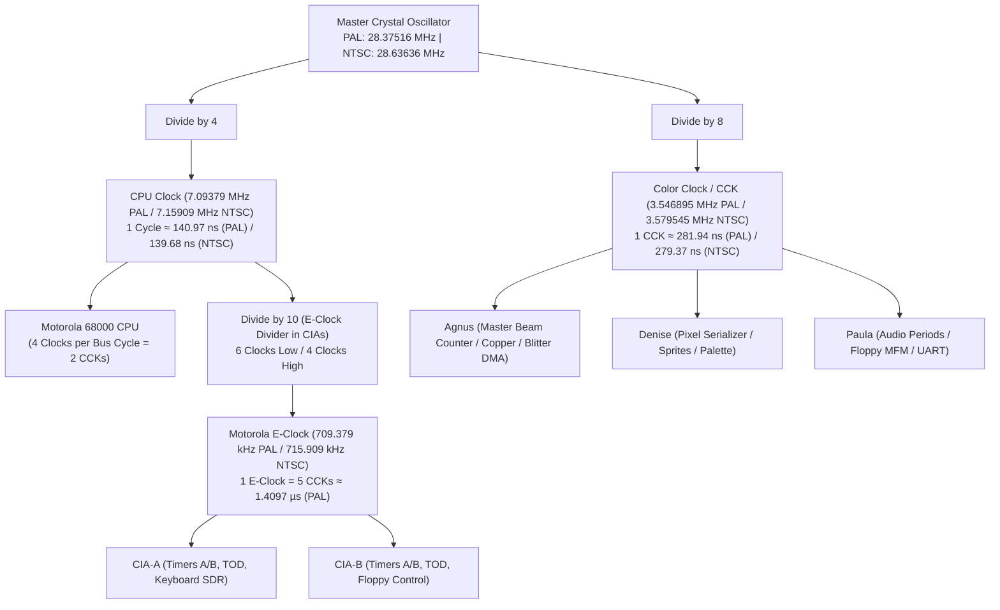

# Amiga 500 Master CycleCounter & Hardware Clock Hierarchy

> [!NOTE]
> System execution constraints, zero-allocation hot path rules, and 2-phase Color Clock guidelines are defined in [AGENTS.md](../../../AGENTS.md).
> Physical bus arbitration, the transparent read latch buffer, and unbuffered write cycles are specified in [MemoryBus.md](MemoryBus.md).
> Master beam position counters (`VHPOSR`, `VPOSR`) are implemented in Agnus ([Agnus.md](Agnus.md)).
> CIA E-Clock division is implemented in [CIA.md](CIA.md).

---

## 1. System Clock Generation & Master Hierarchy

The Amiga 500 derives all system clock frequencies from a single master crystal oscillator. All processing units operate in synchronous harmonic lock:



### 1.1 Master Frequency Standards

| Standard | Master Oscillator ($f_{\text{master}}$) | CPU Clock ($f_{\text{cpu}} = \frac{f_{\text{master}}}{4}$) | Color Clock ($f_{\text{cck}} = \frac{f_{\text{master}}}{8}$) | E-Clock ($f_{\text{e}} = \frac{f_{\text{cpu}}}{10}$) | CCK Period ($T_{\text{cck}}$) |
| :--- | :---: | :---: | :---: | :---: | :---: |
| **PAL** | **$28.375160\ \text{MHz}$** | **$7.093790\ \text{MHz}$** | **$3.546895\ \text{MHz}$** | **$709.379\ \text{kHz}$** | $\approx 281.9368\ \text{ns}$ |
| **NTSC** | **$28.636360\ \text{MHz}$** | **$7.159090\ \text{MHz}$** | **$3.579545\ \text{MHz}$** | **$715.909\ \text{kHz}$** | $\approx 279.3651\ \text{ns}$ |

---

## 2. 2-Phase Bus Timing & Transparent Memory Interleaving

A critical architectural triumph of the Amiga is its ability to share Chip RAM between the Motorola 68000 CPU and custom chip DMA channels:

```
CPU Clock:  | S0 | S1 | S2 | S3 | S4 | S5 | S6 | S7 |
            |-------------------|-------------------|
CCK Slot:   |       CCK1        |       CCK2        |
READ:       | Address & Strobes | Sample Data (S6)  |
            | (Bus Arbitrated)  | (CPU Samples Bus) |
            |-------------------|-------------------|
WRITE:      | Address & Control | Commit Write (S4) |
            | (Bus Arbitrated)  | (Physical RAM)    |
```

### 2.1 The Hardware Timing: 2-Clock CPU vs 1-Clock RAM
- **Motorola 68000 Bus Cycle:** A standard 68000 read or write cycle spans **4 CPU clocks** ($S_0$ through $S_7$), which equals **2 Color Clocks (CCK1 and CCK2)**.
- **Amiga Chip RAM Speed:** The Amiga DRAM memory bus completes a physical memory transfer in **1 Color Clock (280 ns)**.

### 2.2 Read Cycle Execution
1. **During CCK1 ($S_0$–$S_3$):**
   - The CPU presents the target address and asserts strobes (`_AS`, `_UDS`/`_LDS`).
   - If target is Chip RAM and Agnus DMA is active (`chip_ram_blocked == true`), Gary withholds `_DTACK` and the CPU stalls (wait states).
   - If unblocked, arbitration passes and the CPU transitions to CCK2.
2. **During CCK2 ($S_4$–$S_7$):**
   - At $S_6$, data driven on $D_0$–$D_{15}$ is sampled directly by the CPU into its internal target register (`source`, `destination`, `prefetch[0]`, or `irc`).
   - Gary asserts `_DTACK`, the CPU completes its cycle, and the bus transaction finishes without an intermediate bus latch.

### 2.3 Write Cycle Execution
1. **During CCK1 ($S_0$–$S_3$):**
   - The CPU presents the target address, asserts `_AS`, and arbitrates for bus readiness.
   - If target is Chip RAM and occupied by DMA, the CPU stalls before $S_4$.
2. **During CCK2 ($S_4$–$S_7$):**
   - The CPU drives write data onto `D0`–`D15` and asserts data strobes during $S_4$.
   - The write is committed directly to physical Chip RAM.
   - `_DTACK` is acknowledged and the cycle completes.

### 2.4 Conclusion: Interleaved Time-Slot Architecture
In normal operating mode (standard display modes, Blitter Nasty disabled), memory access is cleanly arbitrated across odd/even clock slots:
- DMA channels (Audio, Disk, Copper, Bitplane) take priority during their allocated odd slots.
- The CPU runs smoothly in interleaved slots without unnecessary contention.

---

## 3. Strict Separation of Responsibilities

To prevent tight coupling and synchronization bugs, responsibilities are cleanly isolated across subsystems:

| Subsystem | Dedicated Responsibility | Implementation Location |
| :--- | :--- | :--- |
| **`CycleCounter`** | **Pure 64-bit CCK Cycle Counter:** Tracks elapsed global Color Clocks (`total_cck: u64`). Does not track bus phases, beam coordinates, or E-Clock dividers. | `cycle_counter.rs` |
| **`Agnus` (Beam)** | **Master Raster Beam Tracking:** Coordinates horizontal beam position (`HPOS`), vertical scanlines (`VPOS`), `LOF` interlace field bit, and display timing registers `VHPOSR` / `VPOSR`. | `chips/agnus/beam.rs` (see [Agnus.md](Agnus.md)) |
| **`CIA`** | **E-Clock Division & Prescalers:** Tracks internal E-Clock sub-phase divider ($0..4$) to step Timers A and B every 5 CCKs. | `chips/cia/mod.rs` (see [CIA.md](CIA.md)) |
| **`MemoryBus` / CPU** | **Bus Phase State Machine:** Manages CCK1 vs CCK2 arbitration, wait states, and data bus transfer. | `memory_bus/mod.rs` (see [MemoryBus.md](MemoryBus.md)) |
| **`CpuState` (M68000)** | **Monotonic CPU Clock Cycle Counter:** Tracks elapsed CPU clocks (`cycle_counter: u64`) since reset, incrementing by 2 clocks per CCK micro-step / wait state stall. Queryable globally via `cpu.state.cycle_counter`. | `crates/m68000/src/state.rs` (see [CPU Micro-Step State Machine.md](CPU%20Micro-Step%20State%20Machine.md)) |

---

## 4. Rust Engine Architecture & Public API

The `CycleCounter` is an ultra-lean, copyable, zero-allocation struct whose sole responsibility is counting master Color Clocks. Implementation resides in [`crates/cycle_counter/src/lib.rs`](file:///d:/Programowanie/Amiga/crates/cycle_counter/src/lib.rs):

- **State Representation (`CycleCounter`):**
  - Holds a single private 64-bit monotonically increasing counter (`total_cck: u64`). At ~3.55 MHz, a 64-bit integer runs for over 164,000 years without overflowing.
  - Implements `Default`, `Copy`, `Clone`, `PartialEq`, `Eq`, `Serialize`, `Deserialize`.
- **Core Operational Methods:**
  - `new() -> Self`: Initializes master counter to 0.
  - `step_cck(&mut self)`: Advances global time by exactly 1 Color Clock (~280 ns) using wrapping addition. Annotated with `#[inline(always)]`.
  - `advance_cck(&mut self, count: u64)`: Advances global time by `count` Color Clocks with wrapping arithmetic. Annotated with `#[inline(always)]`.
  - `total_cck(&self) -> u64`: Returns elapsed Color Clock count. Annotated with `#[inline(always)]`.
  - `reset(&mut self)`: Resets elapsed count to 0.
- **Timing Constants:**
  - `PAL_CCK_PER_FRAME`: 70,937 CCKs per video frame.
  - `NTSC_CCK_PER_FRAME`: 59,605 CCKs per video frame.