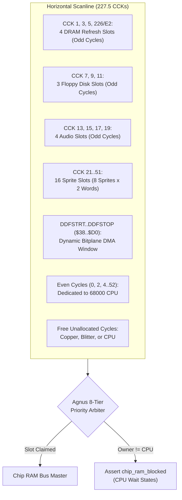

# Agnus DMA Architecture, Slot Scheduling & Bus Arbitration Specification

> [!NOTE]
> System execution constraints, memory bus arbitration, and Color Clock timing are defined in [AGENTS.md](../../../AGENTS.md), [MemoryBus.md](MemoryBus.md), and [Main loop A500.md](Main%20loop%20A500.md).
> Detailed inter-chip signal rules are codified in [`hardware-bus-topology.md`](../../../.agents/rules/hardware-bus-topology.md).
> Coprocessor execution is documented in [Copper.md](Copper.md) and [Blitter.md](Blitter.md). Video display fetching is coordinated with [Denise.md](Denise.md), and audio/floppy streaming with [Paula.md](Paula.md).

---

## 1. Core Decisions & Architectural Principles

Agnus is the sole bus master and direct memory access (DMA) arbiter for the Amiga Chip RAM bus. Every horizontal scanline ($227.5$ Color Clocks) is partitioned into discrete time slots synchronized with the display beam.



### 1.1 Core Hardware Invariants
1. **Exclusive DMA Address Mastership:** Agnus exclusively owns and generates all DMA pointer addresses (`BPLxPT`, `SPRxPT`, `AUDxPT`, `DSKPT`, `COPxLC`, `BLTxPT`).
2. **Passive Peer Latching (Zero Direct Memory Reads):** Peer chips ([Denise.md](Denise.md), [Paula.md](Paula.md)) contain zero DMA address generators and never read `PhysicalMemory` directly. Agnus drives the Chip RAM address and internal `RGA` bus, and peer chips passively latch data off the shared data bus.
3. **Strict Priority Hierarchy:** Contention is resolved on every single Color Clock cycle according to Commodore HRM Figure 6-9.
4. **Fast RAM Immunity:** CPU memory cycles targeting Fast RAM (`$200000`–`$9FFFFF`) bypass Chip RAM arbitration completely and execute with zero wait states even under 100% DMA bus saturation.

---

## 2. Module Architecture & Crate Containment (`crates/dma`)

The DMA scheduler is encapsulated in `crates/dma`:

```
crates/dma/
├── Cargo.toml
├── src/
│   └── dma.rs             // 227.5 CCK slot scheduler, priority arbiter, starvation counters
└── tests/
    └── test_dma.rs        // Slot timing assertions, cycle stealing, Blitter Nasty tests
```

### 2.1 State Representation (`DmaScheduler`)
```rust
#[derive(Debug, Clone, PartialEq, Eq, Serialize, Deserialize)]
pub struct DmaScheduler {
    pub dmacon: u16,
    pub bplcon0: u16,
    pub ddfstrt: u16,
    pub ddfstop: u16,
    pub cpu_starvation_counter: u8,
    pub current_owner: DmaChannel,
    pub chip_ram_blocked: bool,
}
```

---

## 3. 8-Tier Master DMA Priority Hierarchy

On every Color Clock cycle, Agnus evaluates bus mastership across 8 prioritized tiers:

1. **DRAM Refresh (Priority 1):**
   - 4 fixed odd memory cycles per scanline: `CCK 1, 3, 5, 226` (`$E2`).
   - Unconditionally locks the Chip RAM bus to maintain DRAM cell charge.
2. **Floppy Disk DMA (Priority 2):**
   - 3 fixed odd memory cycles: `CCK 7, 9, 11`.
   - Active when `DSKEN` (bit 4) and `DMAEN` (bit 9) are set in `DMACON` and disk pointer is non-zero.
3. **Audio DMA (Priority 3):**
   - 4 fixed odd cycles: `CCK 13` (Channel 0), `15` (Channel 1), `17` (Channel 2), `19` (Channel 3).
   - Active when individual channel bits (`AUD0EN`..`AUD3EN`) and `DMAEN` are set in `DMACON`.
4. **Bitplane DMA (Priority 4):**
   - Dynamically scheduled within the Display Data Fetch window (`DDFSTRT`..=`DDFSTOP`, default `$0038`..`$00D0`).
   - Plane schedule depends on resolution and plane count (`BPLCON0`):
     - **Low-Res (1–4 planes):** Even phases (0, 2, 4, 6) claim planes 1–4. Odd cycles remain free for CPU.
     - **Low-Res (5–6 planes):** Cycle stealing active. Odd phases 1 and 3 are stolen by planes 5 and 6, taking 25% or 50% of CPU memory bandwidth.
     - **Hi-Res (1–4 planes):** Double data rate. Planes consume both even and odd cycles, completely locking out the CPU during active display fetch.
5. **Sprite DMA (Priority 5):**
   - 16 fixed odd cycles (`CCK 21..=51`): 2 words per sprite channel (`SPR0`–`SPR7`).
   - Active when `SPREN` (bit 5) and `DMAEN` are set in `DMACON`.
6. **Copper Coprocessor (Priority 6):**
   - Active when `COPEN` (bit 7) and `DMAEN` are set, and the Copper is actively fetching instruction words.
7. **Blitter DMA (Priority 7):**
   - Active when `BLTEN` (bit 6) and `DMAEN` are set, and the Blitter is busy.
8. **Motorola 68000 CPU (Priority 8):**
   - Awarded the bus whenever no higher-priority custom chip channel claims the cycle. Even cycles in horizontal blanking (0, 2, 4..52) are unallocated and always available for the CPU.

---

## 4. Blitter Nasty & CPU Starvation Yield

The interaction between Blitter and CPU bus requests is controlled by `BLTPRI` (bit 10 of `DMACON`):

### 4.1 Blitter Nasty Mode (`BLTPRI == 1`)
- The Blitter asserts mastership over all remaining bus cycles (both even and odd).
- The 68000 CPU is completely locked out of Chip RAM until the Blitter finishes its transfer.

### 4.2 Normal Blitter Mode (`BLTPRI == 0`) & 3-Cycle Starvation Counter
- Agnus monitors CPU memory starvation via `cpu_starvation_counter`.
- If custom chip DMA or the Blitter prevents the CPU from accessing Chip RAM for **3 consecutive cycles**, Agnus forces the Blitter to yield the 4th cycle unconditionally to the CPU (`DmaChannel::Cpu`).
- Upon yielding, `cpu_starvation_counter` resets to 0, ensuring CPU progress even during massive blits.

---

## 5. Chip RAM Contention & Wait-State Mechanics

Agnus communicates bus contention directly to `MemoryBus`:
- **`chip_ram_blocked` Flag:** Asserted (`true`) whenever `current_owner != DmaChannel::Cpu`.
- **CPU Stalling:** Any CPU read or write targeting Chip RAM (`$000000`–`$07FFFF`) or Slow RAM (`$C00000`–`$C7FFFF`) while `chip_ram_blocked` is true returns `BusResult::WaitState`.
- The CPU micro-step execution stalls without advancing micro-operations until the bus is released.

---

## 6. Register Memory Map & Delayed Mutations

| Address | R/W | Symbol | Description |
| :--- | :---: | :--- | :--- |
| **`$DFF002`** | R | **`DMACONR`** | DMA Control Read (Channel status flags, Blitter Nasty, Blitter Zero/Busy) |
| **`$DFF092`** | W | **`DDFSTRT`** | Display Data Fetch Start (default `$0038`) |
| **`$DFF094`** | W | **`DDFSTOP`** | Display Data Fetch Stop (default `$00D0`) |
| **`$DFF096`** | W | **`DMACON`** | DMA Control Write (Bit 15: SET/CLR, bits 0–14: channel enables) |

### 6.1 `DMACON` Bitfield Allocation
```
Bit 15: SET/CLR (1 = set masked bits, 0 = clear masked bits)
Bit 14: BBUSY   (Blitter busy status - read only in DMACONR)
Bit 13: BZERO   (Blitter zero status - read only in DMACONR)
Bit 10: BLTPRI  (Blitter Nasty: 1 = Blitter priority over CPU, 0 = normal)
Bit  9: DMAEN   (Master DMA Enable)
Bit  8: BPLEN   (Bitplane DMA Enable)
Bit  7: COPEN   (Copper DMA Enable)
Bit  6: BLTEN   (Blitter DMA Enable)
Bit  5: SPREN   (Sprite DMA Enable)
Bit  4: DSKEN   (Disk DMA Enable)
Bit  3: AUD3EN  (Audio Channel 3 DMA Enable)
Bit  2: AUD2EN  (Audio Channel 2 DMA Enable)
Bit  1: AUD1EN  (Audio Channel 1 DMA Enable)
Bit  0: AUD0EN  (Audio Channel 0 DMA Enable)
```

---

## 7. Reference Documentation & Upstream Ground Truth

- [Amiga Hardware Reference Manual: Chapter 6 (Blitter Hardware - DMA Architecture)](../Reference/Hardware%20Reference%20Manual/06%20-%20Chapter%206%20-%20Blitter%20Hardware.md): Authoritative Figure 6-9 DMA slot allocation map and priority hierarchy.
- [Agnus Architecture Specification](Agnus.md): Master Agnus beam synchronization and register dispatch.
- [Memory Bus Specification](MemoryBus.md): Bus wait-state mechanics, Chip RAM address decoding, and Fast RAM immunity.
