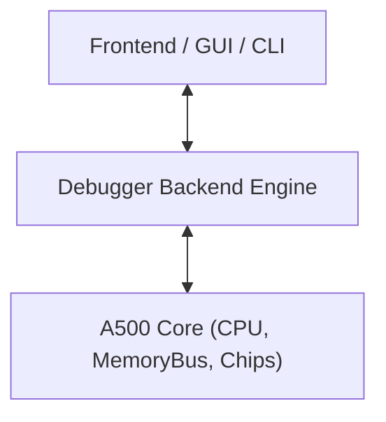

# Amiga 500 Debugger Architecture & Inspection Engine

- **Parent Specification:** [General Architecture.md](General%20Architecture.md)
- **GUI Companion:** [GUI.md](GUI.md) | [GUI Specification.md](GUI%20Specification.md)
- **CPU Specifications:** [CPU Motorola M68000.md](CPU%20Motorola%20M68000.md) | [CPU Micro-Step State Machine.md](CPU%20Micro-Step%20State%20Machine.md)
- **Module Location:** `crates/debugger/` & `crates/disassembler/`
- **Engineering Guidelines:** Follow systems rules in [AGENTS.md](../../../AGENTS.md).

> [!NOTE]
> The Debugger is a pure backend module decoupled from any rendering or GUI framework. It provides headless inspection primitives, disassemblers, breakpoints, and stepping controls.

---

## 1. Scope & Decoupled Architecture

The debugger module wraps or instruments the `A500` machine without adding overhead to the hot emulation loop when disabled:

- **Zero Intrusion when Inactive:** When no breakpoints or watchpoints are set, the execution loop runs with zero branching overhead.
- **Side-Effect Free Inspection:** Reading memory, registers, or hardware state via the debugger must **never** trigger bus latches, reset clear-on-read registers (like `INTREQR`), or alter CPU prefetch queues.

---

## 2. Execution Control & Stepping Primitives

The debugger provides fine-grained stepping modes via [`StepMode`](../../../crates/debugger/src/stepping.rs):
- **`StepCck`**: Steps forward exactly 1 Color Clock (CCK, ~280 ns).
- **`StepInstruction`**: Steps forward until the current M68000 instruction completes and retires.
- **`StepScanline`**: Steps forward until the raster beam advances to the next scanline.
- **`StepFrame`**: Steps forward until the display finishes a full video frame (VBlank transition).
- **`Continue`**: Runs free-running execution until a breakpoint or exception occurs.

---

## 3. Breakpoints & Watchpoints

The debugger maintains a collection of traps evaluated during execution (defined in [`crates/debugger/src/breakpoints.rs`](../../../crates/debugger/src/breakpoints.rs)):

### 3.1 Breakpoint Types
1. **Instruction Breakpoint (`PcBreakpoint`):**
   - Triggers when the CPU's program counter equals a specific 24-bit address (`pc == target_addr`) before executing the opcode.
2. **Memory Watchpoint (`MemoryWatchpoint`):**
   - Triggers on Read, Write, or Access within an address range (`start_addr..=end_addr`).
   - Optional value matching (e.g., break only if writing byte `$FF`).
3. **Register Condition Breakpoint (`ConditionBreakpoint`):**
   - Evaluates boolean expressions against CPU state (e.g. `D0 == 0` or `SR & 0x2000 == 0`).
4. **Custom Chip Event Traps:**
   - Break on Copper `WAIT` or `SKIP` instruction.
   - Break on Blitter start or finish (`BLIT` interrupt).
   - Break on CIA timer underflow.

---

## 4. Inspection & Disassembly Engines

### 4.1 M68000 Disassembler
- Disassembles machine code directly from a given memory address without side effects.
- Correctly decodes:
  - Opcode sizes (`.b`, `.w`, `.l`).
  - All addressing modes (immediate, absolute, indirect, indexed with displacement).
  - Branch targets calculated as relative offsets (`$001004: BNE $001040`).
- Returns formatted strings: `00FC0004: 4E71            NOP`.

#### 4.1.1 Standalone Disassembler Crate (`crates/disassembler`)
The disassembler is extracted into its own dedicated zero-dependency workspace crate ([`crates/disassembler`](../../../crates/disassembler/)), completely decoupled from CPU or memory bus implementations:
- Operates against a side-effect-free word reader closure `Fn(u32) -> u16`.
- Returns a [`Disassembly`](../../../crates/disassembler/src/types.rs) struct containing `pc`, raw instruction words (`words: [u16; 5]`, `word_count`), mnemonic (`&'static str`), and formatted operands (`String`), alongside total consumed instruction stream bytes.
- Highly cohesive, modular architecture strictly respecting source file size limits (< 400 lines per module):
  - [`lib.rs`](../../../crates/disassembler/src/lib.rs): Crate facade, module declarations, and main [`disassemble`](../../../crates/disassembler/src/lib.rs) coordinator function.
  - [`types.rs`](../../../crates/disassembler/src/types.rs): [`Disassembly`](../../../crates/disassembler/src/types.rs) representation and string line formatting (`format_line`).
  - [`ea.rs`](../../../crates/disassembler/src/ea.rs): Dedicated formatting helpers for effective addresses (`format_ea`), immediate values (`format_immediate`), condition codes (`bcc_condition_name`, `dbcc_condition_name`, `scc_condition_name`), and MOVEM register masks (`format_movem_reg_list`).
  - [`alu.rs`](../../../crates/disassembler/src/alu.rs): Arithmetic, logic, comparisons (`ADD`, `SUB`, `AND`, `OR`, `EOR`, `CMP`, `CMPA`, `CMPM`), immediate ops (`ORI`, `ANDI`, `SUBI`, `ADDI`, `EORI`, `CMPI`), bit operations (`BTST`, `BSET`, `BCLR`, `BCHG`), multiply/divide (`MULU`, `MULS`, `DIVU`, `DIVS`), and shifts/rotates (`ASL/ASR`, `LSL/LSR`, `ROL/ROR`, `ROXL/ROXR`).
  - [`branch.rs`](../../../crates/disassembler/src/branch.rs): Inherent control flow (`NOP`, `RESET`, `RTS`, `RTE`, `RTR`, `STOP`, `TRAPV`, `ILLEGAL`), `TRAP #vector`, `LINK`/`UNLK`, `JMP`/`JSR`, branches (`Bcc`), `DBcc`/`DBRA`, and `Scc`.
  - [`data.rs`](../../../crates/disassembler/src/data.rs): Data movement (`MOVE`/`MOVEA`/`MOVEQ`), `MOVEM`, `MOVE` to/from `SR`/`CCR`/`USP`, `LEA`, `CHK`, `PEA`, `SWAP`, `EXT`, unary ops (`CLR`, `NEG`, `NEGX`, `NOT`, `TST`), and quick math (`ADDQ`/`SUBQ`).
  - [`align.rs`](../../../crates/disassembler/src/align.rs): Smart CISC stream alignment engine via `find_aligned_disassembly_start`.

#### 4.1.2 CISC Stream Alignment & Code Guessing (`find_aligned_disassembly_start`)
In variable-length M68000 CISC architectures (instructions ranging from 2 to 10 bytes), naive backward stepping (e.g. subtracting an arbitrary byte offset) easily falls inside extension words or uninitialized zero padding, producing phantom instructions (e.g. `$0000` $\to$ `ORI.B #$00, D0`).

The [`find_aligned_disassembly_start`](../../../crates/disassembler/src/align.rs) algorithm addresses this:
1. **Hardware History Prioritization:** Checks execution history (`temporal` and `trace`) for recent instruction boundaries that cleanly sweep forward to `target_pc`.
2. **Backward Sweep Heuristic:** Evaluates candidate starting addresses backwards in 2-byte steps, verifying that disassembling forward lands exactly on `target_pc`.
3. **Overlapping Boundary Pruning:** Detects and eliminates candidates that fall inside multi-word instruction spans of preceding valid candidates.
4. **Code vs Non-Code Scoring:** Heavily penalizes unmapped/zero-fill `ORI.B` from empty memory and unknown opcodes (`DATA.W`), while rewarding recognized instructions to maximize legitimate code and minimize padding artifacts.
5. **Entry Point Fallback:** When at or near program entry with zero memory before it, cleanly anchors at `target_pc` to prevent spurious display of phantom instructions.

### 4.2 M68000 Mini-Assembler
The debugger provides an interactive line assembler via [`assemble_instruction`](../../../crates/debugger/src/assembler.rs):
- Assembles mnemonic lines into raw M68000 machine code words.
- Supports control instructions (`NOP`, `RTS`, `RTE`, `RESET`, `TRAPV`, `RTR`, `ILLEGAL`, `TRAP #vector`, `LINK`, `UNLK`), branches (`BRA`, `BSR`, `Bcc`, `DBRA`, `DBcc`), data movement (`MOVE`, `MOVEA`, `MOVEQ`, `LEA`, `PEA`), ALU operations (`ADD`, `SUB`, `ADDQ`, `SUBQ`, `ADDA`, `SUBA`, `AND`, `OR`, `EOR`, `CMP`, `CMPA`, `CMPI`, `MULU`, `MULS`, `DIVU`, `DIVS`), unary ops (`CLR`, `NEG`, `NOT`, `TST`, `SWAP`, `EXT`), and raw hex words.
- Supports both decimal (`#-16`, `#42`) and hexadecimal (`#$1000`, `0x2000`) immediate literals, as well as sized absolute addressing (`($002000).L`, `($1000).W`).

### 4.3 Copper List Disassembler
- Traverses the Copper instruction stream starting from `COP1LC` or `COP2LC`.
- Disassembles instructions into:
  - `MOVE $DFFxxx, #$yyyy`
  - `WAIT (H: x, V: y), Blitter: ignore/wait`
  - `SKIP (H: x, V: y)`
- Detects infinite loops or illegal jumps outside Chip RAM.

### 4.3 Custom Chip State Inspectors
- **Blitter Inspector:** Reports channels enabled ($A, B, C, D$), source/destination addresses (`BLTxPTH/L`), minterm formula, line-draw mode, and busy state.
- **DMA Visualizer / Logic Analyzer:** Records a timeline of which hardware subsystem (Copper, Blitter, Bitplanes 1–6, Sprites 0–7, Audio 0–3, Disk, CPU) occupied each CCK slot across the scanline.
- **Interrupt Inspector:** Displays current `INTENA` mask, pending `INTREQ` latches, and active IPL level.

---

## 5. Execution Trace History (Ring Buffer)

The debugger maintains an in-memory ring buffer (e.g. 1024 entries) of [`TraceEntry`](../../../crates/debugger/src/trace.rs) records capturing:
- Master Color Clock cycle (`cck: u64`).
- Program counter (`pc: u32`) and raw opcode (`opcode: u16`).
- Disassembled text representation (`disassembly: String`).
- CPU register state snapshot (`registers: CpuState`).

Zero-allocation access for UI virtual scrolling is provided via `trace.get(chronological_idx)`, returning `Option<&TraceEntry>`. When a crash, illegal instruction, or unhandled exception occurs, this ring buffer provides an instant post-mortem trace of the instructions leading up to the fault.

---

## 6. Reference Documentation & Upstream Ground Truth

- [68000 User's Manual: Section 2 (Introduction & Programmer's Model)](../Reference/68000%20User's%20Manual/02%20-%20Section%202%20-%20Introduction%20%26%20Programmer's%20Model.md): Register structures, status register bits, and user/supervisor modes.
- [68000 User's Manual: Section 6 (Exception Processing, Stack Frames & Reset)](../Reference/68000%20User's%20Manual/06%20-%20Section%206%20-%20Exception%20Processing,%20Stack%20Frames%20%26%20Reset.md): Vector traps, exception stacking frames, and interrupt priority levels.
- [Amiga Hardware Reference Manual: Chapter 1 (Introduction)](../Reference/Hardware%20Reference%20Manual/01%20-%20Chapter%201%20-%20Introduction.md): Chip registers, DMA channel assignments, and interrupt mechanisms.
- [Debugger Engine Implementation](../../../crates/debugger/src/lib.rs): Living Rust implementation of breakpoints, trace ring buffers, and mini-assembler.
- [Disassembler Crate Implementation](../../../crates/disassembler/src/lib.rs): Living Rust disassembler and stream alignment engine.
- [General Architecture Specification](General%20Architecture.md): Machine topology, bus interfaces, and subsystem ownership.
- [GUI Design Specification](GUI%20Specification.md): Developer Studio integration, dock panels, and keyboard shortcuts.

