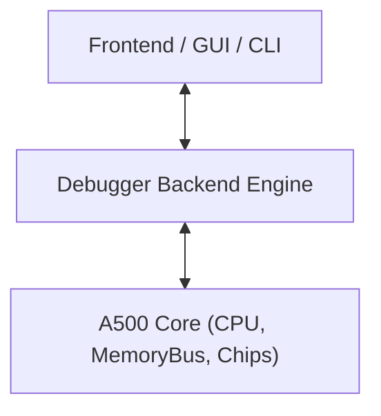

# Amiga 500 Debugger Architecture & Inspection Engine

> [!NOTE]
> The Debugger is a pure backend module decoupled from any rendering or GUI framework. It provides headless inspection primitives, disassemblers, breakpoints, and stepping controls.

---

## 1. Scope & Decoupled Architecture

The debugger module wraps or instruments the `A500` machine without adding overhead to the hot emulation loop when disabled:

- **Zero Intrusion when Inactive:** When no breakpoints or watchpoints are set, the execution loop runs with zero branching overhead.
- **Side-Effect Free Inspection:** Reading memory, registers, or hardware state via the debugger must **never** trigger bus latches, reset clear-on-read registers (like `INTREQR`), or alter CPU prefetch queues.

---

## 2. Execution Control & Stepping Primitives

The debugger provides fine-grained stepping modes via [`StepMode`](../../../crates/debugger/src/stepping.rs):
- **`StepCck`**: Steps forward exactly 1 Color Clock (CCK, ~280 ns).
- **`StepInstruction`**: Steps forward until the current M68000 instruction completes and retires.
- **`StepScanline`**: Steps forward until the raster beam advances to the next scanline.
- **`StepFrame`**: Steps forward until the display finishes a full video frame (VBlank transition).
- **`Continue`**: Runs free-running execution until a breakpoint or exception occurs.

---

## 3. Breakpoints & Watchpoints

The debugger maintains a collection of traps evaluated during execution (defined in [`crates/debugger/src/breakpoints.rs`](../../../crates/debugger/src/breakpoints.rs)):

### 3.1 Breakpoint Types
1. **Instruction Breakpoint (`pc_breakpoints`):**
   - Triggers when the CPU's program counter equals a specific 24-bit address (`pc == target_addr`) before executing the opcode. Implemented in [`crates/debugger/src/breakpoints.rs`](../../../crates/debugger/src/breakpoints.rs).
2. **Memory Watchpoint (`watchpoints`):**
   - Triggers on Read, Write, or Any access within an address range (`start_addr..=end_addr`). Implemented in [`crates/debugger/src/breakpoints.rs`](../../../crates/debugger/src/breakpoints.rs).
3. **Register Condition Breakpoint (Planned for GUI Studio):**
   - Evaluates boolean expressions against CPU state (e.g. `D0 == 0` or `SR & 0x2000 == 0`).
4. **Custom Chip Event Traps (Planned for Phase 2):**
   - Break on Copper `WAIT` or `SKIP` instruction.
   - Break on Blitter start or finish (`BLIT` interrupt).
   - Break on CIA timer underflow.

---

## 4. Inspection & Disassembly Engines

### 4.1 M68000 Disassembler (Implemented)
- Disassembles machine code directly from a given memory address without side effects.
- Correctly decodes:
  - Opcode sizes (`.b`, `.w`, `.l`).
  - All addressing modes (immediate, absolute, indirect, indexed with displacement).
  - Branch targets calculated as relative offsets (`$001004: BNE $001040`).
- Returns formatted strings: `00FC0004: 4E71            NOP`.

#### 4.1.1 Standalone Disassembler API (Zero-Dependency)
The disassembler is built-in and decoupled from any specific machine or bus struct, operating via [`disassemble`](../../../crates/debugger/src/disassembler.rs):
- Operates against a side-effect-free word reader closure `Fn(u32) -> u16`.
- Returns a [`Disassembly`](../../../crates/debugger/src/disassembler.rs) struct containing `pc`, raw instruction words (`words: [u16; 5]`, `word_count`), mnemonic (`&'static str`), and formatted operands (`String`), alongside total consumed instruction stream bytes.

### 4.2 Copper List Disassembler (Planned for Phase 2)
- Traverses the Copper instruction stream starting from `COP1LC` or `COP2LC`.
- Disassembles instructions into:
  - `MOVE $DFFxxx, #$yyyy`
  - `WAIT (H: x, V: y), Blitter: ignore/wait`
  - `SKIP (H: x, V: y)`
- Detects infinite loops or illegal jumps outside Chip RAM.

### 4.3 Custom Chip State Inspectors (Planned for Phase 2)
- **Blitter Inspector:** Reports channels enabled ($A, B, C, D$), source/destination addresses (`BLTxPTH/L`), minterm formula, line-draw mode, and busy state.
- **DMA Visualizer / Logic Analyzer:** Records a timeline of which hardware subsystem (Copper, Blitter, Bitplanes 1–6, Sprites 0–7, Audio 0–3, Disk, CPU) occupied each CCK slot across the scanline.
- **Interrupt Inspector:** Displays current `INTENA` mask, pending `INTREQ` latches, and active IPL level.

---

## 5. Execution Trace History (Ring Buffer)

The debugger maintains an in-memory ring buffer (e.g. 1024 entries) of [`TraceEntry`](../../../crates/debugger/src/trace.rs) records capturing:
- Master Color Clock cycle (`cck: u64`).
- Program counter (`pc: u32`) and raw opcode (`opcode: u16`).
- Disassembled text representation (`disassembly: String`).
- CPU register state snapshot (`registers: CpuState`).

When a crash, illegal instruction, or unhandled exception occurs, this ring buffer provides an instant post-mortem trace of the instructions leading up to the fault.
