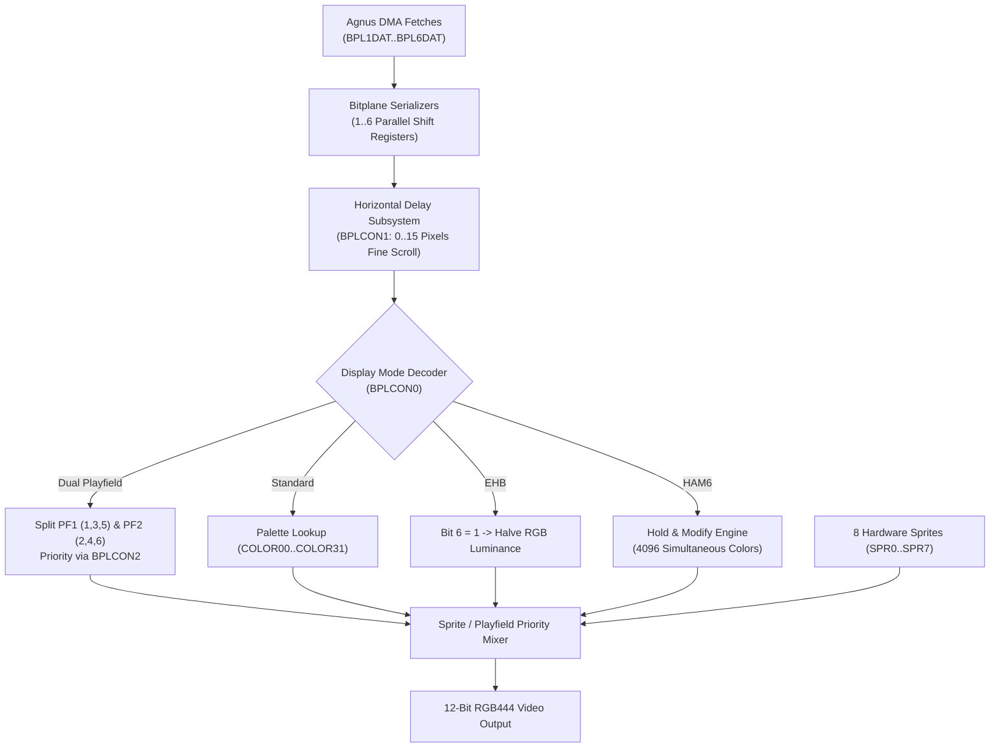

# Denise (MOS 8362 / 8373) Architecture & Hardware Specification

> [!NOTE]
> System execution constraints, memory bus arbitration, and Color Clock timing are defined in [AGENTS.md](../../../AGENTS.md), [MemoryBus.md](MemoryBus.md), and [Main loop A500.md](Main%20loop%20A500.md).
> Detailed game port pinouts and host input bindings are documented in [Joystick.md](Joystick.md) and [Mouse.md](Mouse.md). Raster beam tracking is driven by [Agnus.md](Agnus.md), and display output feeds the frontend in [GUI.md](GUI.md) and [GUI Specification.md](GUI%20Specification.md).

---

## 1. Scope & Chip Revisions

Denise is the video display processor and game port interface for the Amiga:

| Chip Model | Architecture | Pixel Clock | Key Capabilities |
| :--- | :---: | :---: | :--- |
| **MOS 8362** | OCS | **7 MHz / 14 MHz** | Up to 6 bitplanes, 32 palette colors (RGB444), HAM6, EHB, 8 sprites |
| **MOS 8373** | ECS | **7 MHz / 14 MHz / 28 MHz** | Programmable border blanking, Super-Hires ($1280$ pixels), ECS sprite resolution |

---

## 2. Module Decomposition & Workspace Architecture

Denise is partitioned into focused, single-responsibility workspace crates under `crates/`:

```
crates/
├── sprites/           // Denise 8 hardware sprites, position comparators, attached pairs
├── frame_builder/     // Denise raster scanline pixel compositor and 32-bit ARGB frame buffer
└── denise/            // Denise coordinator, video controls (BPLCON0..3), palette, collisions
```

### 2.1 Logical Subsystem Containment & Re-Exports
In accordance with the 3-tier re-export hierarchy, `crates/denise` encapsulates and re-exports its companion crates:
```rust
pub use frame_builder;
pub use sprites;

pub struct Denise {
    pub model: DeniseModel,
    pub sprites: sprites::Sprites,
    pub frame_builder: frame_builder::FrameBuilder,
    pub bplcon0: u16,
    pub color: [u16; COLOR_PALETTE_SIZE],
    // ... collision registers, window coordinates, and in-flight mutation pipeline
}
```

---

## 3. Register Memory Map

All Denise registers are mapped in the Custom Chip register space (`$DFF000`–`$DFF1BE`):

| Address | R/W | Symbol | Description |
| :--- | :---: | :--- | :--- |
| **`$DFF00A`** | R | **`JOY0DAT`** | Game Port 1 Joystick / Mouse quadrature counters |
| **`$DFF00C`** | R | **`JOY1DAT`** | Game Port 2 Joystick / Mouse quadrature counters |
| **`$DFF00E`** | R | **`CLXDAT`** | Collision Data Register (cleared upon read) |
| **`$DFF012`** | R | **`POT0DAT`** | Port 1 Proportional (potentiometer / button 2/3) counter |
| **`$DFF014`** | R | **`POT1DAT`** | Port 2 Proportional (potentiometer / button 2) counter |
| **`$DFF034`** | W | **`POTGO`** | Proportional pin drive and start timer |
| **`$DFF08E`** | W | **`DIWSTRT`** | Display Window Start (upper-left corner: VSTART, HSTART) |
| **`$DFF090`** | W | **`DIWSTOP`** | Display Window Stop (lower-right corner: VSTOP, HSTOP) |
| **`$DFF092`** | W | **`DDFSTRT`** | Display Data Fetch Start (bitplane DMA start CCK) |
| **`$DFF094`** | W | **`DDFSTOP`** | Display Data Fetch Stop (bitplane DMA stop CCK) |
| **`$DFF098`** | W | **`CLXCON`** | Collision Control (match masks and enable bits) |
| **`$DFF100`** | W | **`BPLCON0`** | Bitplane Control 0 (plane count BPU, HIRES, HAM, DBLPF, COLOR) |
| **`$DFF102`** | W | **`BPLCON1`** | Bitplane Control 1 (horizontal scroll offsets for PF1 and PF2) |
| **`$DFF104`** | W | **`BPLCON2`** | Bitplane Control 2 (playfield and sprite priority arbitration) |
| **`$DFF106`** | W | **`BPLCON3`** | Bitplane Control 3 (ECS border color, enhanced sprite control) |
| **`$DFF108`** | W | **`BPL1MOD`** | Bitplane Modulo (odd bitplanes 1, 3, 5) |
| **`$DFF10A`** | W | **`BPL2MOD`** | Bitplane Modulo (even bitplanes 2, 4, 6) |
| **`$DFF110`–`$DFF11A`** | W | **`BPL1DAT`–`BPL6DAT`** | Bitplane 1–6 Data Holding Latches |
| **`$DFF140`–`$DFF178`** | W | **`SPR0POS`–`SPR7POS`** | Sprite 0–7 Horizontal and Vertical Start Position |
| **`$DFF142`–`$DFF17A`** | W | **`SPR0CTL`–`SPR7CTL`** | Sprite 0–7 Stop Position and Attach Control |
| **`$DFF144`–`$DFF17E`** | W | **`SPR0DATA/B`–`SPR7DATA/B`** | Sprite 0–7 Image Data Registers |
| **`$DFF180`–`$DFF1BE`** | W | **`COLOR00`–`COLOR31`** | 32 Palette Color Registers (12-bit RGB444: 4 bits R, 4 bits G, 4 bits B) |

### 3.1 Register Access Semantics & Propagation Latency Pipeline
- **Clear-on-Read Mechanics:** `CLXDAT` (`$DFF00E`) latches sprite and playfield collision flags. Reading `CLXDAT` returns the active collision state and immediately clears all collision latches (`0x0000`). Debugger inspections via `peek_register(0x00E)` read non-destructively without clearing.
- **Write Staging Buffer:** Denise embeds an inline fixed-capacity mutation array `[Option<DelayedMutation>; 64]` sizing to its addressable write register set (`COLOR00..31`, `BPLCON0..3`, `SPR0..7`).
- **Propagation Timing:**
  - `BPLCON0` (`$DFF100`): Propagates with 1 CCK delay (`MutationMode::OverwritePending`). Denise decodes bitplane count and display mode within 1 CCK of the bus write.
  - Palette Registers (`COLOR00`–`COLOR31`): Propagate with 1 CCK delay (`MutationMode::Pipeline`) ensuring raster colors change deterministically on the subsequent Color Clock.
  - Display Window Registers (`DIWSTRT`, `DIWSTOP`, `DDFSTRT`, `DDFSTOP`): Propagate with 1 CCK delay (`MutationMode::OverwritePending`).
- **Defensive Overflow Protection:** If debugger injections saturate the 64-slot buffer, writes commit immediately with a defensive error log, preserving zero-panic invariants.

---

## 4. Pixel Pipeline & Display Modes

Denise receives bitplane word data fetched by Agnus DMA into latches `BPL1DAT`–`BPL6DAT`, serializes the bits into pixel streams, and outputs 12-bit RGB color signals:



### 4.1 Standard Bitplane Modes
- **Low-Resolution (320 Pixels):** Clocked at $7.09\ \text{MHz}$ ($140\ \text{ns}$ per pixel, $1$ pixel per CCK). Supports $1$ to $6$ bitplanes ($2$ to $32$ palette colors).
- **High-Resolution (640 Pixels):** Clocked at $14.19\ \text{MHz}$ ($70\ \text{ns}$ per pixel, $2$ pixels per CCK). Supports $1$ to $4$ bitplanes ($2$ to $16$ palette colors).

### 4.2 Dual Playfield Mode (`DBLPF` in `BPLCON0`)
- Splits the active bitplanes into two independent, overlapping playfield surfaces:
  - **Playfield 1:** Formed by odd bitplanes ($1, 3, 5$). Selects colors from `COLOR00`–`COLOR07`. Color $0$ is transparent.
  - **Playfield 2:** Formed by even bitplanes ($2, 4, 6$). Selects colors from `COLOR08`–`COLOR15`. Color $0$ is transparent.
- **Priority (`BPLCON2` bit 6 `PF2PRI`):** Determines whether Playfield 1 or Playfield 2 is in front.
- **Independent Scrolling:** Each playfield scrolls independently using the 4-bit nibbles in `BPLCON1` ($0$ to $15$ pixel delays).

### 4.3 Extra Half-Brite Mode (EHB)
- Activated when $6$ bitplanes are enabled in Low-Resolution without HAM or Dual Playfield.
- **Behavior:**
  - If Bitplane 6 is `0`: Color index ($0..31$) is read directly from `COLOR00`–`COLOR31`.
  - If Bitplane 6 is `1`: The color index ($0..31$) is retrieved from `COLOR00`–`COLOR31`, but all RGB components are shifted right by 1 ($R/2, G/2, B/2$), creating 32 half-intensity shadow colors for a total of 64 simultaneous colors.

### 4.4 Hold-And-Modify Mode (HAM6)
- Activated via bit 11 (`HOMOD`) in `BPLCON0` with 6 bitplanes active.
- Provides **4,096 simultaneous colors** by modifying one RGB color component per pixel while holding the other two from the previous pixel:

| Control Bits (Planes 6 & 5) | Operation | Resulting Output Pixel Color |
| :---: | :--- | :--- |
| **`00`** | **Palette Lookup** | Output color is looked up in `COLOR00`–`COLOR15` using Planes 1–4. |
| **`01`** | **Modify Blue** | Hold Red and Green from preceding pixel; replace Blue with 4-bit data ($B = \text{Planes 1–4}$). |
| **`10`** | **Modify Red** | Hold Green and Blue from preceding pixel; replace Red with 4-bit data ($R = \text{Planes 1–4}$). |
| **`11`** | **Modify Green** | Hold Red and Blue from preceding pixel; replace Green with 4-bit data ($G = \text{Planes 1–4}$). |

---

## 5. Hardware Sprites & Multiplexing

Denise includes 8 independent hardware sprite engines:
- **Dimensions:** 16 pixels wide, arbitrary vertical height (defined by `VSTART` in `SPRxPOS` and `VSTOP` in `SPRxCTL`).
- **Color Pairs:** Sprites operate in pairs sharing 4-color palettes:
  - Sprites 0 & 1: `COLOR16`–`COLOR19`
  - Sprites 2 & 3: `COLOR20`–`COLOR23`
  - Sprites 4 & 5: `COLOR24`–`COLOR27`
  - Sprites 6 & 7: `COLOR28`–`COLOR31`
- **Attached Sprites (`ATTACH` bit in odd sprite control register):**
  - Pairs (0+1, 2+3, 4+5, 6+7) can be attached to form a single 16-pixel wide sprite with 4 bitplanes, displaying 15 colors plus transparency from `COLOR16`–`COLOR31`.
- **Sprite Multiplexing:**
  - Because sprite start/stop coordinates are re-evaluated scanline by scanline, a single sprite DMA channel can be reused multiple times vertically down the screen by updating `SPRxPOS` and `SPRxCTL` via Copper.

---

## 6. Hardware Collision Detection (`CLXDAT` & `CLXCON`)

Denise tracks physical pixel collisions in hardware during rendering:
- **`CLXDAT` (`$DFF00E`):** 15-bit read-only latch recording:
  - Sprite-to-Sprite collisions (any combination of sprite pairs overlapping non-transparent pixels).
  - Sprite-to-Playfield collisions (sprites overlapping active pixels of Playfield 1 or Playfield 2).
- **Clear on Read:** Reading `CLXDAT` automatically clears all latch bits to zero.
- **`CLXCON` (`$DFF098`):** Collision control mask defining which bitplanes participate in collision checks and their required match values.

---

## 7. Game Port Inputs & Coordinate Latches

Denise houses the directional and quadrature counters for Game Port 1 and Game Port 2:
- **`JOY0DAT` (`$DFF00A`):** Port 1 (Mouse / Joy 1) counter. Bits 15–8 track Y quadrature, bits 7–0 track X quadrature.
- **`JOY1DAT` (`$DFF00C`):** Port 2 (Joy 2 / Mouse 2) counter. Directional switch closures decode into XORed bit pairs.
- **`POT0DAT` / `POT1DAT` (`$DFF012` / `$DFF014`):** Proportional analog potentiometer counters and right/middle mouse button status via `POTGO` (`$DFF034`).
- *Detailed Specifications:* See [Mouse.md](Mouse.md) and [Joystick.md](Joystick.md).

---

## 8. Video Signal Generation, Resistor DAC & CRT Gamma Transfer Physics

The conversion from 12-bit Amiga RGB444 color registers (`COLOR00`–`COLOR31`) to analog display voltages and host 32-bit ARGB frame buffers is governed by physical hardware circuits:

### 8.1 Discrete R-2R Resistor Ladder DAC (Linear Voltage)
Unlike modern graphics hardware with built-in active DACs or non-linear gamma lookup tables:
- **Onboard Resistor Network:** In the physical Amiga 500, Denise outputs 4 digital CMOS logic lines per color channel ($R_0..R_3$, $G_0..G_3$, $B_0..B_3$) directly to an external discrete resistor network on the motherboard (R-2R ladder utilizing $270\ \Omega$ and $560\ \Omega$ metal film resistors feeding a standard $75\ \Omega$ termination).
- **Strictly Linear Voltage Steps:** The resistor network functions as a passive digital-to-analog converter producing 16 strictly equidistant, linear voltage levels from $0.0\text{V}$ (code 0) to $0.7\text{V}$ (code 15) with an exact step voltage of $\Delta V = \frac{0.7\text{V}}{15} \approx 46.67\text{ mV}$.

### 8.2 Absence of Broadcast Gamma Pre-Correction
In standard analog color television broadcast standards (PAL / NTSC / CCIR System I):
- **Broadcast Standards (Gamma Pre-Compressed):** Television cameras were legally mandated to apply gamma pre-correction ($\gamma \approx 1/2.2 \approx 0.45$) to the video signal before transmission. Because the human visual system is logarithmically sensitive to luminance in dark regions (Weber-Fechner law) and CRT electron guns exhibit a non-linear power-law characteristic ($I \propto V^\gamma$, where $\gamma \approx 2.2–2.8$), pre-compressing highlights and expanding dark tones ensured that dark values occupied significantly more bandwidth in the transmission channel, suppressing transmission noise in shadows.
- **The Amiga Reality (Uncorrected Raw Signal):** The Amiga 500 contains **zero gamma correction circuitry**. The video signal emitted from the 23-pin RGB port is raw, uncompressed linear voltage directly proportional to the 4-bit digital register values. Consequently, dark levels occupy the exact same proportional voltage bandwidth as highlight levels (each step is 1/15th of the dynamic range).

### 8.3 CRT Monitor Transfer Function & Shadow Contrast
When an uncorrected Amiga video signal is plugged directly into a period-accurate analog CRT monitor (such as the Commodore 1084S):
- **Natural CRT Expansion:** The physical power-law response of the CRT monitor's electron gun ($\gamma_{\text{CRT}} \approx 2.8$) acts directly upon the linear voltage:
  $$L(n) = L_{\text{max}} \times \left(\frac{n}{15}\right)^{2.8}$$
- **Crushed Shadows & Retro Contrast:** The lowest DAC steps ($n = 1, 2, 3$) produce negligible physical screen luminance ($L(1) = 0.05\%$, $L(2) = 0.35\%$, $L(3) = 1.1\%$), naturally crushing deep shadows into pitch black, while upper steps ($n = 12..15$) generate over $70\%$ of visible luminance. Amiga pixel artists and game developers calibrated their palette choices specifically against this natural CRT darkening.

### 8.4 Studio Quantization ($n \times 16$) & Host Verification Tolerance ($\pm 1$)
When digitizing Amiga video frames or comparing emulator output against vAmigaTS golden reference captures (`.raw` RGB24 viewports):
- **Studio Range Scaling ($n \times 16$):** Rather than naively scaling 4-bit values to 8-bit using bit replication `(n << 4) | n` ($15 \times 17 = 255$), the uncorrected linear DAC voltage maps to 8-bit studio quantization ($n \times 16 \to 0, 16, 32, ..., 240$), matching broadcast studio conventions where nominal peak white is capped at code 240 (`0xF0`).
- **Chroma Subcarrier Rounding ($\pm 1$ Channel Tolerance):** Analog video modulators (such as the Motorola MC1377P inside the Commodore A520 TV modulator) and frame grabber ADC matrix conversions introduce minor $\pm 1$ LSB chroma rounding (e.g. 239 vs 240, 95 vs 96, 63 vs 64). Frame differencers allow a tolerance of $\pm 1$ per RGB channel (`COLOR_TOLERANCE_PER_CHANNEL = 1`) to ensure deterministic matching against physical silicon captures without spurious 1-LSB noise.

---

## 9. Reset Defaults

- **`BPLCON0` (`$DFF100`):** Reset to **`$0000`** (bitplanes disabled, video generation off).
- **`COLOR00`–`COLOR31`:** Default to **`$0000`** (black).
- **`CLXDAT` (`$DFF00E`):** Reset to **`$0000`**.
- **Sprites:** Halted; position and image data registers reset to `$0000`.

---

## 10. Reference Documentation & Upstream Ground Truth

- [Amiga Hardware Reference Manual: Chapter 3 (Playfield Hardware)](../Reference/Hardware%20Reference%20Manual/03%20-%20Chapter%203%20-%20Playfield%20Hardware.md): Authoritative guide for dual-playfield scrolling, bitplane priority multiplexing, color palette selection, HAM6, and EHB video modes.
- [Amiga Hardware Reference Manual: Chapter 4 (Sprite Hardware)](../Reference/Hardware%20Reference%20Manual/04%20-%20Chapter%204%20-%20Sprite%20Hardware.md): Hardware specification for 8 DMA sprite channels, sprite pairing (15-color mode), and hardware collision detection (`CLXDAT`).
- [Amiga Hardware Reference Manual: Appendix B (Register Summary)](../Reference/Hardware%20Reference%20Manual/10%20-%20Appendix%20B%20-%20Register%20Summary%20%28Address%20Order%29.md): Bitfield layouts and access modes for all Denise custom chip registers (`$DFF0E0`–`$DFF1BE`).
- [vAmiga Denise Component Implementation](../../../ref_src/vAmiga-4.5/Core/Components/Denise/Denise.cpp): Reference C++ pixel pipeline, bitplane serializer, and palette DAC conversion.
