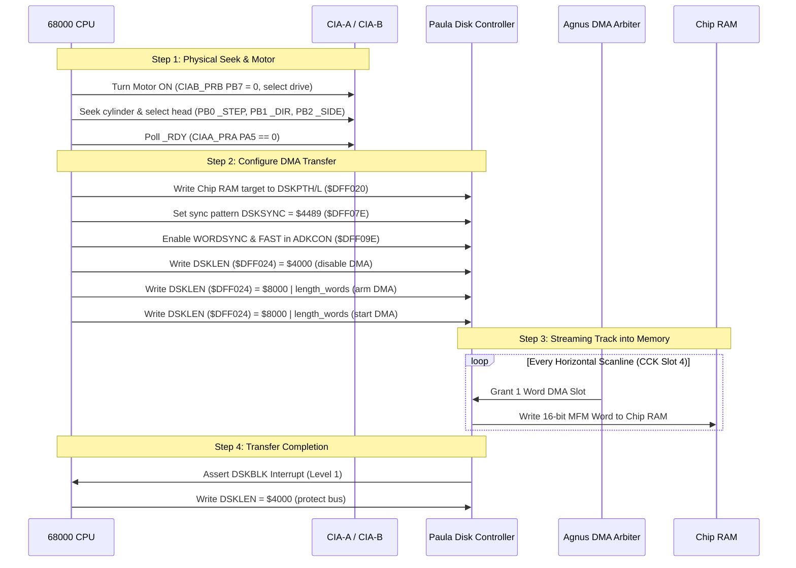
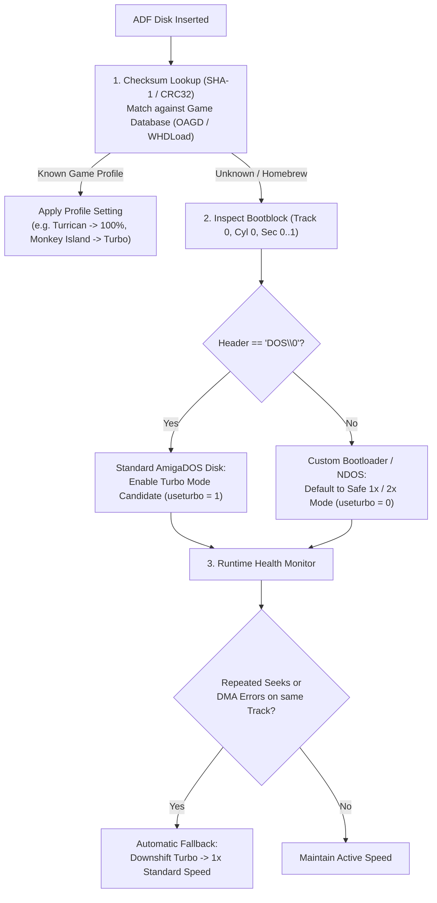

# Amiga 500 Floppy Disk Subsystem Architecture

> [!NOTE]
> Global system ownership principles, zero-allocation rules, and WASM constraints are defined in [AGENTS.md](file:///d:/Programowanie/Amiga/AGENTS.md).
> Custom chip register mappings are defined in [Paula.md](file:///d:/Programowanie/Amiga/Obsidian/Amiga/Design/Paula.md) (`DSKPTH/L`, `DSKLEN`, `DSKSYN`, `DSKBYTR`) and [CIA.md](file:///d:/Programowanie/Amiga/Obsidian/Amiga/Design/CIA.md) (`CIAAPRA`, `CIABPRB`).
> Memory bus DMA contention and 2-phase Color Clock slot timing are defined in [MemoryBus.md](file:///d:/Programowanie/Amiga/Obsidian/Amiga/Design/MemoryBus.md) and [CycleCounter.md](file:///d:/Programowanie/Amiga/Obsidian/Amiga/Design/CycleCounter.md).

---

## 1. Physical Drive Specifications & Geometry

The standard Amiga 500 internal floppy drive (`DF0:`) is a 3.5-inch Double Density (DD) magnetic disk drive (typically Chinon FB-354, Sony MPF-110, or Panasonic):

| Parameter | Specification | Notes |
| :--- | :---: | :--- |
| **Media Type** | 3.5" Double Density (DD) | 135 TPI, 80 tracks per surface |
| **Cylinders** | **80** ($0$ through $79$) | Extended tracks up to 81/82 on some copy-protected disks |
| **Heads / Surfaces** | **2** (Side 0 = Lower, Side 1 = Upper) | Selected via CIA-B `_SIDE` |
| **Tracks per Disk** | **160** ($80\ \text{cylinders} \times 2\ \text{heads}$) | Track Number = $\text{Cylinder} \times 2 + \text{Head}$ |
| **Sectors per Track** | **11** ($0$ through $10$) | Standard AmigaDOS sector formatting |
| **Bytes per Sector** | **512 Bytes** | User payload data |
| **Formatted Capacity** | **880 KB** ($901,120\ \text{Bytes}$) | $160\ \text{tracks} \times 11\ \text{sectors} \times 512\ \text{bytes}$ |
| **Spindle Rotation Speed** | **300 RPM** | $5.0\ \text{rotations/sec} \rightarrow 200\ \text{ms}$ per full rotation |
| **Raw Bit Transfer Rate** | **500 kbits/sec** | $2.0\ \mu\text{s}$ per raw MFM bit cell |
| **Raw Track Capacity** | $\approx 12,668$ MFM words ($\approx 100,000$ bits) | Measured over one full $200\ \text{ms}$ revolution |

---

## 2. Multi-Chip Hardware Coordination

The floppy disk interface does not exist within a single dedicated disk controller chip; it is bridged across **four independent custom chips**:

```mermaid
flowchart TD
    SUBGRAPH_DRIVE["3.5'' Floppy Drive (DF0: - DF3:)"]
    
    CIAB["CIA-B (Port B at $BFD100)"] -->|_STEP, _DIR, _SIDE, _SEL0..3, _MTR| SUBGRAPH_DRIVE
    SUBGRAPH_DRIVE -->|_RDY, _TK0, _WPROT, _CHNG| CIAA["CIA-A (Port A at $BFE001)"]
    SUBGRAPH_DRIVE <-->|Raw Serial MFM Bitstream| PAULA["Paula ($DFF020..$DFF026, $DFF07E)"]
    
    AGNUS["Agnus DMA Arbiter"] -->|1 Word per Scanline (CCK Slot 4)| PAULA
    PAULA <-->|Direct DMA Transfer| CHIPRAM["Chip RAM Track Buffer"]
    
    PAULA -->|DSKBLK IRQ (Level 1) & DSKSYN IRQ (Level 5)| CPU["Motorola 68000 CPU"]
    CIAA -->|PORTS IRQ (Level 2)| CPU
```

### 2.1 Participating Chips & Signal Routing
1. **CIA-B (Drive Control & Mechanics):** Drives output lines controlling motor on/off, head step pulse, step direction, head side select, and drive select (`DF0:`–`DF3:`).
2. **CIA-A (Drive Status Sensing):** Samples input lines for disk ready status, track 0 optical sensor, write protection switch, and disk change/ejection.
3. **Paula (High-Speed Bitstream & DMA):** Converts analog/digital flux pulses into raw MFM bits, detects sync words (`DSKSYNC`), shifts words into FIFO buffers, and issues interrupts (`DSKBLK`, `DSKSYN`).
4. **Agnus (Bus Master):** Allocates exactly 1 Chip RAM DMA cycle per horizontal raster scanline (`CCK Slot 4`, $\approx 64\ \mu\text{s}$) to stream disk data without CPU intervention.

---

## 3. Physical Drive Signals & Mechanics

All physical drive interface signals on the Amiga 34-pin floppy connector are **active-low (open-collector, asserted = low = $0\ \text{V}$, deasserted = high = $+5\ \text{V}$)**:

### 3.1 Drive Selection & Motor Latching (`CIABPRB`)

| Bit | Signal | R/W | Function |
| :---: | :--- | :---: | :--- |
| **PB7** | **`_MTR`** | Out | Disk motor control (0 = Motor ON, 1 = Motor OFF). |
| **PB6** | **`_SEL3`** | Out | Drive select 3 (`DF3:`, active low). |
| **PB5** | **`_SEL2`** | Out | Drive select 2 (`DF2:`, active low). |
| **PB4** | **`_SEL1`** | Out | Drive select 1 (`DF1:`, active low). |
| **PB3** | **`_SEL0`** | Out | Drive select 0 (`DF0:`, internal drive, active low). |
| **PB2** | **`_SIDE`** | Out | Head side select: **`1` = Lower Head (Side 0)**, **`0` = Upper Head (Side 1)**. |
| **PB1** | **`_DIR`** | Out | Seek direction: **`0` = Inward (toward cylinder 79)**, **`1` = Outward (toward cylinder 0)**. |
| **PB0** | **`_STEP`** | Out | Head step pulse (active-low pulse). |

#### The Shared Motor Line Quirk
- Unlike PC floppy controllers where each drive has an independent motor line, **all Amiga floppy drives share a single `_MTR` wire (CIA-B PB7)**!
- **Latching on Select:** Each physical drive contains a latch circuit that samples the state of `_MTR` **on the falling edge (high-to-low transition) of its respective `_SELx` line**.
- When the drive is subsequently deselected (its `_SELx` line returns high), the drive's internal latch **remembers whether its motor was commanded ON or OFF**.
- **Spin-Up Delay:** When turning a motor ON, software must wait $\approx 500\ \text{ms}$ for the spindle rotor to reach full rotational velocity ($300\ \text{RPM}$), or poll the `_RDY` line.

### 3.2 Drive Status Sensing (`CIAAPRA`)

| Bit | Signal | R/W | Function |
| :---: | :--- | :---: | :--- |
| **PA5** | **`_RDY`** | In | Disk ready (0 = Spindle motor running at full speed; 1 = Not ready / motor stopped). |
| **PA4** | **`_TK0`** | In | Track 0 optical sensor (0 = Heads positioned over cylinder 0; 1 = Off track 0). |
| **PA3** | **`_WPROT`**| In | Write protect switch (0 = Write-protected, notch open; 1 = Writable, notch closed). |
| **PA2** | **`_CHNG`** | In | Disk change sensor (0 = Disk removed / changed; 1 = Disk present and verified). |

#### The Disk Change Flip-Flop Quirk (`_CHNG`)
- The `_CHNG` signal is latched by a hardware set-reset flip-flop inside the drive:
  1. When a disk is ejected (or no disk is inserted), the optical/mechanical sensor trips, forcing `_CHNG` **low (0 = disk removed)**.
  2. When a disk is inserted, `_CHNG` **does NOT automatically return high**!
  3. The drive flip-flop **clears only after a disk is inserted AND the drive head receives a step pulse (`_STEP`)**!
- **Operating System Polling:** The AmigaOS `trackdisk.device` driver detects disk insertion by periodically stepping the head back and forth (e.g., between cylinders 0 and 1 or inward then outward) while polling `_CHNG`. If `_CHNG` stays low after stepping, no disk is present. If it returns high, a disk is present and ready.

#### Head Stepping & Settling Timing
- **Direction Setup Time:** `_DIR` must be stable for at least $1.0\ \mu\text{s}$ before pulsing `_STEP`.
- **Step Pulse Width:** `_STEP` must be pulsed low for at least $1.0$ to $3.0\ \mu\text{s}$.
- **Step Rate:** The drive mechanics require a minimum of $3.0\ \text{ms}$ between consecutive step pulses.
- **Head Settle Time:** When reversing seek direction or arriving at the target cylinder, software must wait at least $15.0\ \text{ms}$ before initiating a read or write operation to allow magnetic head vibration to settle.

---

## 4. Amiga MFM Encoding & Track Layout

The Amiga stores data on disk using **Modified Frequency Modulation (MFM)** at $2\ \mu\text{s}$ per bit cell.

### 4.1 MFM Encoding Rules
MFM encodes each unencoded data bit into **two clock/data bits** on magnetic media:
- A data bit `1` is encoded as `01`.
- A data bit `0` is encoded as `10` **if the preceding bit was 0**.
- A data bit `0` is encoded as `00` **if the preceding bit was 1**.

```
Data Bit:       1           0 (after 0)     0 (after 1)
MFM Cells:    [0 1]           [1 0]            [0 0]
```
This guarantees that no two consecutive `1`s ever appear on magnetic media, and no more than three consecutive `0`s occur, maintaining clock synchronization.

### 4.2 The Amiga Split Odd/Even MFM Optimization
To accelerate MFM decoding using the Blitter or simple 68000 ALU operations, Commodore designed a custom MFM split format:
- Instead of interleaving data and clock bits byte-by-byte, **all odd bits ($b_{31}, b_{29}, \dots, b_1$) are stored first, followed by all even bits ($b_{30}, b_{28}, \dots, b_0$)**.
- When decoding in software or via Blitter:
  $$\text{Payload Word} = (\text{Odd MFM Word} \ll 1) \lor (\text{Even MFM Word} \land \$5555)$$
  This avoids complex per-nibble lookup tables (nybbleizers).

### 4.3 AmigaDOS Standard Track Organization

Each track contains **11 sectors** ($0$ through $10$), separated by inter-sector gaps:

```
[ Track Preamble / Gap ]
├── Sector 0
├── Sector 1
├── ...
└── Sector 10
```

Each of the 11 sectors is structured identically into a **1088-byte raw MFM block**:

| Section | Size (Unencoded) | Size (Raw MFM) | Contents / Format |
| :--- | :---: | :---: | :--- |
| **Sync Mark** | 2 Words | 4 Bytes | Magic sync words: **`$4489 $4489`** (or `$0000 $4489`) |
| **Header Info** | 4 Bytes | 8 Bytes | Byte 0: Format `$FF`<br>Byte 1: Track Number ($0..159$)<br>Byte 2: Sector Number ($0..10$)<br>Byte 3: Sectors until gap |
| **Sector Label** | 16 Bytes | 32 Bytes | 4 longwords reserved for operating system flags / recovery info |
| **Header Checksum** | 4 Bytes | 8 Bytes | 32-bit XOR sum of MFM header and label words |
| **Data Checksum** | 4 Bytes | 8 Bytes | 32-bit XOR sum of MFM payload data words |
| **Sector Data** | **512 Bytes** | **1024 Bytes** | 512 bytes odd bits followed by 512 bytes even bits |

---

## 5. Paula DMA Read and Write Workflows



### 5.1 Track Read Workflow
1. **Drive Positioning:** Command motor ON, seek to the desired cylinder using `_STEP` and `_DIR`, select head side via `_SIDE`, and wait for settle time.
2. **Setup Pointers:** Write 32-bit Chip RAM address to `DSKPTH` (`$DFF020`).
3. **Configure Sync Matching:** Write `$4489` to `DSKSYNC` (`$DFF07E`), and enable `WORDSYNC` (bit 10) and `FAST` (bit 8) in `ADKCON` (`$DFF09E`).
4. **Arm DMA:** Write designated word length (typically $\approx 6300$ words for a full track) with bit 15 (`DMAEN`) set to `DSKLEN` **twice** (a safety interlock preventing accidental bus writes).
5. **Streaming:** Paula samples the incoming serial bitstream. When it detects `$4489`, it aligns word framing, asserts `DSKSYN` (Level 5), and streams incoming words into Chip RAM at 1 word per horizontal scanline.
6. **Completion:** When the word count in `DSKLEN` decrements to zero, Paula stops DMA and triggers `DSKBLK` (Level 1).
7. **Decoding:** Software or the Blitter separates and decodes the odd/even MFM bits into plain sector bytes.

### 5.2 Track Write Workflow
1. **Preparation:** The software pre-encodes the entire track into raw MFM format in Chip RAM (sync words `$4489`, sector headers, odd/even split data, and checksums).
2. **Precompensation:** Program `ADKCON` bits `PRECOMP1`/`PRECOMP0` to apply hardware write precompensation ($140\ \text{ns}$ or $280\ \text{ns}$) to combat magnetic flux crowding on inner cylinders ($>40$).
3. **Trigger Write DMA:** Write Chip RAM source address to `DSKPTH`, set `DSKLEN` with `DMAEN` (bit 15 = 1) and `WRITE` (bit 14 = 1) twice.
4. **Serialization:** Paula reads 1 word per scanline from Chip RAM and serializes it out the `DSKDAT` line to the drive head write amplifier.

---

## 6. ADF Disk Image Ingestion & Emulation Format

In the emulator, physical floppy disks are injected as standard **Amiga Disk File (ADF)** byte slices (`&[u8]`):

### 6.1 Standard ADF Geometry
- An uncompressed standard ADF is an exact, sector-by-sector dump of the 880 KB user payload:
  $$\text{Total Bytes} = 80\ \text{cylinders} \times 2\ \text{heads} \times 11\ \text{sectors} \times 512\ \text{bytes} = 901,120\ \text{Bytes}$$
- **Offset Calculation:**
  $$\text{Track Number} = \text{Cylinder} \times 2 + \text{Head}$$
  $$\text{ADF Byte Offset} = \text{Track Number} \times (11 \times 512) = \text{Track Number} \times 5,632\ \text{Bytes}$$

### 6.2 Zero-Allocation In-Memory MFM Synthesis
- Rather than reading or writing host files during emulation cycles, the emulator holds the ADF in memory:
  - When the virtual drive seeks to a cylinder and side, the emulator dynamically synthesizes or buffers the **raw MFM track representation** ($\approx 12,668$ bytes) from the 5,632-byte ADF slice.
  - When the emulated Paula reads words via DMA, it streams directly from this synthesized track buffer.
  - If a write occurs, the emulator decodes the incoming MFM words back into the underlying ADF buffer.

---

## 7. Subsystem Module Decomposition

The floppy peripheral implementation resides in `peripherals/floppy/`:

```
peripherals/floppy/
├── mod.rs             // Multi-chip coordinator (bridges CIA-A, CIA-B, Paula, Agnus)
├── drive.rs           // Virtual drive mechanics (motor latch, step counters, _CHNG flip-flop)
├── disk_image.rs      // ADF byte slice container (&[u8]) and track extraction
└── mfm.rs             // Fast bit-level MFM encoder, decoder, and XOR checksum calculator
```

---

## 8. Accelerated & Instant ("Turbo") Floppy Emulation

While cycle-exact emulation streams exactly 1 word per horizontal scanline ($\approx 200\ \text{ms}$ per revolution), modern users often desire accelerated or instant floppy loading.

### 8.1 Mechanics of "Fast / Instant" Floppy Read

In an instant ("Turbo") floppy read implementation:
1. **Trigger:** When the 68000 CPU writes the second arming word to `DSKLEN` (`$DFF024`) with `DMAEN = 1` and `WRITE = 0`:
2. **Instant Transfer:** Instead of waiting hundreds of milliseconds and advancing 1 word per scanline:
   - The emulator immediately locates the sync mark (`DSKSYNC`, `$4489`) in the virtual track buffer.
   - All `dsklength` requested 16-bit MFM words are committed directly into Chip RAM at `dskpt` in **a single host operation** (`chip_ram[dskpt..dskpt + len * 2] = mfm_words`).
   - The DMA pointer `dskpt` is updated to point past the end of the transfer.
3. **Interrupt Generation:**
   - Paula immediately asserts `DSKSYN` in `INTREQ` (Level 5 interrupt, bit 12).
   - **Crucial Safety Delay:** The completion interrupt `DSKBLK` (Level 1, bit 1) **must NOT be fired in the exact same CPU instruction cycle**! A safety delay of at least 2 scanlines ($\approx 128\ \mu\text{s}$) is required before asserting `DSKBLK` and clearing the DMA busy flags, allowing the CPU instruction stream to complete its `MOVE.W #$8xxx, DSKLEN` instruction and enter its waiting state.

### 8.2 Why Instant Turbo Mode Breaks Certain Amiga Software

Instant floppy read breaks compatibility with numerous commercial games and custom loaders for four distinct hardware reasons:

1. **CPU Background Race Conditions:**
   - On real hardware, a full track read takes $\approx 200\ \text{ms}$. Many game loaders initiate track DMA, and then immediately begin unpacking previous data, initializing sound buffers, clearing screens, or building Copper lists while DMA runs in the background.
   - If DMA completes instantly, the `DSKBLK` interrupt handler fires prematurely—before the main program has finished setting up data structures, buffer pointers, or interrupt vectors—causing crashes or undefined behavior.
2. **Hardware Register Polling (`DSKBYTR` & Beam Synchronization):**
   - Custom loaders that do not use `DSKBLK` interrupts often poll `DSKBYTR` (`$DFF01A`) to monitor incoming bytes in real time, or synchronize track reads to specific raster lines.
   - Instant transfers bypass the byte-ready latch sequence, causing polling loops to hang indefinitely.
3. **Copy Protections & Flux Timing Checks:**
   - Advanced games (e.g., Psygnosis titles, *Turrican*, *Robocop*, Bitmap Brothers releases) incorporate custom track loaders that measure the rotational time between consecutive sync marks or index pulses to detect pirate copies.
   - If data arrives instantaneously (0 ms elapsed between syncs), the copy-protection routine detects a timer anomaly and intentionally halts the machine with a software trap or guru meditation.
4. **Partial / Sub-Track DMA Reads:**
   - Games with custom sector loaders often request small, fractional transfers (e.g. reading only a single 512-byte sector instead of a full track). If an instant loader assumes full track alignment, it corrupts the destination buffer.

---

### 8.3 How Reference Emulators (WinUAE) Handle Turbo

WinUAE implements several sophisticated heuristics in `disk.cpp` to balance speed and compatibility:

```mermaid
flowchart TD
    DSKLEN_WRITE["CPU writes DSKLEN (Start DMA)"] --> CHECK_TURBO{"floppy_speed == 0 (Turbo)?"}
    CHECK_TURBO -->|No (100%..800%)| PROGRESSIVE["Progressive DMA Streaming\n(1 to 8 words per scanline)"]
    CHECK_TURBO -->|Yes| CHECK_FORMAT{"useturbo == 1?\n(Standard AmigaDOS ADF)"}
    
    CHECK_FORMAT -->|No (Custom / IPF / Extended)| PROGRESSIVE
    CHECK_FORMAT -->|Yes| CHECK_WEIRD{"weirddma?\n(Length < 11 Sectors + Gap)"}
    
    CHECK_WEIRD -->|Yes (Short / Custom Read)| PROGRESSIVE
    CHECK_WEIRD -->|No| INSTANT["Instant Copy to Chip RAM\nSet linecounter = 2"]
    
    INSTANT --> DELAY["Wait 2 Scanlines (~128 µs)"]
    DELAY --> IRQ["Assert DSKBLK (Level 1) & Clear DMA"]
```

1. **Speed Settings:**
   - **`100%` (Normal):** Exact real hardware timing (1 word per scanline, 300 RPM).
   - **`200%`, `400%`, `800%`:** Progressive acceleration. The virtual spindle speed and Agnus DMA grant frequency are multiplied, accelerating loads without violating temporal ordering.
   - **`0` (Turbo Mode):** Instant DMA copy.
2. **The `useturbo` AmigaDOS Guard:**
   - WinUAE sets `drv->useturbo = 1` **only for standard AmigaDOS disk images** (`TRACK_AMIGADOS`, 880 KB ADF with 11 standard sectors per track).
   - For any non-standard format (Extended ADF, IPF, custom flux images, non-standard sector counts), WinUAE forces `useturbo = 0`, automatically falling back to progressive DMA.
3. **The `weirddma` Short-Transfer Guard:**
   - If the requested transfer length is less than a full standard track (`dsklength < 11 * 544 + FLOPPY_GAP_LEN`), WinUAE flags `weirddma = true` and **disables instant transfer for that read**. This protects custom loaders performing partial sector reads.
4. **The `linecounter = 2` Delayed Interrupt:**
   - Even in Turbo mode, WinUAE delays firing `DSKBLK` by 2 scanlines (`linecounter = 2`), preventing instant re-entrancy into CPU interrupt handlers.

---

### 8.4 Available Implementation Options in the Emulator

| Option | Speed | Compatibility | Description |
| :--- | :---: | :---: | :--- |
| **1. Cycle-Exact (1x / 100%)** | 1x ($200\ \text{ms}$/track) | **100%** | Strict real hardware timing (1 word per scanline, 3 ms step, 15 ms settle). Supports all copy protections, demos, and custom loaders. |
| **2. Multiplier Acceleration (2x / 4x / 8x)** | 2x to 8x ($25\ \text{ms}$/track) | **~98%** | Accelerates head stepping and multiplies DMA words transferred per scanline. Preserves temporal order, background CPU time, and register polling without race conditions. |
| **3. Instant Turbo (with WinUAE Guards)** | Instant ($0\ \text{ms}$/track) | **~85%** | Direct Chip RAM copy + 2-scanline delayed `DSKBLK` interrupt. Requires `useturbo` and `weirddma` safety checks. Ideal for standard AmigaDOS disks and Workbench. |

---

### 8.5 Automated Game Detection & Compatibility Heuristics

To determine the optimal floppy speed automatically per game or application:



1. **Disk Checksum Database (SHA-1 / CRC32):**
   - The emulator calculates the hash of the 880 KB ADF image and matches it against an embedded or external game database (e.g., Open Amiga Game Database / TOSEC / WHDLoad game configs).
   - Games tagged as having custom track loaders (e.g. *Turrican*, *R-Type*, *Shadow of the Beast*, *Speedball 2*) automatically lock to 100% standard speed.
   - Standard AmigaDOS games (e.g., Cinemaware, LucasArts adventures, Sierra titles, Workbench disks) default to Turbo mode.
2. **Bootblock `"DOS\0"` Header Inspection (Zero-Config Heuristic):**
   - Read the first 4 bytes of Track 0, Sector 0:
     - If the magic bytes equal `b"DOS\0"` (AmigaDOS standard bootblock), the disk utilizes the standard ROM `trackdisk.device` driver, which is **100% compatible with Turbo mode**.
     - If the magic bytes differ (Non-DOS disk with a custom machine-language bootblock), the emulator flags `useturbo = false` and defaults to 1x or 2x speed.
3. **Runtime Dynamic Fallback on Failure:**
   - If a game running in Turbo mode encounters track checksum failures, timeout loops, or repeatedly seeks back and forth over the same track ($>3$ retries), the virtual drive **automatically steps down to 100% cycle-exact mode**, guaranteeing that a game never gets stuck in a boot loop.

