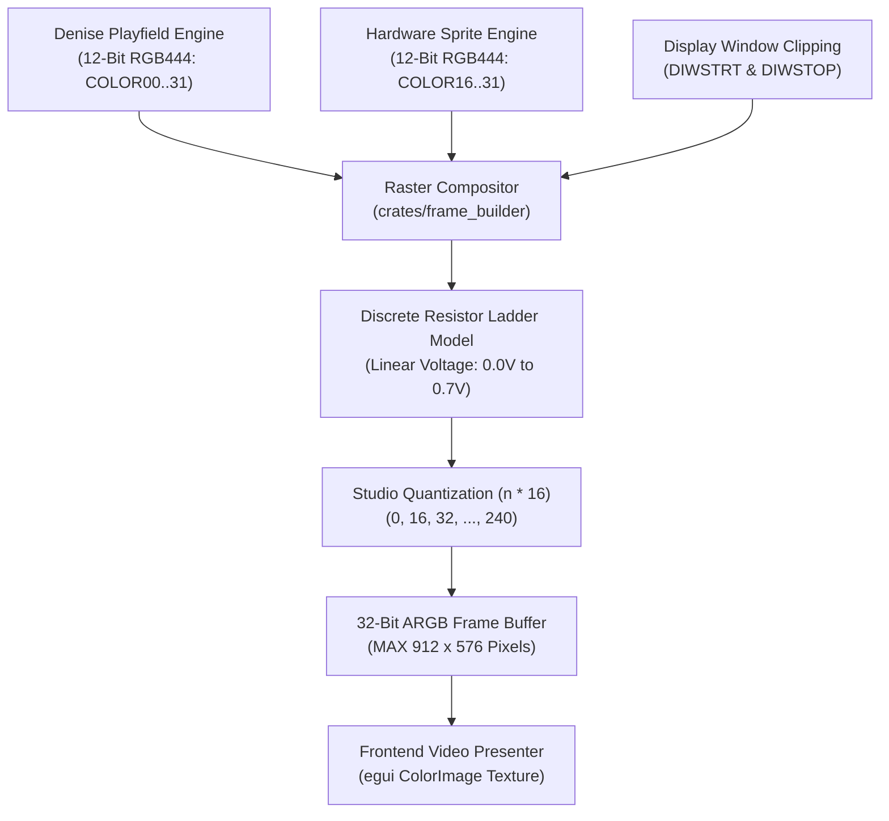

# Denise Frame Builder, Raster Compositor & Video Signal Specification

> [!NOTE]
> System execution constraints, memory bus arbitration, and Color Clock timing are defined in [AGENTS.md](../../../AGENTS.md), [MemoryBus.md](MemoryBus.md), and [Main loop A500.md](Main%20loop%20A500.md).
> Detailed inter-chip signal rules are codified in [`hardware-bus-topology.md`](../../../.agents/rules/hardware-bus-topology.md).
> Display mode decoding, bitplanes, and color registers are defined in [Denise.md](Denise.md). Hardware sprite channels are documented in [Sprites.md](Sprites.md), and GUI texture presentation is specified in [GUI.md](GUI.md).

---

## 1. Core Decisions & Architectural Principles

The Frame Builder (`crates/frame_builder`) is the raster video compositor responsible for assembling pixel outputs from Denise's playfield and sprite engines, applying hardware Display Window (DIW) clipping, and generating a continuous 32-bit ARGB host frame buffer (`0xAARRGGBB`) for display frontends.



### 1.1 Core Invariants
1. **Fixed Memory Footprint:** The frame buffer is pre-allocated with a static capacity of $912 \times 576$ pixels (`FRAME_BUFFER_PIXELS = 525,312` words), ensuring strictly zero heap allocations during active raster scanning.
2. **Discrete R-2R Resistor Ladder Physics:** Denise outputs 4 digital logic lines per RGB channel directly to a motherboard discrete resistor ladder DAC (270 $\Omega$ / 560 $\Omega$), producing 16 strictly linear voltage levels (0.0V to 0.7V).
3. **Absence of Broadcast Gamma Pre-Correction:** The physical Amiga outputs raw, uncompressed linear voltage without camera gamma compression. Contrast expansion ($\gamma \approx 2.8$) occurs naturally at the analog CRT monitor phosphor gun.
4. **Studio Quantization ($n \times 16$):** Rather than naive bit replication `(n << 4) | n`, linear DAC voltages map directly to 8-bit broadcast studio quantization ($n \times 16 \to 0, 16, ..., 240$), matching physical video digitizer captures.

---

## 2. Module Architecture & Crate Containment (`crates/frame_builder`)

```
crates/frame_builder/
├── Cargo.toml
├── src/
│   └── frame_builder.rs   // Raster compositor, DIW clipping, RGB444->ARGB32 conversion
└── tests/
    └── test_frame_builder.rs // Frame geometry, clipping, quantization, overscan tests
```

### 2.1 Frame Buffer Geometry Constants
```rust
/// Maximum overscan width in high-resolution pixels (4 pixels per CCK across 228 CCKs)
pub const MAX_FRAME_WIDTH: usize = 912;
/// Maximum overscan height in PAL scanlines
pub const MAX_FRAME_HEIGHT: usize = 576;
/// Total pixel count of the uncompressed frame buffer
pub const FRAME_BUFFER_PIXELS: usize = MAX_FRAME_WIDTH * MAX_FRAME_HEIGHT;
```

---

## 3. Video Signal Generation, Resistor DAC & CRT Physics

### 3.1 Discrete R-2R Resistor Ladder DAC (Linear Voltage)
Unlike modern graphics hardware with integrated non-linear gamma DACs:
- **Onboard Resistor Network:** In the physical Amiga 500, Denise outputs 4 CMOS digital lines per color channel ($R_{0..3}$, $G_{0..3}$, $B_{0..3}$) directly to an external passive resistor network on the motherboard (R-2R ladder utilizing $270\ \Omega$ and $560\ \Omega$ metal film resistors feeding standard $75\ \Omega$ termination).
- **Strictly Linear Voltage Steps:** The resistor network acts as a linear DAC producing 16 equidistant voltage levels from $0.0\text{V}$ (code 0) to $0.7\text{V}$ (code 15) with an exact step voltage of:
  $$\Delta V = \frac{0.7\text{V}}{15} \approx 46.67\text{ mV}$$

### 3.2 Absence of Broadcast Gamma Pre-Correction
- **Broadcast Standards (Gamma Pre-Compressed):** Commercial television broadcasts legally mandate camera gamma pre-correction ($\gamma \approx 1/2.2 \approx 0.45$). Because human visual luminance perception is logarithmic (Weber-Fechner law) and CRT electron guns exhibit a non-linear power-law response ($I \propto V^\gamma$), pre-compressing highlights expands dark tones across transmission channels to suppress transmission noise.
- **The Amiga Reality (Uncorrected Raw Signal):** The Amiga 500 has **zero gamma pre-correction circuitry**. The signal emitted from the 23-pin RGB port is raw linear voltage directly proportional to the 4-bit register values. Dark values occupy the exact same proportional voltage bandwidth as highlight values.

### 3.3 CRT Monitor Transfer Function & Shadow Contrast
When plugged into a period-accurate analog CRT monitor (such as the Commodore 1084S):
- **Natural CRT Power-Law Expansion:** The CRT monitor's electron gun response ($\gamma_{\text{CRT}} \approx 2.8$) acts directly upon the linear voltage:
  $$L(n) = L_{\text{max}} \times \left(\frac{n}{15}\right)^{2.8}$$
- **Crushed Shadows & Retro Contrast:** The lowest DAC steps ($n = 1, 2, 3$) produce negligible physical screen luminance ($L(1) = 0.05\%$, $L(2) = 0.35\%$, $L(3) = 1.1\%$), naturally crushing deep shadows into pitch black, while upper steps ($n = 12..15$) generate over $70\%$ of visible luminance. Amiga pixel artists calibrated palette choices specifically against this natural CRT darkening.

### 3.4 Studio Quantization ($n \times 16$) & Host Tolerance ($\pm 1$)
When digitizing Amiga frames or comparing emulator output against vAmigaTS golden captures (`.raw` RGB24 viewports):
- **Studio Range Scaling ($n \times 16$):** Rather than naively scaling 4-bit values using bit replication `(n << 4) | n` ($15 \times 17 = 255$), the uncorrected linear DAC voltage maps to 8-bit studio quantization ($n \times 16 \to 0, 16, 32, ..., 240$), matching broadcast studio conventions where nominal peak white is capped at code 240 (`0xF0`).
```rust
#[inline(always)]
pub fn rgb444_to_argb32(rgb: u16) -> u32 {
    let r = ((rgb >> 8) & 0xF) as u32;
    let g = ((rgb >> 4) & 0xF) as u32;
    let b = (rgb & 0xF) as u32;
    let r8 = r << 4;
    let g8 = g << 4;
    let b8 = b << 4;
    0xFF00_0000 | (r8 << 16) | (g8 << 8) | b8
}
```
- **Chroma Subcarrier Rounding ($\pm 1$ Channel Tolerance):** Analog video modulators and ADC grabbers introduce $\pm 1$ LSB chroma rounding (e.g. 239 vs 240, 95 vs 96). Verification harnesses allow a tolerance of $\pm 1$ per RGB channel to eliminate spurious 1-LSB noise.

---

## 4. Display Window Clipping (`DIWSTRT` & `DIWSTOP`)

The Display Window defines the active visible rectangular region on the screen:
- **`DIWSTRT` (`$DFF08E`):** Upper-left corner coordinates (`VSTART` in bits 15–8, `HSTART` in bits 7–0).
- **`DIWSTOP` (`$DFF090`):** Lower-right corner coordinates (`VSTOP` in bits 15–8, `HSTOP` in bits 7–0). Bit 15 determines whether $V_{\text{stop}}$ is extended by 256 lines.

```rust
#[inline]
pub fn is_in_display_window(hcoord: u16, vcoord: u16, diwstrt: u16, diwstop: u16) -> bool {
    let vstart = (diwstrt >> 8) & 0xFF;
    let vstop = ((diwstop >> 8) & 0xFF) | (if (diwstop & 0x8000) != 0 { 0 } else { 0x100 });
    let hstart = diwstrt & 0xFF;
    let hstop = (diwstop & 0xFF) | 0x100;
    vcoord >= vstart && vcoord < vstop && hcoord >= hstart && hcoord < hstop
}
```
- Pixels outside the active Display Window boundary are replaced with `COLOR00` (background/border color).

---

## 5. Frontend Presentation & egui Integration

At the completion of each video frame (vertical blanking reached):
1. `FrameBuilder.frame_ready` is asserted.
2. The frontend GUI (`crates/gui`) retrieves the uncompressed 32-bit ARGB buffer.
3. The buffer is uploaded into an `egui::ColorImage` texture handle without conversion or reallocation, providing high-fps, low-overhead native rendering.

---

## 6. Reference Documentation & Upstream Ground Truth

- [Amiga Hardware Reference Manual: Chapter 3 (Playfield Hardware - Display Window)](../Reference/Hardware%20Reference%20Manual/03%20-%20Chapter%203%20-%20Playfield%20Hardware.md): Hardware specification for `DIWSTRT`, `DIWSTOP`, and screen overscan boundaries.
- [Denise Architecture Specification](Denise.md): Video display controller, bitplane serializer, palette registers, and collision logic.
- [GUI Specification](GUI%20Specification.md): Immediate-mode Developer Studio, frame rendering, and viewport presentation.
