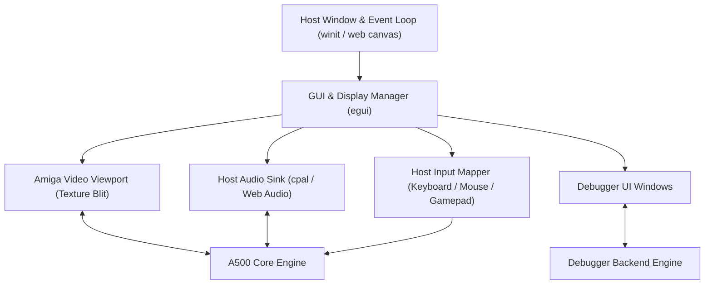

# Amiga 500 GUI & Frontend Architecture

> [!NOTE]
> The GUI is an external consumer of the emulator core. The core exposes pure frame buffers (`&[u32]`), audio sample ring buffers (`&[i16]`), and input event queues. The core has zero direct dependencies on UI frameworks or windowing APIs.

---

## 1. Frontend Architecture & Technology Stack

The UI frontend can target native desktop (Windows, macOS, Linux) and WebAssembly (`wasm32` in the browser) using a unified immediate-mode GUI framework (such as `egui` with `wgpu` or `pixels`):

---

## 2. Video Display Viewport

### 2.1 Resolution, Framing & Aspect Ratio
- **Native Resolution:** Amiga 500 standard output is 50 Hz PAL ($320 \times 256$ LoRes, $640 \times 512$ HiRes interlace) or 60 Hz NTSC ($320 \times 200$ LoRes, $640 \times 400$ HiRes).
- **Overscan Canvas:** Render into a maximum $720 \times 576$ internal buffer (`&[u32]` ARGB8888) to capture hardware overscan, Copper borders, and scrolling margins.
- **Aspect Ratio & Scaling:**
  - Standard Amiga monitors (Commodore 1084S) have a 4:3 physical aspect ratio.
  - The viewport performs integer scaling or sharp bilinear filtering with 4:3 display aspect ratio correction.

### 2.2 GPU Post-Processing & Old TV Simulation Shaders
We plan to implement a GPU shader pipeline (via WGSL / GLSL in `wgpu` and WebGL/WebGPU) with modular post-processing passes to reproduce authentic CRT monitor and vintage television optics:
- **CRT Geometry & Mask:**
  - Adjustable barrel curvature, bezel reflection, and corner vignette.
  - Shadow mask / aperture grille (Trinitron-style) phosphor subpixel triads.
  - Horizontal scanline rasterization with brightness-dependent scanline beam thickness.
- **Color & Signal Emulation (Old TV Look & Feel):**
  - Phosphor glow, halation, and bloom on bright highlights.
  - Optional composite / RF video signal artifacts (chroma subcarrier bleeding, horizontal color fringing, and luma/chroma crosstalk typical of SCART / RF modulators on 1980s TVs).
  - Configurable phosphor persistence and decay trails.

---

## 3. Audio Sink & LED Filter

- **Stereo Playback:** Dual-channel 8-bit signed audio (Channels 0 & 3 to Left, Channels 1 & 2 to Right) rendered at 44.1 kHz or 48 kHz.
- **Decoupled Ring Buffer:** Core streams samples into an internal lock-free ring buffer; host audio thread consumes from it without stalling emulation.
- **Audio Low-Pass Filter (Power LED Filter):**
  - The Amiga 500 has a fixed 7 kHz low-pass filter and a switchable 4.4 kHz RC low-pass filter controlled by CIA-A Port A bit 1 (`_LED`).
  - The GUI visualizes the Power LED brightness/filter state and applies digital IIR filtering.

---

## 4. Input Mapping Engine

Translates host input devices into Amiga hardware register events:

1. **Host Keyboard -> Amiga Keyboard Matrix:**
   - Translates physical host keys (`KeyCode`) into raw Amiga 8-bit scancodes transmitted to CIA-A `SDR`.
   - Maps host shortcuts (e.g. `Ctrl+Alt+Delete` or `F12`) to the Amiga `Ctrl-Amiga-Amiga` reset sequence.
   - *Detailed Specification:* See [Keyboard.md](Keyboard.md).
2. **Host Mouse -> Game Port 1 (`JOY0DAT` & CIA-A):**
   - Accumulates host cursor delta into Denise 8-bit quadrature counters (`JOY0DAT`).
   - Maps left, right, and middle mouse buttons to CIA-A `PRA` bit 6 and Paula `POTGO`.
   - Supports viewport pointer lock and mobile/touchscreen trackpad modes.
   - *Detailed Specification:* See [Mouse.md](Mouse.md).
3. **Host Gamepad -> Game Port 2 (`JOY1DAT` & CIA-A):**
   - Maps D-Pad / Analog stick to digital directional bits in `JOY1DAT`.
   - Maps gamepad buttons to CIA-A `PRA` bit 7 (Fire 1) and `POTGO` (Fire 2).
   - Supports keyboard-to-joystick mapping, autofire, and mobile virtual D-pad.
   - *Detailed Specification:* See [Joystick.md](Joystick.md).

---

## 5. Developer GUI & Debugger Integration

The GUI incorporates an integrated developer studio and debugger. 
- **Direct State Pull:** Panels poll emulator state directly (`&CpuState`, `&mut MemoryBus`, `&mut Debugger`) on render. Zero async messages, zero callback overhead.
- **Synchronous Stepping:** Execution steps immediately record execution snapshots into a temporal history ring buffer for time-travel debugging.
- **Detailed Layout & Operational Specification:**
  - For the complete panel-by-panel operational specification, user interactions, memory editor/search, microcode inspector, temporal scrubber, hotkey matrix, and 1:1 file hierarchy, see **[GUI Specification.md](GUI%20Specification.md)**.

---

## 6. High-DPI, Display Scaling & Browser Zoom Adaptation

The application seamlessly adapts to host display scaling across both native desktop and web browser environments:

- **Desktop (Native DPI Scaling):**
  - `eframe` automatically detects the operating system scale factor (e.g. 100%, 125%, 150%, 200% Windows display scaling) via window surface queries and sets `egui::Context::set_pixels_per_point`.
  - All typography, panels, buttons, and metrics scale proportionally and remain sharp on 4K/retina displays.
  - In-app zoom shortcuts (`Ctrl +` / `Ctrl -` / `Ctrl 0`) dynamically alter `ctx.set_zoom_factor()` without window distortion.
- **WebAssembly (Browser Zoom Adaptation):**
  - In WebAssembly, `eframe::WebRunner` automatically tracks `window.devicePixelRatio`.
  - When a user zooms in or out via browser controls (`Ctrl +` / `Ctrl -` or browser accessibility settings), the canvas automatically resizes its internal buffer and adapts font rendering.
- **Amiga Pixel Viewport Scaling:**
  - The retro Amiga display area ($320 \times 256$) maintains strict 4:3 aspect ratio framing within its panel, utilizing crisp integer prescaling (1x, 2x, 3x) or sharp bilinear filtering so pixel art remains authentic regardless of window or zoom scale.

---

## 7. Appearance & Theme Management (System Dark / Light Mode)

The UI adapts to host OS and browser appearance preferences:

- **Auto Detection:**
  - On desktop, `eframe` queries the OS theme (`eframe::Theme::Dark` or `eframe::Theme::Light`).
  - In WebAssembly, the runner binds to `window.matchMedia('(prefers-color-scheme: dark)')`.
- **User Theme Control:**
  - The top menu bar provides a theme switcher: `System (Auto)`, `Dark Theme` (default, sleek low-eyestrain developer palette), `Light Theme`, and an optional `Classic Amiga Workbench` palette.
  - Theme switching immediately swaps `egui::Visuals` without restarting or losing emulator state.
