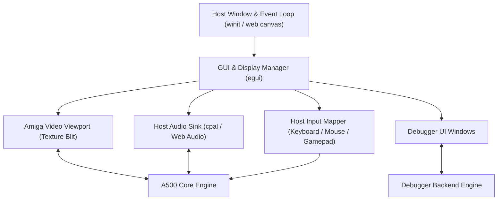

# Amiga 500 GUI & Frontend Architecture

> [!NOTE]
> The GUI is an external consumer of the emulator core. The core exposes pure frame buffers (`&[u32]`), audio sample ring buffers (`&[i16]`), and input event queues. The core has zero direct dependencies on UI frameworks or windowing APIs.

---

## 1. Frontend Architecture & Technology Stack

The UI frontend can target native desktop (Windows, macOS, Linux) and WebAssembly (`wasm32` in the browser) using a unified immediate-mode GUI framework (such as `egui` with `wgpu` or `pixels`):

---

## 2. Video Display Viewport

### 2.1 Resolution, Framing & Aspect Ratio
- **Native Resolution:** Amiga 500 standard output is 50 Hz PAL ($320 \times 256$ LoRes, $640 \times 512$ HiRes interlace) or 60 Hz NTSC ($320 \times 200$ LoRes, $640 \times 400$ HiRes).
- **Overscan Canvas:** Render into a maximum $720 \times 576$ internal buffer (`&[u32]` ARGB8888) to capture hardware overscan, Copper borders, and scrolling margins.
- **Aspect Ratio & Scaling:**
  - Standard Amiga monitors (Commodore 1084S) have a 4:3 physical aspect ratio.
  - The viewport performs integer scaling or sharp bilinear filtering with 4:3 display aspect ratio correction.

### 2.2 GPU Post-Processing & Old TV Simulation Shaders
We plan to implement a GPU shader pipeline (via WGSL / GLSL in `wgpu` and WebGL/WebGPU) with modular post-processing passes to reproduce authentic CRT monitor and vintage television optics:
- **CRT Geometry & Mask:**
  - Adjustable barrel curvature, bezel reflection, and corner vignette.
  - Shadow mask / aperture grille (Trinitron-style) phosphor subpixel triads.
  - Horizontal scanline rasterization with brightness-dependent scanline beam thickness.
- **Color & Signal Emulation (Old TV Look & Feel):**
  - Phosphor glow, halation, and bloom on bright highlights.
  - Optional composite / RF video signal artifacts (chroma subcarrier bleeding, horizontal color fringing, and luma/chroma crosstalk typical of SCART / RF modulators on 1980s TVs).
  - Configurable phosphor persistence and decay trails.

---

## 3. Audio Sink & LED Filter

- **Stereo Playback:** Dual-channel 8-bit signed audio (Channels 0 & 3 to Left, Channels 1 & 2 to Right) rendered at 44.1 kHz or 48 kHz.
- **Decoupled Ring Buffer:** Core streams samples into an internal lock-free ring buffer; host audio thread consumes from it without stalling emulation.
- **Audio Low-Pass Filter (Power LED Filter):**
  - The Amiga 500 has a fixed 7 kHz low-pass filter and a switchable 4.4 kHz RC low-pass filter controlled by CIA-A Port A bit 1 (`_LED`).
  - The GUI visualizes the Power LED brightness/filter state and applies digital IIR filtering.

---

## 4. Input Mapping Engine

Translates host input devices into Amiga hardware register events:

1. **Host Keyboard -> Amiga Keyboard Matrix:**
   - Translates physical host keys (`KeyCode`) into raw Amiga 8-bit scancodes transmitted to CIA-A `SDR`.
   - Maps host shortcuts (e.g. `Ctrl+Alt+Delete` or `F12`) to the Amiga `Ctrl-Amiga-Amiga` reset sequence.
   - *Detailed Specification:* See [Keyboard.md](Keyboard.md).
2. **Host Mouse -> Game Port 1 (`JOY0DAT` & CIA-A):**
   - Accumulates host cursor delta into Denise 8-bit quadrature counters (`JOY0DAT`).
   - Maps left, right, and middle mouse buttons to CIA-A `PRA` bit 6 and Paula `POTGO`.
   - Supports viewport pointer lock and mobile/touchscreen trackpad modes.
   - *Detailed Specification:* See [Mouse.md](Mouse.md).
3. **Host Gamepad -> Game Port 2 (`JOY1DAT` & CIA-A):**
   - Maps D-Pad / Analog stick to digital directional bits in `JOY1DAT`.
   - Maps gamepad buttons to CIA-A `PRA` bit 7 (Fire 1) and `POTGO` (Fire 2).
   - Supports keyboard-to-joystick mapping, autofire, and mobile virtual D-pad.
   - *Detailed Specification:* See [Joystick.md](Joystick.md).

---

## 5. Debugger UI Panels

When developer mode is enabled, the GUI displays interactive debugger tool windows powered by [Debugger.md](Debugger.md):

1. **CPU Register Window:**
   - Live display of Data ($D_0-D_7$) and Address ($A_0-A_7$) registers, $PC$, $SR$, and CCR condition flags ($X, N, Z, V, C$).
   - Quick toggle for Supervisor and Trace flags.
2. **Disassembly View:**
   - Scrollable instruction stream centered around the current $PC$.
   - Interactive breakpoint toggling on double-click.
   - Stepping toolbar: **Step CCK**, **Step Instruction**, **Step Scanline**, **Step Frame**, and **Resume**.
3. **Memory Hex Viewer:**
   - 24-bit address navigator with byte/word views and ASCII decoding.
   - Live memory search and watchpoint setup.
4. **Copper & DMA Visualizer:**
   - Disassembled live Copper lists (`COP1` and `COP2`) with execution cursor.
   - DMA slot logic analyzer: visual horizontal scanline graph indicating which master (CPU, Copper, Blitter, Bitplanes, Audio) occupied the bus.
5. **Custom Chip Inspector:**
   - Tabbed register tables for Agnus, Denise, Paula, and CIAs with human-readable bitfield breakdowns.
