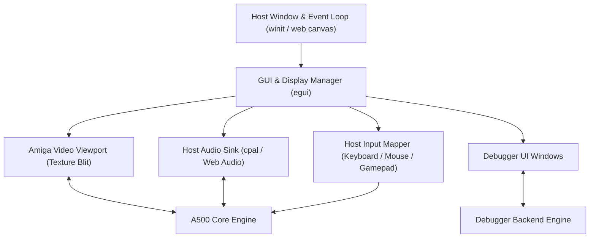

# Amiga 500 GUI & Frontend Architecture

- **Parent Specification:** [General Architecture.md](General%20Architecture.md)
- **Detailed Layout Specification:** [GUI Specification.md](GUI%20Specification.md)
- **Debugger Engine Companion:** [Debugger.md](Debugger.md)
- **Peripheral Specifications:** [Keyboard.md](Keyboard.md) | [Mouse.md](Mouse.md) | [Joystick.md](Joystick.md)
- **Frontend Guidelines:** [egui Guidelines.md](egui%20Guidelines.md) | [Rust Guidelines.md](Rust%20Guidelines.md)
- **Module Location:** `crates/gui/`
- **Engineering Guidelines:** Follow systems rules in [AGENTS.md](../../../AGENTS.md).

> [!NOTE]
> The GUI is an external consumer of the emulator core. The core exposes pure frame buffers (`&[u32]`), audio sample ring buffers (`&[i16]`), and input event queues. The core has zero direct dependencies on UI frameworks or windowing APIs.

---

## 1. Frontend Architecture & Technology Stack

The UI frontend can target native desktop (Windows, macOS, Linux) and WebAssembly (`wasm32` in the browser) using a unified immediate-mode GUI framework (such as `egui` with `wgpu` or `pixels`):

---

## 2. Video Display Viewport

### 2.1 Resolution, Framing & Aspect Ratio
- **Native Resolution:** Amiga 500 standard output is 50 Hz PAL ($320 \times 256$ LoRes, $640 \times 512$ HiRes interlace) or 60 Hz NTSC ($320 \times 200$ LoRes, $640 \times 400$ HiRes).
- **Overscan Canvas:** Render into a maximum $720 \times 576$ internal buffer (`&[u32]` ARGB8888) to capture hardware overscan, Copper borders, and scrolling margins.
- **Aspect Ratio & Scaling:**
  - Standard Amiga monitors (Commodore 1084S) have a 4:3 physical aspect ratio.
  - The viewport performs integer scaling or sharp bilinear filtering with 4:3 display aspect ratio correction.

### 2.2 GPU Post-Processing & Old TV Simulation Shaders
We plan to implement a GPU shader pipeline (via WGSL / GLSL in `wgpu` and WebGL/WebGPU) with modular post-processing passes to reproduce authentic CRT monitor and vintage television optics:
- **CRT Geometry & Mask:**
  - Adjustable barrel curvature, bezel reflection, and corner vignette.
  - Shadow mask / aperture grille (Trinitron-style) phosphor subpixel triads.
  - Horizontal scanline rasterization with brightness-dependent scanline beam thickness.
- **Color & Signal Emulation (Old TV Look & Feel):**
  - Phosphor glow, halation, and bloom on bright highlights.
  - Optional composite / RF video signal artifacts (chroma subcarrier bleeding, horizontal color fringing, and luma/chroma crosstalk typical of SCART / RF modulators on 1980s TVs).
  - Configurable phosphor persistence and decay trails.

---

## 3. Audio Sink & LED Filter

- **Stereo Playback:** Dual-channel 8-bit signed audio (Channels 0 & 3 to Left, Channels 1 & 2 to Right) rendered at 44.1 kHz or 48 kHz.
- **Decoupled Ring Buffer:** Core streams samples into an internal lock-free ring buffer; host audio thread consumes from it without stalling emulation.
- **Audio Low-Pass Filter (Power LED Filter):**
  - The Amiga 500 has a fixed 7 kHz low-pass filter and a switchable 4.4 kHz RC low-pass filter controlled by CIA-A Port A bit 1 (`_LED`).
  - The GUI visualizes the Power LED brightness/filter state and applies digital IIR filtering.

---

## 4. Input Mapping Engine

Translates host input devices into Amiga hardware register events:

1. **Host Keyboard -> Amiga Keyboard Matrix:**
   - Translates physical host keys (`KeyCode`) into raw Amiga 8-bit scancodes transmitted to CIA-A `SDR`.
   - Maps host shortcuts (e.g. `Ctrl+Alt+Delete` or `F12`) to the Amiga `Ctrl-Amiga-Amiga` reset sequence.
   - *Detailed Specification:* See [Keyboard.md](Keyboard.md).
2. **Host Mouse -> Game Port 1 (`JOY0DAT` & CIA-A):**
   - Accumulates host cursor delta into Denise 8-bit quadrature counters (`JOY0DAT`).
   - Maps left, right, and middle mouse buttons to CIA-A `PRA` bit 6 and Paula `POTGO`.
   - Supports viewport pointer lock and mobile/touchscreen trackpad modes.
   - *Detailed Specification:* See [Mouse.md](Mouse.md).
3. **Host Gamepad -> Game Port 2 (`JOY1DAT` & CIA-A):**
   - Maps D-Pad / Analog stick to digital directional bits in `JOY1DAT`.
   - Maps gamepad buttons to CIA-A `PRA` bit 7 (Fire 1) and `POTGO` (Fire 2).
   - Supports keyboard-to-joystick mapping, autofire, and mobile virtual D-pad.
   - *Detailed Specification:* See [Joystick.md](Joystick.md).

---

## 5. Developer GUI & Debugger Integration

The GUI incorporates an integrated developer studio and debugger implemented in [`crates/gui`](../../../crates/gui):
- **Dual Execution Modes:**
  - **Full Developer GUI (`ViewMode::Developer`):** Complete studio layout with register inspector, microcode visualizer, disassembly view, memory hex/search, breakpoints manager, execution trace log, and temporal rewind scrubber.
  - **Clean Screen / Game Mode (`ViewMode::ScreenOnly`):** Distraction-free 4:3 CRT monitor viewport with retro bezel, ideal for standalone game execution.
- **Instant Debugger Toggle (`F2`, `F12`, `Escape` & Floating Button):**
  - Pressing **`F2`**, **`F12`**, or clicking the floating **`[ 🛠 Debugger (F12) ]`** button in game mode immediately **pauses emulation and opens the Developer GUI** at that exact cycle.
  - Pressing **`F2`**, **`F12`**, **`Escape`** (from ScreenOnly), or clicking **`[ 🎮 Game View (F2 / F12) ]`** returns to clean screen view and resumes playing.
  - Supporting `F2` alongside `F12` eliminates the browser key collision where pressing `F12` in Chrome/Edge opens browser DevTools instead of toggling the emulator.
- **Collapsible Sub-Panels & Symmetrical Dock Alignment (`egui::CollapsingHeader`):**
  - Sub-panels in the Left Dock (Data Registers, Address Registers, Execution Status & CCR, Microcode Inspector) and Right Dock (Memory Search, Breakpoints & Watchpoints, Execution Trace Log) are collapsible with `.default_open(true)`.
  - Group boxes expand to 100% of available width (`ui.set_width(ui.available_width())`), eliminating vertical black gutter gaps against panel borders.
  - Data Registers (`d_regs_grid`) and Address Registers (`a_regs_grid`) share a unified 6-column geometry with 3-character labels (`D0:`..`D7:`, `A0:`..`A7:`), ensuring pixel-perfect alignment across columns. Active `A7 = SSP / USP` state is displayed cleanly via tooltips and dedicated status rows without inflating column widths.
  - Removed disruptive horizontal separator between Execution Status and Microcode Inspector.
- **Enhanced High-Visibility Scrollbars:**
  - Configured global `ScrollStyle` (`bar_width = 12.0`, `dormant_handle_opacity = 0.65`, `dormant_background_opacity = 0.35`, `active_handle_opacity = 1.0`) across all themes. Long data streams (Memory Hex, Trace Log, Disassembly) maintain permanent visibility, while fixed-height docks adapt dynamically (`VisibleWhenNeeded`) without phantom gutter bars.
- **Interactive Memory Watchpoint Highlighting:**
  - Bytes in the Memory Hex editor covered by active watchpoints are distinctly highlighted with amber/crimson badges in both Hex and ASCII columns.
  - Right-click context menu enables setting 1-byte, Word (2 bytes), Long (4 bytes), or range watchpoints with Read, Write, or Any access modes.
  - **Alt+Click** on any byte cell instantly toggles a 1-byte Write watchpoint.
- **Smart Startup Modes:**
  - Native Desktop (`cargo run -p gui`) defaults to Developer GUI, or starts in Game Mode via `--game` or `AMIGA_DEV_GUI=0`.
  - WebAssembly (`trunk serve crates/gui/index.html`) defaults to Game Mode.
- **High-Capacity Temporal Debugging (>=1.0s PAL Execution):**
  - High-capacity ring buffer (default 250,000 frames) in headless [`crates/debugger/src/temporal.rs`](../../../crates/debugger/src/temporal.rs) capturing cycle-exact snapshots with zero heap allocations.
  - Dynamic capacity presets (`25k`, `50k`, `100k`, `250k`, `500k`) resizable on the fly.
  - Live recording toggle (`[⏺ Rec: ON]` / `[⏸ Rec: OFF]`, `Alt+T`).
  - Multi-granularity navigation: `[⏮ First]`, `[◀◀ Frame]` (70,824 CCKs), `[-10]`, `[◀ -1]`, `[+1 ▶]`, `[+10]`, `[Frame ▶▶]`, and `[Live Head ⏭]`.
  - Target cycle jumping: direct input field `[ Jump to CCK: #_______ ] [ Go ]`.
- **Breakpoints & Watchpoints Manager:**
  - Dedicated panel in Right Dock to inspect, toggle, add, and remove PC execution breakpoints.
  - Register-based conditional rules (e.g. `PC == $001004 IF D0 == $2A`).
  - Memory range watchpoints (`Read`, `Write`, `Any`).
- **Arbitrary-Address Binary Loading:**
  - `Ctrl + O` or menu opens file dialog and prompts for any target RAM address (e.g. `$001000`, `$070000`, `$000000`).
  - Startup CLI: `cargo run -p gui -- --load path/to/code.bin --addr 001000`.
  - Drag-and-drop: dropping any `.bin`, `.rom`, or executable directly onto the window triggers the loader modal.
  - Automatically disengages Kickstart boot overlay (`bus.map_chip_ram_to_low_memory()`), initializes SP if needed, primes prefetch queue, and scrolls the memory editor.
- **Interactive Editing & Step Diff Highlighting:**
  - **Registers:** Click to edit D0-D7, A0-A7, PC, SR, USP, SSP. Editing PC re-primes prefetch. Changed registers glow with pill badges.
  - **CCR Flags:** Click to toggle bits; changed bits display distinct glowing outlines.
  - **Memory:** Inline hex byte editing with auto-focus and Tab navigation. Rendered cleanly as monospace text on natural theme panel background (zero pill/grid Moiré artifacts). Modified bytes highlighted in crisp cyan text, zeros muted, and watched bytes distinctly framed with flat coral borders.
  - **Disassembly In-Place Editing:** Edit instruction via assembly mnemonics (`NOP`, `MOVE.W D0, D1`) or raw hex (`4E71`). **Byte size invariance is strictly enforced**: if the replacement differs in byte count from the original, the change is aborted with an error banner.
- **Direct State Pull & Bounded Slicing:** Panels poll emulator state directly on render. Free-running execution uses bounded time-slicing (`MAX_INSTRUCTIONS_PER_FRAME = 5000`).
- **Self-Documenting In-App Hardware Encyclopedia (Zero-External-Lookup Principle):** 100% of registers, status bits, custom chip registers, memory ranges, and timeline controls provide comprehensive, self-contained documentation via `.on_hover_ui` and `.on_hover_text`. Users and developers can read complete hardware specifications, bitfield definitions, and privilege rules directly in the application without consulting external manuals.
- **Detailed Layout & Operational Specification:**
  - For the complete panel-by-panel operational specification, see **[GUI Specification.md](GUI%20Specification.md)**.

---

## 6. High-DPI, Display Scaling & Browser Zoom Adaptation

The application seamlessly adapts to host display scaling across both native desktop and web browser environments:

- **Desktop (Native DPI Scaling):**
  - `eframe` automatically detects the operating system scale factor (e.g. 100%, 125%, 150%, 200% Windows display scaling) via window surface queries and sets `egui::Context::set_pixels_per_point`.
  - All typography, panels, buttons, and metrics scale proportionally and remain sharp on 4K/retina displays.
  - In-app zoom shortcuts (`Ctrl +` / `Ctrl -` / `Ctrl 0`) dynamically alter `ctx.set_zoom_factor()` without window distortion.
- **WebAssembly (Browser Zoom Adaptation):**
  - In WebAssembly, `eframe::WebRunner` automatically tracks `window.devicePixelRatio`.
  - When a user zooms in or out via browser controls (`Ctrl +` / `Ctrl -` or browser accessibility settings), the canvas automatically resizes its internal buffer and adapts font rendering.
- **Amiga Pixel Viewport Scaling:**
  - The retro Amiga display area ($320 \times 256$) maintains strict 4:3 aspect ratio framing within its panel, utilizing crisp integer prescaling (1x, 2x, 3x) or sharp bilinear filtering so pixel art remains authentic regardless of window or zoom scale.

---

## 7. Appearance & Theme Management (System Dark / Light Mode)

The UI adapts to host OS and browser appearance preferences:

- **Auto Detection:**
  - On desktop, `eframe` queries the OS theme (`eframe::Theme::Dark` or `eframe::Theme::Light`).
  - In WebAssembly, the runner binds to `window.matchMedia('(prefers-color-scheme: dark)')`.
- **User Theme Control:**
  - The top menu bar provides a theme switcher: `System (Auto)`, `Dark Theme` (default, sleek low-eyestrain developer palette), `Light Theme`, and an optional `Classic Amiga Workbench` palette.
  - Theme switching immediately swaps `egui::Visuals` without restarting or losing emulator state.

---

## 8. Reference Documentation & Upstream Ground Truth

- [GUI Detailed Layout & Panel Specification](GUI%20Specification.md): Pixel-perfect dock geometries, keyboard shortcuts, and component structures.
- [egui Guidelines & Frontend Best Practices](egui%20Guidelines.md): Immediate-mode UI patterns, bounded execution, and headless testing rules.
- [Debugger Architecture & Inspection Engine](Debugger.md): Breakpoint traps, stepping controls, and disassembler facade.
- [GUI Crate Implementation](../../../crates/gui/src/gui.rs): Living Rust implementation of eframe app, views, docks, and modals.
- [GUI Interaction Test Suite](../../../crates/gui/tests/test_interactions.rs): Headless integration tests validating UI layout, keyboard events, and theme toggling.
- [vAmiga Desktop Reference](../../../ref_src/vAmiga-4.5/): Reference emulator GUI layout and presentation architecture.
