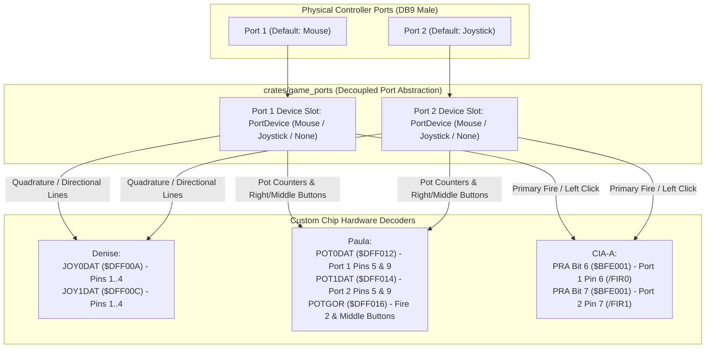

# Amiga 500 Dual Game Ports Subsystem Architecture

This document specifies the architecture, hardware signal routing, and software abstraction for the two physical 9-pin Atari D-Sub controller ports (Port 1 and Port 2) on the Commodore Amiga 500.

> [!NOTE]
> For quadrature mouse details, see [Mouse.md](Mouse.md). For digital and analog joysticks, see [Joystick.md](Joystick.md). For Denise video and counter registers, see [Denise.md](Denise.md). For Paula analog pot counters, see [Paula.md](Paula.md). For CIA-A peripheral interface lines, see [CIA.md](CIA.md). For top-level machine orchestration, see [General Architecture.md](General%20Architecture.md).

---

## 1. Hardware Architecture & Cross-Chip Signal Routing

On the physical Amiga 500 motherboard, the two 9-pin controller ports are not wired to a single monolithic chip. Instead, each port's 9 pins are distributed across three custom chips according to functional responsibility:



### 1.1 Pin-to-Chip Signal Distribution Matrix

| DB9 Pin | Signal Name | Device Usage | Destination Custom Chip | Active Logic |
| :---: | :--- | :--- | :--- | :--- |
| **1** | Up / V | Direction Up (Joy) / V-Pulse (Mouse) | Denise (`JOYxDAT` bit 8) | Quadrature / switch matrix |
| **2** | Down / H | Direction Down (Joy) / H-Pulse (Mouse) | Denise (`JOYxDAT` bit 0) | Quadrature / switch matrix |
| **3** | Left / VQ | Direction Left (Joy) / VQ-Pulse (Mouse) | Denise (`JOYxDAT` bit 9) | Direction bit / quadrature |
| **4** | Right / HQ | Direction Right (Joy) / HQ-Pulse (Mouse) | Denise (`JOYxDAT` bit 1) | Direction bit / quadrature |
| **5** | Pot X / Button 3 | Middle Mouse / Pot X | Paula (`POTxDAT` low / `POTGOR` bit 8 or 12) | Active low pull-down (0 = pressed) |
| **6** | Fire 1 / Left Button | Primary Trigger / Left Click | CIA-A (`PRA` bit 6 for Port 1, bit 7 for Port 2) | Active low pull-down (0 = pressed) |
| **7** | +5V DC | Logic Power (Max 100 mA) | Power Supply (+5V rail) | Continuous supply |
| **8** | GND | Signal Ground | Chassis Ground | Common return |
| **9** | Pot Y / Button 2 | Right Mouse / Secondary Fire | Paula (`POTxDAT` high / `POTGOR` bit 10 or 14) | Active low pull-down (0 = pressed) |

---

## 2. Decoupled Rust Architecture (`crates/game_ports`)

The `game_ports` crate models the physical controller ports as a peer subsystem of the machine, decoupling device implementations (`crates/mouse`, `crates/joystick`) from individual chip emulators:

### 2.1 Pluggable Device Slots (`PortDevice`)

```rust
#[derive(Debug, Clone, Copy, PartialEq, Eq, Serialize, Deserialize)]
pub enum PortDevice {
    /// Open / disconnected port
    None,
    /// Amiga 2-button or 3-button quadrature mouse
    Mouse(Mouse),
    /// Standard Atari / Amiga digital joystick
    Joystick(Joystick),
}
```

Each port slot can host any controller type independently, enabling flexible configurations (e.g. Mouse in Port 1 and Joystick in Port 2, Dual Joysticks for multiplayer games, or Dual Mice for custom software).

### 2.2 Observable Hardware State Snapshot (`GamePortsState`)

```rust
#[derive(Debug, Clone, Copy, PartialEq, Eq, Serialize, Deserialize)]
pub struct GamePortsState {
    pub port1: PortDevice,
    pub port2: PortDevice,
    pub pot0dat: u16,
    pub pot1dat: u16,
}
```

The state implements `serde::Serialize` and `serde::Deserialize` with zero pointer chasing or runtime heap allocations, ensuring save states capture controller hardware faithfully.

---

## 3. Register Decoding & Chipset Interfaces

### 3.1 Denise Direction & Quadrature Registers (`JOY0DAT` / `JOY1DAT`)

- `joy0dat(&self) -> u16`: Returns the 16-bit word for Port 1 (`$DFF00A`).
- `joy1dat(&self) -> u16`: Returns the 16-bit word for Port 2 (`$DFF00C`).

### 3.2 Paula Analog Potentiometers & Button Latch (`POTGOR`)

- `pot0dat(&self) -> u16`: Returns Port 1 analog charge counters (`$DFF012`).
- `pot1dat(&self) -> u16`: Returns Port 2 analog charge counters (`$DFF014`).
- `potgor(&self, potgo_latch: u16) -> u16`: Combines Paula's internal `POTGO` write latch (`$DFF034`) with active button pull-downs:
  - **Bit 14**: Port 2 Pin 9 (Right mouse / Fire 2). Active low (0 = pressed, 1 = released).
  - **Bit 12**: Port 2 Pin 5 (Middle mouse). Active low (0 = pressed, 1 = released).
  - **Bit 10**: Port 1 Pin 9 (Right mouse / Fire 2). Active low (0 = pressed, 1 = released).
  - **Bit 8**: Port 1 Pin 5 (Middle mouse). Active low (0 = pressed, 1 = released).

### 3.3 CIA-A Primary Fire Triggers (`PRA`)

- `fire1_port1(&self) -> bool`: Returns `true` if Port 1 primary trigger / left mouse button is pressed. Connected to CIA-A `PRA` bit 6 (`/FIR0`, active low: 0 = pressed).
- `fire1_port2(&self) -> bool`: Returns `true` if Port 2 primary trigger / fire 1 is pressed. Connected to CIA-A `PRA` bit 7 (`/FIR1`, active low: 0 = pressed).

---

## 4. Host Input Event Routing

Host UI frameworks (such as egui or SDL) route physical keyboard, mouse, and gamepad events to the emulated machine through dedicated forwarder helpers:

```rust
// Relative mouse delta routing
machine.apply_mouse_delta(dx, dy);

// Mouse button state routing (left, right, middle)
machine.set_mouse_buttons(left, right, middle);

// Joystick directional switches and dual fire buttons
machine.set_joystick(up, down, left, right, fire1, fire2);
```

The `game_ports` subsystem automatically routes mouse deltas to whichever port currently hosts a mouse and joystick events to whichever port currently hosts a joystick.
