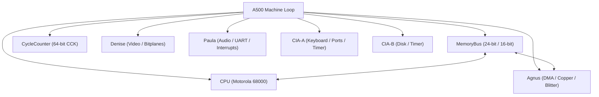

# Amiga 500 General System Architecture

> [!NOTE]
> Project-wide engineering constraints, Rust coding guidelines, and WASM requirements are defined in [AGENTS.md](file:///d:/Programowanie/Amiga/AGENTS.md).

---

## 1. System Block Diagram & Ownership

The emulator is organized around a top-level machine struct named `A500`, which owns all subsystems and manages coordination without circular handles:

- **Top-Level Machine (`A500`)**: Controls stepping (single CCK, multi-cycle, or full video frame), reset lines, and interrupt priority arbitration (IPL 1–6).
- **Decoupled Modules**: Subsystems do not hold references or callbacks to one another; signals and bus requests are driven in the main machine loop and `MemoryBus`.
- **Circuit Simulation & Signal Propagation**: Hardware components model physical circuit delay. Changes to register latches take effect on subsequent clock phases/cycles rather than propagating instantaneously across chips.

---

## 2. External Interfaces & Data Flow

- **ROM & Disk Injection**: Kickstart ROM images and disk buffers are injected from the outside as raw byte slices (`&[u8]`).
- **Decoupled Host I/O**:
  - Video rendering outputs into a dedicated frame buffer.
  - Audio outputs into decoupled sample ring buffers.
  - Save states serialize full machine state to/from JSON (see [SaveState.md](file:///d:/Programowanie/Amiga/Obsidian/Amiga/Design/SaveState.md)).

---

## 3. Subsystem Reference Links

- [Main loop A500.md](file:///d:/Programowanie/Amiga/Obsidian/Amiga/Design/Main%20loop%20A500.md): Machine stepping, reset sequence, and interrupt arbitration.
- [MemoryBus.md](file:///d:/Programowanie/Amiga/Obsidian/Amiga/Design/MemoryBus.md): 2-phase CCK arbitration, address decoding, and DMA contention.
- [CPU Motorola M68000.md](file:///d:/Programowanie/Amiga/Obsidian/Amiga/Design/CPU%20Motorola%20M68000.md): M68000 core state, registers, and prefetch queue.
- [Specialized Chips.md](file:///d:/Programowanie/Amiga/Obsidian/Amiga/Design/Specialized%20Chips.md): Custom chips (Agnus, Denise, Paula) and CIAs (8520).
- [CycleCounter.md](file:///d:/Programowanie/Amiga/Obsidian/Amiga/Design/CycleCounter.md): Master Color Clock counter.
- [SaveState.md](file:///d:/Programowanie/Amiga/Obsidian/Amiga/Design/SaveState.md): State serialization model.
- [Configuration.md](file:///d:/Programowanie/Amiga/Obsidian/Amiga/Design/Configuration.md): Machine configuration, RAM sizes, chipset models, and ROM injection.
- [Debugger.md](file:///d:/Programowanie/Amiga/Obsidian/Amiga/Design/Debugger.md): Headless debugger backend, stepping, breakpoints, and disassembler.
- [GUI.md](file:///d:/Programowanie/Amiga/Obsidian/Amiga/Design/GUI.md): Frontend architecture, video viewport, audio sink, and developer UI panels.

---

## 4. Architecture Notes & TODOs

- **Memory Interleaving & Buffers**:
  - Document the exact mechanism where CPU accesses memory during alternate Color Clock slots while custom chips perform DMA.
  - Clarify the transparent read latch buffer in `MemoryBus` that isolates the CPU during bus wait states.