# Amiga 500 General System Architecture

> [!NOTE]
> Project-wide engineering constraints, Rust coding guidelines, and WASM requirements are defined in [AGENTS.md](../../../AGENTS.md).

---

## 1. System Block Diagram & Ownership

The emulator is organized around a top-level machine struct named A500, which owns all subsystems and manages coordination without circular handles:

`mermaid
graph TD
    A500["A500 Machine Loop"] --> CPU["CPU (Motorola 68000)"]
    A500 --> BUS["MemoryBus (24-bit / 16-bit)"]
    A500 --> CLK["Master CCK Counter (u64)"]
    A500 --> AGNUS["Agnus (DMA / Copper / Blitter)"]
    A500 --> DENISE["Denise (Video / Bitplanes)"]
    A500 --> PAULA["Paula (Audio / UART / Interrupts)"]
    A500 --> CIAA["CIA-A (Keyboard / Ports / Timer)"]
    A500 --> CIAB["CIA-B (Disk / Timer)"]

    BUS <--> AGNUS
    BUS <--> CPU
`

- **Top-Level Machine (A500)**: Controls stepping (single CCK, multi-cycle, or full video frame), reset lines, and interrupt priority arbitration (IPL 1–6).
- **Decoupled Modules**: Subsystems do not hold references or callbacks to one another; signals and bus requests are driven in the main machine loop and MemoryBus.
- **Circuit Simulation & Signal Propagation**: Hardware components model physical circuit delay. Changes to register latches take effect on subsequent clock phases/cycles rather than propagating instantaneously across chips.

---

## 2. Workspace Crate Architecture & Dependencies

The codebase is organized as a Cargo workspace with decoupled, single-responsibility crates located under crates/:

```mermaid
graph TD
    classDef top fill:#0f2537,stroke:#38ef7d,stroke-width:2px,color:#ffffff;
    classDef core fill:#1e3a5f,stroke:#4f9da6,stroke-width:2px,color:#ffffff;
    classDef chip fill:#2d1b4e,stroke:#9d4edd,stroke-width:2px,color:#ffffff;
    classDef subchip fill:#3b1e36,stroke:#f72585,stroke-width:1px,color:#ffffff;
    classDef periph fill:#1b3b22,stroke:#52b788,stroke-width:2px,color:#ffffff;
    classDef tool fill:#3d2c40,stroke:#d16ba5,stroke-width:2px,color:#ffffff;

    subgraph TopLevel["Top-Level Machine Chassis"]
        ML["machine_loop<br/><code>crates/machine_loop</code>"]:::top
    end

    subgraph MemoryAndCPU["Memory Storage & CPU Core"]
        CFG["config<br/><code>crates/config</code>"]:::core
        PMEM["physical_memory<br/><code>crates/physical_memory</code>"]:::core
        MBUS["memory_bus<br/><code>crates/memory_bus</code>"]:::core
        RTC["rtc<br/><code>crates/rtc</code>"]:::core
        CPU["m68000<br/><code>crates/m68000</code>"]:::core
    end

    subgraph CustomChips["Custom Chip Coordinators & Coprocessors"]
        AGNUS["agnus<br/><code>crates/agnus</code>"]:::chip
        COP["copper<br/><code>crates/copper</code>"]:::subchip
        BLT["blitter<br/><code>crates/blitter</code>"]:::subchip
        DMA["dma<br/><code>crates/dma</code>"]:::subchip

        DENISE["denise<br/><code>crates/denise</code>"]:::chip
        SPR["sprites<br/><code>crates/sprites</code>"]:::subchip
        FB["frame_builder<br/><code>crates/frame_builder</code>"]:::subchip

        PAULA["paula<br/><code>crates/paula</code>"]:::chip
        AUD["audio<br/><code>crates/audio</code>"]:::subchip
        SER["serial_port<br/><code>crates/serial_port</code>"]:::subchip

        CIA["cia (A & B)<br/><code>crates/cia</code>"]:::chip
    end

    subgraph Peripherals["Peripherals & Input Devices"]
        GP["game_ports<br/><code>crates/game_ports</code>"]:::periph
        MOU["mouse<br/><code>crates/mouse</code>"]:::subchip
        JOY["joystick<br/><code>crates/joystick</code>"]:::subchip
        FLP["floppy<br/><code>crates/floppy</code>"]:::periph
        KBD["keyboard<br/><code>crates/keyboard</code>"]:::periph
        PAR["parallel_port<br/><code>crates/parallel_port</code>"]:::periph
    end

    subgraph Diagnostics["Diagnostics, Debugger & GUI"]
        DIS["disassembler<br/><code>crates/disassembler</code>"]:::tool
        DBG["debugger<br/><code>crates/debugger</code>"]:::tool
        GUI["gui<br/><code>crates/gui</code>"]:::tool
        TR["test_runner<br/><code>crates/test_runner</code>"]:::tool
    end

    %% Chassis Ownership & Routing
    ML --> CPU
    ML --> PMEM
    ML --> MBUS
    ML --> AGNUS
    ML --> DENISE
    ML --> PAULA
    ML --> CIA
    ML --> FLP
    ML --> KBD
    ML --> GP
    ML --> PAR
    ML --> RTC

    %% Logical Containment / Re-exports
    AGNUS --> COP
    AGNUS --> BLT
    AGNUS --> DMA

    DENISE --> SPR
    DENISE --> FB

    PAULA --> AUD
    PAULA --> SER

    GP --> MOU
    GP --> JOY

    %% Memory & Bus Connections
    PMEM --> CFG
    PMEM --> RTC
    MBUS --> PMEM
    CPU --> PMEM

    %% Tooling Dependencies
    DBG --> CPU
    DBG --> PMEM
    DBG --> DIS
    GUI --> DBG
    TR --> DBG
```

### Crate Descriptions & Responsibilities

| Crate | Path | Responsibility | Workspace Dependencies |
| :--- | :--- | :--- | :--- |
| **config** | [crates/config](../../../crates/config) | Encapsulated, read-only hardware presets (Bare512k, Standard1Mb, ExpandedPowerUser), chip models, RtcModel, video timings. | *None* |
| **copper** | [crates/copper](../../../crates/copper) | Agnus Copper coprocessor (MOVE, WAIT, SKIP, CDANG danger mode). | serde |
| **blitter** | [crates/blitter](../../../crates/blitter) | Agnus 4-channel DMA Blitter, minterm ALU, barrel shifters, and line drawer. | serde |
| **dma** | [crates/dma](../../../crates/dma) | Agnus DMA slot scheduler (227.5 CCK horizontal schedule), channel gating (`DMACON`), and Chip RAM contention. | serde |
| **agnus** | [crates/agnus](../../../crates/agnus) | Agnus (MOS 8370/8371/8372A) chip coordinator and beam counters (`VHPOSR`, `VPOSR`). | config, serde |
| **sprites** | [crates/sprites](../../../crates/sprites) | Denise 8 hardware sprite engines, coordinate comparators, attached pairs, multiplexing. | serde |
| **frame_builder** | [crates/frame_builder](../../../crates/frame_builder) | Denise raster scanline compositor, display window clipping, and 32-bit ARGB frame buffer generation. | serde |
| **mouse** | [crates/mouse](../../../crates/mouse) | Amiga 2/3-button quadrature mouse and `JOY0DAT` encoding. | serde |
| **joystick** | [crates/joystick](../../../crates/joystick) | Digital Atari 9-pin standard joystick and `JOYxDAT` direction switch XOR encoding. | serde |
| **game_ports** | [crates/game_ports](../../../crates/game_ports) | Amiga dual 9-pin controller ports (Port 1 & Port 2), pluggable device slots (`Mouse`, `Joystick`), Denise/Paula/CIA-A decoders. | mouse, joystick, serde |
| **denise** | [crates/denise](../../../crates/denise) | Denise (MOS 8362/8373) video processor, bitplanes, palette (`COLOR00`–`COLOR31`), and collision registers. | config, serde |
| **audio** | [crates/audio](../../../crates/audio) | Paula 4-channel 8-bit DMA audio engine, volume scaling (0..64), and stereo panning. | serde |
| **floppy** | [crates/floppy](../../../crates/floppy) | 3.5" DD floppy drive mechanics (80 cylinders, 2 heads) and Paula MFM DMA controller. | serde |
| **serial_port** | [crates/serial_port](../../../crates/serial_port) | Paula RS-232 UART transceiver (`SERDAT`, `SERPER`) and CIA-B handshakes. | serde |
| **paula** | [crates/paula](../../../crates/paula) | Paula (MOS 8364) chip coordinator and central interrupt multiplexer (`INTENA`/`INTREQ`). | serde |
| **keyboard** | [crates/keyboard](../../../crates/keyboard) | MOS 6500/1 keyboard microcontroller, scancode matrix, serial stream, and Ctrl-Amiga-Amiga reset. | serde |
| **parallel_port** | [crates/parallel_port](../../../crates/parallel_port) | Centronics 8-bit bidirectional parallel printer port and CIA-B handshakes. | serde |
| **cia** | [crates/cia](../../../crates/cia) | MOS 8520 Complex Interface Adapter (Timers A & B, Ports A & B, TOD, SDR, ICR). | serde |
| **rtc** | [crates/rtc](../../../crates/rtc) | OKI MSM6242B Real-Time Clock & Calendar emulation, BCD latches, civil calendar arithmetic. | config, serde |
| **physical_memory** | [crates/physical_memory](../../../crates/physical_memory) | 24-bit physical address space, 256-entry 64KB bank table (`addr >> 16`), 2-phase CCK arbitration, open bus emulation. | config, rtc |
| **memory_bus** | [crates/memory_bus](../../../crates/memory_bus) | Motherboard address router (`MemoryBus<'a>`), dispatching 24-bit address space live to physical storage, custom chips, and peripherals. | agnus, audio, blitter, cia, copper, denise, dma, floppy, frame_builder, paula, physical_memory, rtc, sprites |
| **m68000** | [crates/m68000](../../../crates/m68000) | Cycle-exact Motorola 68000 CPU core, 65,536-entry compile-time static dispatch table, registers, ALU, prefetch queue. | physical_memory |
| **machine_loop** | [crates/machine_loop](../../../crates/machine_loop) | Tier 0 top-level machine facade owning CPU, memory bus router, monotonic `u64` CCK counter, custom chips, coprocessors, and devices in a flat structure with parameter-based cycle stepping. | agnus, audio, blitter, cia, config, copper, denise, dma, floppy, frame_builder, game_ports, joystick, keyboard, m68000, memory_bus, mouse, parallel_port, paula, physical_memory, rtc, serial_port, sprites, serde |
| **disassembler** | [crates/disassembler](../../../crates/disassembler) | Cycle-exact M68000 instruction disassembler. | *None* |
| **debugger** | [crates/debugger](../../../crates/debugger) | Headless inspection and debugging subsystem, temporal time-travel engine, breakpoints, and watchpoints. | m68000, physical_memory, disassembler |
| **test_runner** | [crates/test_runner](../../../crates/test_runner) | Automated validation against Tom Harte SingleStepTests, cycle-exact benchmarking, and Cartesian DMA contention suite. | m68000, physical_memory, debugger, disassembler |
| **gui** | [crates/gui](../../../crates/gui) | Immediate-mode Developer Studio & Standalone GUI (egui/eframe), live CPU/memory inspection, temporal time-travel scrubber. | m68000, physical_memory, debugger, config, rtc |

---

## 3. External Interfaces & Data Flow

- **ROM & Disk Injection**: Kickstart ROM images and disk buffers are injected from the outside as raw byte slices (&[u8]).
- **Decoupled Host I/O**:
  - Video rendering outputs into a dedicated frame buffer.
  - Audio outputs into decoupled sample ring buffers.
  - Save states serialize full machine state to/from JSON (see [SaveState.md](SaveState.md)).

---

## 4. Subsystem Reference Links

- [CPU Motorola M68000.md](CPU%20Motorola%20M68000.md): Register architecture, condition codes, exception vectors, and instruction set.
- [CPU Micro-Step State Machine.md](CPU%20Micro-Step%20State%20Machine.md): Cycle-exact micro-operations, bus strobes, pipeline refills, and micro-step traces.
- [CPU SingleStepTests.md](CPU%20SingleStepTests.md): Verification suite against Tom Harte physical silicon test vectors.
- [CPU Instruction Benchmarking.md](CPU%20Instruction%20Benchmarking.md): Cycle-exact benchmarking engine, memory map, execution trace dumping (--dump-traces), and timing anomaly detection.
- [CPU Instruction Benchmark Catalog.md](CPU%20Instruction%20Benchmark%20Catalog.md): Comprehensive test case catalog across all instructions, addressing modes, and operand permutations.
- [CPU Instruction Benchmark Strategies.md](CPU%20Instruction%20Benchmark%20Strategies.md): Loop construction patterns, PRNG data synthesis, and cycle timing strategies.
- [Main loop A500.md](Main%20loop%20A500.md): Machine stepping, reset sequence, and interrupt arbitration.
- [MemoryBus.md](MemoryBus.md): 2-phase CCK arbitration, address decoding, and DMA contention.
- [Agnus.md](Agnus.md): Master beam counters, DMA arbiter, Copper, and 4-channel Blitter.
- [Denise.md](Denise.md): Video pixel serializer, bitplanes, sprites, palette, and collisions.
- [Paula.md](Paula.md): 4-channel DMA audio, floppy disk MFM controller, serial UART, and central interrupt multiplexer.
- [CIA.md](CIA.md): Dual MOS 8520 Complex Interface Adapters (timers, TOD, SDR, parallel & control ports).
- [SaveState.md](SaveState.md): State serialization model.
- [Configuration.md](Configuration.md): Machine configuration, RAM sizes, chipset models, and ROM injection.
- [Debugger.md](Debugger.md): Headless debugger backend, stepping, breakpoints, and disassembler.
- [GUI.md](GUI.md): Frontend architecture, video viewport, audio sink, DPI/theme adaptation, and decoupled interfaces.
- [GUI Specification.md](GUI%20Specification.md): Concrete layout and operational specification for developer GUI, panels, memory editor, and 1:1 file hierarchy.
- [Joystick.md](Joystick.md): Game port digital/analog joysticks, 4-player parallel adapter, and host gamepad mapping.
- [Game Ports.md](Game%20Ports.md): Dual 9-pin controller ports (Port 1 & Port 2), signal routing across Denise, Paula, and CIA-A, and host event routing.
- [Mouse.md](Mouse.md): Port 1 quadrature counters (JOY0DAT), buttons, pointer locking, and touchscreen mapping.
- [Keyboard.md](Keyboard.md): Microcontroller serial protocol, scancode matrix, Ctrl-Amiga-Amiga reset, and host layout-independent key mapping.
- [Floppy.md](Floppy.md): 3.5" DD drive mechanics, multi-chip interface (CIA-A, CIA-B, Paula, Agnus), MFM track layout, and ADF ingestion.
- [RTC.md](RTC.md): OKI MSM6242B real-time clock, battery-backed registers, BCD calendar, and 24/12h timing.
- [Platform Quirks and Invariants Catalog.md](Platform%20Quirks%20and%20Invariants%20Catalog.md): Centralized master catalog of hardware idiosyncrasies, silicon timing traps, and anti-tamper invariants across CPU, chipset, and memory bus.
- [Cross-Chip Signals and Action Dispatch Catalog.md](Cross-Chip%20Signals%20and%20Action%20Dispatch%20Catalog.md): Closed silicon signal space, inter-chip bus propagation latencies, conflict resolution, and action dispatch matrix.
- [Custom Chip Register Ownership and Access Matrix.md](Custom%20Chip%20Register%20Ownership%20and%20Access%20Matrix.md): Split read/write identities, physical chip ownership (Agnus, Denise, Paula), open bus floating states, and register access modes ($000..$1FE).
- [Testing Strategy and Quality Assurance.md](Testing%20Strategy%20and%20Quality%20Assurance.md): 3-Tier Testing Architecture, external tests/ architecture, and verification tooling.

