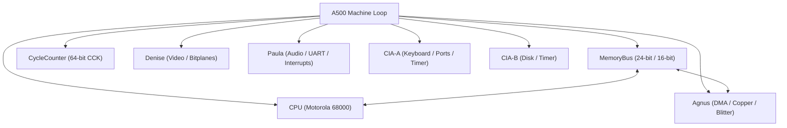
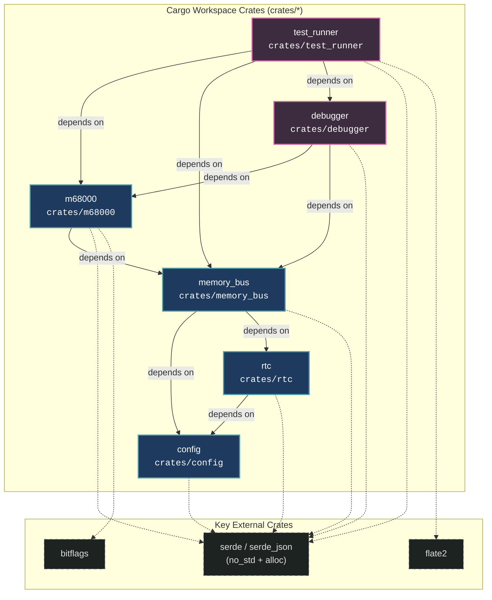

# Amiga 500 General System Architecture

> [!NOTE]
> Project-wide engineering constraints, Rust coding guidelines, and WASM requirements are defined in [AGENTS.md](../../../AGENTS.md).

---

## 1. System Block Diagram & Ownership

The emulator is organized around a top-level machine struct named `A500`, which owns all subsystems and manages coordination without circular handles:

- **Top-Level Machine (`A500`)**: Controls stepping (single CCK, multi-cycle, or full video frame), reset lines, and interrupt priority arbitration (IPL 1–6).
- **Decoupled Modules**: Subsystems do not hold references or callbacks to one another; signals and bus requests are driven in the main machine loop and `MemoryBus`.
- **Circuit Simulation & Signal Propagation**: Hardware components model physical circuit delay. Changes to register latches take effect on subsequent clock phases/cycles rather than propagating instantaneously across chips.

---

## 2. Workspace Crate Architecture & Dependencies

The codebase is organized as a Cargo workspace with decoupled, single-responsibility crates located under `crates/`:

### Crate Descriptions & Responsibilities

| Crate | Path | Responsibility | Workspace Dependencies |
| :--- | :--- | :--- | :--- |
| **`config`** | [`crates/config`](../../../crates/config) | Encapsulated, read-only hardware presets (`Bare512k`, `Standard1Mb`, `ExpandedPowerUser`), `RtcModel`, video timings. | *None* |
| **`rtc`** | [`crates/rtc`](../../../crates/rtc) | OKI MSM6242B Real-Time Clock & Calendar emulation, BCD latches, standalone civil calendar arithmetic, and CCK cycle stepping. | `config` |
| **`memory_bus`** | [`crates/memory_bus`](../../../crates/memory_bus) | 24-bit physical address space, 256-entry 64KB bank table (`addr >> 16`), 2-phase CCK arbitration, open bus emulation. | `config`, `rtc` |
| **`m68000`** | [`crates/m68000`](../../../crates/m68000) | Cycle-exact Motorola 68000 CPU core, 65,536-entry compile-time static dispatch table, registers, ALU, prefetch queue. | `memory_bus` |
| **`debugger`** | [`crates/debugger`](../../../crates/debugger) | Headless inspection and debugging subsystem, register/memory inspectors, disassembly, breakpoint triggers. | `m68000`, `memory_bus` |
| **`test_runner`** | [`crates/test_runner`](../../../crates/test_runner) | Automated validation against MAME (`.json`) and Tom Harte (`.json`) SingleStepTests suites. | `m68000`, `memory_bus`, `debugger` |

---

## 3. External Interfaces & Data Flow

- **ROM & Disk Injection**: Kickstart ROM images and disk buffers are injected from the outside as raw byte slices (`&[u8]`).
- **Decoupled Host I/O**:
  - Video rendering outputs into a dedicated frame buffer.
  - Audio outputs into decoupled sample ring buffers.
  - Save states serialize full machine state to/from JSON (see [SaveState.md](SaveState.md)).

---

## 4. Subsystem Reference Links

- [Main loop A500.md](Main%20loop%20A500.md): Machine stepping, reset sequence, and interrupt arbitration.
- [MemoryBus.md](MemoryBus.md): 2-phase CCK arbitration, address decoding, and DMA contention.
- [Agnus.md](Agnus.md): Master beam counters, DMA arbiter, Copper, and 4-channel Blitter.
- [Denise.md](Denise.md): Video pixel serializer, bitplanes, sprites, palette, and collisions.
- [Paula.md](Paula.md): 4-channel DMA audio, floppy disk MFM controller, serial UART, and central interrupt multiplexer.
- [CIA.md](CIA.md): Dual MOS 8520 Complex Interface Adapters (timers, TOD, SDR, parallel & control ports).
- [CycleCounter.md](CycleCounter.md): Master Color Clock counter.
- [SaveState.md](SaveState.md): State serialization model.
- [Configuration.md](Configuration.md): Machine configuration, RAM sizes, chipset models, and ROM injection.
- [Debugger.md](Debugger.md): Headless debugger backend, stepping, breakpoints, and disassembler.
- [GUI.md](GUI.md): Frontend architecture, video viewport, audio sink, and developer UI panels.
- [Joystick.md](Joystick.md): Game port digital/analog joysticks, 4-player parallel adapter, and host gamepad mapping.
- [Mouse.md](Mouse.md): Port 1 quadrature counters (`JOY0DAT`), buttons, pointer locking, and touchscreen mapping.
- [Keyboard.md](Keyboard.md): Microcontroller serial protocol, scancode matrix, `Ctrl-Amiga-Amiga` reset, and host layout-independent key mapping.
- [Floppy.md](Floppy.md): 3.5" DD drive mechanics, multi-chip interface (CIA-A, CIA-B, Paula, Agnus), MFM track layout, and ADF ingestion.
- [RTC.md](RTC.md): OKI MSM6242B real-time clock, battery-backed registers, BCD calendar, and 24/12h timing.