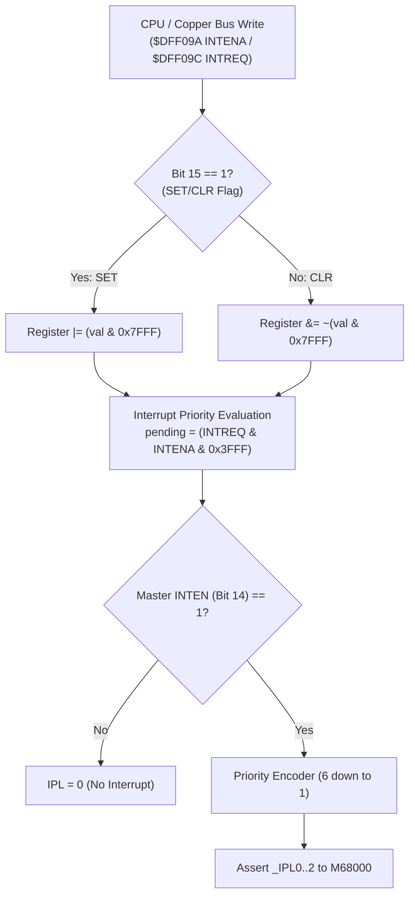

# Amiga 500 Central Interrupt Architecture & Controller Specification

- **Parent Architectural Hub:** [General Architecture.md](General%20Architecture.md)
- **Subsystem Coordinator:** [Paula.md](Paula.md)
- **CPU Execution & Autovectors:** [CPU Motorola M68000.md](CPU%20Motorola%20M68000.md)
- **Motherboard Signal Dispatch:** [Cross-Chip Signals and Action Dispatch Catalog.md](Cross-Chip%20Signals%20and%20Action%20Dispatch%20Catalog.md)

---

## 1. Core Decisions & Architectural Takeaways

1. **Centralized Priority Encoding on Paula (MOS 8364):**
   - The Amiga architecture routes all 14 discrete system interrupt sources into a centralized priority encoder physically located inside the Paula custom chip.
   - Paula encodes active requests into 6 prioritized levels ($IPL 1..6$) and directly drives the Motorola 68000 interrupt priority lines (`_IPL0`, `_IPL1`, `_IPL2`).
2. **Asymmetric Register Pairs with Atomic SET/CLR Semantics:**
   - Writing to `$DFF09A` (`INTENA`) or `$DFF09C` (`INTREQ`) uses **Bit 15 as an atomic control flag**:
     - **Bit 15 = 1 (`SET`):** Any bit set to `1` in bits 0..14 is asserted or enabled.
     - **Bit 15 = 0 (`CLR`):** Any bit set to `1` in bits 0..14 is cleared or disabled.
     - Bits written with `0` remain completely unmodified.
   - Reading occurs at distinct symmetrical register addresses `$DFF01C` (`INTENAR`) and `$DFF01E` (`INTREQR`).
3. **Decoupled Crate Architecture (`crates/interrupts`):**
   - The core logic of the 14-source priority encoder and SET/CLR semantics is encapsulated in a standalone, allocation-free crate `crates/interrupts`.
   - Paula embeds and re-exports `InterruptController`, enforcing 1 CCK write propagation delay across the memory bus while keeping interrupt evaluation clean and decoupled.

---

## 2. Priority Level Encoding & Interrupt Sources Matrix

The Amiga custom chipset and peripherals define 14 hardware interrupt sources mapped into 6 prioritized levels ($IPL 1..6$). Level 7 is reserved for external non-maskable interrupts (NMI):

| Level | Bit | Symbol | Triggering Subsystem | Description & Silicon Mechanics |
| :---: | :---: | :--- | :--- | :--- |
| **6** | 13 | **`EXTER`** | **CIA-B** | External interrupt line asserted by CIA-B (Timer A/B underflow, serial, TOD alarm). |
| **5** | 12 | **`DSKSYN`** | **Paula (Floppy)** | Disk sync pattern matched incoming MFM serial bitstream (typically `$4489`). |
| **5** | 11 | **`RBF`** | **Paula (UART)** | Serial port Receive Buffer Full (`SERDATR` holding register loaded). |
| **4** | 10 | **`AUD3`** | **Paula (Audio)** | Audio channel 3 sample buffer loop finished / DMA reload requested. |
| **4** | 9 | **`AUD2`** | **Paula (Audio)** | Audio channel 2 sample buffer loop finished / DMA reload requested. |
| **4** | 8 | **`AUD1`** | **Paula (Audio)** | Audio channel 1 sample buffer loop finished / DMA reload requested. |
| **4** | 7 | **`AUD0`** | **Paula (Audio)** | Audio channel 0 sample buffer loop finished / DMA reload requested. |
| **3** | 6 | **`BLIT`** | **Agnus (Blitter)** | Blitter coprocessor finished current 2D block transfer or line draw operation. |
| **3** | 5 | **`VERTB`** | **Agnus (Beam)** | Vertical blanking interval started (beam entered vertical blanking band). |
| **3** | 4 | **`COPER`** | **Agnus (Copper)** | Copper coprocessor executed instruction with interrupt bit set or Copper strobe. |
| **2** | 3 | **`PORTS`** | **CIA-A** | I/O port interrupt asserted by CIA-A (keyboard, timer underflow, TOD 50/60 Hz tick). |
| **1** | 2 | **`SOFT`** | **CPU (Software)** | Software-triggered interrupt written directly to `INTREQ` by guest software. |
| **1** | 1 | **`DSKBLK`** | **Paula (Floppy)** | Disk block DMA transfer completed (word counter in `DSKLEN` expired). |
| **1** | 0 | **`TBE`** | **Paula (UART)** | Serial port Transmit Buffer Empty (`SERDAT` holding register ready for next word). |

---

## 3. Register Control & SET/CLR Mechanics



### 3.1 Asymmetric Register Address Map

- **`$DFF01C` (`INTENAR`):** Read-only. Returns current 15-bit interrupt enable mask (bit 14 reflects master `INTEN`).
- **`$DFF09A` (`INTENA`):** Write-only. Writes bits 0..14 with bit 15 selecting atomic `SET` (1) or `CLR` (0).
- **`$DFF01E` (`INTREQR`):** Read-only. Returns current 14-bit interrupt request mask.
- **`$DFF09C` (`INTREQ`):** Write-only. Writes bits 0..13 with bit 15 selecting atomic `SET` (1) or `CLR` (0).

### 3.2 Master Interrupt Enable Bit (`INTEN`, Bit 14)
- Bit 14 of `INTENA` is the **Master Interrupt Enable** (`INTEN`).
- When `INTEN == 0`, all 14 hardware interrupt requests are masked from the CPU. Paula drives `_IPL0..2 = 111` (IPL level 0).
- Individual request bits in `INTREQ` continue to accumulate and latch even when `INTEN == 0` or when their respective channel enable bit in `INTENA` is cleared. As soon as `INTEN` and the channel bit are set, the pending interrupt immediately escalates to the CPU.

---

## 4. Hardware Priority Resolution & Preemption Logic

The priority encoder resolves pending interrupts strictly in descending order ($6 \to 5 \to 4 \to 3 \to 2 \to 1$):
- **Level 6 Preemption:** If `EXTER` (bit 13) is asserted and unmasked, the CPU interrupt priority level is driven to 6, regardless of active requests on levels 1..5.
- **Level 5 Arbitration:** If either `DSKSYN` (bit 12) or `RBF` (bit 11) is active and Level 6 is clear, level 5 is driven.
- **Level 4 Arbitration:** If any of `AUD0`..`AUD3` (bits 7..10) are active and Levels 5..6 are clear, level 4 is driven.
- **Level 3 Arbitration:** If any of `COPER`, `VERTB`, or `BLIT` (bits 4..6) are active and Levels 4..6 are clear, level 3 is driven.
- **Level 2 Arbitration:** If `PORTS` (bit 3) is active and Levels 3..6 are clear, level 2 is driven.
- **Level 1 Arbitration:** If any of `TBE`, `DSKBLK`, or `SOFT` (bits 0..2) are active and Levels 2..6 are clear, level 1 is driven.

---

## 5. Decoupled Rust Crate Architecture (`crates/interrupts`)

The interrupt controller is encapsulated in `crates/interrupts/src/interrupts.rs`:

```rust
#[derive(Debug, Clone, Copy, PartialEq, Eq, Default, Serialize, Deserialize)]
pub struct InterruptController {
    pub intena: u16,
    pub intreq: u16,
}

impl InterruptController {
    pub fn new() -> Self;
    pub fn reset(&mut self);
    pub fn write_intena(&mut self, val: u16);
    pub fn write_intreq(&mut self, val: u16);
    pub fn request(&mut self, mask: u16);
    pub fn clear_request(&mut self, mask: u16);
    pub fn is_requested(&self, mask: u16) -> bool;
    pub fn is_enabled(&self, mask: u16) -> bool;
    pub fn is_master_enabled(&self) -> bool;
    pub fn pending_mask(&self) -> u16;
    pub fn pending_level(&self) -> u8;
    pub fn read_intenar(&self) -> u16;
    pub fn read_intreqr(&self) -> u16;
}
```

### 5.1 Subsystem Containment & Re-Export Pattern
In accordance with the 3-tier re-export hierarchy in [workspace-structure-and-reexports.md](../../../.agents/rules/workspace-structure-and-reexports.md), `crates/paula` owns and re-exports `interrupts`:
```rust
pub use interrupts;
pub use interrupts::InterruptController;

pub struct Paula {
    pub audio: audio::Audio,
    pub serial_port: serial_port::SerialPort,
    pub interrupts: interrupts::InterruptController,
    // ...
}
```

---

## 6. Reference Documentation & Upstream Ground Truth

- [Paula Architecture Specification](Paula.md): Master custom chip coordinator hosting audio, floppy, serial, and interrupt controllers.
- [CPU Motorola M68000 Specification](CPU%20Motorola%20M68000.md): Autovector exception processing (Vectors 25..30 for Levels 1..6).
- [Cross-Chip Signals and Action Dispatch Catalog](Cross-Chip%20Signals%20and%20Action%20Dispatch%20Catalog.md): Inter-chip interrupt routing and motherboard coordination.
- [Amiga Hardware Reference Manual: Chapter 7 (System Control Hardware)](../Reference/Hardware%20Reference%20Manual/07%20-%20Chapter%207%20-%20System%20Control%20Hardware.md): Authoritative Commodore specification for interrupt multiplexing, priority level encoding (IPL 1..6), and SET/CLR semantics.
- [vAmiga Paula Component Implementation](../../../ref_src/vAmiga-4.5/Core/Components/Paula/Paula.cpp): Reference C++ coordinator for interrupt evaluation and register staging.
