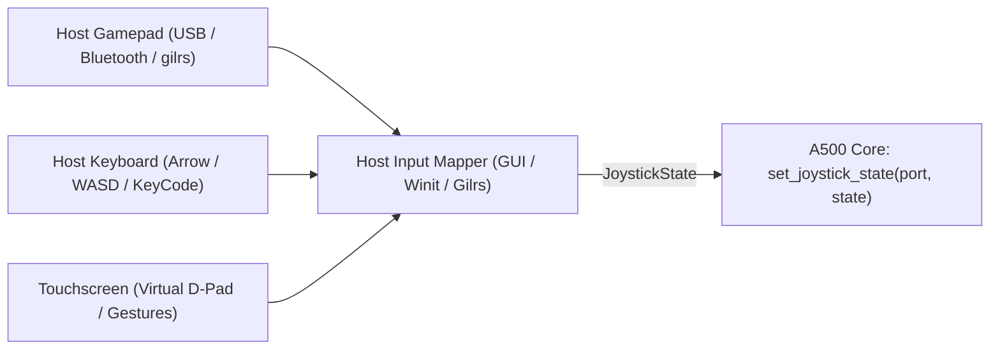

# Amiga 500 Joystick Subsystem & Input Architecture

This document specifies the hardware registers, electrical interface, extended adapter standards, and cross-platform host input abstraction for digital and proportional joysticks in the Amiga 500 emulator.

> [!NOTE]
> For dual game port bus routing, see [Game Ports.md](Game%20Ports.md). For top-level machine coordination, see [General Architecture.md](General%20Architecture.md). For game port switching and configuration, see [Configuration.md](Configuration.md). For frontend UI input routing, see [GUI.md](GUI.md).

---

## 1. Hardware Architecture & Signal Routing

The Amiga 500 provides two 9-pin D-sub male controller ports on the side of the chassis:
- **Port 1 (Default: Mouse):** Decoded by Denise `JOY0DAT` (`$DFF00A`), CIA-A `PRA` bit 6, and Paula/Denise `POT0DAT` (`$DFF012`) / `POTGO` (`$DFF034`).
- **Port 2 (Default: Joystick):** Decoded by Denise `JOY1DAT` (`$DFF00C`), CIA-A `PRA` bit 7, and Paula/Denise `POT1DAT` (`$DFF014`) / `POTGO` (`$DFF034`).

Either port can be configured to host a joystick or a mouse via `A500Config` (see [Configuration.md](Configuration.md)).

```mermaid
flowchart TD
    JOY["Digital Joystick (Atari 9-pin Standard)"]
    PORT2["Game Port 2 (DB9 Male Connector)"]
    
    JOY -->|Up, Down, Left, Right Switches| PORT2
    JOY -->|Fire Button 1 (Pin 6)| PORT2
    JOY -->|Fire Button 2 (Pin 9)| PORT2
    
    PORT2 -->|Directional Switch Matrix| DENISE["Denise: JOY1DAT ($DFF00C)"]
    PORT2 -->|Fire 1 (Active Low /_FIR1)| CIAA["CIA-A: PRA Bit 7 ($BFE001)"]
    PORT2 -->|Fire 2 (DATRY)| PAULA["Paula / Denise: POT1DAT / POTGO ($DFF014 / $DFF034)"]
```

### 1.1 Pinout (Standard Atari 9-Pin Controller Port)

| Pin | Mnemonic | Joystick Function | Amiga Decoding Destination |
| :---: | :--- | :--- | :--- |
| **1** | `FORWARD*` | Up / Forward switch | Denise `JOYxDAT` bit 8 (via XOR) |
| **2** | `BACK*` | Down / Backward switch | Denise `JOYxDAT` bit 0 (via XOR) |
| **3** | `LEFT*` | Left switch | Denise `JOYxDAT` bit 9 |
| **4** | `RIGHT*` | Right switch | Denise `JOYxDAT` bit 1 |
| **5** | `POTX` / `BUTTON3` | Optional Fire Button 3 / Pot X | Paula / Denise `POTxDAT` low byte & `POTGO` |
| **6** | `FIRE1*` | Primary Fire Button (Button 1) | CIA-A `PRA` (Port 1 = Bit 6 `_FIR0`, Port 2 = Bit 7 `_FIR1`) |
| **7** | `+5V` | +5V DC Supply (Max 100 mA) | Power for autofire circuits and active controllers |
| **8** | `GND` | System Ground | Return line for all switches |
| **9** | `POTY` / `FIRE2*` | Secondary Fire Button (Button 2) / Pot Y | Paula / Denise `POTxDAT` high byte & `POTGO` bit 10 (`DATLY`) / bit 14 (`DATRY`) |

---

## 2. Register Specifications & Logic Decoding

### 2.1 Directional State (`JOY0DAT` & `JOY1DAT`)

Unlike simpler systems where directional switches map directly to GPIO bits, the Amiga passes joystick directional signals through Denise's quadrature mouse counter logic. The switches are encoded into `JOY0DAT` (`$DFF00A`) and `JOY1DAT` (`$DFF00C`):

- **Bit 1:** True logic state of **Right** switch ($1 = \text{closed/pressed}, 0 = \text{open}$).
- **Bit 9:** True logic state of **Left** switch ($1 = \text{closed/pressed}, 0 = \text{open}$).
- **Bit 0 $\oplus$ Bit 1:** The exclusive-OR of bit 1 and bit 0 yields the state of the **Back / Down** switch:
  $$\text{Down} = \text{bit } 1 \oplus \text{bit } 0$$
- **Bit 8 $\oplus$ Bit 9:** The exclusive-OR of bit 9 and bit 8 yields the state of the **Forward / Up** switch:
  $$\text{Up} = \text{bit } 9 \oplus \text{bit } 8$$

#### Emulating Directional Latches in Denise
To synthesize the correct `JOYxDAT` register value for given directional inputs:
```rust
pub fn encode_joystick_direction(up: bool, down: bool, left: bool, right: bool) -> u16 {
    let bit1 = if right { 1 } else { 0 };
    let bit0 = if down ^ right { 1 } else { 0 };
    let bit9 = if left { 1 } else { 0 };
    let bit8 = if up ^ left { 1 } else { 0 };

    (bit9 << 9) | (bit8 << 8) | (bit1 << 1) | bit0
}
```

### 2.2 Fire Buttons (CIA-A `PRA` & Paula/Denise `POTGO`)

1. **Fire Button 1 (Primary):**
   - Active low input directly connected to CIA-A Port A (`PRA` `$BFE001`).
   - Bit 6: Port 1 primary fire button (`_FIR0`). ($0 = \text{pressed}, 1 = \text{released}$).
   - Bit 7: Port 2 primary fire button (`_FIR1`). ($0 = \text{pressed}, 1 = \text{released}$).
   - Software polls `CIAAPRA` or uses CIA-A timer interrupts to sample fire button presses.

2. **Fire Button 2 (Secondary / Two-Button Joysticks):**
   - Connected to Pin 9.
   - Read through Paula/Denise proportional controller pin registers (`POTGO` write `$DFF034`, `POTGOR`/`POTINP` read `$DFF016`).
   - Pin 9 for Port 1: Bit 10 (`DATLY`).
   - Pin 9 for Port 2: Bit 14 (`DATRY`).
   - Amiga hardware pull-up holds the line at logic 1; pressing the button pulls it to ground (logic 0).

3. **Fire Button 3 (Optional / CD32 & Enhanced Pads):**
   - Connected to Pin 5.
   - Read through `POTGO`/`POTINP`: Bit 8 (`DATLX`) for Port 1, Bit 12 (`DATRX`) for Port 2.

---

## 3. Extended Joystick Standards (Post-Baseline)

### 3.1 4-Player Parallel Port Joystick Adapter
For multiplayer games (e.g. *Super Skidmarks*, *Dynablaster*, *Super Cars II*, *Kick Off 2*), the Amiga supports external 4-player adapters connected to the 25-pin DB25 parallel port (`CIAAPRB` `$BFE101` and CIA-A / CIA-B control lines):

- **Joysticks 3 & 4:**
  - 8 data bits of `CIAAPRB` are split between the directional lines of Joystick 3 and Joystick 4.
  - Control lines (`BUSY`, `POUT`, `SEL`) are used to read the respective fire buttons.
- **Emulator Support:**
  - The parallel port peripheral manager inspects port settings and bridges host controllers 3 and 4 into `CIAAPRB` and CIA control registers.

### 3.2 Proportional Analog Joysticks & Paddles
Paddles and analog flight sticks use variable potentiometers ($0-470\,\text{k}\Omega$) connected between Pin 7 (+5V) and Pins 5/9:

- **Integrating A/D Conversion:**
  - Internal capacitors ($0.047\,\mu\text{F}$) are discharged during the first 7 (NTSC) or 8 (PAL) scanlines after `POTGO` bit 0 is written with `1`.
  - Capacitors recharge through the external potentiometer. When voltage crosses the internal threshold, the scanline counter value is latched into `POT0DAT` / `POT1DAT` (`$DFF012` / `$DFF014`).
  - High byte: Y potentiometer count ($0-255$).
  - Low byte: X potentiometer count ($0-255$).
- **Software Handling:** Games read `POTxDAT` during Vertical Blank and average multiple readings to smooth potentiometer jitter.

---

## 4. Cross-Platform Host Input Abstraction

The emulator core is system-agnostic and runs on Windows, Linux, macOS, Android, iOS, and WebAssembly (WASM). To provide seamless input without platform-specific dependencies in the core:

### 4.1 Host Device Mapping Architecture



1. **Host Gamepads & Game Controllers (`gilrs`):**
   - The desktop frontend uses Rust's `gilrs` library (or native OS game controller APIs).
   - **D-Pad & Analog Sticks:** Left analog stick axes are filtered with a configurable deadzone threshold ($15-20\%$):
     - Axis X $> +0.2 \rightarrow \text{Right}$
     - Axis X $< -0.2 \rightarrow \text{Left}$
     - Axis Y $> +0.2 \rightarrow \text{Down}$
     - Axis Y $< -0.2 \rightarrow \text{Up}$
   - **Buttons:** Bottom face button (Xbox A / PS Cross) maps to Fire 1. Right/Top face button (Xbox B/Y / PS Circle/Triangle) maps to Fire 2.

2. **Host Keyboard Emulation:**
   - Keys are mapped via physical `KeyCode` (USB HID position) to avoid keyboard layout discrepancies:
     - **Layout 1 (Numpad):** `Numpad8` (Up), `Numpad2` (Down), `Numpad4` (Left), `Numpad6` (Right), `Numpad0` / `Right Ctrl` (Fire 1), `NumpadDecimal` / `Right Alt` (Fire 2).
     - **Layout 2 (WASD / Space):** `KeyW` (Up), `KeyS` (Down), `KeyA` (Left), `KeyD` (Right), `Space` / `KeyF` (Fire 1), `KeyG` (Fire 2).
     - **Layout 3 (Cursor Keys):** `ArrowUp`, `ArrowDown`, `ArrowLeft`, `ArrowRight`, `Right Ctrl` (Fire 1).

3. **Touchscreen Mapping (Mobile / Tablet / WASM):**
   - On mobile browsers and touch devices, an on-screen virtual floating joystick/D-pad and action buttons are rendered via `egui`.
   - Touch drag vectors generate digital directional states and button press events.

4. **Autofire Engine:**
   - Integrated autofire generator in the host input layer toggles the Fire 1 bit at user-defined rates (e.g. 10 Hz, 15 Hz, 30 Hz) when the autofire button is held.

---

## 5. Emulator Data Structures & Hot-Path APIs

Hot-path execution paths perform zero dynamic memory allocation.

```rust
/// Digital state of a standard 2-button Amiga joystick
#[derive(Debug, Clone, Copy, PartialEq, Eq, Default, Serialize, Deserialize)]
pub struct JoystickState {
    pub up: bool,
    pub down: bool,
    pub left: bool,
    pub right: bool,
    pub fire1: bool,
    pub fire2: bool,
    pub fire3: bool,
}

impl A500 {
    /// Update joystick inputs for a given game port (0 = Port 1, 1 = Port 2)
    /// Typically called once per video frame right before step_frame()
    #[inline]
    pub fn set_joystick_state(&mut self, port_index: usize, state: JoystickState) {
        match port_index {
            0 => self.game_ports.port1.set_joystick(state),
            1 => self.game_ports.port2.set_joystick(state),
            _ => {}
        }
    }
}
```

### 5.1 Host Input Timing (Once Per Frame)
- **Is once-per-frame updating sufficient?**
  - **Yes.** Amiga games and OS tasks poll `JOYxDAT` and `CIAAPRA` synchronously during the Vertical Blanking interrupt (50 Hz PAL / 60 Hz NTSC, once every 20 ms / 16.6 ms).
  - Updating inputs immediately before invoking `step_frame()` provides zero input lag and optimal host CPU efficiency.
  - Sub-frame CCK stepping maintains the latched state throughout all 312 scanlines.

---

## 6. Subsystem Coordination & Save State

- **CIA-A Integration:** `CIAAPRA` bits 6 and 7 continuously reflect `!fire1`.
- **Denise Integration:** Denise reads directional bits when the CPU or Copper accesses `$DFF00A` / `$DFF00C`.
- **Save State:** `JoystickState` is fully serializable as part of `GamePortsState` in [SaveState.md](SaveState.md).

---

## 7. Reference Documentation & Upstream Ground Truth

- [Amiga Hardware Reference Manual: Chapter 8 (Interface Hardware)](../Reference/Hardware%20Reference%20Manual/08%20-%20Chapter%208%20-%20Interface%20Hardware.md): Game port directional switch decoding, XOR directional encodings, and fire button lines.
- [Amiga Hardware Reference Manual: Appendix E (Interfaces)](../Reference/Hardware%20Reference%20Manual/13%20-%20Appendix%20E%20-%20Interfaces.md): Controller port DB9 pinouts, parallel 4-player joystick adapter schematics, and POTGO lines.
- [vAmiga Joystick Implementation Reference](../../../ref_src/vAmiga-4.5/Core/Peripherals/Joystick/Joystick.h): Reference C++ joystick model, digital switch latching, and autofire support.
