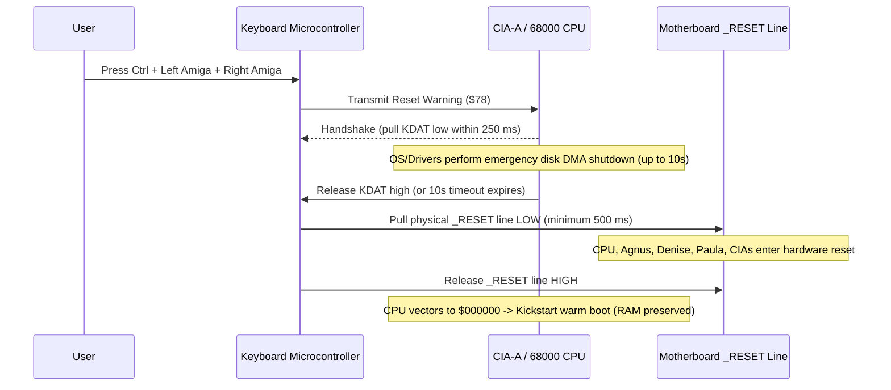

# Amiga 500 Keyboard Subsystem & Input Architecture

This document specifies the keyboard microcontroller hardware, serial transmission protocol, scancode matrix, warm reset mechanics (`Ctrl-Amiga-Amiga`), and cross-platform host keyboard abstraction for the Amiga 500 emulator.

> [!NOTE]
> For top-level machine coordination and reset sequences, see [Main loop A500.md](Main%20loop%20A500.md) and [General Architecture.md](General%20Architecture.md). For CIA-A register mapping, see [CIA.md](CIA.md). For host frontend keyboard routing, see [GUI.md](GUI.md).

---

## 1. Hardware Architecture & Communications Interface

The Amiga 500 keyboard is an intelligent subsystem powered by an onboard microcontroller (MOS 6500/1 on standard A500). It connects to the motherboard via an 8-pin internal ribbon cable (or external 5-pin DIN on A2000, modular 4P4C on A1000):

```mermaid
flowchart LR
    KBD["Keyboard Microcontroller (MOS 6500/1)
Matrix Scanner & 10-Key Type-Ahead Buffer"]
    
    KBD -->|KCLK (Serial Clock)| CIAA_CNT["CIA-A: CNT Pin ($BFEC01 / $BFED01)"]
    KBD <-->|KDAT (Bidirectional Serial Data)| CIAA_SP["CIA-A: SP (Serial Data Register)"]
    KBD -->|_RESET (Hardware Reset Line)| A500_RST["System _RESET Line (CPU, Agnus, Denise, Paula, CIAs)"]
```

### 1.1 Physical Interface Lines

| Signal | Direction | Destination | Description |
| :---: | :---: | :--- | :--- |
| `+5V` | In | Power Rail | +5V DC supply for keyboard electronics and LEDs |
| `GND` | — | Ground | System Ground |
| `KCLK` | Out (Kbd $\rightarrow$ Amiga) | CIA-A `CNT` Pin | Active-low serial clock pulse (~17 kHz) |
| `KDAT` | Bidirectional | CIA-A `SP` Pin | Open-collector active-low serial data stream / handshake line |
| `_RESET` | Out (Kbd $\rightarrow$ Amiga) | Motherboard `_RESET` | Direct open-collector line pulled low upon detecting `Ctrl-Amiga-Amiga` |

---

## 2. Serial Transmission Protocol & Handshake

Communication between the keyboard and CIA-A is synchronous serial transmission driven by `KCLK` and `KDAT`:

```text
       KCLK and KDAT Timing Diagram
        ___     ___     ___     ___     ___     ___     ___     ___     _______
KCLK   /   \___/   \___/   \___/   \___/   \___/   \___/   \___/   \___/
       
       _________________________________________________________________
KDAT   \_______X_______X_______X_______X_______X_______X_______X_______/
         Bit 6   Bit 5   Bit 4   Bit 3   Bit 2   Bit 1   Bit 0   Bit 7
         First                                                   Last
```

1. **Active-Low Signal Polarity:**
   - High (+5V) = Logic **0**
   - Low (0V) = Logic **1**
2. **Rotated Bit Order (6-5-4-3-2-1-0-7):**
   - All scancodes are rotated left by 1 bit prior to transmission.
   - Bit 7 (the Key-Up / Key-Down flag) is transmitted **last**.
   - *Hardware Rationale:* If electrical noise causes lost synchronization, the keyboard clocks out 1-bits to resynchronize. Sending the up/down flag last ensures any garbage byte clocked into the system appears as a benign key-up (release) rather than a spurious key-press.
3. **Transmission Timing:**
   - The keyboard asserts `KDAT` ~20 µs before pulling `KCLK` low.
   - `KCLK` stays low for ~20 µs, then returns high.
   - The keyboard holds `KDAT` stable for another ~20 µs before the next bit.
   - Total transmission rate: ~60 µs per bit ($\approx 17\text{ kbit/s}$, $\approx 480\ \mu\text{s}$ per byte).
4. **CIA-A Reception & Interrupt:**
   - CIA-A receives incoming bits via its Serial Data Register (`SDR` at `$BFEC01`).
   - When all 8 bits have shifted in, CIA-A sets the `SP` flag in its Interrupt Control Register (`ICR` `$BFED01`) and fires a **Level 2 Interrupt (`PORTS` / `INT2`)** to the 68000 CPU.
5. **Acknowledge Handshake (85 µs Pulse):**
   - After reading `SDR`, software MUST acknowledge receipt by pulsing `KDAT` low.
   - Software sets CIA-A `CRA` bit 6 (`SPMODE = 1`, output mode) and writes `0` to `SDR` to pull the line low, delays for at least **85 µs**, and then sets `SPMODE = 0` (input mode) to release `KDAT` high.
   - The keyboard waits for this handshake before sending the next keycode. If no handshake arrives within 143 ms, the keyboard enters resync mode.
6. **Keyboard Type-Ahead Buffer:**
   - The microcontroller maintains a 10-key FIFO queue. If keystrokes occur before the system handshakes the current byte, they are queued without loss.

---

## 3. Scancodes & Keycode Matrix

Every physical key produces a 7-bit positional code plus a 1-bit transition flag (Bit 7):
$$\text{Raw Code} = \text{Keycode} \mid (\text{if released } \{ 0x80 \} \text{ else } \{ 0x00 \})$$

### 3.1 Keycode Ranges

1. **Main Matrix Keys (`$00–$3F`):**
   - Letters, numbers, and punctuation keys.
   - Position-based (independent of national key legend): `$00` (\`~), `$01` (1), `$10` (Q), `$20` (A), `$31` (Z), etc.
   - International cutouts: `$30` (cutout next to Left Shift on international keyboards), `$2B` (cutout next to Return).
2. **Control & Editing Keys (`$40–$5F`):**
   - `$40` (Space Bar), `$41` (Backspace), `$42` (Tab), `$43` (Numpad Enter), `$44` (Return), `$45` (Escape), `$46` (Delete).
   - `$4C` (Cursor Up), `$4D` (Cursor Down), `$4E` (Cursor Right), `$4F` (Cursor Left).
   - `$50–$59` (Function Keys F1–F10), `$5F` (Help).
3. **Qualifier Keys (`$60–$67`):**
   - `$60` (Left Shift), `$61` (Right Shift), `$62` (Caps Lock), `$63` (Control).
   - `$64` (Left Alt), `$65` (Right Alt), `$66` (Left Amiga / Commodore), `$67` (Right Amiga).
   - **Independently Readable:** These 7 modifier keys are physically isolated outside the row/column matrix and **never generate ghost or phantom keystrokes**.
4. **Caps Lock Quirk:**
   - Unlike all other keys, Caps Lock transmits a keycode **only when pressed down**, never on release.
   - When pressing Caps Lock turns ON the LED: transmits `$62` (bit 7 = 0).
   - When pressing Caps Lock turns OFF the LED: transmits `$E2` (bit 7 = 1).
5. **Out-of-Band System Codes:**
   - `$78`: **Reset Warning** (`Ctrl-Amiga-Amiga` detected).
   - `$F9`: **Lost Sync** (previous keycode garbled; retransmitting).
   - `$FA`: **Buffer Overflow** (more than 10 keys in queue).
   - `$FC`: **Self-Test Failed** (Caps Lock LED blinks error code).
   - `$FD`: **Initiate Power-Up Key Stream** (sent on boot to report keys held down).
   - `$FE`: **Terminate Power-Up Key Stream**.

---

## 4. Warm Reset Mechanics (`Ctrl-Amiga-Amiga`)

The Amiga keyboard handles the iconic three-finger reset sequence directly at the hardware level:



1. **Detection:** Microcontroller detects simultaneous closure of `Ctrl` (`$63`), `Left Amiga` (`$66`), and `Right Amiga` (`$67`).
2. **Reset Warning (`$78`):** The keyboard transmits `$78`. The Amiga OS has up to 10 seconds to park floppy heads and flush write buffers.
3. **Hard Line Pull:** The microcontroller asserts the motherboard `_RESET` pin low for at least **500 ms**, ensuring all custom chips and the CPU are fully held in reset.
4. **Kickstart Warm Boot:**
   - On release, the CPU loads initial SSP and PC from `$000000`/`$000004` (overlayed to Kickstart ROM).
   - Because RAM was not erased, Kickstart verifies the memory checksums (`KickTagPtr`), detects a warm reset, preserves resident modules, and restarts without a cold memory test (see [Main loop A500.md](Main%20loop%20A500.md)).

---

## 5. Cross-Platform Host Keyboard Abstraction

To run on Windows, Linux, macOS, Android, iOS, and WebAssembly without platform-specific dependencies:

### 5.1 Physical Scancodes vs. Logical Characters
A critical challenge in emulator engineering is handling international keyboard layouts (US QWERTY, German QWERTZ, French AZERTY, etc.):
- **The Problem:** If an emulator maps keys based on logical character output (e.g. `'Z'`), on an AZERTY or QWERTZ keyboard the keys used for gaming (WASD, Y/Z) will be in the wrong physical locations.
- **The Solution (Physical `KeyCode` Mapping):**
  - In Rust (`winit` / `egui`), keyboard events provide `KeyEvent::physical_key` (`KeyCode` enum representing physical scancode position according to the USB HID standard).
  - The emulator strictly maps **physical key positions** to Amiga matrix scancodes.
  - As a result, physical key positions match an authentic Amiga 500 regardless of the host OS or active desktop language!

### 5.2 Translation Table Architecture
The input layer uses a direct lookup array (`[Option<u8>; 256]`):

```rust
pub fn host_keycode_to_amiga_scancode(key: KeyCode) -> Option<u8> {
    match key {
        KeyCode::KeyA => Some(0x20),
        KeyCode::KeyB => Some(0x35),
        KeyCode::KeyC => Some(0x33),
        KeyCode::KeyD => Some(0x22),
        // ...
        KeyCode::Space => Some(0x40),
        KeyCode::Backspace => Some(0x41),
        KeyCode::Enter => Some(0x44),
        KeyCode::Escape => Some(0x45),
        // Modifiers
        KeyCode::ShiftLeft => Some(0x60),
        KeyCode::ShiftRight => Some(0x61),
        KeyCode::CapsLock => Some(0x62),
        KeyCode::ControlLeft => Some(0x63),
        KeyCode::AltLeft => Some(0x64),
        KeyCode::AltRight => Some(0x65),
        KeyCode::SuperLeft => Some(0x66),  // Host Windows/Command key -> Left Amiga
        KeyCode::SuperRight => Some(0x67), // Host Windows/Command key -> Right Amiga
        // Function keys
        KeyCode::F1 => Some(0x50),
        // ...
        KeyCode::F10 => Some(0x59),
        // Cursor keys
        KeyCode::ArrowUp => Some(0x4C),
        KeyCode::ArrowDown => Some(0x4D),
        KeyCode::ArrowRight => Some(0x4E),
        KeyCode::ArrowLeft => Some(0x4F),
        _ => None,
    }
}
```

### 5.3 Host Reset Shortcut Mapping
To trigger an authentic Amiga reset from PC keyboards:
- **Shortcut 1 (Authentic):** `Ctrl` + `Left Super (Windows/Cmd)` + `Right Super`
- **Shortcut 2 (PC Friendly):** `Ctrl` + `Left Alt` + `Right Alt`
- **Shortcut 3 (Single Key / Hotkey):** `F12` or `Ctrl + F11` (configurable in GUI).
- Triggering this shortcut invokes `a500.trigger_keyboard_reset()`, which initiates the warm reset sequence.

### 5.4 Mobile & Touchscreen Virtual Keyboard
- On Android, iOS, and mobile WASM browsers, `egui` renders a semi-transparent on-screen Amiga keyboard.
- Modifier buttons (Shift, Amiga, Ctrl) support latching/locking for easy thumb typing.

---

## 6. Emulator Data Structures & Hot-Path APIs

```rust
/// Represents the internal state of the Amiga keyboard controller
#[derive(Debug, Clone, PartialEq, Eq, Serialize, Deserialize)]
pub struct KeyboardSubsystem {
    /// 10-entry FIFO type-ahead queue
    pub queue: [u8; 10],
    pub queue_len: usize,

    /// Currently transmitted byte and bit index
    pub shift_register: u8,
    pub bit_index: u8,

    /// Handshake latch state
    pub waiting_handshake: bool,
    pub handshake_timer_cck: u32,

    /// Key-down bitfield for phantom detection and state queries
    pub keys_down: [bool; 128],
}

impl A500 {
    /// Enqueue a physical key press/release event from the host
    #[inline]
    pub fn send_key_event(&mut self, scancode: u8, pressed: bool) {
        self.keyboard.enqueue_key(scancode, pressed);
    }

    /// Trigger hardware Ctrl-Amiga-Amiga warm reset
    pub fn trigger_keyboard_reset(&mut self) {
        self.reset_warm();
    }
}
```

---

## 7. Reference Documentation & Upstream Ground Truth

- [Amiga Hardware Reference Manual: Chapter 8 (Interface Hardware)](../Reference/Hardware%20Reference%20Manual/08%20-%20Chapter%208%20-%20Interface%20Hardware.md): CIA-A SDR register handshake, KDAT/KCLK serial protocol timing, and keyboard interrupt generation.
- [Amiga Hardware Reference Manual: Appendix H (Keyboard)](../Reference/Hardware%20Reference%20Manual/16%20-%20Appendix%20H%20-%20Keyboard.md): Microcontroller matrix scanning, standard US/international key tables, and raw scancode values.
- [vAmiga Keyboard Implementation Reference](../../../ref_src/vAmiga-4.5/Core/Peripherals/Keyboard/Keyboard.h): Reference C++ keyboard controller, scancode FIFO queue, and reset latching.