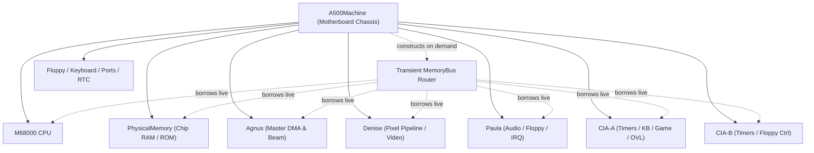

# MachineLoop Architecture Review & Orientation

> [!NOTE]
> This review document satisfies Milestone Step 1.4 verification requirements.
> It details the end-to-end architecture, physical signal routing, and execution timing of `crates/machine_loop` as implemented in the cycle-exact Amiga 500 emulator.
> Related specifications: [Main loop A500.md](Main%20loop%20A500.md), [General Architecture.md](General%20Architecture.md), and [Cross-Chip Signals and Action Dispatch Catalog.md](Cross-Chip%20Signals%20and%20Action%20Dispatch%20Catalog.md).

---

## 1. Executive Architecture Summary

The `machine_loop` crate (`crates/machine_loop/src/machine_loop.rs`) represents Tier 0 in the emulator chassis hierarchy. It acts as the physical Amiga 500 motherboard PCB simulation:
- **Zero Circular Ownership:** `A500Machine` owns all major subsystems (`Cpu`, `PhysicalMemory`, `Agnus`, `Denise`, `Paula`, `CiaA`, `CiaB`, `FloppyController`, `Keyboard`, `GamePorts`, `RtcMsm6242b`) in a completely flat structure. No subsystem retains a raw pointer, reference, or cross-chip handle to any peer.
- **Transient Bus Routing:** `A500Machine::memory_bus(&mut self) -> MemoryBus<'_>` constructs a zero-cost, stack-allocated router spanning all subsystems live on demand, eliminating double-ownership conflicts.
- **Color Clock Synchronization:** All execution steps in discrete Color Clock units (**CCK**, ~281.94 ns PAL / ~279.37 ns NTSC). The master monotonic clock `pub cck: u64` governs phase coordination across CPU and custom chips.
- **Agnus DMA Address Mastership & Passive Latching:** All DMA addresses, Copper pointers, and RGA bus lines are driven exclusively by Agnus. Denise and Paula operate as purely passive data latchers (`denise.write_bpldat`, `paula.latch_floppy_dskbytr`).

---

## 2. Master Execution Path & CCK Phase Flow

### 2.1 Color Clock Step Lifecycle (`step_cck`)

Every master clock step follows a deterministic, 5-phase electronic sequence:

1. **Master Clock Advancement:**
   - Increments monotonic counter: `self.cck = self.cck.wrapping_add(1)`.
2. **Subsystem Coordination (`step_subsystems_cck`):**
   - **Disk DMA Request Sampling:** Samples Paula's `_DSKREQ` active status and Floppy MFM buffer readiness, driving `agnus.set_dsk_dma_req()`.
   - **Agnus Step:** Executes `agnus.step_cck_ram(&mut self.physical_memory.chip_ram)`. Advances raster beam counters, mutation pipeline, Copper execution, and Blitter cycles.
   - **Agnus Bus Actions:**
     - `poll_copper_write()`: Dispatches Copper register writes to custom chips via `self.memory_bus().write_custom_word(reg, val)`.
     - `poll_bpl_dma()`: Latches fetched bitplane data into Denise via `self.denise.write_bpldat(plane, word)`.
     - `poll_dsk_dma_slot()`: Consumes disk MFM words from Floppy and streams directly into Chip RAM at the Agnus `dskpt` pointer; decrements Paula's `DSKLEN`.
   - **Bus Contention Latching:** Propagates `self.agnus.chip_ram_blocked` to `self.physical_memory.chip_ram_blocked` to enforce CPU wait states on subsequent accesses.
   - **Interrupt Line Assertions:**
     - Blitter completion (`_BLITINT`) sets Paula `INTREQ` bit 6 (`IRQ_BLIT`).
     - Vertical blanking (`_VSYNC`) sets Paula `INTREQ` bit 5 (`IRQ_VERTB`) and ticks CIA-A TOD.
   - **Denise Step:** Advances Denise (`step_cck(beam)`); triggers CIA-B TOD on `beam.hpos == 0` (`_HSYNC`).
   - **Paula & Floppy Step:** Steps Paula audio channels, serial UART, and Floppy MFM mechanics.
   - **Peripherals & Cross-Chip Cascades:**
     - Disk sync pattern match (`DSKSYN`) sets Paula `INTREQ` bit 12 (`IRQ_DSKSYN`).
     - Disk block DMA completion sets Paula `INTREQ` bit 1 (`IRQ_DSKBLK`).
     - Audio channel DMA restart (`AUDxDSR`) reloads Agnus `audpt` and asserts Paula audio interrupt.
     - Steps Keyboard serial shifting to CIA-A SDR.
     - Steps CIA-A and CIA-B timers.
     - Routes CIA `/IRQ` output lines to Paula `_INT2` and `_INT6` pins.
     - Steps RTC OKI MSM6242B.
     - Handles CIA-A OVL transition (mapping Kickstart ROM vs Chip RAM to `$000000`).
     - Repolls peripheral pins (`poll_peripheral_pins()`).
   - **Interrupt Priority Line (IPL) Arbitration:** Samples `paula.pending_interrupt_level()` and updates `cpu.state.ipl` for the CPU to sample during instruction micro-steps.
3. **Hardware Reset Evaluation:**
   - Detects keyboard reset pulse (Ctrl-Amiga-Amiga) $\to$ executes `reset_warm()`.
4. **M68000 RESET Pulse Evaluation:**
   - Detects `cpu.state.reset_line_asserted` $\to$ executes `reset_external_devices()`.
5. **CPU Bus Phase Execution:**
   - Constructs transient `MemoryBus` and advances CPU: `self.cpu.step_cck(&mut bus)`.
   - Returns `true` if an instruction completed on this Color Clock.

---

## 3. Bus Arbitration Sequence & Contention Mechanics

1. **Even vs Odd Slots Allocation:**
   - Amiga hardware allocates even CCK cycles to Agnus DMA channels (Display bitplanes, Copper, Blitter, Audio, Disk, Refresh) and odd CCK cycles to the CPU.
2. **Chip RAM Contention:**
   - When Agnus Blitter engages with "Blitter Nasty" (`BLTPRI = 1`) or bitplanes saturate DMA slots, `agnus.chip_ram_blocked` is flagged.
   - Any CPU access targeting Chip RAM addresses (`$000000..$1FFFFF`) returns `BusResult::WaitState`.
   - The CPU holds its internal micro-step state, inserting wait CCK cycles until the bus clears.
3. **Open Bus Floating Reads:**
   - Accesses to unmapped memory ranges return floating bus pull-up `$FF` (or configured open-bus value), strictly adhering to Amiga hardware specifications.

---

## 4. Hardware Bus Topology & Compliance Review

An audit of the implementation against `.agents/rules/hardware-bus-topology.md` confirms:

| Architectural Rule | Implementation Status | Verification Evidence |
| :--- | :---: | :--- |
| **Agnus DMA Mastership** | **COMPLIANT** | Agnus exclusively drives `dskpt`, `cop1lc`, `blt*`, and `bpl*`. |
| **Passive Denise Latching** | **COMPLIANT** | Denise contains zero Chip RAM read pointers; receives data solely via `write_bpldat()`. |
| **Passive Paula Latching** | **COMPLIANT** | Paula disk/audio DMA consumes data latched via motherboard routing; zero internal bus reads. |
| **Zero Circular References** | **COMPLIANT** | All inter-chip coordination passes through `A500Machine` and transient `MemoryBus`. |
| **Clean Reset Hierarchy** | **COMPLIANT** | Separate `reset()`, `reset_warm()`, and `reset_external_devices()` cleanly partition reset domains. |
| **Associated Constants** | **COMPLIANT** | Replaced raw hex masks with associated constants (`CIAA_PRA_FIRE_MASK`, `IRQ_BLIT`, etc.). |

---

## 5. Architectural Findings & Future Recommendations

1. **DMA Slot Harmonization:**
   - Disk DMA currently synchronizes in `step_subsystems_cck` via `poll_dsk_dma_slot()`. In future milestones (Milestone 2+), the slot assignment logic can be further integrated with the Agnus unified DMA slot allocator.
2. **Scanline Stepping:**
   - `step_line()` was introduced to support raster line-level stepping for debuggers and GUI frame synchronizers without manual loop boilerplate.
3. **Save State Integrity:**
   - `save_state()` and `load_state()` capture the full machine snapshot including PNG preview and sub-cycle micro-step positions, enabling deterministic rewind and regression triage.

---
