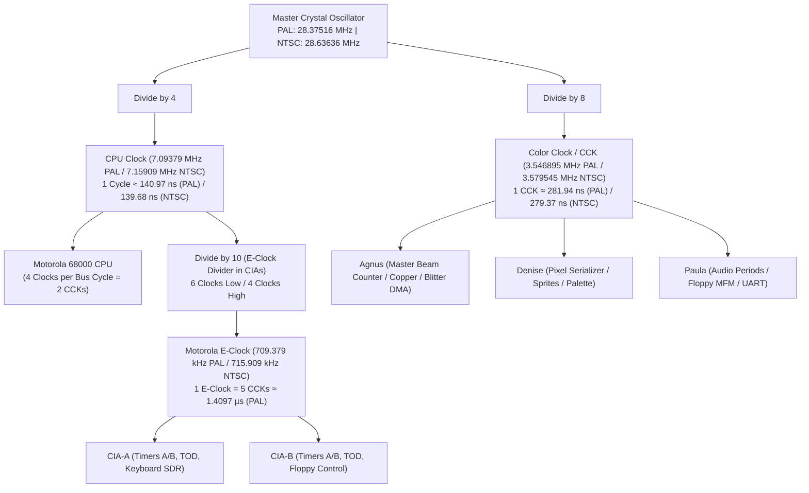

# Amiga 500 Main Machine Loop & Subsystem Coordination

> [!NOTE]
> Ownership architecture and module decoupling principles are defined in [AGENTS.md](../../../AGENTS.md) and [General Architecture.md](General%20Architecture.md).
> Physical bus arbitration is specified in [MemoryBus.md](MemoryBus.md), and CPU execution in [CPU Motorola M68000.md](CPU%20Motorola%20M68000.md). Custom chips are detailed in [Agnus.md](Agnus.md), [Denise.md](Denise.md), and [Paula.md](Paula.md).

---

## 1. Master System Clock & Frequency Hierarchy

The Amiga 500 derives all system clock frequencies from a single master crystal oscillator. All processing units operate in synchronous harmonic lock:



### 1.1 Master Frequency Standards

| Standard | Master Oscillator ($f_{\text{master}}$) | CPU Clock ($f_{\text{cpu}} = \frac{f_{\text{master}}}{4}$) | Color Clock ($f_{\text{cck}} = \frac{f_{\text{master}}}{8}$) | E-Clock ($f_{\text{e}} = \frac{f_{\text{cpu}}}{10}$) | CCK Period ($T_{\text{cck}}$) |
| :--- | :---: | :---: | :---: | :---: | :---: |
| **PAL** | **$28.375160\ \text{MHz}$** | **$7.093790\ \text{MHz}$** | **$3.546895\ \text{MHz}$** | **$709.379\ \text{kHz}$** | $\approx 281.9368\ \text{ns}$ |
| **NTSC** | **$28.636360\ \text{MHz}$** | **$7.159090\ \text{MHz}$** | **$3.579545\ \text{MHz}$** | **$715.909\ \text{kHz}$** | $\approx 279.3651\ \text{ns}$ |

---

## 2. Machine Struct (`A500Machine`)

The top-level `A500Machine` struct (`crates/machine_loop/src/lib.rs`) owns and orchestrates all components without circular references:
- `cpu`: Motorola 68000 core (`m68000::Cpu`)
- `physical_memory`: 24-bit physical storage and RAM/ROM buffers (`physical_memory::PhysicalMemory`)
- `cck`: Monotonic master 64-bit Color Clock counter (`pub cck: u64`)
- `rtc`: Real-Time Clock OKI MSM6242B (`rtc::RtcMsm6242b`)
- `agnus`, `denise`, `paula`: Custom chipsets
- `copper`, `blitter`, `dma`: Coprocessors and DMA slot scheduler
- `cia_a`, `cia_b`: MOS 8520 Complex Interface Adapters
- `sprites`, `frame_builder`, `audio`, `floppy`: Coprocessors and peripheral controllers
- `memory_bus(&mut self) -> MemoryBus<'_>`: Zero-cost transient router decoding the 24-bit physical address space live to storage, custom chips, and peripherals.

---

## 3. Stepping Capabilities & Master Clock Loop

The main loop provides three levels of stepping granularity:

1. **Single CCK Step (`step_cck`)**:
   - Advance `self.cck` by 1 CCK (~280 ns PAL / ~279 ns NTSC) using wrapping arithmetic.
   - Clock custom chips (Agnus beam counter/Copper/Blitter, Denise pixel pipeline, Paula audio).
   - Clock CIAs (decrement Timer A & B, update TOD).
   - Clock CPU bus phase (**CCK1** or **CCK2**):
     - CPU queries `memory_bus.read_phase1()`, `read_phase2()`, `write_phase1()`, or `write_phase2()`.
     - If `MemoryBusResult::Blocked`, CPU holds current micro-step and inserts a wait state.
   - Run interrupt arbitration loop.
2. **Cycle Count Step (`step_cycles(cck_count: u64)`)**:
   - Executes a designated number of Color Clocks in a loop.
3. **Full Video Frame Step (`step_frame`)**:
   - Executes until Denise / Agnus completes a full vertical frame (VBlank transition).
## 4. Interrupt Arbitration Pipeline

On each CCK step, the main loop coordinates interrupt requests across chips:

```mermaid
flowchart TD
    PAULA["Paula (Levels 1, 3, 4, 5)"] -->|Pending Request Lines| MAIN_LOOP["A500 Main Loop"]
    CIAA["CIA-A (Level 2 PORTS)"] -->|Active Line| MAIN_LOOP
    CIAB["CIA-B (Level 6 EXTER)"] -->|Active Line| MAIN_LOOP

    MAIN_LOOP -->|Calculate Highest Unmasked Priority| RESOLVE["Resolve IPL (0..6)"]
    RESOLVE -->|cpu.set_ipl(level)| CPU["Motorola 68000 CPU"]
```

1. **Query Sources:**
   - **Paula:** Level 1 (`TBE`, `DSKBLK`, `SOFT`), Level 3 (`VERTB`, `BLIT`, `COPER`), Level 4 (`AUD0-3`), Level 5 (`RBF`, `DSKSYN`).
   - **CIA-A:** Level 2 (`PORTS`).
   - **CIA-B:** Level 6 (`EXTER`).
2. **Resolve Level:** Calculate the highest pending, unmasked interrupt priority level ($IPL \in 1..6$, or $0$ if none).
3. **Drive CPU Lines:** Call `cpu.set_ipl(resolved_level)`. The CPU samples `ipl` at the instruction microcode boundary against `SR` interrupt mask bits.

---

## 5. Reset Flows: Cold vs. Warm Reset & Physical Circuit Mechanics

On real Amiga hardware, **all resets start CPU execution from address `$000000` via the Gary low-memory boot overlay (`_OVL`)**:

### 5.1 Physical Reset Lines & Timing
1. **Physical Reset Circuitry:**
   - **Power-On Reset:** A 555 timer circuit on the Amiga motherboard asserts the bidirectional open-collector `_RESET` and `_HALT` lines LOW simultaneously for ~500 ms upon system power-up.
   - **Keyboard Reset (`Ctrl-Amiga-Amiga`):** The MOS 6500/1 keyboard microcontroller transmits warning code `$78` to CIA-A over the serial link, allowing AmigaOS up to 10 seconds to park floppy drive heads and flush disk cache buffers. After an ACK handshake or timeout (~500 ms), the keyboard pulls the motherboard `_RESET` line LOW for $\ge 500$ ms.
   - **M68000 Reset Exception Timing:**
     - After `_RESET` and `_HALT` are released HIGH, the M68000 enters its internal 40-clock reset sequence (10 bus cycles = 20 Color Clocks / CCK phases).
     - Bus cycles 1–2 (4 CCK): Fetch initial 32-bit `SSP` from `$000000-$000003`.
     - Bus cycles 3–4 (4 CCK): Fetch initial 32-bit `PC` from `$000004-$000007`.
     - Bus cycles 5–6 (4 CCK): Prefetch first instruction word at `PC` into `IR`; increment `PC += 2`.
     - Bus cycles 7–8 (4 CCK): Prefetch second instruction word at `PC` into `IRC` (`prefetch[0]`); increment `PC += 2`.
     - Cycles 9–10: Internal dispatch and microcode initialization.
     - *Double Bus Fault:* If a bus error or address error (odd vector) occurs during the reset vector fetch, the CPU enters the **HALTED** state and permanently tri-states its bus until an external hardware reset occurs.

2. **M68000 `RESET` Instruction (`$4E70`) Distinction:**
   - The assembly instruction `RESET` is a privileged instruction ($S=1$).
   - When executed, the M68000 drives its external `_RESET` pin LOW for 124 clock cycles (62 CCKs) while `_HALT` remains HIGH.
   - **The CPU does NOT reset its own internal state, registers, or PC!** It continues execution with the subsequent instruction.
   - External devices (custom chips, CIAs, expansion boards) and Gary are reset, re-engaging `_OVL`. Software executing `RESET` must ensure its execution is already running out of Kickstart ROM space (`$F80000-$FFFFFF`) before triggering `RESET`.

---

### 5.2 Subsystem Reset Defaults Table

| Subsystem / Chip | Register / State | Power-On / Hardware Reset Value | Circuit Effect |
| :--- | :--- | :--- | :--- |
| **Gary / Bus** | `_OVL` (Boot Overlay) | **Active (`0`)** | Intercepts CPU accesses to `$000000-$07FFFF` and routes to Kickstart ROM space (`$F80000-$FFFFFF`). Chip DMA is unaffected. |
| **CPU (M68000)** | `SR` | **`$2700`** | Supervisor mode ($S=1$), Trace disabled ($T=0$), Interrupt mask set to Level 7 ($I_2,I_1,I_0 = 111$). |
| **CPU (M68000)** | `SSP` / `PC` | **Vectors from `$000000` / `$000004`** | Fetched from Kickstart ROM via Gary `_OVL`. |
| **CPU (M68000)** | `D0..D7`, `A0..A6` | **Undefined (Cold) / Unaltered (Warm)** | Flip-flops retain state on warm reset; random on cold silicon. |
| **Agnus (8370/8371)** | `DMACON` | **`$0000`** | All 7 DMA channels disabled, master DMA disabled, Blitter Nasty disabled. |
| **Agnus** | `hpos` / `vpos` / `lof` | **`0` / `0` / `false`** | Raster beam synchronized to scanline 0, horizontal CCK 0, short frame. |
| **Copper** | `COP1LC` / `COP2LC` | **`0` / `0`** | Copper halted (`is_running = false`, `is_waiting = false`, `cdang = false`). |
| **Blitter** | Busy flag | **`false`** | Blitter idle, channels released. |
| **Denise (8362)** | `BPLCON0`..`BPLCON3` | **`$0000`** | Display output disabled, 0 bitplanes active, sprites disabled. |
| **Denise** | `CLXDAT` | **`$0000`** | Collision latches cleared. |
| **Paula (8364)** | `INTENA` / `INTREQ` | **`$0000` / `$0000`** | Master and all 14 interrupt channels disabled; all requests cleared. |
| **Paula** | `AUD0VOL`..`AUD3VOL` | **`0`** | Audio output immediately muted. |
| **Paula** | Floppy & UART | **Motor OFF, UART idle** | Drive motor disabled, write gate off, serial dividers reset. |
| **CIA-A & CIA-B** | `DDRA` / `DDRB` | **`$00`** | All port pins configured as high-impedance inputs. |
| **CIA-A** | `PRA` bit 0 (`_OVL`) | **Input (`0`)** | Keeps Gary boot overlay active until software configures `DDRA` bit 0 = 1 and `PRA` bit 0 = 1. |
| **CIA-A & CIA-B** | `CRA` / `CRB` | **`$00`** | All timers stopped (continuous mode, E-clock source). Latches reset to `$FFFF`. |
| **CIA-A & CIA-B** | `ICR` | **`$00`** | All interrupt masks cleared; pending flags cleared. |
| **Machine Loop** | `cck` | **`0`** | Master Color Clock counter reset to 0. |

---

### 5.3 Cold / Hard Reset (`reset_cold`)
1. **MemoryBus:** Call `memory_bus.reset_cold()`. Zeroes all physical Chip RAM, Slow RAM, and Fast RAM buffers (`$00`) and engages low-memory overlay (`map_kickstart_to_low_memory()`).
   - *Headless / Test Invariant:* If no Kickstart ROM is loaded (synthetic test mode), disengages overlay so test RAM at `$000000` remains visible.
2. **Master CCK Counter:** Set `self.cck = 0`.
3. **Specialized Chips:** Apply chip reset defaults from the table above (disable DMA, mask interrupts, halt Copper/Blitter, mute audio, clear CIA latches).
4. **CPU:** Apply M68000 reset:
   - `SR` set to `$2700`.
   - Read initial `SSP` from `$000000` (routed to Kickstart ROM).
   - Read initial `PC` from `$000004` (routed to Kickstart ROM).
   - Prime prefetch queue (`IR` and `IRC`).
5. **Execution & Kickstart Detection:**
   - CPU begins executing at Kickstart entry point.
   - Because RAM was zeroed, memory checksum validation fails.
   - Kickstart executes full cold system initialization: diagnostic colors (Red/Green/Blue tests), memory auto-sizing, chip initialization, and prompts for boot diskette (insert floppy screen or Early Startup).

---

### 5.4 Warm Reset (`reset_warm`)
1. **MemoryBus:** Call `memory_bus.reset_warm()`. **Leaves RAM contents completely intact!** Re-engages low-memory overlay (`map_kickstart_to_low_memory()`).
   - *Headless / Test Invariant:* If no Kickstart ROM is loaded, disengages overlay so test RAM at `$000000` remains visible.
2. **Master CCK Counter:** Set `self.cck = 0`.
3. **Specialized Chips:** Apply chip reset defaults (disable DMA, mask interrupts, mute audio, reset CIA port latches), leaving physical RAM undisturbed.
4. **CPU:**
   - Re-initialize `SR = $2700`.
   - Reload initial `SSP` from `$000000` and initial `PC` from `$000004`.
   - Prime prefetch queue (`IR` and `IRC`).
5. **Kickstart Detection & Fast Reboot:**
   - CPU begins executing at Kickstart entry point.
   - Kickstart scans RAM for magic resident signatures (`KickTagPtr`, ExecBase pointers, `ColdCapture`/`CoolCapture` vectors, and memory checksums).
   - Because RAM was preserved, the memory checksum succeeds.
   - Kickstart recognizes a **warm reboot**: it preserves resident libraries, device drivers, and surviving RAD: recoverable RAM-disks, bypasses prolonged memory sizing, and reboots rapidly.

---

## 6. Delayed Signal & Register Mutation Propagation Pipeline

Physical Amiga circuit traces and custom chip internal latches exhibit finite propagation delays:
- **Read is NOW**: Reading a custom register returns the *currently latched active value* immediately with zero delay.
- **Write is Staged**: Writes to control registers (e.g. `DMACON`, `BPLCON0`, `COLORxx`, `INTENA`), trigger strobes (`COPJMP1`, `BLTSIZE`), or CIA timer latches do not take instantaneous cross-chip effect. Instead, they enter a small staged delay pipeline and commit to the active register after $K$ Color Clock phases or CCK cycles ($K \in 1..4$).

```mermaid
flowchart LR
    CPU_WRITE["CPU / Copper Write\n(Cycle T)"] --> STAGE["Delayed Mutation Latch\n[delay_cck = K, value = V]"]
    STAGE -->|step_cck() decrements countdown| PIPELINE{"countdown == 0?"}
    PIPELINE -->|No| WAIT["Pending (Hidden from Chip Logic)"]
    PIPELINE -->|Yes| COMMIT["Commit to Active Register\n(Cycle T + K)\nAffects Beam / DMA / Video"]
    
    REG_READ["Register Read\n(Cycle T)"] --> ACTIVE["Read Active Latched Value NOW\n(Immediate Bus Return)"]
```

### 6.1 Hot-Path Zero-Allocation Architecture
To satisfy Rule 2.4 (zero allocation in hot path):
- Staged mutations are modeled using fixed-size inline ring buffers / fixed arrays embedded directly in chip structs:
  - `Agnus`: `[Option<DelayedMutation>; 64]` (covering all Agnus write registers including Copper, Blitter, and beam controls).
  - `Denise`: `[Option<DelayedMutation>; 64]` (covering palette `COLOR00..31`, bitplane control `BPLCON0..3`, and sprites).
  - `Paula`: `[Option<DelayedMutation>; 32]` (covering audio channels, interrupt control `INTENA`/`INTREQ`, and disk controller).
  - `CIA`: `[Option<DelayedMutation>; 16]` (covering all 16 addressable 8520 register offsets).
- Two distinct mutation propagation modes are supported:
  - `MutationMode::Pipeline`: Pipelined FIFO wave for streaming registers (colors, audio samples, bitplane pointers).
  - `MutationMode::OverwritePending`: Control/strobe registers (`DMACON`, `INTENA`, `INTREQ`, `BLTSIZE`, `COPJMP1/2`) where back-to-back writes replace pending mutations targeting the same register.
- Overflow Protection: If the mutation buffer capacity is exceeded, an immediate fallback commit is executed with a defensive error log, guaranteeing zero host panics and zero heap allocations.

### 6.2 Deterministic Save State Serialization
All pending mutations, staged register values, and remaining cycle countdowns are fully serialized within the subsystem snapshot structs (`AgnusState`, `DeniseState`, etc.):
- Restoring a save state captured mid-propagation guarantees that pending writes commit at the exact target cycle, ensuring bit-for-bit cycle-exact repeatability.

### 6.3 Subsystem Action Dispatch & Multi-Chip Register Binding Pipeline
When in-flight register mutations mature (or commit immediately upon bus write), the machine loop translates raw register modifications into strongly typed action methods on subsystem handles:
- **`DMACON` ($096) Master & Channel Routing:**
  - Routes individual DMA enables to `Audio` (channels 0..3), `FloppyController` (`dma_enabled`), `Sprites` (`dma_enabled`), `Blitter` (`dma_enabled`), `Copper` (`dma_enabled`), and `FrameBuilder` (`dma_enabled`).
  - Gated by master enable: channel DMA is only active when both master `DMAEN` (bit 9) and the channel enable bit are asserted.
  - Updates `BLTPRI` (bit 10, Blitter Nasty mode) on `Blitter`.
- **`Copper` Strobes & Latches:**
  - `COP1LC` ($080/$082) & `COP2LC` ($084/$086) update Copper pointer latches.
  - `COPJMP1` ($088) & `COPJMP2` ($08A) strobes reload the active Copper Program Counter (`cop_pc`) and assert `is_running = true`.
- **`Blitter` Triggering & Register Synchronization:**
  - Writing `BLTSIZE` ($058) synchronizes all active address pointers (`bltapt`, `bltbpt`, `bltcpt`, `bltdpt`) and control registers (`bltcon0`, `bltcon1`, modulos, masks) from Agnus into the Blitter engine.
  - Hardware Invariant: Writing `BLTSIZE` immediately arms the Blitter and sets `is_busy = true`, asserting `BBUSY` in `DMACONR` even if DMA is currently disabled.
- **`Floppy` Subsystem Bridge:**
  - Writing `DSKLEN` ($024) enforces the physical 2-write arming sequence: the first write with bit 15 arms the controller, and the second consecutive write with bit 15 starts DMA transfer.
  - Writes to CIA-B Port B ($BFD100) clock the shared `_MTR` wire into drive motor flip-flops on the falling edge of `_SELx`, pulse `_STEP`, and configure `_DIR` and `_SIDE`.
  - On every CCK cycle, peripheral pin polling samples active drive status lines (`_RDY`, `_TK0`, `_WPROT`, `_CHNG`) into CIA-A Port A ($BFE001) inputs.
- **Raster Beam Observation:**
  - Centralized master beam coordinates (`BeamPosition { hpos, vpos, lof }`) from Agnus are passed directly into `step_cck(beam)` on `Copper`, `Sprites`, and `FrameBuilder`, eliminating circular references and dynamic heap allocations.

---

## 7. Baseline Agnus DMA Bus Contention Arbitration

On each CCK step, Agnus evaluates the horizontal scanline slot schedule ($227.5$ CCKs per PAL line):
1. **DMA Slot Allocation**:
   - CCK 0..3: DRAM Refresh
   - CCK 4: Floppy Disk DMA
   - CCK 5..8: Audio DMA (Channels 0–3)
   - CCK 12..27: Sprite DMA (Sprites 0–7)
   - Dynamic: Bitplane DMA according to display depth (`BPLCON0`)
2. **Contention Flag Exposure**:
   - Agnus drives `memory_bus.set_chip_ram_blocked(blocked)` based on the active DMA slot and `DMACON` bit 10 (`BLTPRI` Blitter Nasty mode).
   - Even before individual custom chip internal logic (e.g. bitplane pixel serializer, audio BLEP synthesis, Blitter minterm ALU) is fully implemented, this baseline arbiter allows the CPU, Copper, and memory bus to observe bus contention and stall with `MemoryBusResult::Blocked`, establishing realistic bus timing from day one.

---

## 8. Host Interfaces & Persistence

- **Video Frame Retrieval:** Returns current frame buffer slice (`&[u32]` ARGB, $720 \times 576$ max PAL).
- **Audio Sample Retrieval:** Decouples stereo audio ring buffers (`&[i16]`).
- **Save State:** Serializes complete machine state via [SaveState.md](SaveState.md).

---

## 9. Reference Documentation & Upstream Ground Truth

- [Amiga Hardware Reference Manual: Chapter 7 (System Control Hardware)](../Reference/Hardware%20Reference%20Manual/07%20-%20Chapter%207%20-%20System%20Control%20Hardware.md): System reset sequences, bus arbitration lines, and interrupt prioritization.
- [A500/A2000 Technical Reference Manual: Section 1 (Summary of Differences)](../Reference/A500%20A2000%20Technical%20Reference%20Manual/01%20-%20Section%201%20Summary%20of%20Differences.md): Motherboard layout, master system clocks, bus timing, and chip interconnections.
- [vAmiga System Coordinator Reference](../../../ref_src/vAmiga-4.5/Core/Components/Amiga.cpp): Master execution loop, sub-frame step scheduling, and decoupled host buffer flushes.