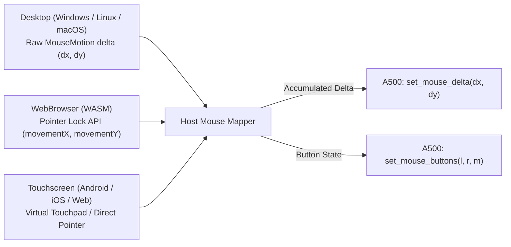

# Amiga 500 Mouse Subsystem & Pointer Architecture

This document specifies the hardware registers, quadrature counter mechanics, button sensing, and cross-platform host mouse/touchscreen input abstraction for the Amiga 500 emulator.

> [!NOTE]
> For dual game port bus routing, see [Game Ports.md](Game%20Ports.md). For top-level machine coordination, see [General Architecture.md](General%20Architecture.md). For game port configurations, see [Configuration.md](Configuration.md). For digital joysticks, see [Joystick.md](Joystick.md). For GUI pointer locking, see [GUI.md](GUI.md).

---

## 1. Hardware Architecture & Signal Routing

The standard Amiga 500 two-button (and optional three-button) mechanical/optical mouse connects to **Game Port 1** (9-pin D-sub male):

```mermaid
flowchart TD
    MOUSE["Amiga Mouse (2/3 Buttons, Quadrature Optical/Ball)"]
    PORT1["Game Port 1 (DB9 Male Connector)"]

    MOUSE -->|Horizontal Quadrature (H, HQ)| PORT1
    MOUSE -->|Vertical Quadrature (V, VQ)| PORT1
    MOUSE -->|Left Mouse Button (Pin 6)| PORT1
    MOUSE -->|Right Mouse Button (Pin 9)| PORT1
    MOUSE -->|Middle Mouse Button (Pin 5)| PORT1

    PORT1 -->|H, HQ, V, VQ Pulses| DENISE["Denise: JOY0DAT ($DFF00A)
(X Counter: bits 7-0, Y Counter: bits 15-8)"]
    PORT1 -->|Left Button (_FIR0)| CIAA["CIA-A: PRA Bit 6 ($BFE001)"]
    PORT1 -->|Right Button (DATLY)| PAULA_R["Paula / Denise: POTGO Bit 10 / POTINP ($DFF034 / $DFF016)"]
    PORT1 -->|Middle Button (DATLX)| PAULA_M["Paula / Denise: POTGO Bit 8 / POTINP ($DFF034 / $DFF016)"]
```

### 1.1 Pinout (Port 1 Mouse Connector)

| Pin | Mnemonic | Mouse Signal Function | Amiga Decoding Destination |
| :---: | :--- | :--- | :--- |
| **1** | `V` | Vertical quadrature phase 1 | Denise `JOY0DAT` Y counter |
| **2** | `H` | Horizontal quadrature phase 1 | Denise `JOY0DAT` X counter |
| **3** | `VQ` | Vertical quadrature phase 2 ($90^\circ$ phase shift) | Denise `JOY0DAT` Y direction logic |
| **4** | `HQ` | Horizontal quadrature phase 2 ($90^\circ$ phase shift) | Denise `JOY0DAT` X direction logic |
| **5** | `MIDBUT*` / `POT0X` | Middle Mouse Button (Button 3) / Pot X | Paula / Denise `POTGO` bit 8 (`DATLX`) & `POTINP` |
| **6** | `LFTBUT*` / `FIRE0*` | Left Mouse Button (Button 1) | CIA-A `PRA` bit 6 (`_FIR0`, active low) |
| **7** | `+5V` | +5V DC Supply (Max 100 mA) | Power for internal mouse LED emitters and sensors |
| **8** | `GND` | System Ground | Return line for encoders and switches |
| **9** | `RGTBUT*` / `POT0Y` | Right Mouse Button (Button 2) / Pot Y | Paula / Denise `POTGO` bit 10 (`DATLY`) & `POTINP` |

---

## 2. Hardware Quadrature Counters (`JOY0DAT`)

Denise contains dedicated 8-bit up/down counters for tracking mouse position without CPU intervention:
- **Address:** `$DFF00A` (`JOY0DAT` for Port 1, `$DFF00C` `JOY1DAT` for Port 2).
- **Register Layout:**
  - **Bits 15–8:** 8-bit Vertical ($Y$) counter ($0-255$, wrapping modulo 256).
  - **Bits 7–0:** 8-bit Horizontal ($X$) counter ($0-255$, wrapping modulo 256).

### 2.1 Quadrature Phase Decoding & Direction
The physical mouse encoder uses two photo-interrupters per axis, producing square waves with a $90^\circ$ phase offset:

```text
       MOUSE QUADRATURE
        V  VQ : Direction
       -------------------
        0   0 : State 0
        0   1 : State 1
        1   1 : State 2
        1   0 : State 3
```

- **Counting Rule:**
  - Moving **Right** (Horizontal): Increments the X counter (wrapping $255 \rightarrow 0$).
  - Moving **Left** (Horizontal): Decrements the X counter (wrapping $0 \rightarrow 255$).
  - Moving **Down** (toward user): Increments the Y counter (wrapping $255 \rightarrow 0$).
  - Moving **Up** (away from user): Decrements the Y counter (wrapping $0 \rightarrow 255$).
- **Software Velocity & Delta Calculation:**
  Amiga OS (Intuition) and games sample `JOY0DAT` once per frame during the Vertical Blanking interrupt. The displacement $\Delta X$ and $\Delta Y$ are calculated using 8-bit signed wrapping arithmetic:
  $$\Delta X = (\text{new\_x} - \text{prev\_x}) \text{ as } i8$$
  $$\Delta Y = (\text{new\_y} - \text{prev\_y}) \text{ as } i8$$
- **Velocity Limit:**
  If the mouse moves more than 127 counts in a single sample frame (approx. $16.6\text{ ms}$ NTSC / $20\text{ ms}$ PAL), signed overflow occurs, causing pointer reversal. For a standard 200 CPI mouse, the maximum safe speed is:
  $$\text{Velocity}_{\max} = \frac{127 \text{ counts} \times \frac{1\text{ in}}{200\text{ counts}}}{0.020\text{ s}} \approx 31.75\text{ in/s}$$

---

## 3. Mouse Button Decoding

1. **Left Mouse Button (`_FIR0`):**
   - Directly wired to CIA-A Port A bit 6 (`CIAAPRA` `$BFE001`).
   - Amiga pull-up holds the line at logic 1 ($+5\text{V}$).
   - Pressing the left button shorts Pin 6 to Ground, reading as logic **0** in bit 6.
2. **Right Mouse Button (`POT0Y` / Pin 9):**
   - Wired to the proportional controller input in Paula/Denise.
   - Read through register `POTINP` (`$DFF016`):
     - Bit 10 (`DATLY`): State of Port 1 Pin 9 ($0 = \text{pressed}, 1 = \text{released}$).
3. **Middle Mouse Button (`POT0X` / Pin 5):**
   - Wired to proportional controller Pin 5.
   - Read through register `POTINP` (`$DFF016`):
     - Bit 8 (`DATLX`): State of Port 1 Pin 5 ($0 = \text{pressed}, 1 = \text{released}$).

---

## 4. Cross-Platform Host Input Abstraction

The emulator core receives host mouse events through clean, platform-agnostic APIs.

### 4.1 Host Platforms & Integration Architecture



### 4.2 Desktop Integration (Windows, Linux, macOS)
- **Relative Motion (`winit` / `egui`):**
  - Uses `DeviceEvent::MouseMotion { delta: (dx, dy) }` to obtain unaccelerated raw hardware deltas.
  - When emulation is active, the host cursor is grabbed and locked inside the viewport window (**Pointer Lock** mode).
- **Sub-Pixel Accumulation & Fractional Smoothing:**
  - Modern high-DPI mice generate hundreds of events per frame. Fractional deltas are accumulated to eliminate movement jitter and staircase artifacts:
  ```rust
  pub struct MouseAccumulator {
      pub fractional_x: f32,
      pub fractional_y: f32,
      pub sensitivity: f32,
  }
  ```

### 4.3 WebAssembly & WebBrowser (WASM)
- Employs the HTML5 **Pointer Lock API** (`element.requestPointerLock()`).
- Host mouse events deliver `movementX` and `movementY` directly into the WASM core.
- Clicking inside the canvas automatically captures the pointer; pressing `Escape` releases it.

### 4.4 Touchscreen & Mobile Devices (Android, iOS, Tablets)
To support touchscreens without physical mice, the emulator provides two user-configurable modes:

1. **Virtual Touchpad Mode (Default & Recommended for Intuition Desktop):**
   - The entire screen (or a designated touch area) behaves like a laptop touchpad.
   - Dragging one finger across the screen generates relative $(\Delta x, \Delta y)$ mouse pulses.
   - **Gestures:**
     - **Single Tap:** Left Mouse Button click.
     - **Two-Finger Tap:** Right Mouse Button click.
     - **Tap & Drag:** Left Mouse Button drag (selecting text, dragging windows).
2. **Absolute Touch-to-Pointer Mapping:**
   - Touch coordinates are mapped to Amiga screen coordinates ($0..320 \times 0..200$).
   - The host calculates the delta from the currently tracked Amiga mouse position and smoothly streams incremental quadrature pulses until the target position is reached.

---

## 5. Emulator Data Structures & Hot-Path APIs

Hot execution paths perform zero dynamic memory allocation.

```rust
/// Represents the physical state of the Amiga mouse
#[derive(Debug, Clone, Copy, PartialEq, Eq, Default, Serialize, Deserialize)]
pub struct MouseState {
    pub x_counter: u8,
    pub y_counter: u8,
    pub left_button: bool,
    pub right_button: bool,
    pub middle_button: bool,
}

impl A500 {
    /// Feed relative mouse movements from host window loop into Port 1
    /// dx: Positive = Right, Negative = Left
    /// dy: Positive = Down, Negative = Up
    #[inline]
    pub fn set_mouse_delta(&mut self, dx: i32, dy: i32) {
        self.game_ports.port1.apply_mouse_delta(dx, dy);
    }

    /// Feed mouse button states into Port 1
    #[inline]
    pub fn set_mouse_buttons(&mut self, left: bool, right: bool, middle: bool) {
        self.game_ports.port1.set_mouse_buttons(left, right, middle);
    }
}
```

### 5.1 Internal Counter Update Implementation
In the GamePort/Mouse subsystem:
```rust
impl MouseDevice {
    pub fn apply_mouse_delta(&mut self, dx: i32, dy: i32) {
        // Wrapping 8-bit counters match Amiga Denise hardware behavior
        self.x_counter = self.x_counter.wrapping_add(dx as u8);
        self.y_counter = self.y_counter.wrapping_add(dy as u8);
    }

    pub fn read_joy0dat(&self) -> u16 {
        ((self.y_counter as u16) << 8) | (self.x_counter as u16)
    }
}
```

---

## 6. Subsystem Coordination & Save State

- **CIA-A Integration:** `CIAAPRA` bit 6 reads `0` if `left_button == true`, `1` otherwise.
- **Paula Integration:** `POTINP` bit 10 reads `0` if `right_button == true`, bit 8 reads `0` if `middle_button == true`.
- **Denise Integration:** Denise returns `read_joy0dat()` whenever `$DFF00A` is accessed.
- **Save State:** `MouseState` (counters and button states) is fully serialized in [SaveState.md](SaveState.md).

---

## 7. Reference Documentation & Upstream Ground Truth

- [Amiga Hardware Reference Manual: Chapter 8 (Interface Hardware)](../Reference/Hardware%20Reference%20Manual/08%20-%20Chapter%208%20-%20Interface%20Hardware.md): Port 1 optical quadrature signal decoding, pulse trains, and direction counter mechanics.
- [Amiga Hardware Reference Manual: Appendix E (Interfaces)](../Reference/Hardware%20Reference%20Manual/13%20-%20Appendix%20E%20-%20Interfaces.md): Controller port DB9 pinouts, button lines, and proportional potentiometer circuitry.
- [vAmiga Mouse Implementation Reference](../../../ref_src/vAmiga-4.5/Core/Peripherals/Mouse/Mouse.h): Reference C++ implementation for mouse quadrature accumulation, host pointer scaling, and middle button support.