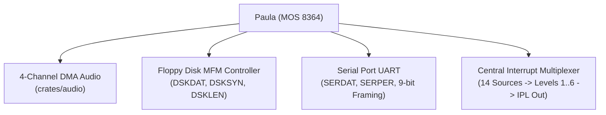
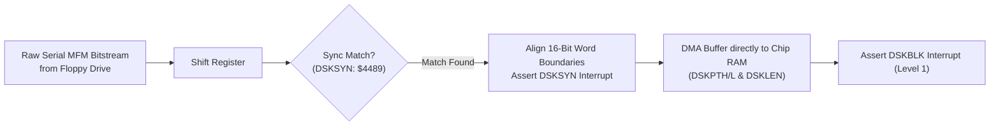

# Paula (MOS 8364) Architecture & Hardware Specification

> [!NOTE]
> System execution constraints, memory bus arbitration, and Color Clock timing are defined in [AGENTS.md](../../../AGENTS.md), [MemoryBus.md](MemoryBus.md), and [Main loop A500.md](Main%20loop%20A500.md).
> Detailed inter-chip signal rules are codified in [`hardware-bus-topology.md`](../../../.agents/rules/hardware-bus-topology.md).
> Save state structures for Paula are specified in [SaveState.md](SaveState.md). Machine stepping and interrupt priority arbitration (IPL 1–6) are coordinated with [Main loop A500.md](Main%20loop%20A500.md) and [CPU Motorola M68000.md](CPU%20Motorola%20M68000.md). Disk controller interaction is detailed in [Floppy.md](Floppy.md), and DMA channel arbitration is handled by [Agnus.md](Agnus.md) and [DMA.md](DMA.md).
> 4-channel audio sample streaming is specified in [Audio.md](Audio.md).

---

## 1. Scope & Subsystem Overview

Paula is the multi-function sound generator, floppy disk interface, serial communication controller, and central interrupt multiplexer for the Amiga:



---

## 2. Module Decomposition & Workspace Architecture

Paula is partitioned into focused, decoupled workspace crates under `crates/`:

```
crates/
├── audio/             // 4-channel DMA audio engine, volume scaling, period counters, BLEP synthesis
├── serial_port/       // RS-232 UART transceiver (SERDAT, SERPER, 9-bit framing)
└── paula/             // Paula coordinator, central INTENA/INTREQ multiplexer, and register routing
```

### 2.1 Logical Subsystem Containment & Re-Exports
In accordance with the 3-tier re-export hierarchy, `crates/paula` owns and re-exports its companion crates:
```rust
pub use audio;
pub use serial_port;

pub struct Paula {
    pub audio: audio::Audio,
    pub serial_port: serial_port::SerialPort,
    pub intena: u16,
    pub intreq: u16,
    pub adkcon: u16,
    // ... pot counters, floppy latches, and in-flight mutation pipeline
}
```

### 2.2 Passive Bus Latching & Zero Direct Memory Reads Invariant
Per [`hardware-bus-topology.md`](../../../.agents/rules/hardware-bus-topology.md) and [General Architecture.md](General%20Architecture.md):
- **Zero DMA Address Generators:** Paula contains **no DMA pointer registers and no Chip RAM address generation circuitry**. Agnus owns and increments all `AUDxPT` audio pointers and `DSKPT` disk pointers.
- **Zero Direct Memory Reads:** Paula **never holds references to `PhysicalMemory` and never calls `memory.read()`**.
- **Passive Data Latching via DMAL & RGA Bus:**
  - Audio: When Paula's sample period triggers a buffer reload request, Agnus schedules audio DMA in slots 13..19, asserts `DMAL`, places the memory address onto the Chip RAM bus, and asserts `AUDxDAT` (`$0AA`, `$0BA`, `$0CA`, `$0DA`) on the internal `RGA` bus. Paula passively latches the 16-bit word off the data bus into its channel holding register.
  - Floppy: In slots 7, 9, 11, Agnus transfers MFM words between Chip RAM and Paula's `DSKDAT` (`$026`) holding register over the shared data bus.
- **Prohibition of Direct Inter-Chip Smuggling:** Paula never directly calls methods on Agnus, Denise, or CPU. All interactions (such as `AUDxDSR` pointer reload strobes and interrupt requests) model physical electric pins coordinated by the machine loop.

---

## 3. Register Memory Map

Paula registers are mapped in the Custom Chip space (`$DFF008`–`$DFF032`, `$DFF07E`, `$DFF09A`–`$DFF0DE`):

| Address | R/W | Symbol | Description |
| :--- | :---: | :--- | :--- |
| **`$DFF008`** | R | **`DSKDATR`** | Disk data early read / MFM verification |
| **`$DFF010`** | R | **`ADKCONR`** | Audio and Disk control read |
| **`$DFF018`** | R | **`SERDATR`** | Serial port data and status read (RBF, TBE, TSRE, OVRUN) |
| **`$DFF01A`** | R | **`DSKBYTR`** | Disk data byte and sync status read |
| **`$DFF01C`** | R | **`INTENAR`** | Interrupt enable bits read |
| **`$DFF01E`** | R | **`INTREQR`** | Interrupt request bits read |
| **`$DFF020`** | W | **`DSKPTH`** | Disk DMA Pointer High (High 5 bits) |
| **`$DFF022`** | W | **`DSKPTL`** | Disk DMA Pointer Low (Low 16 bits) |
| **`$DFF024`** | W | **`DSKLEN`** | Disk DMA Length (words, bit 15: DMA enable, bit 14: write mode) |
| **`$DFF026`** | W | **`DSKDAT`** | Disk DMA write data buffer |
| **`$DFF030`** | W | **`SERDAT`** | Serial port data write (data bits + stop bit control) |
| **`$DFF032`** | W | **`SERPER`** | Serial port baud rate period and 9-bit framing divisor |
| **`$DFF07E`** | W | **`DSKSYN`** | Disk sync pattern register (standard `$4489`) |
| **`$DFF09A`** | W | **`INTENA`** | Interrupt enable control (bit 15: SET/CLR) |
| **`$DFF09C`** | W | **`INTREQ`** | Interrupt request control (bit 15: SET/CLR) |
| **`$DFF09E`** | W | **`ADKCON`** | Audio, Disk, and UART control write |
| **`$DFF0A0`–`$DFF0D2`** | W | **`AUDxLCH/L`** | Audio Channel 0–3 Sample Location Pointer |
| **`$DFF0A4`–`$DFF0D4`** | W | **`AUDxLEN`** | Audio Channel 0–3 Sample Length (in 16-bit words) |
| **`$DFF0A6`–`$DFF0D6`** | W | **`AUDxPER`** | Audio Channel 0–3 Period divisor (clock ticks per sample) |
| **`$DFF0A8`–`$DFF0D8`** | W | **`AUDxVOL`** | Audio Channel 0–3 Volume (6-bit linear: $0$ to $64$) |
| **`$DFF0AA`–`$DFF0DA`** | W | **`AUDxDAT`** | Audio Channel 0–3 Sample Data Holding Latch |

### 3.1 Register Access Semantics & Propagation Latency Pipeline
- **Asymmetric Register Pairs:**
  - `INTENAR` (`$DFF01C`) read vs `INTENA` (`$DFF09A`) write.
  - `INTREQR` (`$DFF01E`) read vs `INTREQ` (`$DFF09C`) write.
  - `ADKCONR` (`$DFF010`) read vs `ADKCON` (`$DFF09E`) write.
  - Bit 15 on write registers controls `SET/CLR` mechanics: writing with bit 15 = 1 sets individual masked bits; bit 15 = 0 clears them.
- **Write Staging Buffer:** Paula embeds an inline fixed-capacity mutation array `[Option<DelayedMutation>; 32]` sizing to its addressable write register set.
- **Propagation Timing:**
  - `INTENA` / `INTREQ`: Propagates with 1 CCK delay (`MutationMode::OverwritePending`). Paula's central interrupt encoder recalculates IPL lines to the CPU at the conclusion of the 1-CCK propagation.
  - `ADKCON`: Propagates with 2 CCK delay (`MutationMode::OverwritePending`).
  - Audio Volume / Period (`AUDxVOL`, `AUDxPER`): Propagate with 1 CCK delay (`MutationMode::Pipeline`).
  - Cross-Chip `DMACON` Broadcast: Paula latches DMA enables for audio channels (`AUD0..3`) and floppy disk (`DSK`) broadcast from the memory bus.
- **Defensive Overflow Protection:** If debugger injections saturate the 32-slot buffer, writes commit immediately with a defensive error log, preserving zero-panic invariants.

---

## 4. Subordinate Audio Engine (`crates/audio`)

Paula houses 4 independent DMA sound channels producing 8-bit signed PCM output across stereo Left (Channels 1 & 2) and Right (Channels 0 & 3) channels.
- **Sample Rates:** Clocked by Color Clock period dividers: $f = 3,546,895\ \text{Hz} / \text{period}$ (PAL).
- **Volume & Modulation:** 6-bit linear volume scaling ($0..64$) and cross-channel frequency/amplitude modulation via `ADKCON`.
- **Filtering:** Fixed 7 kHz 2-pole RC filter and switchable 4.4 kHz LED filter (controlled by CIA-A Port A bit 1 `_LED`).
- *Authoritative Specification:* See [Audio.md](Audio.md).

---

## 5. Floppy Disk MFM Controller

Paula interfaces with 3.5" floppy disk drives to encode and decode raw bit-level Modified Frequency Modulation (MFM) streams:



- **Sync Word Detection (`DSKSYN`):** Paula continuously monitors the serial MFM bitstream. When the pattern matches `DSKSYN` (standard `$4489`), it aligns word framing and fires the `DSKSYN` interrupt (Level 5).
- **DMA Streaming:** Once synchronized, Paula writes decoded 16-bit words directly into Chip RAM via Agnus DMA slots. When the word count in `DSKLEN` expires, Paula asserts `DSKBLK` (Level 1).
- **Cross-Chip Coordination:**
  - **CIA-B:** Drives drive selection (`_SEL0`–`_SEL3`), motor (`_MTR`), head stepping (`_STEP`), step direction (`_DIR`), and side select (`_SIDE`).
  - **CIA-A:** Monitors status signals (`_RDY`, `_TK0`, `_WPROT`, `_CHNG`).
  - *Detailed Specifications:* For complete physical drive mechanics, motor latching on select, head stepping timing, AmigaDOS odd/even split MFM sector format, and ADF ingestion, see [Floppy.md](Floppy.md).

---

## 6. Serial Port UART

Paula contains a full-duplex asynchronous UART controller:
- **`SERPER` (`$DFF032`):** Defines baud rate divisor ($f_{\text{baud}} = \frac{3,546,895}{\text{SERPER} + 1}$) and 9-bit framing mode.
- **`SERDAT` (`$DFF030`):** Transmit holding register. Supports 8 or 9 data bits plus stop bits.
- **`SERDATR` (`$DFF018`):** Receive register and status flags:
  - `RBF` (bit 14): Receive Buffer Full.
  - `TBE` (bit 13): Transmit Buffer Empty.
  - `TSRE` (bit 12): Transmit Shift Register Empty.
  - `OVRUN` (bit 11): Receiver overrun error.

---

## 7. Central Interrupt Priority Multiplexer

Paula aggregates all 14 system interrupt sources into 6 prioritized levels ($IPL 1..6$) and drives the CPU interrupt priority lines (`_IPL0`, `_IPL1`, `_IPL2`):

| Level | Priority Sources | Triggering Chip / Subsystem |
| :---: | :--- | :--- |
| **1** | `TBE` (Serial TX Empty), `DSKBLK` (Disk Block Done), `SOFT` | Paula (UART, Floppy) |
| **2** | `PORTS` (External CIA-A interrupt line) | CIA-A |
| **3** | `VERTB` (Vertical Blank), `BLIT` (Blitter Finished), `COPER` (Copper) | Agnus (Beam, Blitter, Copper) |
| **4** | `AUD0`, `AUD1`, `AUD2`, `AUD3` (Audio Channels 0–3) | Paula (Audio) |
| **5** | `RBF` (Serial RX Buffer Full), `DSKSYN` (Disk Sync Match) | Paula (UART, Floppy) |
| **6** | `EXTER` (External CIA-B interrupt line) | CIA-B |

### 7.1 Set / Clear Control (`INTENA` & `INTREQ`)
Both `INTENA` (`$DFF09A`) and `INTREQ` (`$DFF09C`) use bit 15 as an atomic control flag:
- **Bit 15 = 1 (`SET`):** Any bit set to `1` in the written word is asserted/enabled.
- **Bit 15 = 0 (`CLR`):** Any bit set to `1` in the written word is cleared/disabled.
- Bits written with `0` remain unchanged.

---

## 8. Reset Defaults

- **`INTENA` (`$DFF09A`):** Reset to **`$0000`** (master and all 14 interrupt sources disabled).
- **`INTREQ` (`$DFF09C`):** Cleared to **`$0000`** (all pending requests discarded).
- **`AUD0VOL`–`AUD3VOL`:** Reset to **`0`** (audio immediately muted).
- **Audio DMA:** Halted.
- **Floppy DMA:** Halted; `DSKLEN` set to `$0000`.

---

## 9. Reference Documentation & Upstream Ground Truth

- [Audio Architecture Specification](Audio.md): 4-channel DMA audio engine, volume scaling, period counters, and BLEP synthesis.
- [Floppy Subsystem Specification](Floppy.md): MFM decoding, drive mechanics, and sector formats.
- [Amiga Hardware Reference Manual: Chapter 5 (Audio Hardware)](../Reference/Hardware%20Reference%20Manual/05%20-%20Chapter%205%20-%20Audio%20Hardware.md): Authoritative specification for 4-channel DMA audio.
- [Amiga Hardware Reference Manual: Chapter 7 (System Control Hardware)](../Reference/Hardware%20Reference%20Manual/07%20-%20Chapter%207%20-%20System%20Control%20Hardware.md): Interrupt multiplexing logic, priority level encoding (IPL 1–6), `INTENA`, and `INTREQ` control bits.
- [Amiga Hardware Reference Manual: Chapter 8 (Interface Hardware)](../Reference/Hardware%20Reference%20Manual/08%20-%20Chapter%208%20-%20Interface%20Hardware.md): UART serial communication registers (`SERDAT`, `SERPER`) and floppy disk read/write timing.
- [Amiga Hardware Reference Manual: Appendix B (Register Summary)](../Reference/Hardware%20Reference%20Manual/10%20-%20Appendix%20B%20-%20Register%20Summary%20%28Address%20Order%29.md): Bitfield layouts and access modes for all Paula custom chip registers (`$DFF008`–`$DFF032`, `$DFF09A`–`$DFF0DE`).
- [vAmiga Paula Component Implementation](../../../ref_src/vAmiga-4.5/Core/Components/Paula/Paula.cpp): Reference C++ coordinator for sound generation, interrupt routing, and UART framing.
