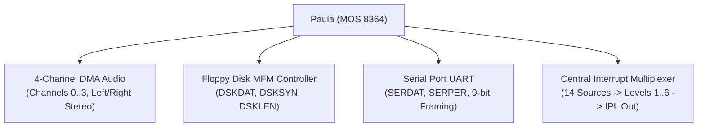
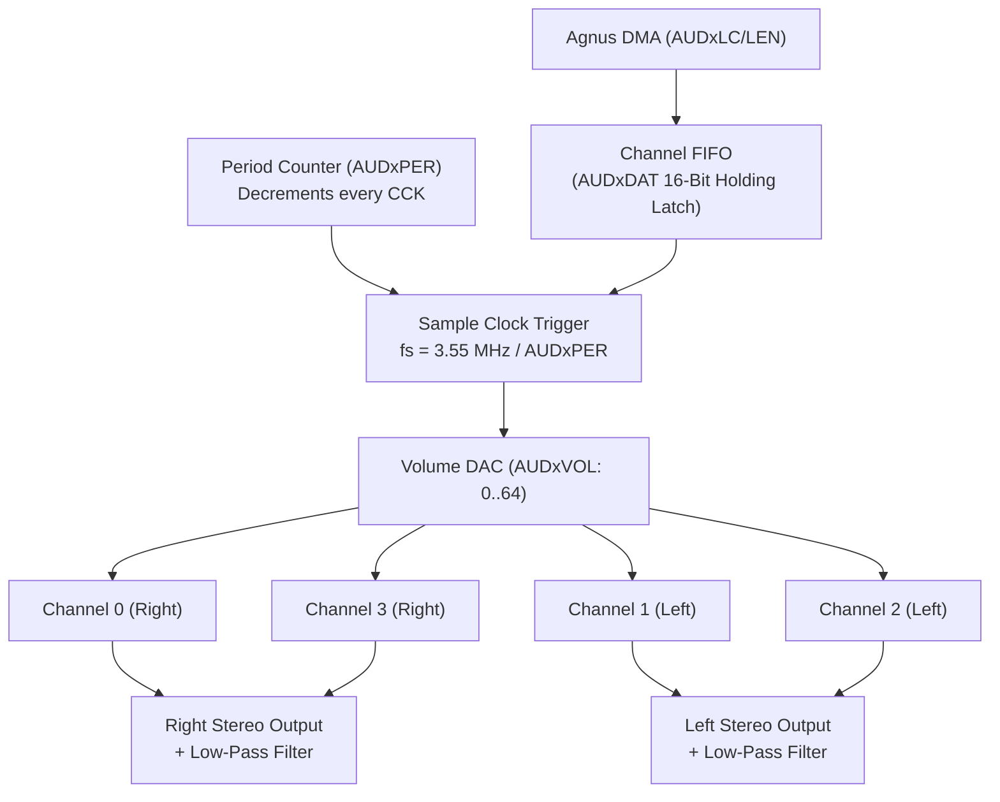
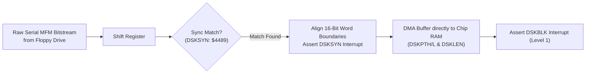

# Paula (MOS 8364) Architecture & Hardware Specification

> [!NOTE]
> System execution constraints, memory bus arbitration, and Color Clock timing are defined in [AGENTS.md](file:///d:/Programowanie/Amiga/AGENTS.md), [MemoryBus.md](file:///d:/Programowanie/Amiga/Obsidian/Amiga/Design/MemoryBus.md), and [CycleCounter.md](file:///d:/Programowanie/Amiga/Obsidian/Amiga/Design/CycleCounter.md).
> Save state structures for Paula are specified in [SaveState.md](file:///d:/Programowanie/Amiga/Obsidian/Amiga/Design/SaveState.md).

---

## 1. Scope & Subsystem Overview

Paula is the multi-function sound generator, floppy disk interface, serial communication controller, and central interrupt multiplexer for the Amiga:



---

## 2. Module Decomposition

Paula is structured into modular subcomponents within `chips/paula/`:

```
chips/paula/
├── mod.rs             // Paula coordinator, register dispatch & tick routing
├── audio.rs           // 4 independent DMA sound channels, period counters, BLEP sinc
├── floppy.rs          // Floppy MFM bit serializer/deserializer, sync detector, DMA
├── uart.rs            // Serial port UART transceiver (SERDAT, SERPER)
└── interrupts.rs      // Central INTENA and INTREQ priority encoder (IPL 1..6)
```

---

## 3. Register Memory Map

Paula registers are mapped in the Custom Chip space (`$DFF008`–`$DFF032`, `$DFF07E`, `$DFF09A`–`$DFF0DE`):

| Address | R/W | Symbol | Description |
| :--- | :---: | :--- | :--- |
| **`$DFF008`** | R | **`DSKDATR`** | Disk data early read / MFM verification |
| **`$DFF010`** | R | **`ADKCONR`** | Audio and Disk control read |
| **`$DFF018`** | R | **`SERDATR`** | Serial port data and status read (RBF, TBE, TSRE, OVRUN) |
| **`$DFF01A`** | R | **`DSKBYTR`** | Disk data byte and sync status read |
| **`$DFF01C`** | R | **`INTENAR`** | Interrupt enable bits read |
| **`$DFF01E`** | R | **`INTREQR`** | Interrupt request bits read |
| **`$DFF020`** | W | **`DSKPTH`** | Disk DMA Pointer High (High 5 bits) |
| **`$DFF022`** | W | **`DSKPTL`** | Disk DMA Pointer Low (Low 16 bits) |
| **`$DFF024`** | W | **`DSKLEN`** | Disk DMA Length (words, bit 15: DMA enable, bit 14: write mode) |
| **`$DFF026`** | W | **`DSKDAT`** | Disk DMA write data buffer |
| **`$DFF030`** | W | **`SERDAT`** | Serial port data write (data bits + stop bit control) |
| **`$DFF032`** | W | **`SERPER`** | Serial port baud rate period and 9-bit framing divisor |
| **`$DFF07E`** | W | **`DSKSYN`** | Disk sync pattern register (standard `$4489`) |
| **`$DFF09A`** | W | **`INTENA`** | Interrupt enable control (bit 15: SET/CLR) |
| **`$DFF09C`** | W | **`INTREQ`** | Interrupt request control (bit 15: SET/CLR) |
| **`$DFF09E`** | W | **`ADKCON`** | Audio, Disk, and UART control write |
| **`$DFF0A0`–`$DFF0D2`** | W | **`AUDxLCH/L`** | Audio Channel 0–3 Sample Location Pointer |
| **`$DFF0A4`–`$DFF0D4`** | W | **`AUDxLEN`** | Audio Channel 0–3 Sample Length (in 16-bit words) |
| **`$DFF0A6`–`$DFF0D6`** | W | **`AUDxPER`** | Audio Channel 0–3 Period divisor (clock ticks per sample) |
| **`$DFF0A8`–`$DFF0D8`** | W | **`AUDxVOL`** | Audio Channel 0–3 Volume (6-bit linear: $0$ to $64$) |
| **`$DFF0AA`–`$DFF0DA`** | W | **`AUDxDAT`** | Audio Channel 0–3 Sample Data Holding Latch |

---

## 4. 4-Channel DMA Audio Engine

Paula houses 4 independent DMA sound channels producing 8-bit signed PCM output:



### 4.1 Sample Clocking & Period Formula
- The audio period counter decrements once every **Color Clock (CCK)**.
- When the period counter reaches zero, the channel outputs the next 8-bit sample byte and reloads from `AUDxPER`.
- **Sample Rate Equations:**
  $$f_{\text{sample}} = \frac{3,546,895\ \text{Hz}}{\text{period}} \quad (\text{PAL}) \qquad f_{\text{sample}} = \frac{3,579,545\ \text{Hz}}{\text{period}} \quad (\text{NTSC})$$
- **Hardware Period Limits:**
  - Minimum supported period: **$124$ CCKs** ($\approx 28.86\ \text{kHz}$ max sample rate under PAL).
  - Maximum period: **$65,535$ CCKs** ($\approx 54.1\ \text{Hz}$).

### 4.2 Stereo Channel Assignment & Volume Scaling
- **Left Channel:** Audio Channel 1 and Audio Channel 2.
- **Right Channel:** Audio Channel 0 and Audio Channel 3.
- **Volume:** Controlled by bits 5–0 of `AUDxVOL` ($0$ = mute, $64$ = maximum amplitude).

### 4.3 Modulation via `ADKCON`
- Channel 0 can modulate Channel 1 (frequency or amplitude modulation).
- Channel 2 can modulate Channel 3 (frequency or amplitude modulation).

### 4.4 Hardware Audio Filters
- **Fixed RC Low-Pass Filter:** 2-pole analog filter with a fixed cutoff frequency of $\approx 7\ \text{kHz}$.
- **Switchable "LED" Filter:** Additional 1-pole low-pass filter with a cutoff frequency of $\approx 4.4\ \text{kHz}$. Controlled directly by **CIA-A Port A bit 1** (`_LED`). Setting the bit low enables the filter and dims the power LED; setting it high disables the filter and brightens the LED.

---

## 5. Floppy Disk MFM Controller

Paula interfaces with 3.5" floppy disk drives to encode and decode raw bit-level Modified Frequency Modulation (MFM) streams:



- **Sync Word Detection (`DSKSYN`):** Paula continuously monitors the serial MFM bitstream. When the pattern matches `DSKSYN` (standard `$4489`), it aligns word framing and fires the `DSKSYN` interrupt (Level 5).
- **DMA Streaming:** Once synchronized, Paula writes decoded 16-bit words directly into Chip RAM via Agnus DMA slots. When the word count in `DSKLEN` expires, Paula asserts `DSKBLK` (Level 1).
- **Cross-Chip Coordination:**
  - **CIA-B:** Drives drive selection (`_SEL0`–`_SEL3`), motor (`_MTR`), head stepping (`_STEP`), step direction (`_DIR`), and side select (`_SIDE`).
  - **CIA-A:** Monitors status signals (`_RDY`, `_TK0`, `_WPROT`, `_CHNG`).
  - *Detailed Specifications:* For complete physical drive mechanics, motor latching on select, head stepping timing, AmigaDOS odd/even split MFM sector format, and ADF ingestion, see [Floppy.md](file:///d:/Programowanie/Amiga/Obsidian/Amiga/Design/Floppy.md).

---

## 6. Serial Port UART

Paula contains a full-duplex asynchronous UART controller:
- **`SERPER` (`$DFF032`):** Defines baud rate divisor ($f_{\text{baud}} = \frac{3,546,895}{\text{SERPER} + 1}$) and 9-bit framing mode.
- **`SERDAT` (`$DFF030`):** Transmit holding register. Supports 8 or 9 data bits plus stop bits.
- **`SERDATR` (`$DFF018`):** Receive register and status flags:
  - `RBF` (bit 14): Receive Buffer Full.
  - `TBE` (bit 13): Transmit Buffer Empty.
  - `TSRE` (bit 12): Transmit Shift Register Empty.
  - `OVRUN` (bit 11): Receiver overrun error.

---

## 7. Central Interrupt Priority Multiplexer

Paula aggregates all 14 system interrupt sources into 6 prioritized levels ($IPL 1..6$) and drives the CPU interrupt priority lines (`_IPL0`, `_IPL1`, `_IPL2`):

| Level | Priority Sources | Triggering Chip / Subsystem |
| :---: | :--- | :--- |
| **1** | `TBE` (Serial TX Empty), `DSKBLK` (Disk Block Done), `SOFT` | Paula (UART, Floppy) |
| **2** | `PORTS` (External CIA-A interrupt line) | CIA-A |
| **3** | `VERTB` (Vertical Blank), `BLIT` (Blitter Finished), `COPER` (Copper) | Agnus (Beam, Blitter, Copper) |
| **4** | `AUD0`, `AUD1`, `AUD2`, `AUD3` (Audio Channels 0–3) | Paula (Audio) |
| **5** | `RBF` (Serial RX Buffer Full), `DSKSYN` (Disk Sync Match) | Paula (UART, Floppy) |
| **6** | `EXTER` (External CIA-B interrupt line) | CIA-B |

### 7.1 Set / Clear Control (`INTENA` & `INTREQ`)
Both `INTENA` (`$DFF09A`) and `INTREQ` (`$DFF09C`) use bit 15 as an atomic control flag:
- **Bit 15 = 1 (`SET`):** Any bit set to `1` in the written word is asserted/enabled.
- **Bit 15 = 0 (`CLR`):** Any bit set to `1` in the written word is cleared/disabled.
- Bits written with `0` remain unchanged.

---

## 8. Reset Defaults

- **`INTENA` (`$DFF09A`):** Reset to **`$0000`** (master and all 14 interrupt sources disabled).
- **`INTREQ` (`$DFF09C`):** Cleared to **`$0000`** (all pending requests discarded).
- **`AUD0VOL`–`AUD3VOL`:** Reset to **`0`** (audio immediately muted).
- **Audio DMA:** Halted.
- **Floppy DMA:** Halted; `DSKLEN` set to `$0000`.
