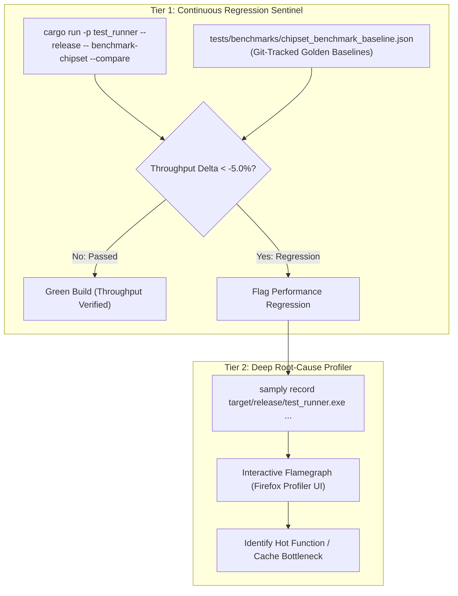

# Performance Profiling & Optimization Strategy

> [!NOTE]
> Architectural guidelines and machine invariants reside in [AGENTS.md](../../../AGENTS.md).
> The M68000 CPU instruction benchmark framework is specified in [CPU Instruction Benchmarking.md](CPU%20Instruction%20Benchmarking.md).
> Color Clock execution phases ($CCK1/CCK2$) and bus arbitration are specified in [General Architecture.md](General%20Architecture.md) and [Main loop A500.md](Main%20loop%20A500.md).
> Implementation resides in [`crates/test_runner`](../../../crates/test_runner) and the dedicated agent skill [`.agents/skills/profile-external`](../../../.agents/skills/profile-external).

---

## 1. Core Performance Goals & Architecture

Maintaining cycle-exact hardware fidelity at high execution speeds requires strict performance discipline. However, inserting synthetic timing probes into hot emulation loops distorts host CPU execution pipelines, flushes compiler instruction caches, and introduces artificial timing divergence.

This specification establishes a **Two-Tier Performance Monitoring Architecture**:
1. **Tier 1 — Automated Regression Sentinel (Harness Gate):** Continuous, deterministic throughput tracking using Git-tracked golden baselines (`tests/benchmarks/chipset_benchmark_baseline.json`) executing uninstrumented release code.
2. **Tier 2 — External Statistical Sampling Profiler (`samply`):** Deep, method-level call tree and flamegraph inspection using non-invasive OS performance counters on demand.



---

## 2. Prohibition of Intrusive Hot-Path Probes

- **The Observer Effect in Emulation:** Calling host timer APIs (`std::time::Instant::now()`, `QueryPerformanceCounter`) inside per-CCK execution loops (`step_cck`, `step_subsystems_cck`) incurs a severe measurement penalty (~20–80 ns per call). On a 3.54 MHz Color Clock model, probes alter instruction scheduling and prevent LLVM from performing cross-function inlining optimizations.
- **Architectural Policy:** Core emulation crates (`crates/agnus`, `crates/denise`, `crates/paula`, `crates/m68000`, `crates/memory_bus`) must remain **100% free of measurement probes**. Profiling must never alter the production execution path.

---

## 3. Tier 1: Git-Tracked Chipset Benchmark Baseline

Modeled after the proven M68000 instruction benchmarking system ([CPU Instruction Benchmarking.md](CPU%20Instruction%20Benchmarking.md)), the test runner maintains an authoritative golden baseline dataset:

- **Location:** `tests/benchmarks/chipset_benchmark_baseline.json`
- **Schema:**
  ```json
  {
    "version": 1,
    "recorded_at": "2026-09-14",
    "results": [
      {
        "name": "coptim1",
        "category": "Copper Coprocessor",
        "frames": 50,
        "cck_count": 3556800,
        "elapsed_ms": 459.0,
        "fps": 108.9,
        "cck_mhz": 7.75,
        "methods": {
          "Cpu::step_cck": { "percent": 31.4, "module": "cpu" },
          "Agnus::step_cck_ram": {
            "percent": 32.8,
            "module": "agnus",
            "submethods": {
              "Copper::step_cck": 21.6,
              "Blitter::step_cck_ram": 0.0,
              "DmaScheduler::arbitrate": 11.2
            }
          },
          "Denise::step_cck": {
            "percent": 26.5,
            "module": "denise",
            "submethods": {
              "FrameBuilder::set_cck_pixels": 25.1,
              "SpriteEngine::step_cck": 1.4
            }
          },
          "Paula::step_cck": { "percent": 3.8, "module": "paula", "submethods": { "Audio::step_cck": 3.8 } },
          "Cia::step_cck": { "percent": 4.2, "module": "cia" },
          "FloppyController::step_cck": { "percent": 0.8, "module": "floppy" },
          "Rtc::step_cck": { "percent": 0.5, "module": "rtc" }
        }
      }
    ]
  }
  ```

### 3.1 Method-Level Profile Aggregation (`tools/harness/aggregate_profile.py`)
To obtain method and module time distribution without intrusive runtime probes:
1. Run external sampling profiler (`samply record ...` or `perf record ...`).
2. Aggregate samples by canonical entry method:
   - `python tools/harness/aggregate_profile.py <profile_file> --target coptim1 --update-baseline tests/benchmarks/chipset_benchmark_baseline.json`
3. Canonical entry methods:
   - `Cpu::step_cck` (`cpu`)
   - `Agnus::step_cck_ram` (`agnus` -> `Copper::step_cck`, `Blitter::step_cck_ram`, `DmaScheduler::arbitrate`)
   - `Denise::step_cck` (`denise` -> `FrameBuilder::set_cck_pixels`, `SpriteEngine::step_cck`)
   - `Paula::step_cck` (`paula` -> `Audio::step_cck`)
   - `Cia::step_cck` (`cia`)
   - `FloppyController::step_cck` (`floppy`)
   - `Rtc::step_cck` (`rtc`)

### 3.2 Regression Evaluation Protocol
The sentinel executes representative benchmark targets for a fixed frame count ($N = 50$) in release mode:
$$\Delta\% = \frac{\text{FPS}_{\text{active}} - \text{FPS}_{\text{baseline}}}{\text{FPS}_{\text{baseline}}} \times 100$$
- If $\Delta\% \ge -5.0\%$, the audit passes.
- If $\Delta\% < -5.0\%$, the runner exits with code 1, blocking regression integration.

---

## 4. Tier 2: External Sampling Profiling (`samply`)

When investigating bottlenecks or validating proposed optimizations:

### 4.1 Subsystem Mapping via Crate Boundaries
Because each Amiga subsystem is isolated in its own workspace crate, the profiler automatically groups execution time by chip:
- `agnus::*` / `copper::*` / `blitter::*` / `dma::*` $\to$ Agnus Coprocessors & Bus Arbiter
- `denise::*` / `frame_builder::*` / `sprites::*` $\to$ Denise Video Pipeline
- `paula::*` / `audio::*` / `floppy::*` $\to$ Paula Audio & Storage
- `m68000::*` / `memory_bus::*` $\to$ CPU Microcode Dispatch & Physical Memory
- `cia::*` / `keyboard::*` / `rtc::*` $\to$ Peripheral Timers & I/O

### 4.2 Optimization Verification Protocol
Whenever refactoring for performance (such as *Dynamic Agnus DMA Slot Arbitration*):
1. **Pre-Optimization Profile:** Record a baseline flamegraph with `samply` to capture exact percentage share.
2. **Implement Minimal Code Change:** Implement the focused optimization while preserving code readability and architectural simplicity.
3. **Verification Gate:** Pass all automated unit tests, SingleStepTests, and vAmigaTS verification suites.
4. **Post-Optimization Profile:** Re-run `samply` to verify that target self-time decreased.
5. **Update Baseline:** Re-record golden metrics via `benchmark-chipset --record` and commit atomically.

---

## 5. Reference Documentation & Upstream Ground Truth

- [CPU Instruction Benchmarking.md](CPU%20Instruction%20Benchmarking.md): Golden CSV/JSON baseline infrastructure and anomaly detection algorithms.
- [General Architecture.md](General%20Architecture.md): Physical Color Clock synchronization model ($CCK1/CCK2$).
- [Main loop A500.md](Main%20loop%20A500.md): Master machine coordination loop and borrow-split dispatch architecture.
- [vAmiga Core Architecture Reference](../../../ref_src/vAmiga/Core/VAmiga.cpp): Reference C++ main emulation loop and frame timing model.
