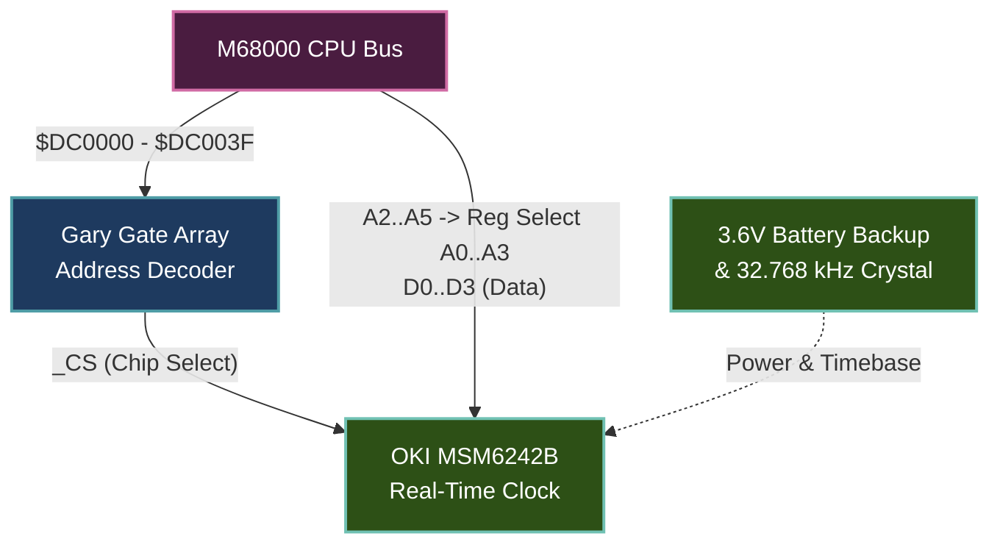

# Amiga 500 Real-Time Clock (RTC) Specification

> [!NOTE]
> System execution constraints, memory bus arbitration, and Color Clock timing are defined in [AGENTS.md](../../../AGENTS.md), [MemoryBus.md](MemoryBus.md), and [Main loop A500.md](Main%20loop%20A500.md).
> Save state structures for RTC are specified in [SaveState.md](SaveState.md). Hardware presets and active RTC model configurations are defined in [Configuration.md](Configuration.md).
> Implementation resides in the dedicated foundational crate [`crates/rtc`](../../../crates/rtc).

---

## 1. Scope & Physical Hardware Overview

The Amiga 500 does not include a battery-backed clock on the stock motherboard. Instead, a real-time clock is added via the **Commodore A501 512 KB Trapdoor Expansion** (or third-party memory expansions), and was later built directly onto the motherboard in the **Amiga 500+** and **Amiga 2000**.

- **Canonical Chipset:** **OKI MSM6242B** (also designated MSM6242RS in Commodore technical manuals).
- **Physical Memory Location:** `$DC0000` to `$DC003F` (64-byte address block).
- **Bus Interface:** 4-bit CMOS peripheral IC connected directly to the lower data bus lines ($D_0–D_3$) through address decoding handled by the Gary custom gate array.
- **Crystal Oscillator:** 32.768 kHz tuning fork crystal with battery backup (typically a rechargeable 3.6V NiCd barrel battery on original hardware).

---

## 2. Bus Addressing & Register Layout

### 2.1 Stride & Odd-Byte Access
Because the MSM6242B is a 4-bit peripheral connected to the lower data byte ($D_0–D_3$), it responds strictly when the lower data strobe ($\overline{\text{LDS}}$) is asserted. On the Motorola 68000, this corresponds to **odd byte addresses** (`A0 = 1`).

Furthermore, CPU address lines $A_2, A_3, A_4, A_5$ are wired to the chip's register select pins $A_0, A_1, A_2, A_3$. Consequently, each 4-bit register is spaced **4 bytes apart** (longword stride):
- Register index formula: `reg = (addr >> 2) & 0x0F`
- Typical hardware access addresses:
  - Register `0x0`: `$DC0001` or `$DC0003`
  - Register `0x1`: `$DC0005` or `$DC0007`
  - ...
  - Register `0xF`: `$DC003D` or `$DC003F`

Even byte address reads (`A0 = 0`, $\overline{\text{UDS}}$ asserted) return unmapped open bus (`$FF`), and writes to even byte addresses are ignored.

### 2.2 Complete 16-Register Map

All numeric digits are represented in **positive Binary-Coded Decimal (BCD)**, active high.

| Reg | Name | Bit 3 ($D_3$) | Bit 2 ($D_2$) | Bit 1 ($D_1$) | Bit 0 ($D_0$) | BCD Range | Description |
|:---:|:---:|:---:|:---:|:---:|:---:|:---:|:---|
| **`0x0`** | `S1` | S8 | S4 | S2 | S1 | 0–9 | Seconds units (1-second digit) |
| **`0x1`** | `S10` | 0 | S40 | S20 | S10 | 0–5 | Seconds tens (10-second digit) |
| **`0x2`** | `MI1` | mi8 | mi4 | mi2 | mi1 | 0–9 | Minutes units (1-minute digit) |
| **`0x3`** | `MI10` | 0 | mi40 | mi20 | mi10 | 0–5 | Minutes tens (10-minute digit) |
| **`0x4`** | `H1` | h8 | h4 | h2 | h1 | 0–9 | Hours units (1-hour digit) |
| **`0x5`** | `H10` | 0 | **PM/AM** | h20 | h10 | 0–2 (24h) / 0–1 (12h) | Hours tens + PM/AM flag (in 12h mode: Bit 2 = 1 if PM, 0 if AM) |
| **`0x6`** | `D1` | d8 | d4 | d2 | d1 | 1–9 | Day of month units (1-day digit) |
| **`0x7`** | `D10` | 0 | 0 | d20 | d10 | 0–3 | Day of month tens (10-day digit) |
| **`0x8`** | `MO1` | mo8 | mo4 | mo2 | mo1 | 0–9 | Month units (1-month digit) |
| **`0x9`** | `MO10` | 0 | 0 | 0 | mo10 | 0–1 | Month tens (10-month digit, 1–12) |
| **`0xA`** | `Y1` | y8 | y4 | y2 | y1 | 0–9 | Year units (1-year digit) |
| **`0xB`** | `Y10` | y80 | y40 | y20 | y10 | 0–9 | Year tens (10-year digit) |
| **`0xC`** | `W` | 0 | w4 | w2 | w1 | 0–6 | Day of the week (0 = Sunday, 1 = Monday ... 6 = Saturday) |
| **`0xD`** | `CD` | 30s ADJ | IRQ FLAG | BUSY | HOLD | — | **Control Register D** |
| **`0xE`** | `CE` | t1 | t0 | ITRPT/STND | MASK | — | **Control Register E** |
| **`0xF`** | `CF` | TEST | 24/12 | STOP | RESET | — | **Control Register F** |

---

## 3. Control Registers & Operational Logic

### 3.1 Control Register D (`0xD`)
- **Bit 0 (`HOLD`)**:
  - Writing `1` freezes internal register counter carry propagation into the readable register latches.
  - Software sets `HOLD = 1` before reading time/date registers sequentially to prevent digit tearing (e.g. reading 23:59:59 transitioning to 00:00:00 mid-read).
  - Writing `0` unfreezes the readable latches and applies any accumulated carries.
- **Bit 1 (`BUSY`)**:
  - Read-only flag. Set to `1` by hardware while an internal 1 Hz ripple carry is executing (~1.9 ms window).
  - When `HOLD = 1`, `BUSY` reads as `0`.
- **Bit 2 (`IRQ FLAG`)**:
  - Indicates a periodic interrupt pulse has occurred. Writing `0` clears this flag.
- **Bit 3 (`30 sec. ADJ`)**:
  - Writing `1` rounds the current second counter to the nearest minute:
    - If seconds $\le 29$, seconds reset to `00` without advancing minutes.
    - If seconds $\ge 30$, seconds reset to `00` and the minute counter advances by `1`.

### 3.2 Control Register E (`0xE`)
- **Bit 0 (`MASK`)**: Enables or masks periodic waveform / interrupt outputs.
- **Bit 1 (`ITRPT/STND`)**: Selects interrupt pulse output or standard square-wave output.
- **Bits 2–3 (`t0`, `t1`)**: Period selection ($1/64\text{ s}$, $1\text{ s}$, $1\text{ min}$, $1\text{ hr}$).

### 3.3 Control Register F (`0xF`)
- **Bit 0 (`RESET`)**: Resets internal counter divider stages below 1 Hz.
- **Bit 1 (`STOP`)**: Halts internal counting while high.
- **Bit 2 (`24/12`)**:
  - `1`: **24-hour time system** (default AmigaDOS configuration). Register `0x5` provides tens digit `h20` and `h10` ($0..2$).
  - `0`: **12-hour time system**. Register `0x5` Bit 2 indicates PM (`1`) or AM (`0`), while Bits 0–1 provide the hour tens digit ($0..1$).
- **Bit 3 (`TEST`)**: Test mode flag.

---

## 4. Clock Progression & Warp Mode Emulation

To support both interactive real-time emulation and headless benchmark/warp execution:

1. **Host Wall-Clock Synchronization**:
   - On initialization or reset, the RTC is primed from host time (`time_t`) plus an adjustable user offset delta (`time_diff: i64`).
2. **Dual-Mode Time Evaluation**:
   - **Real-Time Mode (Normal Execution):** If the elapsed wall-clock interval between RTC reads exceeds threshold ($> 2$ seconds) or on initial boot, time is evaluated directly against host wall-clock time plus `time_diff`.
   - **Cycle-Exact / Warp Mode (Fast Boot):** When reads occur in rapid succession ($< 2$ seconds), the emulator calculates elapsed time based on **elapsed master Color Clock cycles** ($\Delta\text{CCK} / 3.546895\text{ MHz}$).
   - *Why this is necessary:* During cold boot, AmigaDOS and the Kickstart ROM execute the `setclock` probe by polling the seconds register across a short loop to verify that the clock "ticks." In headless or turbo warp mode, advancing solely via host time would cause the second counter not to advance in synthetic execution time, causing probe failure.

---

## 5. Preset Profiles & Missing Hardware Behavior

- **Preset 1 (`Bare512k` / `RtcModel::None`)**:
  - No RTC hardware is installed.
  - Address range `$DC0000..$DC003F` decodes as **unmapped open bus** (`MemoryBank::OpenBus`), returning floating bus `$FF` on byte reads.
  - Writes are ignored.
  - AmigaDOS `setclock load` detects open bus and cleanly exits without setting time.
- **Preset 2 (`Standard1Mb` / `RtcModel::Msm6242b`) & Preset 3 (`ExpandedPowerUser`)**:
  - Full OKI MSM6242B emulation active at `$DC0000..$DC003F`.
  - Default control register states on hard reset:
    - Control D = `0b0001` (`HOLD = 1` until software initializes)
    - Control E = `0b0000`
    - Control F = `0b0100` (`24/12 = 1` for 24-hour mode)

---

## 6. Save State Architecture (`RtcState`)

Per [SaveState.md](SaveState.md), RTC state is serialized as an independent, decoupled snapshot defined in [`RtcMsm6242b`](../../../crates/rtc/src/lib.rs):
- **`model` (`RtcModel`)**: Active RTC hardware configuration (`None` or `Msm6242b`).
- **`registers` (`[u8; 16]`)**: 16 4-bit register latches (`$0..$F`) holding BCD digits.
- **`control_d` (`u8`)**: Latched value of Control Register D (Hold, Busy, IRQ, 30s adjustment).
- **`control_e` (`u8`)**: Latched value of Control Register E (Mask, Intr/Std, period t0/t1).
- **`control_f` (`u8`)**: Latched value of Control Register F (Reset, Stop, 24/12 hour, Test).
- **`simulated_time` (`i64`)**: Current simulated time in seconds since Unix epoch.
- **`cck_accumulator` (`u64`)**: Master clock cycle accumulator tracking fractional seconds.

---

## 7. Reference Documentation & Upstream Ground Truth

- [A500/A2000 Technical Reference Manual: Section 7.1 Clock Calendar Registers](../Reference/A500%20A2000%20Technical%20Reference%20Manual/13%20-%20Section%207.1%20Clock%20calendar%20registers.md): Official OKI MSM6242B register memory map, Gary address decoding at `$DC0000..$DC003F`, and nibble packing rules.
- [Amiga Guru Book: Chapter 9 (Low-Level Architecture)](../Reference/Amiga%20Guru%20Book/09%20-%20Chapter%209%20-%20Low-Level%20Hard-%20and%20Software%20Architecture.md): Low-level software access protocols, `setclock` utility detection loops, and hardware battery backup circuitry.
- [vAmiga RTC Core Implementation Reference](../../../ref_src/vAmiga-4.5/Core/Components/RTC/RTC.cpp): Reference C++ state machine for BCD counter increments, leap-year calculation, and test register latches.
