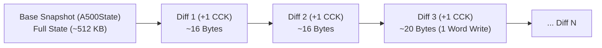
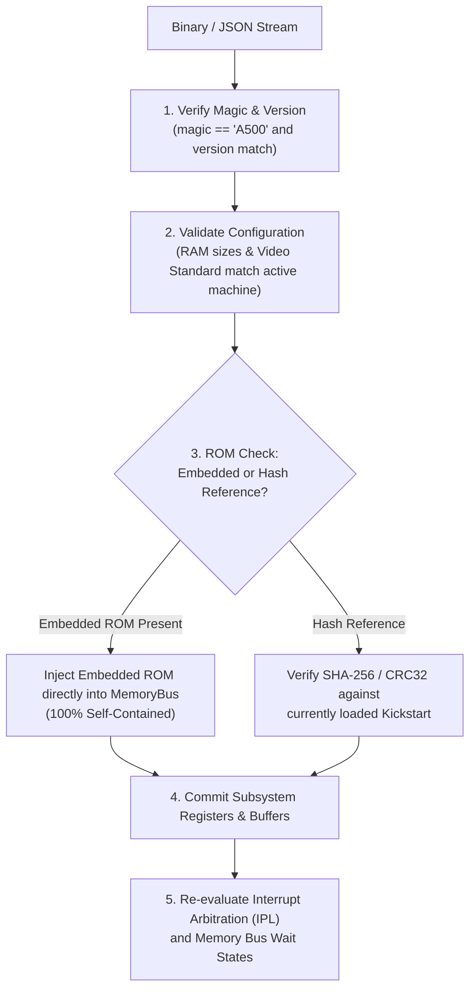

# Amiga 500 Save State Architecture & Serialization Specification

> [!NOTE]
> System ownership principles and decoupling constraints are defined in [AGENTS.md](../../../AGENTS.md) and [General Architecture.md](General%20Architecture.md).
> Master clock synchronization is detailed in [Main loop A500.md](Main%20loop%20A500.md).
> Memory layout and low-memory overlay rules are specified in [MemoryBus.md](MemoryBus.md). Machine state serialization is driven by [Main loop A500.md](Main%20loop%20A500.md). Subsystem state schemas are defined in [CPU Motorola M68000.md](CPU%20Motorola%20M68000.md), [Agnus.md](Agnus.md), [Denise.md](Denise.md), [Paula.md](Paula.md), [CIA.md](CIA.md), and [RTC.md](RTC.md).

---

## 1. Architectural Principles

1. **Decoupled Snapshot Structs:**
   - Save state data structures are pure value containers (`Clone`, `Debug`, `PartialEq`, `Serialize`, `Deserialize`).
   - They contain zero runtime host handles, window pointers, audio device context handles, or open file descriptors.
2. **Zero-Allocation Hot Path:**
   - Regular emulation stepping (`step_cck()`, `step_frame()`) never creates, updates, or allocates save state objects.
   - Snapshots are synthesized on demand via public machine methods: `a500.save_state() -> A500State` and restored via `a500.load_state(&state) -> Result<(), SaveStateError>`.
3. **Deterministic Round-Trip Verification:**
   - Taking a snapshot at cycle $T$, restoring it into a fresh machine instance, and stepping $N$ cycles must produce bit-for-bit identical hardware registers and memory contents as stepping continuously without saving.
4. **Self-Contained vs. Referenced ROM Modes:**
   - Because a Kickstart ROM is only 256 KB (or 512 KB) and compresses down to ~150 KB, save states can optionally embed the entire ROM image directly. This provides 100% standalone portability across different computers without requiring external ROM files.
   - Alternatively, a lightweight reference mode stores the CRC32 checksum of the Kickstart ROM.
5. **Direct Chip Value Containment:**
   - Unlike `Cpu` which isolates register snapshots in `CpuState` for external test harnesses (SingleStepTests), custom chips (`Copper`, `Blitter`, `Agnus`, `Denise`, `Paula`, `Cia`) are already flat value containers with zero circular pointers. They are themselves the canonical serializable state records, avoiding duplicate wrapper structs.

---

## 2. Complete State Schema Definitions

```rust
use serde::{Deserialize, Serialize};

/// Master state container representing a full Amiga 500 machine snapshot.
#[derive(Debug, Clone, PartialEq, Serialize, Deserialize)]
pub struct A500State {
    /// Compatibility header and hardware configuration metadata
    pub header: SaveStateHeader,
    /// Monotonically increasing 64-bit Color Clock count
    pub cck: u64,
    /// Active hardware configuration model
    pub config: A500Config,
    /// Motorola 68000 CPU register and micro-execution state
    pub cpu: CpuState,
    /// 24-bit physical memory buffers, overlay flag, and open bus settings
    pub physical_memory: PhysicalMemory,
    /// OKI MSM6242B Real-Time Clock
    pub rtc: rtc::RtcMsm6242b,
    /// Agnus (beam counters, copper, blitter, dma, chip RAM bus lock)
    pub agnus: agnus::Agnus,
    /// Denise (video control, sprites, frame builder, color palette, collisions)
    pub denise: denise::Denise,
    /// Paula (audio channels, serial UART, interrupt multiplexer)
    pub paula: paula::Paula,
    /// MOS 8520 CIA-A
    pub cia_a: cia::Cia,
    /// MOS 8520 CIA-B
    pub cia_b: cia::Cia,
    /// 3.5" DD Floppy controller and drive units
    pub floppy: floppy::FloppyController,
    /// MOS 6500/1 keyboard microcontroller
    pub keyboard: keyboard::Keyboard,
    /// Dual Atari 9-pin controller game ports
    pub game_ports: game_ports::GamePorts,
}

/// Metadata header identifying state compatibility and machine configuration.
#[derive(Debug, Clone, PartialEq, Eq, Serialize, Deserialize)]
pub struct SaveStateHeader {
    /// Format identifier: b"A500"
    pub magic: [u8; 4],
    /// Schema format version (e.g. 1)
    pub version: u32,
    /// Creation timestamp (UTC Unix seconds)
    pub timestamp: u64,
    /// Video standard (PAL or NTSC)
    pub video_standard: VideoStandard,
    /// Configured Chip RAM size in bytes (e.g. 524,288 or 1,048,576)
    pub chip_ram_size: usize,
    /// Configured Slow RAM size in bytes (0 or 524,288)
    pub slow_ram_size: usize,
    /// Configured Fast RAM size in bytes (0 to 8,388,608)
    pub fast_ram_size: usize,
    /// Kickstart ROM verification checksum (IEEE 802.3 CRC32)
    pub kickstart_crc32: u32,
    /// True if Kickstart ROM bytes are embedded inside the state (self-contained mode)
    pub is_self_contained: bool,
}

/// Motorola 68000 CPU core state.
#[derive(Debug, Clone, Copy, PartialEq, Eq, Serialize, Deserialize)]
pub struct CpuState {
    /// Data registers D0..D7 (private; accessed via dedicated accessors)
    d: [u32; 8],
    /// Address registers A0..A7 (private; accessed via dedicated accessors)
    a: [u32; 8],
    /// User Stack Pointer (USP)
    pub usp: u32,
    /// Supervisor Stack Pointer (SSP)
    pub ssp: u32,
    /// Program Counter (PC)
    pub pc: u32,
    /// Status Register (SR)
    pub sr: u16,
    /// Instruction Register (current executing opcode)
    pub ir: u16,
    /// Instruction Register Companion (prefetched next opcode word)
    pub irc: u16,
    /// Instruction fetch address for IRC
    pub irc_address: u32,
    /// Sampled Interrupt Priority Level (0..6)
    pub pending_ipl: u8,
    /// Stopped state (waiting for interrupt after STOP)
    pub stopped: bool,
    /// Halted state (e.g. double bus fault)
    pub halted: bool,
    /// Monotonically increasing CPU clock cycle counter since reset
    pub cycle_counter: u64,
}

/// Agnus state (Master Beam, Copper, Blitter, DMA).
/// Delayed register mutation in-flight across Color Clock phases / CCK cycles.
#[derive(Debug, Clone, Copy, PartialEq, Eq, Serialize, Deserialize)]
pub struct DelayedMutation<T: Copy> {
    /// Target custom register offset ($DFF000 + reg)
    pub reg: u16,
    /// Staged payload to commit
    pub value: T,
    /// Remaining CCK clock countdown before committing to active chip registers
    pub remaining_cck: u8,
}

/// Agnus state (Master Beam, Copper, Blitter, DMA).
#[derive(Debug, Clone, Copy, PartialEq, Eq, Serialize, Deserialize)]
pub struct AgnusState {
    pub dmacon: u16,
    
    // --- Raster Beam Subsystem ---
    pub hpos: u16,
    pub vpos: u16,
    pub lof: bool,

    // --- Copper Subsystem ---
    pub copper_pc: u32,
    pub copper_lc1: u32,
    pub copper_lc2: u32,
    pub copper_ir1: u16,
    pub copper_ir2: u16,
    pub copper_waiting: bool,
    pub copper_wait_vpos: u16,
    pub copper_wait_hpos: u16,
    pub copper_wait_mask_v: u16,
    pub copper_wait_mask_h: u16,
    pub copper_danger: bool, // CDANG bit
    pub copper_halted: bool,

    // --- Blitter Subsystem ---
    pub bltcon0: u16,
    pub bltcon1: u16,
    pub bltafwm: u16,
    pub bltalwm: u16,
    pub bltapt: u32,
    pub bltbpt: u32,
    pub bltcpt: u32,
    pub bltdpt: u32,
    pub bltamod: i16,
    pub bltbmod: i16,
    pub bltcmod: i16,
    pub bltdmod: i16,
    pub bltadat: u16,
    pub bltbdat: u16,
    pub bltcdat: u16,
    pub bltsizv: u16,
    pub bltsizh: u16,
    pub blitter_busy: bool,
    pub blitter_zero_flag: bool,

    // --- Delayed Mutation Pipeline ---
    /// In-flight staged mutations pending commit after K CCK cycles
    pub delayed_mutations: [Option<DelayedMutation<u16>>; 4],
}

/// Denise state (Video, Bitplanes, Sprites, Palette, Collisions).
#[derive(Debug, Clone, Copy, PartialEq, Eq, Serialize, Deserialize)]
pub struct DeniseState {
    pub bplcon0: u16,
    pub bplcon1: u16,
    pub bplcon2: u16,
    pub bplcon3: u16,
    pub bpl1mod: i16,
    pub bpl2mod: i16,
    pub bpldat: [u16; 6],
    pub diwstrt: u16,
    pub diwstop: u16,
    pub ddfstrt: u16,
    pub ddfstop: u16,
    /// 32 color palette registers (12-bit RGB444)
    pub color: [u16; 32],
    /// 8 Hardware Sprites
    pub spr_pos: [u16; 8],
    pub spr_ctl: [u16; 8],
    pub spr_data: [u16; 8],
    pub spr_datb: [u16; 8],
    pub spr_pt: [u32; 8],
    /// Collision Detection
    pub clxdat: u16,
    pub clxcon: u16,

    // --- Delayed Mutation Pipeline ---
    /// In-flight staged mutations pending commit after K CCK cycles
    pub delayed_mutations: [Option<DelayedMutation<u16>>; 4],
}

/// Paula state (Audio, Floppy, Serial UART, Interrupts).
#[derive(Debug, Clone, Copy, PartialEq, Eq, Serialize, Deserialize)]
pub struct PaulaState {
    pub audio: [AudioChannelState; 4],
    pub dsklen: u16,
    pub dskpth: u16,
    pub dskptl: u16,
    pub dsksyn: u16,
    pub dskbytr: u16,
    pub dskdat: u16,
    pub dsk_dma_active: bool,
    pub dsk_write_mode: bool,
    pub serdat: u16,
    pub serdatr: u16,
    pub serper: u16,
    pub intena: u16,
    pub intreq: u16,
}

#[derive(Debug, Clone, Copy, PartialEq, Eq, Serialize, Deserialize)]
pub struct AudioChannelState {
    pub ptr: u32,
    pub len: u16,
    pub per: u16,
    pub vol: u8,
    pub dat: u16,
    pub period_counter: u16,
    pub dma_active: bool,
    pub int_requested: bool,
}

/// MOS 8520 CIA state (instantiated for CIA-A and CIA-B).
#[derive(Debug, Clone, Copy, PartialEq, Eq, Serialize, Deserialize)]
pub struct CiaState {
    pub pra: u8,
    pub prb: u8,
    pub ddra: u8,
    pub ddrb: u8,
    pub timer_a_latch: u16,
    pub timer_a_counter: u16,
    pub timer_b_latch: u16,
    pub timer_b_counter: u16,
    pub cra: u8,
    pub crb: u8,
    pub tod_counter: u32,
    pub tod_alarm: u32,
    pub tod_latched: bool,
    pub sdr: u8,
    pub icr_mask: u8,
    pub icr_data: u8,
    /// Internal 5-CCK E-Clock sub-phase divider (0..4)
    pub e_clock_subphase: u8,
}

/// MemoryBus state including physical RAM allocations and Gary routing flags.
#[derive(Debug, Clone, PartialEq, Eq, Serialize, Deserialize)]
pub struct MemoryBusState {
    /// Low-memory boot overlay active (`map_kickstart_to_low_memory`)
    pub kickstart_overlay_active: bool,
    /// Chip RAM bus lock flag
    pub chip_ram_blocked: bool,
    /// Chip RAM buffer (Base64 in JSON)
    pub chip_ram: Vec<u8>,
    /// Optional Slow RAM buffer
    pub slow_ram: Option<Vec<u8>>,
    /// Optional Fast RAM buffer
    pub fast_ram: Option<Vec<u8>>,
}

/// External peripherals state (Floppy drives, Mouse, Joystick, Keyboard).
#[derive(Debug, Clone, PartialEq, Serialize, Deserialize)]
pub struct PeripheralsState {
    pub floppy_drives: [FloppyDriveState; 4],
    pub mouse_delta_x: i32,
    pub mouse_delta_y: i32,
    pub joystick_port1: u8,
    pub joystick_port2: u8,
    pub keyboard_buffer: Vec<u8>,
    pub keyboard_ack_pending: bool,
}

#[derive(Debug, Clone, Copy, PartialEq, Eq, Serialize, Deserialize)]
pub struct FloppyDriveState {
    pub inserted: bool,
    pub current_cylinder: u8,
    pub motor_on: bool,
    pub write_protected: bool,
    pub head_side: u8,
}
```

---

## 3. Differential Save States (`A500DiffState`)

To support **continuous rewind, time-travel debugging, and cycle-by-cycle inspection**, the emulator implements a lightweight differential state model.

### 3.1 The Principle: Why Diffs Are Extremely Small
Across a single Color Clock (or even an entire scanline), over 99.9% of the system state remains completely unchanged:
- The CPU only changes registers when retiring an instruction or completing an internal microcode phase (every 2 to 8+ CCKs).
- **Physical Memory:** Across 1 Color Clock, **at most one 16-bit word can be written** across the entire 16 MB address space! (Often 0 words during reads or computation).
- Storing a full 512 KB / 1 MB snapshot every cycle is prohibitively expensive, whereas a delta snapshot consumes **less than 24 bytes in binary**!



### 3.2 Differential State Rust Schema

```rust
use bitflags::bitflags;
use serde::{Deserialize, Serialize};

bitflags! {
    #[derive(Debug, Clone, Copy, PartialEq, Eq, Serialize, Deserialize)]
    pub struct DiffFlags: u8 {
        const CPU        = 1 << 0;
        const AGNUS      = 1 << 1;
        const DENISE     = 1 << 2;
        const PAULA      = 1 << 3;
        const CIA_A      = 1 << 4;
        const CIA_B      = 1 << 5;
        const MEMORY     = 1 << 6;
        const PERIPHERAL = 1 << 7;
    }
}

/// Differential snapshot representing state changes between base_cycle and target_cycle.
#[derive(Debug, Clone, PartialEq, Serialize, Deserialize)]
pub struct A500DiffState {
    pub base_cycle: u64,
    pub target_cycle: u64,
    pub flags: DiffFlags,
    pub cpu: Option<CpuDiff>,
    pub agnus: Option<AgnusDiff>,
    pub denise: Option<DeniseDiff>,
    pub paula: Option<PaulaDiff>,
    pub cia_a: Option<CiaDiff>,
    pub cia_b: Option<CiaDiff>,
    pub memory_diffs: Vec<MemoryWordDiff>,
}

/// Memory word modification delta supporting bidirectional rollback.
#[derive(Debug, Clone, Copy, PartialEq, Eq, Serialize, Deserialize)]
pub struct MemoryWordDiff {
    /// 24-bit physical word address ($000000..$FFFFFE, even address)
    pub address: u32,
    /// New word value committed at target_cycle
    pub new_val: u16,
    /// Previous word value at base_cycle (enables instant rewind without replaying forward)
    pub old_val: u16,
}

/// CPU delta: only fields that changed are present
#[derive(Debug, Clone, Copy, PartialEq, Eq, Default, Serialize, Deserialize)]
pub struct CpuDiff {
    pub d_mask: u8, // Bitmask indicating which D0..D7 registers changed
    pub d_vals: [u32; 8],
    pub a_mask: u8, // Bitmask indicating which A0..A6/SSP/USP changed
    pub a_vals: [u32; 8],
    pub pc: Option<u32>,
    pub sr: Option<u16>,
    pub ir: Option<u16>,
    pub irc: Option<u16>,
}

/// Agnus delta: only beam counters and active registers
#[derive(Debug, Clone, Copy, PartialEq, Eq, Default, Serialize, Deserialize)]
pub struct AgnusDiff {
    pub hpos: Option<u16>,
    pub vpos: Option<u16>,
    pub lof: Option<bool>,
    pub copper_pc: Option<u32>,
    pub dmacon: Option<u16>,
    pub blitter_busy: Option<bool>,
}
```

### 3.3 Binary Wire Format for Diffs (Compact Packed Stream)

In binary format, an `A500DiffState` is serialized with zero fluff:

| Offset | Size | Field | Description |
| :---: | :---: | :--- | :--- |
| **`$00`** | 4 B | `magic` | Identifier `b"DIFF"` |
| **`$04`** | 8 B | `base_cycle` | 64-bit base Color Clock cycle |
| **`$0C`** | 2 B | `delta_cck` | Cycles elapsed ($target - base$, typically $1$) |
| **`$0E`** | 1 B | `flags` | Bitflags indicating which subsystems have deltas |
| **`...`** | Var | Subsystem payloads | Serialized only for flags with bit set to `1` |
| **`...`** | 2 B | `mem_count` | Number of modified memory words ($N$) |
| **`...`** | $N \times 7$ B | Memory entries | Array of `[addr: u24, new_val: u16, old_val: u16]` |

- **Single-CCK Footprint:**
  - If no memory write occurred: Header ($14$ B) + Flags ($1$ B) + CPU PC change ($5$ B) + $0$ memory entries ($2$ B) = **$22$ Bytes**.
  - If a memory write occurred: $22\ \text{Bytes} + 7\ \text{Bytes} = \mathbf{29\ \text{Bytes}}$.
  - A 1,000-cycle rewind buffer takes less than **30 Kilobytes**!

### 3.4 JSON Format for Diffs

For debugging, diff states serialize to human-readable JSON with hexadecimal strings:

```json
{
  "type": "diff",
  "base_cycle": 70937,
  "target_cycle": 70938,
  "flags": ["CPU", "AGNUS", "MEMORY"],
  "cpu": {
    "pc": "0x00FC0124",
    "d_changed": { "0": "0x00000042" }
  },
  "agnus": {
    "hpos": 45,
    "vpos": 12
  },
  "memory": [
    { "addr": "0x00007FFE", "new": "0x4E75", "old": "0x0000" }
  ]
}
```

### 3.5 Forward Application & Bidirectional Rewind

```rust
impl A500State {
    /// Apply an incremental diff forward in time
    pub fn apply_diff(&mut self, diff: &A500DiffState) -> Result<(), SaveStateError> {
        if self.cycle_counter.total_cck != diff.base_cycle {
            return Err(SaveStateError::CycleMismatch {
                expected: diff.base_cycle,
                actual: self.cycle_counter.total_cck,
            });
        }
        self.cycle_counter.total_cck = diff.target_cycle;
        
        // Apply CPU deltas
        if let Some(cpu_diff) = &diff.cpu {
            if let Some(pc) = cpu_diff.pc { self.cpu.pc = pc; }
            if let Some(sr) = cpu_diff.sr { self.cpu.sr = sr; }
            // Apply register masks...
        }

        // Apply memory writes
        for mem in &diff.memory_diffs {
            let offset = mem.address as usize;
            self.memory_bus.chip_ram[offset..offset + 2].copy_from_slice(&mem.new_val.to_be_bytes());
        }
        Ok(())
    }

    /// Rewind machine backward in time using old_val fields
    pub fn rollback_diff(&mut self, diff: &A500DiffState) -> Result<(), SaveStateError> {
        if self.cycle_counter.total_cck != diff.target_cycle {
            return Err(SaveStateError::CycleMismatch {
                expected: diff.target_cycle,
                actual: self.cycle_counter.total_cck,
            });
        }
        self.cycle_counter.total_cck = diff.base_cycle;

        // Restore previous memory contents
        for mem in &diff.memory_diffs {
            let offset = mem.address as usize;
            self.memory_bus.chip_ram[offset..offset + 2].copy_from_slice(&mem.old_val.to_be_bytes());
        }
        Ok(())
    }
}
```

---

## 4. Full Snapshot Validation Pipeline

When restoring a full keyframe snapshot (`A500State`), the emulator executes the following validation steps:



---

## 5. Reference Documentation & Upstream Ground Truth

- [vAmiga Snapshot Component Implementation](../../../ref_src/vAmiga-4.5/Core/Media/Snapshot.cpp): Snapshot serializer for Amiga hardware state, block headers, and uncompressed RAM payloads.
- [CPU State Snapshot Implementation Source](../../../crates/m68000/src/state.rs): Living Rust `CpuState` data structures implementing Serde serialization and deserialization.