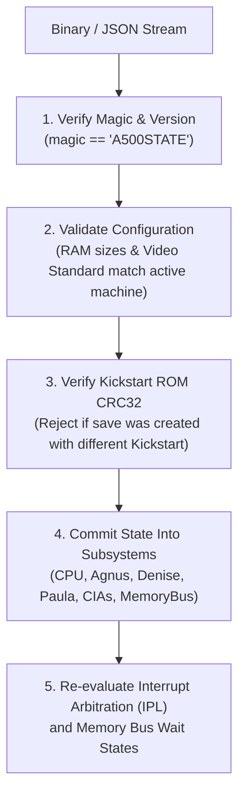

# Amiga 500 Save State Architecture & Serialization Specification

> [!NOTE]
> System ownership principles and decoupling constraints are defined in [AGENTS.md](file:///d:/Programowanie/Amiga/AGENTS.md) and [General Architecture.md](file:///d:/Programowanie/Amiga/Obsidian/Amiga/Design/General%20Architecture.md).
> Clock synchronization structures are detailed in [CycleCounter.md](file:///d:/Programowanie/Amiga/Obsidian/Amiga/Design/CycleCounter.md).
> Memory layout and low-memory overlay rules are specified in [MemoryBus.md](file:///d:/Programowanie/Amiga/Obsidian/Amiga/Design/MemoryBus.md).

---

## 1. Architectural Principles

1. **Decoupled Snapshot Structs:**
   - Save state data structures are pure data containers (`Clone`, `Debug`, `PartialEq`, `Serialize`, `Deserialize`).
   - They hold zero runtime handles, host window pointers, audio device context handles, or open file descriptors.
2. **Zero-Allocation Hot Path:**
   - Regular emulation stepping (`step_cck()`, `step_frame()`) never creates or updates save state objects.
   - Snapshots are synthesized on demand via public methods: `a500.save_state() -> A500State` and restored via `a500.load_state(&state) -> Result<(), SaveStateError>`.
3. **Deterministic Round-Trip Verification:**
   - Taking a snapshot at cycle $T$, restoring it to a fresh machine instance, and stepping $N$ cycles must produce bit-for-bit identical hardware registers and memory contents as stepping continuously without saving.
4. **Format Versioning & Schema Protection:**
   - Every save state starts with a magic header (`b"A500STATE"`), format schema version, and machine configuration fingerprint to reject mismatched Kickstart ROMs or conflicting RAM configurations.

---

## 2. Complete State Schema Definitions

```rust
use serde::{Deserialize, Serialize};

/// Master state container representing the complete Amiga 500 machine.
#[derive(Debug, Clone, PartialEq, Serialize, Deserialize)]
pub struct A500State {
    pub header: SaveStateHeader,
    pub cycle_counter: CycleCounterState,
    pub cpu: CpuState,
    pub agnus: AgnusState,
    pub denise: DeniseState,
    pub paula: PaulaState,
    pub cia_a: CiaState,
    pub cia_b: CiaState,
    pub memory_bus: MemoryBusState,
    pub peripherals: PeripheralsState,
}

/// Metadata header identifying state compatibility and machine configuration.
#[derive(Debug, Clone, PartialEq, Serialize, Deserialize)]
pub struct SaveStateHeader {
    /// Magic identifier: b"A500STATE" (9 bytes)
    pub magic: [u8; 9],
    /// Schema format version (incremented on breaking field modifications)
    pub version: u32,
    /// Video standard (0 = PAL, 1 = NTSC)
    pub video_standard: u8,
    /// Configured Chip RAM size in bytes (e.g. 524,288 for 512KB, 1,048,576 for 1MB)
    pub chip_ram_size: u32,
    /// Configured Slow RAM size in bytes (0 or 524,288)
    pub slow_ram_size: u32,
    /// Configured Fast RAM size in bytes (0 to 8,388,608)
    pub fast_ram_size: u32,
    /// CRC32 of Kickstart ROM used during snapshot creation
    pub kickstart_crc32: u32,
}

/// Global clock state.
#[derive(Debug, Clone, Copy, PartialEq, Eq, Serialize, Deserialize)]
pub struct CycleCounterState {
    pub total_cck: u64,
    pub phase: u8, // 0 = CCK1, 1 = CCK2
    pub e_clock_phase: u8,
    pub hpos: u16,
    pub vpos: u16,
    pub lof: bool,
}

/// Motorola 68000 CPU core state.
#[derive(Debug, Clone, Copy, PartialEq, Eq, Serialize, Deserialize)]
pub struct CpuState {
    /// Data registers D0..D7
    pub d: [u32; 8],
    /// Address registers A0..A6
    pub a: [u32; 7],
    /// User Stack Pointer (USP)
    pub usp: u32,
    /// Supervisor Stack Pointer (SSP)
    pub ssp: u32,
    /// Program Counter (PC)
    pub pc: u32,
    /// Status Register (SR)
    pub sr: u16,
    /// Instruction Register (current executing opcode)
    pub ir: u16,
    /// Instruction Register Companion (prefetched next opcode word)
    pub irc: u16,
    /// Instruction fetch address for IRC
    pub irc_address: u32,
    /// Sampled Interrupt Priority Level (0..6)
    pub pending_ipl: u8,
    /// Stopped state (e.g. waiting for interrupt after STOP instruction)
    pub stopped: bool,
    /// Halted state (e.g. double bus fault)
    pub halted: bool,
}

/// Agnus state (Master Beam, Copper, Blitter, DMA).
#[derive(Debug, Clone, Copy, PartialEq, Eq, Serialize, Deserialize)]
pub struct AgnusState {
    /// DMA Control Register read state (DMACONR)
    pub dmacon: u16,
    
    // --- Copper Subsystem ---
    pub copper_pc: u32,
    pub copper_lc1: u32,
    pub copper_lc2: u32,
    pub copper_ir1: u16,
    pub copper_ir2: u16,
    pub copper_waiting: bool,
    pub copper_wait_vpos: u16,
    pub copper_wait_hpos: u16,
    pub copper_wait_mask_v: u16,
    pub copper_wait_mask_h: u16,
    pub copper_danger: bool, // CDANG bit
    pub copper_halted: bool,

    // --- Blitter Subsystem ---
    pub bltcon0: u16,
    pub bltcon1: u16,
    pub bltafwm: u16,
    pub bltalwm: u16,
    pub bltapt: u32,
    pub bltbpt: u32,
    pub bltcpt: u32,
    pub bltdpt: u32,
    pub bltamod: i16,
    pub bltbmod: i16,
    pub bltcmod: i16,
    pub bltdmod: i16,
    pub bltadat: u16,
    pub bltbdat: u16,
    pub bltcdat: u16,
    pub bltsizv: u16,
    pub bltsizh: u16,
    pub blitter_busy: bool,
    pub blitter_zero_flag: bool,
}

/// Denise state (Video, Bitplanes, Sprites, Palette, Collisions).
#[derive(Debug, Clone, Copy, PartialEq, Eq, Serialize, Deserialize)]
pub struct DeniseState {
    pub bplcon0: u16,
    pub bplcon1: u16,
    pub bplcon2: u16,
    pub bplcon3: u16,
    pub bpl1mod: i16,
    pub bpl2mod: i16,
    pub bpldat: [u16; 6],
    pub diwstrt: u16,
    pub diwstop: u16,
    pub ddfstrt: u16,
    pub ddfstop: u16,
    /// 32 color palette registers (12-bit RGB444)
    pub color: [u16; 32],
    /// 8 Hardware Sprites
    pub spr_pos: [u16; 8],
    pub spr_ctl: [u16; 8],
    pub spr_data: [u16; 8],
    pub spr_datb: [u16; 8],
    pub spr_pt: [u32; 8],
    /// Collision Detection
    pub clxdat: u16,
    pub clxcon: u16,
}

/// Paula state (Audio, Floppy, Serial UART, Interrupts).
#[derive(Debug, Clone, Copy, PartialEq, Eq, Serialize, Deserialize)]
pub struct PaulaState {
    /// 4 DMA Audio Channels
    pub audio: [AudioChannelState; 4],
    /// Floppy Disk Controller
    pub dsklen: u16,
    pub dskpth: u16,
    pub dskptl: u16,
    pub dsksyn: u16,
    pub dskbytr: u16,
    pub dskdat: u16,
    pub dsk_dma_active: bool,
    pub dsk_write_mode: bool,
    /// Serial UART
    pub serdat: u16,
    pub serdatr: u16,
    pub serper: u16,
    /// Central Interrupt Priority Multiplexer
    pub intena: u16,
    pub intreq: u16,
}

#[derive(Debug, Clone, Copy, PartialEq, Eq, Serialize, Deserialize)]
pub struct AudioChannelState {
    pub ptr: u32,
    pub len: u16,
    pub per: u16,
    pub vol: u8,
    pub dat: u16,
    pub period_counter: u16,
    pub dma_active: bool,
    pub int_requested: bool,
}

/// MOS 8520 CIA state (instantiated for CIA-A and CIA-B).
#[derive(Debug, Clone, Copy, PartialEq, Eq, Serialize, Deserialize)]
pub struct CiaState {
    pub pra: u8,
    pub prb: u8,
    pub ddra: u8,
    pub ddrb: u8,
    pub timer_a_latch: u16,
    pub timer_a_counter: u16,
    pub timer_b_latch: u16,
    pub timer_b_counter: u16,
    pub cra: u8,
    pub crb: u8,
    pub tod_counter: u32,
    pub tod_alarm: u32,
    pub tod_latched: bool,
    pub sdr: u8,
    pub icr_mask: u8,
    pub icr_data: u8,
}

/// MemoryBus state including physical RAM allocations and Gary routing flags.
#[derive(Debug, Clone, PartialEq, Eq, Serialize, Deserialize)]
pub struct MemoryBusState {
    /// Low-memory boot overlay active (`map_kickstart_to_low_memory`)
    pub kickstart_overlay_active: bool,
    /// Chip RAM bus lock flag
    pub chip_ram_blocked: bool,
    /// Phase 1 read latch register
    pub read_latch: u16,
    /// Chip RAM buffer (Base64 in JSON)
    pub chip_ram: Vec<u8>,
    /// Optional Slow RAM buffer
    pub slow_ram: Option<Vec<u8>>,
    /// Optional Fast RAM buffer
    pub fast_ram: Option<Vec<u8>>,
}

/// External peripherals state (Floppy drives, Mouse, Joystick, Keyboard).
#[derive(Debug, Clone, PartialEq, Serialize, Deserialize)]
pub struct PeripheralsState {
    pub floppy_drives: [FloppyDriveState; 4],
    pub mouse_delta_x: i32,
    pub mouse_delta_y: i32,
    pub joystick_port1: u8,
    pub joystick_port2: u8,
    pub keyboard_buffer: Vec<u8>,
    pub keyboard_ack_pending: bool,
}

#[derive(Debug, Clone, Copy, PartialEq, Eq, Serialize, Deserialize)]
pub struct FloppyDriveState {
    pub inserted: bool,
    pub current_cylinder: u8,
    pub motor_on: bool,
    pub write_protected: bool,
    pub head_side: u8,
}
```

---

## 3. Serialization Formats & Encoding

### 3.1 JSON Serialization (Human-Readable & Debugger Friendly)

- For developer tools, automated test fixtures, and diff inspection, state can be serialized to formatted JSON.
- **Base64 Byte Arrays:** To prevent JSON bloat, large memory arrays (`chip_ram`, `slow_ram`, `fast_ram`) use `base64::engine::general_purpose::STANDARD` serialization helpers:
  ```rust
  pub fn to_json(&self) -> Result<String, serde_json::Error> {
      serde_json::to_string_pretty(self)
  }
  pub fn from_json(json_str: &str) -> Result<Self, serde_json::Error> {
      serde_json::from_str(json_str)
  }
  ```

### 3.2 Compact Binary Serialization (Bincode / Production Storage)

- For high-speed production save states and WASM local storage, snapshot data is serialized into a compact binary stream via `bincode`.
- A 4-byte CRC32 trailer is appended to the binary stream for corruption detection.

---

## 4. State Restoration & Validation Pipeline

When restoring state, the emulator executes the following validation sequence before committing the new state:



1. **Header Validation:** Confirm `magic == *b"A500STATE"` and `version == CURRENT_VERSION`.
2. **Configuration Match:** Confirm `chip_ram_size`, `slow_ram_size`, and `fast_ram_size` match current emulator configuration.
3. **ROM Compatibility Check:** Ensure `kickstart_crc32` matches the currently injected ROM slice.
4. **Atomic Restoration:** Commit buffers into `MemoryBus`, registers into CPU and custom chips.
5. **Post-Load Synchronization:** Call `main_loop.recalculate_ipl()` and update Denise raster pointers to resume execution cleanly without glitching.