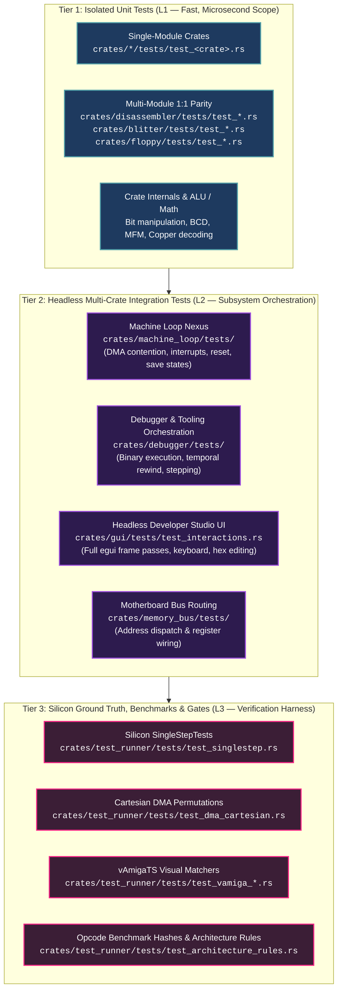

# Amiga 500 Testing Strategy and Quality Assurance

> [!NOTE]
> Project-wide engineering constraints, Rust coding guidelines, and constitutional rules are defined in [AGENTS.md](../../../AGENTS.md) and [.agents/rules/unit-testing-policy.md](../../../.agents/rules/unit-testing-policy.md).

---

## 1. Architectural Purpose & Testing Pyramid

To guarantee hardware fidelity, zero regressions, and complete opcode support, the Amiga 500 emulator enforces a strict **3-Tier Testing Taxonomy** across all 27 workspace crates. Every crate maintains an external `tests/` directory with zero inline tests in `src/`, providing clean separation between runtime production logic and test harnesses:

---

## 2. The 3-Tier Testing Taxonomy

### Tier 1: Isolated Unit Tests (L1 — Fast, Unit Scope)
- **Scope**: Single crate, single module in complete isolation. Zero multi-chip machine state.
- **Execution Speed**: Microseconds to milliseconds (< 2 seconds total across all 24 peripheral and core crates).
- **Execution Command**: `python tools/run_tests.py --unit`
- **Responsibilities**:
  - Bitwise operations, register reads/writes, wrapping arithmetic, and state transitions.
  - Bresenham line drawer math, octants, and 256-minterm Boolean truth tables ([`crates/blitter/tests/`](../../../crates/blitter/tests/)).
  - MFM encoding, sector decoding, track sync words, and checksums ([`crates/floppy/tests/`](../../../crates/floppy/tests/)).
  - Disassembler opcode parsing, effective address modes, and Fibonacci branch heuristics ([`crates/disassembler/tests/`](../../../crates/disassembler/tests/)).
  - MOS 8520 CIA cascaded timers, TOD clock, and shift register transfers ([`crates/cia/tests/`](../../../crates/cia/tests/)).
  - Paula audio period division and volume scaling ([`crates/audio/tests/`](../../../crates/audio/tests/)).
  - Micro-benchmark statistical variance, anomaly classification, and PRNG domain clamping ([`crates/test_runner/tests/`](../../../crates/test_runner/tests/)).

### Tier 2: Headless Multi-Crate Integration Tests (L2 — Subsystem Orchestration)
- **Scope**: Multi-crate interaction, bus routing, and system loop orchestration.
- **Execution Speed**: 3 to 15 seconds.
- **Execution Command**: `python tools/run_tests.py --integration`
- **Primary Integration Hubs**:
  1. **Machine Loop Nexus ([`crates/machine_loop/tests/`](../../../crates/machine_loop/tests/))**:
     - `test_machine_loop.rs`: Top-level A500 state machine loop step progression, monotonic CCK clock progression, CPU bus wait-states.
     - `test_copper_machine_integration.rs`: Copper list execution, raster beam WAIT synchronization, palette mutation, and Level 3 IRQ.
     - `test_blitter_machine_integration.rs`: Blitter 2D memory operations (copy, fill), Chip RAM mutation, and Level 3 `_BLITINT` signaling.
     - `test_denise_palette_sprite_integration.rs`: Full 32-color palette batch writes, sprite channel vertical comparators, and data arming.
     - `test_audio_machine_integration.rs`: Paula audio DMA playback streaming from Chip RAM, period clock division, and Level 4 `AUDxDSR` interrupt propagation.
     - `test_dma_switching_and_signals_integration.rs`: Dynamic `DMACON` bitwise SET/CLR across all chips, electronic signal propagation delays, and unmapped open bus reads.
     - `test_dma_contention.rs`: Agnus DMA scheduler contending with CPU bus accesses.
     - `test_interrupt_pipeline.rs`: Level 1-6 interrupt prioritization between Paula, Agnus, CIA-A, CIA-B and CPU IPL.
     - `test_register_propagation.rs`: CPU writing custom registers with CCK electronic delay pipelines.
     - `test_cia_keyboard_integration.rs`: Physical keyboard transmission -> CIA-A SDR -> Level 2 interrupt to CPU.
     - `test_action_dispatch.rs`: Register writes dispatching strongly-typed actions across custom chips.
     - `test_reset.rs`: Cold, warm, and external CPU RESET instruction handling.
     - `test_rtc.rs`: Real-time clock BCD decoding and cycle-exact stepping.
      - `test_save_state.rs`: Complete machine state serialization and restoration roundtrip.

#### The 4-Question Integration Checklist (When Tier 2 Tests are Mandatory)

Whenever any custom chip, coprocessor, peripheral device, or interrupt line is added, modified, or refactored:
1. **Control & Strobe Mutation:** Does changing register bits (e.g. `DMACON`, `INTENA`, `COPCON`) gate or trigger execution?
2. **Autonomous Memory Transfer:** Does the subsystem read or write Chip RAM over multiple CCK cycles (Copper, Blitter, Denise, Audio, Floppy)?
3. **Cross-Chip Signal & Interrupt Routing:** Does the subsystem raise an interrupt line, latch status, or send electronic signals to other chips (Paula -> CPU, Agnus -> Denise, CIAs -> CPU)?
4. **Hardware Contention & Wait States:** Does the subsystem compete for Chip RAM slots or stall the CPU?

If the answer to **any** question is **YES**, authoring a Tier 2 integration test in `crates/machine_loop/tests/` is mandatory.

#### The 4 Standardized Integration Test Archetypes

1. **Archetype A (Autonomous Progress):** Setup registers/memory -> trigger strobe -> step $N$ CCKs -> assert mutated Chip RAM buffer.
2. **Archetype B (Signal Escalation & CPU Autovector):** Trigger event -> step CCKs -> assert CPU IPL escalation and PC vector branch.
3. **Archetype C (DMA Gatekeeping):** Step with DMA bit set (assert progress) -> step with bit or master `DMAEN` cleared (assert zero progress).
4. **Archetype D (Contention & Concurrency):** Run active Chip RAM transfer -> assert CPU wait states on Chip RAM alongside zero wait states in Fast RAM.

#### Custom Chip Whole-Machine Verification Matrix

| Custom Chip | Primary Integration Test File | Verified Operational Capabilities |
| :--- | :--- | :--- |
| **Copper** | `test_copper_machine_integration.rs`, `test_copper_control_flow_integration.rs` | List execution, beam `WAIT`, `MOVE` to `COLOR00`, DMACON enable/disable, Level 3 IRQ, `SKIP` condition, `CDANG` danger mode |
| **Blitter** | `test_blitter_machine_integration.rs`, `test_blitter_nasty_contention_integration.rs` | 2D copy & fill in Chip RAM, `BLTSIZE` start, Level 3 `_BLITINT` assertion, CPU bus lockout, Blitter Nasty vs Fast RAM immunity |
| **Denise** | `test_denise_palette_sprite_integration.rs`, `test_denise_bitplane_integration.rs` | 32-color batch mutation, sprite vertical window, `SPRxDATA` arming, DMA toggling, 1-plane bitplane fetch, display window clipping |
| **Paula** | `test_audio_machine_integration.rs`, `test_interrupt_pipeline_integration.rs` | Audio DMA playback, period scaling, sample buffer generation, Level 4 `AUD0DSR`, multi-interrupt IPL 1-6 arbitration, INTENA masking |
| **DMA Arbiter** | `test_dma_switching_and_signals_integration.rs` | Bitwise SET/CLR in `DMACON`, master `DMAEN` global halt, 1-2 CCK electronic delays, open bus `$FFFF` |
| **CIAs** | `test_cia_keyboard_integration.rs`, `test_cia_machine_integration.rs` | Keyboard serial shift to CIA-A `SDR`, Timer A/B underflow Level 2/6 IRQs, horizontal TOD (CIA-B), vertical TOD 50 Hz tick (CIA-A) |

  2. **Debugger & Tooling Nexus ([`crates/debugger/tests/`](../../../crates/debugger/tests/))**:
     - `test_debugger.rs` & `test_stepping_and_session.rs`: Debugger session stepping `machine_loop` and CPU core.
     - `test_sample_binaries.rs`: Injecting compiled M68000 test binaries into RAM and executing instructions.
     - `test_temporal_and_trace.rs`: Time-travel rewind buffer tracking full machine state history.
  3. **Headless Developer Studio UI ([`crates/gui/tests/`](../../../crates/gui/tests/))**:
     - `test_interactions.rs`: 36 headless UI interaction tests simulating mouse clicks, keyboard shortcuts, memory edits, time-travel scrubbing, view switching.
     - `test_gui.rs` & `test_persistence.rs`: Immediate-mode UI layout, theme loading, dock splits, and window state.
  4. **Motherboard Bus Routing ([`crates/memory_bus/tests/`](../../../crates/memory_bus/tests/))**:
     - `test_router.rs` & `test_register_wiring.rs`: Routing 24-bit physical addresses across chips and storage.

### Tier 3: Silicon Ground Truth & Verification Harness (L3 — Physical Vectors)
- **Scope**: External reference validation against real Commodore hardware silicon captures and benchmarks.
- **Execution Command**: `python tools/run_tests.py --harness` or targeted test runners.
- **Key Verification Suites**:
  - **Tom Harte SingleStepTests ([`crates/test_runner/tests/test_singlestep.rs`](../../../crates/test_runner/tests/test_singlestep.rs))**: 45,565 valid opcodes tested cycle-by-cycle against physical silicon captures (see [CPU SingleStepTests.md](CPU%20SingleStepTests.md)).
  - **Cartesian DMA Contention ([`crates/test_runner/tests/test_dma_cartesian.rs`](../../../crates/test_runner/tests/test_dma_cartesian.rs))**: Full $2^k \times 2^M$ permutation sweep verifying cycle invariance $C = C_0 + 2 \times \text{wait\_states}$ and Fast RAM immunity.
  - **vAmigaTS Visual Frame Differencer ([`crates/test_runner/tests/test_vamiga_*.rs`](../../../crates/test_runner/tests/test_vamiga_harness.rs))**: Automated headless comparison of `Denise` / `FrameBuilder` rendered output against 2,815 physical silicon frame captures.
  - **Opcode Micro-Benchmarks ([`crates/test_runner/tests/test_benchmark_*.rs`](../../../crates/test_runner/tests/test_benchmark_csv.rs))**: Cycle throughput vs golden baseline hashes (see [CPU Instruction Benchmarking.md](CPU%20Instruction%20Benchmarking.md)).
  - **Automated Architecture Rules ([`crates/test_runner/tests/test_architecture_rules.rs`](../../../crates/test_runner/tests/test_architecture_rules.rs))**: 20 automated guardrail tests verifying zero unwraps, file size limits, macro prohibitions, test naming, and 1:1 test parity.

---

## 3. Structural Conventions & Invariants

1. **Dedicated External `tests/` Directory**:
   - Zero inline tests in `crates/*/src/` (`#[cfg(test)] mod tests` is strictly forbidden).
   - Keeps runtime production code clean, uncluttered, and $\le 800$ lines.
2. **Canonical Test Naming (`test_<name>.rs`)**:
   - In Cargo workspaces, every `.rs` file directly inside `crates/<crate>/tests/` compiles into an independent test binary.
   - All test files must strictly start with `test_` (e.g. `test_line.rs`, `test_anomaly.rs`).
   - Shared non-test helper modules must reside inside subdirectories (e.g. `tests/common/mod.rs`).
3. **1:1 Multi-Module Parity**:
   - Multi-module crates must maintain dedicated 1:1 unit test files mirroring each major computational submodule:
     - `crates/blitter`: `test_blitter.rs`, `test_line.rs`, `test_minterm.rs`.
     - `crates/disassembler`: `test_align.rs`, `test_alu.rs`, `test_branch.rs`, `test_data.rs`, `test_ea.rs`, `test_disassembler_facade.rs`.
     - `crates/floppy`: `test_floppy.rs`, `test_mfm.rs`.
     - `crates/config`: `test_config.rs`, `test_mutation.rs`.
     - `crates/physical_memory`: `test_arbitration.rs`, `test_map.rs`, `test_physical_memory.rs`.
4. **Minimum Test & Assertion Density**:
   - Every workspace crate must define at least **2 active `#[test]` functions** and at least **10 assertions** (`assert!`, `assert_eq!`, `assert_ne!`) to prevent shallow placeholder scaffolding.

---

## 4. Automated Verification Tooling

| Tool / Script | Purpose | Enforcement Layer |
| :--- | :--- | :--- |
| [`tools/run_tests.py`](../../../tools/run_tests.py) | CLI runner for Tier 1 (`--unit`), Tier 2 (`--integration`), and Tier 3 (`--harness`). | Developer workflow & CI |
| [`tools/pre_flight.py`](../../../tools/pre_flight.py) | Master 4-gate pre-commit quality checker (Formatting, Attractors, AGENTS.md size, Architecture tests). | Git pre-commit hook & CI |
| [`tools/check_test_coupling.py`](../../../tools/check_test_coupling.py) | Verifies that changes to `crates/<crate>/src/` are coupled with changes to `crates/<crate>/tests/`. | Git pre-commit hook |
| [`tools/audit_api_coverage.py`](../../../tools/audit_api_coverage.py) | Statically verifies that public functions (`pub fn`) are referenced and tested in unit/integration suites. | Pre-flight gate (`--strict`) |
| [`crates/test_runner/tests/test_architecture_rules.rs`](../../../crates/test_runner/tests/test_architecture_rules.rs) | 20 automated tests validating architectural rules, test naming, and multi-module parity. | `cargo test` & pre-flight gate |

---

## 5. Related Architecture Specifications

- [General Architecture.md](General%20Architecture.md): Amiga 500 system block diagram and crate dependencies.
- [Main loop A500.md](Main%20loop%20A500.md): Machine loop cycle stepping, reset sequencing, and interrupt arbitration.
- [CPU SingleStepTests.md](CPU%20SingleStepTests.md): Verification against physical silicon instruction test vectors.
- [CPU Instruction Benchmarking.md](CPU%20Instruction%20Benchmarking.md): Cycle-exact benchmarking framework and golden CSV/JSON row hashes.
- [Platform Quirks and Invariants Catalog.md](Platform%20Quirks%20and%20Invariants%20Catalog.md): Centralized master catalog of hardware idiosyncrasies and anti-tamper invariants.
